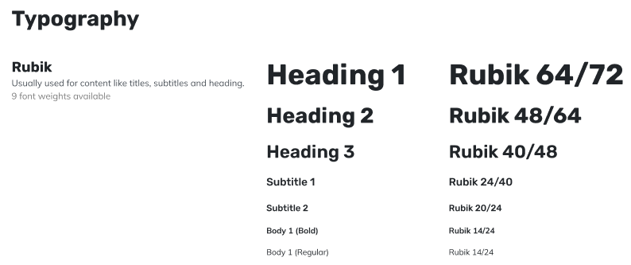
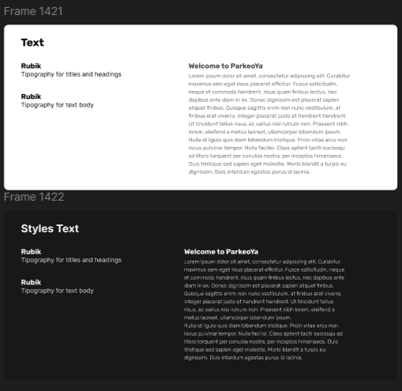
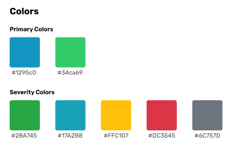
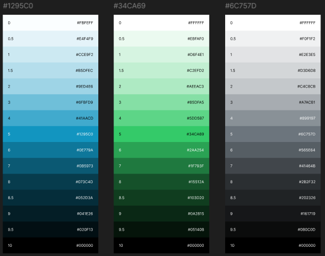
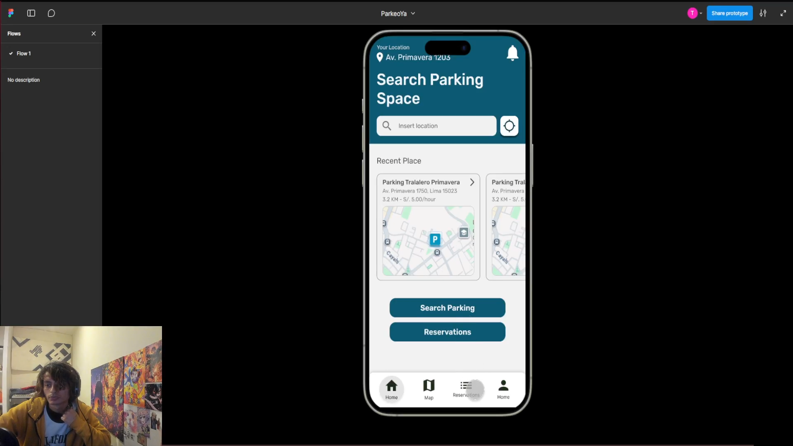
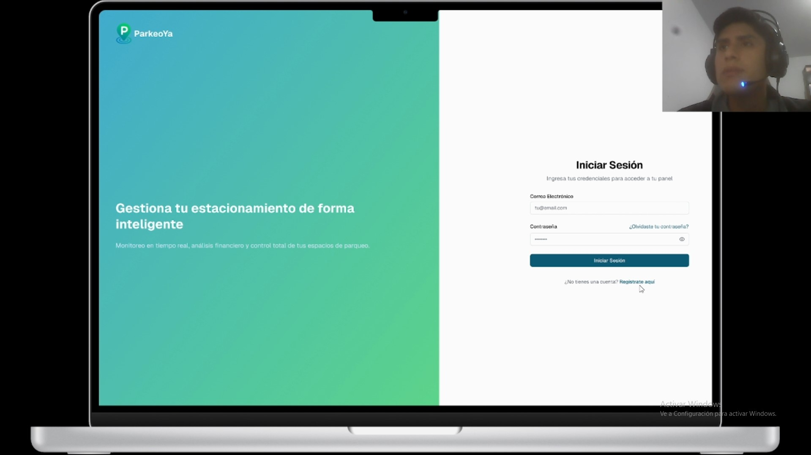

## Capítulo V: Solution UI/UX Design

### 5.1. Style Guidelines

En ParkeoYa, procuramos ofrecer una experiencia visual contemporánea, nítida y uniforme en todos los dispositivos. Estas directrices aseguran una identidad cohesiva en la plataforma web, móvil e incluso en su integración con sistemas IoT. Nos fundamentamos en principios de diseño orientados a la simplicidad, accesibilidad y coherencia visual.

#### 5.1.1. General Style Guidelines

**Branding**  
La identidad de marca de ParkeoYa se concentra en proyectar confianza, accesibilidad y eficiencia urbana. Empleamos una paleta cromática basada en tonalidades azules, turquesa y verde, evocando innovación tecnológica, profesionalismo, movilidad inteligente y dinamismo urbano. Esta combinación genera una atmósfera moderna, fiable y alineada con el propósito de la plataforma.

**Tipografía**  
La tipografía en ParkeoYa cumple un rol esencial en la claridad visual y la usabilidad de la aplicación móvil. Se eligieron fuentes modernas, limpias y altamente legibles que permiten a los usuarios identificar rápidamente la información clave, mejorando así la experiencia general de navegación.

La estructura tipográfica se organiza en niveles jerárquicos: **headings** (títulos), **body** (texto principal), **buttons** (botones) y **links** (enlaces), garantizando uniformidad visual en toda la interfaz.

**Colores**  
La paleta cromática de ParkeoYa integra gradientes de azul, turquesa y verde. Esta combinación simboliza confiabilidad tecnológica y eficiencia en movilidad urbana:

**Espaciado** 
El sistema de espaciado sigue una escala base de 4px para mantener un ritmo visual armonioso:

Este sistema facilita interfaces ordenadas, equilibradas y de navegación intuitiva.

**Iconografía**  
Los iconos en ParkeoYa son minimalistas y fácilmente identificables, apropiados para acciones recurrentes como buscar, reservar, guardar o compartir ubicación. La iconografía se fundamenta en los estándares de Material Design Icons, asegurando consistencia visual multiplataforma.

- Buscar: Icono de lupa 
- Reservar: Icono de lista 
- Confirmar: Icono de check 
- Ubicación: Icono de GPS

**Tono de Comunicación**  
El lenguaje de ParkeoYa es directo, amigable y eficiente. Buscamos establecer una relación de confianza con el usuario, transmitiendo practicidad, claridad y profesionalismo mientras mantenemos un enfoque cercano y orientado a resolver necesidades urbanas reales.

#### 5.1.2. Web, Mobile and IoT Style Guidelines

**Web Style Guidelines**  
ParkeoYa proporciona una experiencia fluida en dispositivos de escritorio, adaptándose dinámicamente a diversos tamaños de pantalla:

- **Diseño Responsivo:** Priorizamos un layout adaptativo que se ajusta orgánicamente a diferentes resoluciones, implementando patrones de escaneo visual tipo F para optimizar la lectura y comprensión del contenido.

- **Navegación:** Implementamos una barra de navegación superior con acceso directo a secciones clave (Inicio, Mi Playa, Mis ingresos, Perfil). En pantallas reducidas, la navegación se compacta mediante un menú hamburguesa para optimizar el espacio disponible.

- **Accesibilidad:** Las interacciones están diseñadas para ser intuitivas, con iconografía clara y espaciado generoso. Los elementos interactivos mantienen alto contraste cromático para maximizar visibilidad y usabilidad.

**Mobile Style Guidelines**  
En la versión móvil de ParkeoYa, priorizamos la usabilidad táctil manteniendo coherencia visual con la plataforma web pero optimizando la interfaz para pantallas compactas:

- **Elementos Interactivos:** Empleamos botones amplios y áreas de toque generosas para facilitar la interacción en pantallas táctiles, minimizando errores de selección.

- **Disposición de Contenido:** Los elementos se organizan priorizando funciones principales como búsqueda de estacionamiento y reserva inmediata, asegurando acceso rápido sin desplazamientos excesivos.

- **Optimización del Contenido:** La información se adapta eficientemente, garantizando que datos relevantes como disponibilidad en tiempo real, precio y ubicación estén siempre visibles en la vista principal.

**IoT Style Guidelines**  
El emulador Wokwi permite simular la interacción con dispositivos IoT como sensores de ocupación. Esto habilita a la aplicación para mostrar información sobre disponibilidad de espacios de estacionamiento en tiempo real.

- **Simulación de Sensores:** La aplicación presenta una representación visual intuitiva del estado de los sensores, indicando mediante código de colores si un espacio está ocupado (rojo), disponible (verde) o en espera del usuario que reservó el espacio (amarillo).

- **Interacción Usuario-IoT:** Las actualizaciones de estado de los sensores son instantáneas y visuales, permitiendo a los usuarios identificar rápidamente espacios disponibles mediante mapas interactivos con indicadores cromáticos claros.

### 5.2. Information Architecture
#### 5.2.1. Organization Systems

ParkeoYa implementa diversos sistemas organizacionales para garantizar que los conductores encuentren y utilicen las funcionalidades principales de manera ágil e intuitiva.

- **Jerárquico:** En las aplicaciones web y móvil, los elementos se organizan con una jerarquía visual clara basada en tamaños tipográficos (h1 a h3) y contrastes cromáticos de la paleta turquesa personalizada. Este enfoque permite a los usuarios identificar rápidamente lo más relevante en cada pantalla, como botones de buscar, reservar o ver disponibilidad en tiempo real.

- **Secuencial:** Los flujos como el proceso de búsqueda y reserva de estacionamiento siguen una lógica paso a paso que conduce al usuario desde la búsqueda inicial hasta la confirmación de reserva, optimizando la experiencia mediante progresión lógica.

#### 5.2.2. Labeling Systems

Utilizamos un sistema de etiquetado simple, directo y reconocible para eliminar ambigüedades. Empleamos terminología concisa como:

- Inicio, Buscar Parqueo, Mis Reservas, Mi Playa, Perfil

- La iconografía universal complementa las etiquetas (buscar, ubicación, check) para reforzar el reconocimiento visual inmediato.

- Las acciones principales están representadas por verbos concisos y botones con alta visibilidad cromática.

#### 5.2.3. SEO Tags and Meta Tags

**Landing Page**  
- Title: ParkeoYa - Encuentra estacionamiento disponible al instante
- Meta Description: ParkeoYa te permite localizar y reservar estacionamientos cercanos en segundos. Rápido, confiable y eficiente para tu movilidad urbana.
- Meta Keywords: estacionamiento, parking, app de parqueo, reserva de estacionamiento, ParkeoYa, parqueo inteligente
- Meta Author: ParkeoYa Development Team

**Web App** 
- Title: ParkeoYa App - Gestión de Playas Estacionamiento
- Meta Description: Accede a tu cuenta ParkeoYa, administra tu Playa de Estacionamiento y genera ingresos extra.

**Mobile App** 
- Title: ParkeoYa App - Buscador de Estacionamientos
- Meta Description: Accede a tu cuenta ParkeoYa, administra tus reservas activas y encuentra estacionamiento disponible cerca de ti fácilmente.

#### 5.2.4. Searching Systems

**¿Qué se puede buscar?:** Los conductores pueden buscar estacionamientos mediante ubicación actual (GPS) o rango de precios.

**¿Qué filtros están disponibles?:** Rangos de precio, valoración de usuarios.

**¿Cómo se presentan los resultados?:** Mediante tarjetas visuales con iconografía clara, indicadores de precio, distancia y disponibilidad en tiempo real, con botones de acción rápida (ver detalles, reservar ahora) o preferencia de precio.

#### 5.2.5. Navigation Systems

**Navegación Jerárquica:** Desde la pantalla principal, se accede a las secciones fundamentales mediante una barra de navegación persistente (web) o menú de navegación inferior (móvil), garantizando acceso inmediato a funcionalidades esenciales.

**Navegación Global:** El menú principal permanece accesible en todo momento para transitar entre funcionalidades como "Buscar Parqueo", "Mis Reservas", "Mi Perfil" o "Historial".

**Navegación Local:** Dentro de cada módulo, como "Detalles del Estacionamiento" o "Configuración de Cuenta", se incluyen submenús contextuales para acciones específicas: ver mapa, calificar servicio, contactar soporte, etc.

### 5.3. Landing Page UI Design

Para esta sección utilizamos la herramienta Figma para diseñar los Wireframes y Mockups de la Landing Page.

Link del Figma: [Figma](https://www.figma.com/design/J4QynUoONIuJKQPABMteja/ParkeoYa?node-id=1-4&t=uBOKGos6nDJyb5z5-1)

#### 5.3.1. Landing Page Wireframe
En esta sección se mostrarán los wireframes en pantalla Desktop y mobile de la Landing Page.

**Desktop**

- **Sección Inicio:**

- **Sección Sobre Nosotros:** 
  

- **Sección Características:** 

- **Sección Resultados:** 
  

- **Sección Beneficios:** 
  

- **Sección Reseñas Y Contacto:**
  

- **Sección Footer:**
  

**Mobile**

#### 5.3.2. Landing Page Mock-up

A continuación se mostrarán los Mockups de la Landing Page tanto para Desktop como para mobile con una descripción de cada apartado.

- **Sección Inicio:** En esta sección se muestra un poco de la aplicación y botones de redirección a las aplicaciones según el tipo de usuario.

**Sección Sobre Nosotros:** En esta sección se muestra la misión, vision, valores y descripción de nuestra startup.
  

- **Sección Características:** En esta sección se muestran las características principales de la solución IoT.

- **Sección Resultados:** En esta sección se muestran los resultados que algunos de nuestros usuarios obtuvieron usando la aplicación.
  

- **Sección Beneficios:** En esta sección se muestran los beneficios que se puede obtener usando la aplicación.
  

- **Sección Reseñas Y Contacto:** En esta sección se muestran algunas reseñas de nuestros usuarios y un apartado de contacto.
  

- **Sección Footer:** En esta sección se muestra el Footer con enlaces de Producto, Soporte y Empresa.
  

**Mobile**

### 5.4. Applications UX/UI Design
#### 5.4.1. Applications Wireframes
Para la aplicación de ParkeoYa, se han diseñado los bocetos de las pantallas que luego serán diseñadas más a detalle. A continuación, se presentan los wireframes de las pantallas de las aplicaciones web y móvil.

Link del Figma: [Figma](https://www.figma.com/design/J4QynUoONIuJKQPABMteja/ParkeoYa?node-id=1-5&t=uBOKGos6nDJyb5z5-1)

**App Web - Dueño de Playa de Estacionamiento**  

- **Autenticación** 

- **Dashboard** 

- **Estacionamientos** 

- **Reservas** 

- **Finanzas** 

- **Reseñas** 

- **Configuracion** 

**App Móvil - Conductor**  
- **Autenticación**
  

  
- **Home** 

- **Perfil**  

- **Búsqueda de Estacionamiento** 
  

- **Reservar Estacionamiento** 
  

- **Gestión de Reserva** 

#### 5.4.2. Applications Wireflow Diagrams

**App Web - Dueño de Playa de Estacionamiento**  

- **Registro de Usuario y Parqueo e Inicio de Sesión**

  - **User Goal:** Como dueño de una playa de estacionamiento, quiero poder registrar mis datos personales, a mi playa de estacionamiento e iniciar sesión en la aplicación.
    
  - **User Persona:** Dueño de Playa de Estacionamiento.
    
  - **Descripción:** Si el usuario se encuentra en la pantalla de inicio de sesión y no tiene una cuenta, deberá dar click en "Registrate aqui", llenar su información personal, la de su playa de estacionamiento y al dar a finalizar, puede proceder a iniciar sesión.

- **Navegación en Sidebar**

  - **User Goal:** Como dueño de una playa de estacionamiento, quiero poder navegar entre las distitnas opciones de la Sidebar.
    
  - **User Persona:** Dueño de Playa de Estacionamiento.
    
  - **Descripción:** Cuando el usuario se encuentra en la pantalla de inicio y quiere dirigirse a la pantalla de Estacionamientos/Reservas/Finanzas/Reseñas/Configuración, solo deberá elegir el bóton correspondiente.

- **Configurar Estacionamiento, Perfil, Notificaciones y Seguridad**

  - **User Goal:** Como dueño de una playa de estacionamiento, quiero poder configurar los datos de mi cuenta, de mi estacionamiento y preferencias en la aplicación .
    
  - **User Persona:** Dueño de Playa de Estacionamiento.
    
  - **Descripción:** Cuando el usuario se encuentra en la pantalla de Configuraciones y quiere configurar algo en especifico, solo deberá elegir el bóton que indique el apartado a modificar.
    

**App Móvil - Conductor**  

- **Registro de Conductor e Inicio de Sesión:**
  - **User Goal:** Como conductor, quiero poder registrarme e iniciar sesión en la aplicación.
    
  - **User Persona:** Conductor
    
  - **Descripción:** Cuando el usuario se encuentra en la pantalla de bienvenida y no cuenta con una cuenta, deberá presionar "Sign Up" y llenar los datos requeridos para proceder a iniciar sesión con su cuenta recién creada.

- **Recuperación de Contraseña**
  
  - **User Goal:** Como conductor, quiero poder recuperar mi contraseña con mi correo electrónico.
    
  - **User Persona:** Conductor
    
  - **Descripción:** Cuando el usuario se encuentra en la pantalla de inicio de sesión y no recuerda su contraseña, deberá presionar "¿Olvidaste tu Contraseña?", escribir su correo, colocar el codigo de verificación, crear una nueva contraseña, repetirla, confirmar e iniciar sesión con la contraseña actualizada.
    

- **Añadir Auto**

  - **User Goal:** Como conductor, quiero poder añadir la información de mis autos a la aplicacion.
    
  - **User Persona:** Conductor
    
  - **Descripción:** Cuando el usuario se encuentra en la pantalla de perfil y quiere añadir un nuevo auto, deberá dar click en "Añadir nuevo auto", llenar la información del auto y dar a "Añadir".
    

- **Editar Perfil**
  
  - **User Goal:** Como conductor, quiero poder editar mi perfil en la aplicación.
    
  - **User Persona:** Conductor
    
  - **Descripción:** Cuando el usuario se encuentra en la pantalla de perfil y quiere editar sus datos personales, deberá dar click en "Editar Perfil", modificar sus datos y dar click en "Guardar Cambios".
    

- **Reserva de Estacionamiento**

  - **User Goal:** Como conductor, quiero poder reservar un estacionamiento en la aplicación.
    
  - **User Persona:** Conductor
    
  - **Descripción:** Cuando el usuario se encuentra en la pantalla de inicio y quiere reservar un estacionamiento, deberá dar click en el botón de "Buscar Parking", seleccionar uno de los parqueos que se muestren en el mapa, dar click en "Reservar Ahora", Seleccionar el espacio de su preferencia, especificar la fecha hora de entrada, hora de salida, el auto, la tarjeta con la que pagará la reserva y dar click en el botón de "Pagar.

- **Visualización de Reservas y Detalles**
  
  - **User Goal:** Como conductor, quiero poder visualizar mis reservas activas y pasadas en la aplicación.
    
  - **User Persona:** Conductor
    
  - **Descripción:** Cuando el usuario se encuentra en la pantalla de Reservas y da click en "Ver detalles", podrá visualizar los detalles de la reserva .

- **Cancelar Reserva**
  
  - **User Goal:** Como conductor, quiero poder cancelar una reserva activa.
    
  - **User Persona:** Conductor
    
  - **Descripción:** Cuando el usuario se encuentra en la pantalla de Reservas y quiere cancelar una reserva activa, deberá dar click en el botón de "Cancelar Reserva" y Confirmar la cancelación.

- **Ver Reseñas y Añadir Reseña a un Parqueo**
  
  - **User Goal:** Como conductor, quiero poder ver las reseñas de un parqueo y escribir una reseña.
    
  - **User Persona:** Conductor
    
  - **Descripción:** Cuando el usuario ha seleccionado un parqueo en el mapa, deberá dar click en "Ver Reseñas" para visualizar las reseñas y si quiere escribir una reseña deberá dar click en el botón "Hacer una Reseña", colocar el numero de estrellas y comentario y dar click en el botón "Enviar Reseña".

#### 5.4.3. Applications Mock-ups

Para la aplicación de ParkeoYa, se han diseñado pantallas que reflejan la experiencia de los usuarios al interactuar con la plataforma. A continuación, se presentan los mock-ups de las pantallas de las aplicaciones web y móvil.

Link del Figma: [Figma](https://www.figma.com/design/J4QynUoONIuJKQPABMteja/ParkeoYa?node-id=309-9146&t=uBOKGos6nDJyb5z5-1)

**App Web - Dueño de Playa de Estacionamiento**  

- **Autenticación:** Pantallas de Registro de Usuario Dueño de Playa de Estacionamiento, Registro de Playa de Estacionamiento e Inicio de Sesión.

- **Dashboard:** Pantalla de Visualización de Reportes y Accesos rápidos.

- **Estacionamientos:** Pantalla de Visualización de estacionamientos y sus estados en tiempo real.

- **Reservas:** Pantalla de visualización de Reservas de los clientes y sus estados. 

- **Finanzas:** Pantalla de visualización de los ingresos generados con la aplicación.

- **Reseñas:** Pantalla de visualización de Reseñas de la Playa de Estacionamiento hechas por los conductores.

- **Configuración:** Pantallas de configuración de estacionamientos, perfil, notificaciones y seguridad.

**App Móvil - Conductor**  
- **Autenticación:** Pantallas de Registro de nuevo usuario, verificación, inicio de sesión y cambio de contraseña.

- **Home:** Pantalla Home que dirigira al usuario al resto de funcionalidades

- **Perfil:** Pantallas que permitirán al usuario ver y modificar sus datos personales.

  
- **Busqueda de Estacionamiento:** Pantallas donde el usuario podrá encontrar playas de estacionamiento en el mapa y ver las reseñas de cada uno de ellos.

  
- **Reservar Estacionamiento:** Pantallas que muestran el proceso de reserva de un estaciónamiento en una playa seleccionada.
  

- **Gestión de Reserva:** Pantallas que permitirán al usuario ver y cancelar sus reservas realizadas.

  
#### 5.4.4. Applications User Flow Diagrams

**App Web - Dueño de Playa de Estacionamiento**  

- **Registro de Usuario y Parqueo e Inicio de Sesión**

  - **User Goal:** Como dueño de una playa de estacionamiento, quiero poder registrar mis datos personales, a mi playa de estacionamiento e iniciar sesión en la aplicación.
    
  - **User Persona:** Dueño de Playa de Estacionamiento.
    
  - **Descripción:** Si el usuario se encuentra en la pantalla de inicio de sesión y no tiene una cuenta, deberá dar click en "Registrate aqui", llenar su información personal, la de su playa de estacionamiento y al dar a finalizar, puede proceder a iniciar sesión.

- **Navegación en Sidebar**

  - **User Goal:** Como dueño de una playa de estacionamiento, quiero poder navegar entre las distitnas opciones de la Sidebar.
    
  - **User Persona:** Dueño de Playa de Estacionamiento.
    
  - **Descripción:** Cuando el usuario se encuentra en la pantalla de inicio y quiere dirigirse a la pantalla de Estacionamientos/Reservas/Finanzas/Reseñas/Configuración, solo deberá elegir el bóton correspondiente.

- **Configurar Estacionamiento, Perfil, Notificaciones y Seguridad**

  - **User Goal:** Como dueño de una playa de estacionamiento, quiero poder configurar los datos de mi cuenta, de mi estacionamiento y preferencias en la aplicación .
    
  - **User Persona:** Dueño de Playa de Estacionamiento.
    
  - **Descripción:** Cuando el usuario se encuentra en la pantalla de Configuraciones y quiere configurar algo en especifico, solo deberá elegir el bóton que indique el apartado a modificar.
    

**App Móvil - Conductor**  

- **Registro de Conductor e Inicio de Sesión:**
  - **User Goal:** Como conductor, quiero poder registrarme e iniciar sesión en la aplicación.
    
  - **User Persona:** Conductor
    
  - **Descripción:** Cuando el usuario se encuentra en la pantalla de bienvenida y no cuenta con una cuenta, deberá presionar "Sign Up" y llenar los datos requeridos para proceder a iniciar sesión con su cuenta recién creada.

- **Recuperación de Contraseña**
  
  - **User Goal:** Como conductor, quiero poder recuperar mi contraseña con mi correo electrónico.
    
  - **User Persona:** Conductor
    
  - **Descripción:** Cuando el usuario se encuentra en la pantalla de inicio de sesión y no recuerda su contraseña, deberá presionar "¿Olvidaste tu Contraseña?", escribir su correo, colocar el codigo de verificación, crear una nueva contraseña, repetirla, confirmar e iniciar sesión con la contraseña actualizada.
    

- **Añadir Auto**

  - **User Goal:** Como conductor, quiero poder añadir la información de mis autos a la aplicacion.
    
  - **User Persona:** Conductor
    
  - **Descripción:** Cuando el usuario se encuentra en la pantalla de perfil y quiere añadir un nuevo auto, deberá dar click en "Añadir nuevo auto", llenar la información del auto y dar a "Añadir".
    

- **Editar Perfil**
  
  - **User Goal:** Como conductor, quiero poder editar mi perfil en la aplicación.
    
  - **User Persona:** Conductor
    
  - **Descripción:** Cuando el usuario se encuentra en la pantalla de perfil y quiere editar sus datos personales, deberá dar click en "Editar Perfil", modificar sus datos y dar click en "Guardar Cambios".
    

- **Reserva de Estacionamiento**

  - **User Goal:** Como conductor, quiero poder reservar un estacionamiento en la aplicación.
    
  - **User Persona:** Conductor
    
  - **Descripción:** Cuando el usuario se encuentra en la pantalla de inicio y quiere reservar un estacionamiento, deberá dar click en el botón de "Buscar Parking", seleccionar uno de los parqueos que se muestren en el mapa, dar click en "Reservar Ahora", Seleccionar el espacio de su preferencia, especificar la fecha hora de entrada, hora de salida, el auto, la tarjeta con la que pagará la reserva y dar click en el botón de "Pagar.

- **Visualización de Reservas y Detalles**
  
  - **User Goal:** Como conductor, quiero poder visualizar mis reservas activas y pasadas en la aplicación.
    
  - **User Persona:** Conductor
    
  - **Descripción:** Cuando el usuario se encuentra en la pantalla de Reservas y da click en "Ver detalles", podrá visualizar los detalles de la reserva .

- **Cancelar Reserva**
  
  - **User Goal:** Como conductor, quiero poder cancelar una reserva activa.
    
  - **User Persona:** Conductor
    
  - **Descripción:** Cuando el usuario se encuentra en la pantalla de Reservas y quiere cancelar una reserva activa, deberá dar click en el botón de "Cancelar Reserva" y Confirmar la cancelación.

- **Ver Reseñas y Añadir Reseña a un Parqueo**
  
  - **User Goal:** Como conductor, quiero poder ver las reseñas de un parqueo y escribir una reseña.
    
  - **User Persona:** Conductor
    
  - **Descripción:** Cuando el usuario ha seleccionado un parqueo en el mapa, deberá dar click en "Ver Reseñas" para visualizar las reseñas y si quiere escribir una reseña deberá dar click en el botón "Hacer una Reseña", colocar el numero de estrellas y comentario y dar click en el botón "Enviar Reseña".

### 5.5. Applications Prototyping

Mobile Aplication 

Link del Prototipo: [Prototipo](https://www.figma.com/proto/J4QynUoONIuJKQPABMteja/ParkeoYa?node-id=2-110&t=javn3IzdBb8xNEo2-1&scaling=scale-down&content-scaling=fixed&page-id=1%3A3&starting-point-node-id=2%3A110&show-proto-sidebar=1)

Link del video del Prototipo: [Video Prototipo](https://upcedupe-my.sharepoint.com/:v:/g/personal/u202017267_upc_edu_pe/ETj3uMZWKpBGgPWEeueSTXoBCMKoZNGsSzuRr0ZumT5Sew?nav=eyJyZWZlcnJhbEluZm8iOnsicmVmZXJyYWxBcHAiOiJPbmVEcml2ZUZvckJ1c2luZXNzIiwicmVmZXJyYWxBcHBQbGF0Zm9ybSI6IldlYiIsInJlZmVycmFsTW9kZSI6InZpZXciLCJyZWZlcnJhbFZpZXciOiJNeUZpbGVzTGlua0NvcHkifX0&e=w7hDFP)

Web Aplication

Link del Prototipo Web: [Prototipo](https://www.figma.com/proto/J4QynUoONIuJKQPABMteja/ParkeoYa?node-id=241-2&t=GirfGc0125DKUPcc-1&scaling=scale-down&content-scaling=fixed&page-id=1%3A2&starting-point-node-id=241%3A2)

Link del video del Prototipo Web: [Video Prototipo](https://upcedupe-my.sharepoint.com/:v:/g/personal/u202121935_upc_edu_pe/Eb_z7dFSZD9DlsjUrBBd8_QBX2a72YWYmH_9FKsiSR0saA?nav=eyJyZWZlcnJhbEluZm8iOnsicmVmZXJyYWxBcHAiOiJTdHJlYW1XZWJBcHAiLCJyZWZlcnJhbFZpZXciOiJTaGFyZURpYWxvZy1MaW5rIiwicmVmZXJyYWxBcHBQbGF0Zm9ybSI6IldlYiIsInJlZmVycmFsTW9kZSI6InZpZXcifX0%3D&e=2g4rGx )
