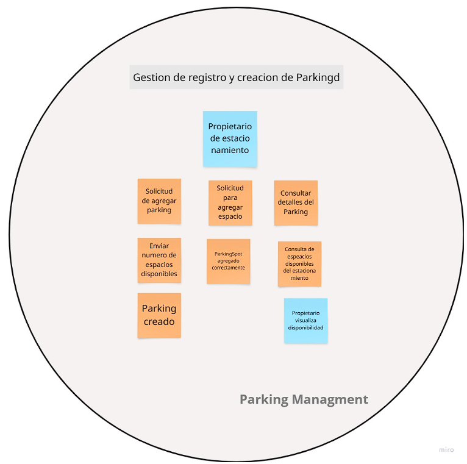

    <strong>Universidad Peruana de Ciencias Aplicadas</strong> 
    </img> 
    <strong>Ingeniería de Software</strong> 
     <strong>Ciclo: 7mo</strong> 
     <strong>1ASI0572 - Desarrollo de Soluciones IOT - 3428</strong> 
     <strong>Docente: Marco Antonio Leon Baca</strong> 
     <strong>"Informe de Trabajo Final"
</strong> 

    <strong>Startup: Lorem-Ipsum-UPC </strong> 
     <strong>Producto: ParkeoYa </strong> 

    <h3 align="center">Team Members:</h3>

    <table align="center">
        <tr>
            <th style="text-align:center;">Código</th>
            <th style="text-align:center;">Apellidos y nombres</th>
        </tr>
        <tr>
            <td style="text-align:center;">U202121935</td>
            <td style="text-align:center;">Calisaya Sánchez, Juan Jesús</td>
        </tr>
        <tr>
            <td style="text-align:center;">U202122232</td>
            <td style="text-align:center;">David Polanco, Alessandro Alonso</td>
        </tr>
        <tr>
            <td style="text-align:center;">U201911727</td>
            <td style="text-align:center;">Espinoza Delgado, Bárbara Antonella</td>
        </tr>
        <tr>
            <td style="text-align:center;">U202214733</td>
            <td style="text-align:center;">Serrano Ircañaupa, Nelson Elias</td>
        </tr>
        <tr>
            <td style="text-align:center;">U202017267</td>
            <td style="text-align:center;">Sotil Vasquez, Tyrone Raí</td>
        </tr>
    </table>
    

</body>

 <strong> Septiempre, 2025</strong>

# Registro de Versiones del Informe

| **Versión** | **Fecha** | **Autor** | **Descripción de Modificación** |
|-------------|-----------|-----------|---------------------------------|
| 1.0         | 31/08/2025| Juan Calisaya | Creación del documento de trabajo en formato Markdown. |
| 1.1         | 02/09/2025| Bárbara Espinoza | Realización del Capítulo 1 |
| 1.2         | 03/09/2025| Bárbara Espinoza | Realización del Capítulo 2 |
| 1.3         | 15/09/2025| Juan Calissaya y Alessandro David | Realización del Capítulo 3 |
| 1.4         | 20/09/2025| Alessandro David, Nelson Serrano y Tyrone Sotil | Realización del Capítulo 4 |
| 1.5         | 8/10/2025| Alessandro David, Nelson Serrano y Tyrone Sotil, Bárbara Espinoza, Juan Calisaya | Realización del Capítulo 5 y 6 |

# Project Report Collaboration Insights 

Enlace al repositorio del informe en GitHub: [Repositorio de GitHub](https://github.com/Lorem-Ipsum-UPC/reporte)

## TB1

**Descripción de las actividades realizadas:**
- **Espinoza Delgado, Bárbara Antonella**: Colaboré con la realización del capítulo 1 y 2 del informe cumpliendo con el formato en Markdown y estando pendiente de las correcciones y partes faltantes.
- **Calisaya Sánchez, Juan Jesús**: Colaboré con la realización del capítulo 3 del informe , especificamente, la realización de epicas y user stories.
- **David Polanco, Alessandro Alonso**: Colaboré con la realización del capítulo 3 y 4 del informe , especificamente, la realización del impact mapping y Strategic-Level Domain-Driven Design.
- **Serrano Ircañaupa, Nelson Elias**: Colaboré con la realización del capítulo 4 del informe , especificamente, la realización de Diagramas C4 y Bounded Context Canvas.
- **Sotil Vasquez, Tyrone Raí**: Colaboré con la realización del capítulo 4 del informe , especificamente, la realización de Diagramas C4, diagramas de clases y diagramas de base de datos.

**Evidencia de colaboración**

## TP

**Descripción de las actividades realizadas:**
- **Espinoza Delgado, Bárbara Antonella**: Colaboré con la elaboración del Capítulo V y VI del informe, supervisando la coherencia del contenido, el cumplimiento del formato en Markdown y la integración de los artefactos finales. Lideré la planificación del Sprint 1, coordinando la asignación de tareas, la gestión del Source Code Management y la validación de evidencias para el Sprint Review.
- **Calisaya Sánchez, Juan Jesús**: Colaboré en la elaboración del Capítulo V y VI, específicamente en el diseño de wireframes, mockups y el desarrollo del frontend web application. Participé en la preparación de la evidencia de Software Deployment y en la integración de los entregables visuales para el Sprint Review.
- **David Polanco, Alessandro Alonso**: Colaboré en el desarrollo del Capítulo VI, participando en la configuración del Software Deployment y en la implementación técnica de la landing page y la web application. Además, contribuí con las evidencias de desarrollo y documentación para el Sprint Review, asegurando la correcta integración del source code.
- **Serrano Ircañaupa, Nelson Elias**: Colaboré con la elaboración del Capítulo VI, específicamente en la preparación de evidencias de testing suite y execution para el Sprint Review. Apoyé en la validación del producto y en el aseguramiento de la calidad del software, garantizando la correcta verificación de los requisitos funcionales.
- **Sotil Vasquez, Tyrone Raí**: Colaboré en la elaboración del Capítulo V y VI, enfocándome en el diseño de mobile wireframes y app prototypes dentro del UI/UX Design. Además, participé en la integración visual del design system y en la validación del frontend durante el proceso de implementación y despliegue.

**Evidencia de colaboración**

# Contenido

### Tabla de contenidos
### [Registro de versiones del informe](#registro-de-versiones-del-informe)
### [Project Report Collaboration Insights](#project-report-collaboration-insights)
### [Student Outcome](#student-outcome)

## [Capítulo I: Introducción](#capítulo-i-introducción)
- [1.1. Startup Profile](#11-startup-profile)
    - [1.1.1. Descripción de la Startup](#111-descripción-de-la-startup)
    - [1.1.2. Perfiles de integrantes del equipo](#112-perfiles-de-integrantes-del-equipo)
- [1.2. Solution Profile](#12-solution-profile)
    - [1.2.1 Antecedentes y problemática](#121-antecedentes-y-problemática)
    - [1.2.2 Lean UX Process](#122-lean-ux-process)
        - [1.2.2.1. Lean UX Problem Statements](#1221-lean-ux-problem-statements)
        - [1.2.2.2. Lean UX Assumptions](#1222-lean-ux-assumptions)
        - [1.2.2.3. Lean UX Hypothesis Statements](#1223-lean-ux-hypothesis-statements)
        - [1.2.2.4. Lean UX Canvas](#1224-lean-ux-canvas)
- [1.3. Segmentos objetivo](#13-segmentos-objetivo)

## [Capítulo II: Requirements Elicitation & Analysis](#capítulo-ii-requirements-elicitation--analysis)
- [2.1. Competidores](#21-competidores)
    - [2.1.1. Análisis competitivo](#211-análisis-competitivo)
    - [2.1.2. Estrategias y tácticas frente a competidores](#212-estrategias-y-tácticas-frente-a-competidores)
- [2.2. Entrevistas](#22-entrevistas)
    - [2.2.1. Diseño de entrevistas](#221-diseño-de-entrevistas)
    - [2.2.2. Registro de entrevistas](#222-registro-de-entrevistas)
    - [2.2.3. Análisis de entrevistas](#223-análisis-de-entrevistas)
- [2.3. Needfinding](#23-needfinding)
    - [2.3.1. User Personas](#231-user-personas)
    - [2.3.2. User Task Matrix](#232-user-task-matrix)
    - [2.3.3. User Journey Mapping](#233-user-journey-mapping)
    - [2.3.4. Empathy Mapping](#234-empathy-mapping)
- [2.4. Big Picture Event Storming](#24-big-picture-event-storming)
- [2.5. Ubiquitous Language](#25-ubiquitous-language)

## [Capítulo III: Requirements Specification](#capítulo-iii-requirements-specification)
- [3.1. User Stories](#31-user-stories)
- [3.2. Impact Mapping](#32-impact-mapping)
- [3.3. Product Backlog](#33-product-backlog)

## [Capítulo IV: Solution Software Design](#capítulo-iv-solution-software-design)
- [4.1. Strategic-Level Domain-Driven Design](#41-strategic-level-domain-driven-design)
  - [4.1.1. Design Level EventStorming](#411-design-level-eventstorming)
    - [4.1.1.1. Candidate Context Discovery](#4111-candidate-context-discovery)
    - [4.1.1.2. Domain Message Flows Modeling](#4112-domain-message-flows-modeling)
    - [4.1.1.3. Bounded Context Canvases](#4113-bounded-context-canvases)
  - [4.1.2. Context Mapping](#412-context-mapping)
  - [4.1.3. Software Architecture](#413-software-architecture)
    - [4.1.3.1. Software Architecture Context Level Diagrams](#4131-software-architecture-context-level-diagrams)
    - [4.1.3.2. Software Architecture Container Level Diagrams](#4132-software-architecture-container-level-diagrams)
    - [4.1.3.3. Software Architecture Deployment Diagrams](#4133-software-architecture-deployment-diagrams)
- [4.2. Tactical-Level Domain-Driven Design](#42-tactical-level-domain-driven-design)
  - [4.2.1. Bounded Context: Identity and Access Management](#421-bounded-context-identity-and-access-management)
    - [4.2.1.1. Domain Layer](#4211-domain-layer)
    - [4.2.1.2. Interface Layer](#4212-interface-layer)
    - [4.2.1.3. Application Layer](#4213-application-layer)
    - [4.2.1.4. Infrastructure Layer](#4214-infrastructure-layer)
    - [4.2.1.5. Bounded Context Software Architecture Component Level Diagrams](#4215-bounded-context-software-architecture-component-level-diagrams)
    - [4.2.1.6. Bounded Context Software Architecture Code Level Diagrams](#4216-bounded-context-software-architecture-code-level-diagrams)
      - [4.2.1.6.1. Bounded Context Domain Layer Class Diagrams](#42161-bounded-context-domain-layer-class-diagrams)
      - [4.2.1.6.2. Bounded Context Database Design Diagram](#42162-bounded-context-database-design-diagram)
  - [4.2.2. Bounded Context: Profile Management](#422-bounded-context-profile-management)
    - [4.2.2.1. Domain Layer](#4221-domain-layer)
    - [4.2.2.2. Interface Layer](#4222-interface-layer)
    - [4.2.2.3. Application Layer](#4223-application-layer)
    - [4.2.2.4. Infrastructure Layer](#4224-infrastructure-layer)
    - [4.2.2.5. Bounded Context Software Architecture Component Level Diagrams](#4225-bounded-context-software-architecture-component-level-diagrams)
    - [4.2.2.6. Bounded Context Software Architecture Code Level Diagrams](#4226-bounded-context-software-architecture-code-level-diagrams)
      - [4.2.2.6.1. Bounded Context Domain Layer Class Diagrams](#42261-bounded-context-domain-layer-class-diagrams)
      - [4.2.2.6.2. Bounded Context Database Design Diagram](#42262-bounded-context-database-design-diagram)
  - [4.2.3. Bounded Context: Parking Management](#423-bounded-context-parking-management)
    - [4.2.3.1. Domain Layer](#4231-domain-layer)
    - [4.2.3.2. Interface Layer](#4232-interface-layer)
    - [4.2.3.3. Application Layer](#4233-application-layer)
    - [4.2.3.4. Infrastructure Layer](#4234-infrastructure-layer)
    - [4.2.3.5. Bounded Context Software Architecture Component Level Diagrams](#4235-bounded-context-software-architecture-component-level-diagrams)
    - [4.2.3.6. Bounded Context Software Architecture Code Level Diagrams](#4236-bounded-context-software-architecture-code-level-diagrams)
      - [4.2.3.6.1. Bounded Context Domain Layer Class Diagrams](#42361-bounded-context-domain-layer-class-diagrams)
      - [4.2.3.6.2. Bounded Context Database Design Diagram](#42362-bounded-context-database-design-diagram)
  - [4.2.4. Bounded Context: Reservation](#424-bounded-context-reservation)
    - [4.2.4.1. Domain Layer](#4241-domain-layer)
    - [4.2.4.2. Interface Layer](#4242-interface-layer)
    - [4.2.4.3. Application Layer](#4243-application-layer)
    - [4.2.4.4. Infrastructure Layer](#4244-infrastructure-layer)
    - [4.2.4.5. Bounded Context Software Architecture Component Level Diagrams](#4245-bounded-context-software-architecture-component-level-diagrams)
    - [4.2.4.6. Bounded Context Software Architecture Code Level Diagrams](#4246-bounded-context-software-architecture-code-level-diagrams)
      - [4.2.4.6.1. Bounded Context Domain Layer Class Diagrams](#42461-bounded-context-domain-layer-class-diagrams)
      - [4.2.4.6.2. Bounded Context Database Design Diagram](#42462-bounded-context-database-design-diagram)
  - [4.2.5. Bounded Context: Review](#425-bounded-context-review)
    - [4.2.5.1. Domain Layer](#4251-domain-layer)
    - [4.2.5.2. Interface Layer](#4252-interface-layer)
    - [4.2.5.3. Application Layer](#4253-application-layer)
    - [4.2.5.4. Infrastructure Layer](#4254-infrastructure-layer)
    - [4.2.5.5. Bounded Context Software Architecture Component Level Diagrams](#4255-bounded-context-software-architecture-component-level-diagrams)
    - [4.2.5.6. Bounded Context Software Architecture Code Level Diagrams](#4256-bounded-context-software-architecture-code-level-diagrams)
      - [4.2.5.6.1. Bounded Context Domain Layer Class Diagrams](#42561-bounded-context-domain-layer-class-diagrams)
      - [4.2.5.6.2. Bounded Context Database Design Diagram](#42562-bounded-context-database-design-diagram)
  - [4.2.6. Bounded Context: Notification](#426-bounded-context-notification)
    - [4.2.6.1. Domain Layer](#4261-domain-layer)
    - [4.2.6.2. Interface Layer](#4262-interface-layer)
    - [4.2.6.3. Application Layer](#4263-application-layer)
    - [4.2.6.4. Infrastructure Layer](#4264-infrastructure-layer)
    - [4.2.6.5. Bounded Context Software Architecture Component Level Diagrams](#4265-bounded-context-software-architecture-component-level-diagrams)
    - [4.2.6.6. Bounded Context Software Architecture Code Level Diagrams](#4266-bounded-context-software-architecture-code-level-diagrams)
      - [4.2.6.6.1. Bounded Context Domain Layer Class Diagrams](#42661-bounded-context-domain-layer-class-diagrams)
      - [4.2.6.6.2. Bounded Context Database Design Diagram](#42662-bounded-context-database-design-diagram)
  - [4.2.7. Bounded Context: Device Management](#427-bounded-context-device-management)
    - [4.2.7.1. Domain Layer](#4271-domain-layer)
    - [4.2.7.2. Interface Layer](#4272-interface-layer)
    - [4.2.7.3. Application Layer](#4273-application-layer)
    - [4.2.7.4. Infrastructure Layer](#4274-infrastructure-layer)
    - [4.2.7.5. Bounded Context Software Architecture Component Level Diagrams](#4275-bounded-context-software-architecture-component-level-diagrams)
    - [4.2.7.6. Bounded Context Software Architecture Code Level Diagrams](#4276-bounded-context-software-architecture-code-level-diagrams)
      - [4.2.7.6.1. Bounded Context Domain Layer Class Diagrams](#42761-bounded-context-domain-layer-class-diagrams)
      - [4.2.7.6.2. Bounded Context Database Design Diagram](#42762-bounded-context-database-design-diagram)
  - [4.2.8. Bounded Context: Payment](#428-bounded-context-payment)
    - [4.2.8.1. Domain Layer](#4281-domain-layer)
    - [4.2.8.2. Interface Layer](#4282-interface-layer)
    - [4.2.8.3. Application Layer](#4283-application-layer)
    - [4.2.8.4. Infrastructure Layer](#4284-infrastructure-layer)
    - [4.2.8.5. Bounded Context Software Architecture Component Level Diagrams](#4285-bounded-context-software-architecture-component-level-diagrams)
    - [4.2.8.6. Bounded Context Software Architecture Code Level Diagrams](#4286-bounded-context-software-architecture-code-level-diagrams)
      - [4.2.8.6.1. Bounded Context Domain Layer Class Diagrams](#42861-bounded-context-domain-layer-class-diagrams)
      - [4.2.8.6.2. Bounded Context Database Design Diagram](#42862-bounded-context-database-design-diagram)
## [Capítulo V: Solution UI/UX Design](#capítulo-v-solution-uiux-design)
- [5.1. Style Guidelines](#51-style-guidelines)
    - [5.1.1. General Style Guidelines](#511-general-style-guidelines)
    - [5.1.2. Web, Mobile and IoT Style Guidelines](#512-web-mobile-and-iot-style-guidelines)
  - [5.2. Information Architecture](#52-information-architecture)
    - [5.2.1. Organization Systems](#521-organization-systems)
    - [5.2.2. Labeling Systems](#522-labeling-systems)
    - [5.2.3. SEO Tags and Meta Tags](#523-seo-tags-and-meta-tags)
    - [5.2.4. Searching Systems](#524-searching-systems)
    - [5.2.5. Navigation Systems](#525-navigation-systems)
  - [5.3. Landing Page UI Design](#53-landing-page-ui-design)
    - [5.3.1. Landing Page Wireframe](#531-landing-page-wireframe)
    - [5.3.2. Landing Page Mock-up](#532-landing-page-mock-up)
  - [5.4. Applications UX/UI Design](#54-applications-uxui-design)
    - [5.4.1. Applications Wireframes](#541-applications-wireframes)
    - [5.4.2. Applications Wireflow Diagrams](#542-applications-wireflow-diagrams)
    - [5.4.3. Applications Mock-ups](#543-applications-mock-ups)
    - [5.4.4. Applications User Flow Diagrams](#544-applications-user-flow-diagrams)
  - [5.5. Applications Prototyping](#55-applications-prototyping)
    
## [Capítulo VI: Product Implementation, Validation & Deployment](#capítulo-vi-product-implementation-validation-&-deployment)
- [6.1. Software Configuration Management](#61-software-configuration-management)
    - [6.1.1. Software Development Environment Configuration](#611-software-development-environment-configuration)
    - [6.1.2. Source Code Management](#612-source-code-management)
    - [6.1.3. Source Code Style Guide & Conventions](#613-source-code-style-guide--conventions)
    - [6.1.4. Software Deployment Configuration](#614-software-deployment-configuration)
  - [6.2. Landing Page, Services & Applications Implementation](#62-landing-page-services--applications-implementation)
    - [6.2.1. Sprint 1](#621-sprint-1)
      - [6.2.1.1. Sprint Planning 1](#6211-sprint-planning-1)
      - [6.2.1.2. Aspect Leaders and Collaborators](#6212-aspect-leaders-and-collaborators)
      - [6.2.1.3. Sprint Backlog 1](#6213-sprint-backlog-1)
      - [6.2.1.4. Development Evidence for Sprint Review](#6214-development-evidence-for-sprint-review)
      - [6.2.1.5. Testing Suite Evidence for Sprint Review](#6215-testing-suite-evidence-for-sprint-review)
      - [6.2.1.6. Execution Evidence for Sprint Review](#6216-execution-evidence-for-sprint-review)
      - [6.2.1.7. Services Documentation Evidence for Sprint Review](#6217-services-documentation-evidence-for-sprint-review)
      - [6.2.1.8. Software Deployment Evidence for Sprint Review](#6218-software-deployment-evidence-for-sprint-review)
      - [6.2.1.9. Team Collaboration Insights during Sprint](#6219-team-collaboration-insights-during-sprint)
                
### [Conclusiones y recomendaciones](#conclusiones-y-recomendaciones)
- [Video About the Team](#video-about-the-team)
### [Bibliografía](#bibliografía)
### [Anexos](#anexos)

# Student Outcome

**ABET – EAC - Student Outcome 5**
Criterio: La capacidad de funcionar efectivamente en un equipo cuyos miembros juntos proporcionan liderazgo, crean un entorno de colaboración e inclusivo, establecen objetivos, planifican tareas y cumplen objetivos.

<table>
  <tr>
    <th>Criterio específico</th>
    <th>Acciones realizadas</th>
    <th>Conclusiones</th>
  </tr>
  <tr>
    <td>Trabaja en equipo para proporcionar liderazgo en forma conjunta</td>
    <td>
      <b>TB1:</b> 
      <b>Calisaya Sánchez Juan Jesús:</b> En esta etapa del proyecto, formé parte de reuniones tanto presenciales como     virtuales, en las cuales aporté propuestas relevantes para definir el flujo del negocio, lo que contribuyó a generar claridad y alineamiento dentro del equipo. 
      <b>TP:</b> 
      Ejercí un liderazgo colaborativo en el desarrollo del frontend, orientando la implementación de los wireframes y la integración visual de la web application. Mi trabajo en conjunto con los demás miembros ayudó a mantener la coherencia visual y el cumplimiento de los plazos establecidos.  
      <b>TB1:</b> 
      <b>David Polanco, Alessandro Alonso:</b>Durante la sesión de EventStorming y el Candidate Context Discovery, se asumió un liderazgo compartido entre los integrantes para organizar el flujo de actividades. En mi caso, participé proponiendo la estructura del tablero en Miro y guiando la secuencia de eventos y comandos, mientras otros compañeros aportaron en la validación de reglas de negocio y políticas. 
      <b>TP:</b>  Contribuí al liderazgo técnico del equipo, supervisando la configuración del deployment y la integración del source code. Promoví el aprendizaje conjunto y apoyé la resolución de problemas técnicos, garantizando un desarrollo coordinado y alineado con las metas del sprint.  
      <b>TB1:</b> 
      <b>Espinoza Delgado, Bárbara Antonella:</b> En grupo logramos organizarnos de forma adecuada para desarrollar el trabajo, distribuyendo responsabilidades entre los integrantes. Se llevaron a cabo reuniones para coordinar las actividades y se utilizó GitHub como herramienta para dar seguimiento al progreso de cada miembro y Discord para realizar las reuniones semanales.  
      <b>TP:</b>  Asumí el liderazgo general del equipo, guiando la planificación y ejecución del sprint. Organicé tareas, promoví la colaboración y aseguré el cumplimiento de los objetivos establecidos. Mi rol se centró en mantener la comunicación efectiva y la coherencia entre design, development y review, fomentando un liderazgo compartido entre todos los integrantes.  
      <b>TB1:</b> 
      <b>Serrano Ircañaupa, Nelson Elias:</b> En grupo manejamos lo que debe hacer cada integrante, se hicieron discusiones de equipo para una mejora continua de los diagramas, avances en los capítulos. Me tocó elaborar el diagrama c4 y así mismo para los bounded context, estos puntos se desarrollaron en plataformas colaborativas de Visual Paradigm para que todos participen. 
      <b>TP:</b>  Apoyé el liderazgo compartido desde el área de testing, promoviendo buenas prácticas de validación y revisión. Mi participación aseguró la calidad del software y fortaleció la comunicación entre los diferentes roles del equipo durante el desarrollo del sprint.  
      <b>TB1:</b> 
      <b>Sotil Vasquez, Tyrone Raí:</b> Trabajamos de manera colaborativa, asumiendo responsabilidades compartidas y brindando liderazgo conjunto dentro del equipo. Se coordinaron fechas limite de entrega de tareas promoviendo un ambiente de cooperación y asegurando el cumplimiento de los objetivos del proyecto. 
      <b>TP:</b>  Colaboré activamente en el liderazgo del mobile design, aportando ideas innovadoras y asegurando que el equipo comprendiera la visión estética del proyecto. Mi participación ayudó a fortalecer la unidad del grupo y a coordinar el trabajo entre designers y developers para cumplir con los objetivos del sprint.
    </td>
    <td><b>TB1:</b> Conseguimos organizarnos de manera eficiente, asignando las tareas de forma equitativa y empleando herramientas como GitHub para dar un seguimiento claro al progreso. Compartimos ideas, resolvimos dudas de forma colectiva y mantuvimos una comunicación continua a través de reuniones de coordinación. Esta experiencia fortaleció nuestras capacidades de trabajo colaborativo y evidenció el valor de la planificación y la cooperación para cumplir objetivos en común. 
    <b>TP:</b>  El equipo demostró un liderazgo compartido y equilibrado durante el desarrollo del proyecto. Barbara asumió la dirección general, garantizando la coordinación y comunicación entre todos. Tyrone y Juan lideraron desde el diseño y desarrollo visual, mientras que Alessandro gestionó el liderazgo técnico y Nelson reforzó el control de calidad. Esta sinergia permitió una toma de decisiones colaborativa y una ejecución coherente de los objetivos del sprint.
</td>
  </tr>
  <tr>
    <td>Crea un entorno colaborativo e inclusivo, establece metas, planifica tareas y cumple objetivos.</td>
    <td>
      <b>TB1:</b> 
      <b>Calisaya Sánchez Juan Jesús:</b> Durante el desarrollo del proyecto, me enfoqué en promover un entorno de trabajo colaborativo e inclusivo, impulsando la participación de todos los miembros mediante una retroalimentación constante y constructiva. Además, colaboré en la creación de epics, user stories y product backlog.       
      <b>TP:</b>  Planifiqué y ejecuté tareas del frontend web, colaborando en la integración visual con la landing page. Mantuve una comunicación constante con el equipo, asegurando una coordinación efectiva y el cumplimiento de los objetivos técnicos y de diseño del proyecto.        
      <b>TB1:</b> 
      <b>David Polanco, Alessandro Alonso:</b> Se promovió un entorno colaborativo al organizar reuniones virtuales para alinear las metas de esta entrega. Definimos de forma conjunta los pasos a seguir y planificamos las tareas asignando responsables según las fortalezas de cada miembro. De esta forma se logró cumplir el objetivo de entregar la especificación de bounded contexts con evidencia clara en Miro y en el informe, asegurando que todos los integrantes participaran activamente en el proceso. 
      <b>TP:</b>  Organicé y gestioné las tareas de development y deployment de la web application, colaborando estrechamente con los demás integrantes. Planifiqué mis actividades de manera coordinada, asegurando la entrega exitosa del sprint y contribuyendo al cumplimiento de los objetivos técnicos del equipo.  
      <b>TB1:</b> 
      <b>Espinoza Delgado, Bárbara Antonella:</b> Se coordinó de manera conjunta la repartición de tareas a realizar para esta entrega tomando en cuenta las habilidades de cada integrante, asi como a traves de las reuniones nos hemos ayudado unos a otros a solventar dudas o dar recordatorios sobre los plazos de entrega del trabajo.  
      <b>TP:</b>  Fomenté un entorno inclusivo y participativo, asignando tareas de manera equitativa y manteniendo una comunicación constante. Establecí metas alcanzables para cada sprint y supervisé su cumplimiento, asegurando una planificación efectiva y resultados de alta calidad para todo el equipo.  
      <b>TB1:</b> 
      <b>Serrano Ircañaupa, Nelson Elias:</b> Para este apartado se coordinó y debatió el avance de las tareas de los diagramas c4 para verificar los contextos y contenedores de la aplicación. También gracias al event storming se pudo obtener los bounded context candidatos para representarlos en el diagrama de arquitectura de componentes. Se cumplió satisfactoriamente este punto. 
      <b>TP:</b>  Participé activamente en las etapas de testing, planificando y ejecutando pruebas para asegurar el cumplimiento de los requisitos del sistema. Mi compromiso con la calidad fortaleció el entorno colaborativo y permitió alcanzar los objetivos planteados en el sprint.   
      <b>TB1:</b> 
      <b>Sotil Vasquez, Tyrone Raí:</b> Se organizaron reuniones en el server de Discord para dividir las partes a realizar, buscando que estas sean equitativas a las habilidades de cada uno. Además el uso de Github nos permitió visualizar los avances y cantidad de aportes que cada integrante realizaba. 
      <b>TP:</b> Participé activamente en la planificación de tareas de design, garantizando la coherencia entre los mobile mockups y la application. Mantener una comunicación fluida con mis compañeros permitió integrar las ideas de todos y cumplir los objetivos de user experience del proyecto.   
    </td>
    <td><b>TB1:</b> Colaboramos de forma coordinada, repartiendo las tareas de manera justa y definiendo metas semanales en reuniones periódicas. Hicimos uso de GitHub y mantuvimos una comunicación continua para aclarar dudas, realizar ajustes y supervisar los avances de manera conjunta. Promovimos un entorno inclusivo en el que cada integrante aportó sus ideas, alcanzando consensos en las decisiones y garantizando transparencia durante todo el proceso. Gracias a esta organización compartida y al compromiso colectivo, conseguimos finalizar el trabajo dentro del plazo previsto. 
    <b>TP:</b> Los integrantes evidenciaron una sólida cultura de colaboración e inclusión. La planificación guiada por Barbara facilitó la organización de tareas y la definición clara de metas. Tyrone y Juan integraron los diseños y prototipos con el desarrollo web, Alessandro aseguró la correcta implementación técnica, y Nelson garantizó la calidad mediante pruebas. Gracias a esta coordinación, el equipo cumplió sus objetivos de manera eficiente y cohesionada.  
</td>
  </tr>
</table>

# Capítulo I: Introduccion

## 1.1. Startup Profile
### 1.1.1. Descripción de la Startup

Lorem Ipsum es una startup peruana del sector tecnológico orientada al desarrollo de soluciones inteligentes. Como solución a la ineficiente administración de espacios en zonas urbanas de alto tráfico, donde los conductores suelen perder tiempo valioso buscando disponibilidad de estacionamiento, hemos creado ParkeoYa.

Nuestra propuesta se basa en el uso de tecnologías IoT, geolocalización y sensores inteligentes, que permiten detectar en tiempo real los espacios libres, reservarlos a través de una aplicación y facilitar su pago. Además, la integración de información en tiempo real garantiza una administración eficiente, incrementa la rentabilidad de las playas de estacionamiento y mejora la experiencia de los conductores habituales y esporádicos.

Con esta solución buscamos optimizar el uso de los estacionamientos, mejorar la movilidad urbana y promover prácticas sostenibles, generando beneficios tanto para los usuarios como para los propietarios de los espacios.

**Misión:** Nuestra misión como startup es revolucionar la experiencia de aparcamiento conectando a conductores y administradores mediante una plataforma inteligente que, apoyada en IoT y cámaras de monitoreo, optimice el uso del espacio, reduzca tiempos de búsqueda y proporcione una gestión automatizada y eficiente.

**Visión:** Nuestra visión es consolidarnos como la startup líder en soluciones que involucren la gestión de estacionamientos a nivel nacional, aportando a la movilidad eficiente de las ciudades a través de soluciones tecnológicas innovadoras y sostenibles que favorezcan a los conductores y a los titulares de los estacionamientos.

### 1.1.2. Perfiles de integrantes del equipo

| Perfiles de los Miembros del Equipo | Descripción de los Miembros del Equipo |
|:-------------------|:------:|
|  **Calisaya Sánchez Juan Jesús - u202121935**     | Soy estudiante de Ingeniería de Software. Me considero una persona empática, colaboradora, responsable y con buenas habilidades de comunicación. Además de mis capacidades técnicas, estas cualidades me permitirán contribuir de manera efectiva al desarrollo exitoso del proyecto.	|
| **David Polanco, Alessandro Alonso - u202122232**     | Mi nombre es Alessandro David y tengo 22 años. Yo estoy cursando la carrera de Ingenieria de Software en la UPC y ando en 9no ciclo. Me gusto demasiado mi eleccion referente a la carrera dado que me interesan mucho todos los temas que tenga que ver con la tecnologia y las tendencias de este rubro. Me considero una persona empática, comprometida, y siempre atento a resolver cualquier problema que me concierna. Como integrante del grupo de Desarrollo de Soluciones IoT me comprometo a cooperar con todo lo asignado en el trabajo y apoyar a mis compañeros con cualquier duda que quieran absolver.	|
| **Espinoza Delgado, Bárbara Antonella - u201911727**    | Mi nombre es Bárbara Antonella Espinoza Delgado, soy estudiante de Ingeniería de Software de 8vo ciclo. Tengo experiencia en trabajos en equipo y me considero una persona puntual con la realización y entrega de las tareas pendientes. |
| **Serrano Ircañaupa, Nelson Elias - u202214733**     | Me llamo Nelson Serrano, soy un entusiasta de la tecnología con gran interés en el backend, las redes y la ciberseguridad. Disfruto aprender nuevas herramientas de desarrollo, explorar entornos de seguridad informática y trabajar en proyectos que combinan programación con buenas prácticas de software. Mis principales fortalezas son el desarrollo backend, la gestión de bases de datos y el análisis de vulnerabilidades, lo que me permite aportar valor en proyectos que requieren robustez, organización y seguridad. |
| **Sotil Vasquez, Tyrone Raí - u202017267**     | Me llamo Tyrone Sotil, soy un apasionado tanto de la programación como de la creación de contenido. Mis hobbies incluyen la edición de videos, jugar videojuegos y la programación de páginas web. Mis principales fortalezas son la programación frontend, el diseño de imágenes/videos y los procesos de automatización o conexiones con IA |

## 1.2. Solution Profile
### 1.2.1. Antecedentes y problemática

En las ciudades con alto flujo vehicular, la búsqueda de estacionamientos representa un problema crítico que genera congestión, pérdida de tiempo, contaminación ambiental y estrés en los conductores. La escasez de espacios adecuados y la falta de herramientas tecnológicas que permitan consultar disponibilidad o realizar reservas anticipadas incrementan la frustración y afectan la movilidad urbana. Ante esta situación, surge la necesidad de soluciones innovadoras basadas en tecnologías IoT y sensores inteligentes, que permitan una gestión en tiempo real de los espacios.

**What (¿Qué?)**
Desarrollar una solución tecnológica que optimice la gestión de estacionamientos públicos. Esta debe permitir monitorear en tiempo real la disponibilidad de espacios, reducir el tiempo de búsqueda, evitar la ocupación indebida y facilitar un cobro automatizado mediante aplicaciones y sistemas de monitoreo inteligente.

**When (¿Cuándo?)**
El problema se ha intensificado en la última década debido al crecimiento vehicular. En Lima, por ejemplo, se suman más de 100 000 vehículos al año (AAP, 2023), lo que agudiza el tráfico, especialmente en horas punta (7:00–9:00 a.m. y 5:00–8:00 p.m.). La demanda supera con creces la oferta de espacios y se vuelve aún más crítica en contextos de alta concentración, como eventos masivos o zonas céntricas.

**Where (¿Dónde?)**
La problemática se concentra en ciudades densamente pobladas como Lima, Arequipa y Trujillo, donde estudios como Lima Cómo Vamos (2022) indican que hasta el 60% del tráfico en distritos como Miraflores y San Isidro proviene de conductores buscando estacionamiento. La falta de sistemas automatizados agrava la dificultad de acceder a información precisa y actualizada.

**Who (¿Quiénes?)**
Los principales afectados son los conductores que requieren estacionamientos seguros, accesibles y eficientes, así como los propietarios de playas de estacionamiento, que buscan maximizar la ocupación de sus espacios.

**Why (¿Por qué?)**
La raíz del problema está en la ausencia de sistemas modernos de gestión. La falta de comunicación en tiempo real entre oferta y demanda de espacios genera pérdidas económicas, mayor contaminación, incremento de infracciones y reducción de la calidad de vida urbana.

**How (¿Cómo?)**
La solución propuesta integra sensores IoT para detectar ocupación en tiempo real, una plataforma centralizada para procesar datos y pagos digitales, y una app móvil que guíe a los conductores hacia espacios disponibles. Además, el sistema permite reservas anticipadas y cobro automatizado.

**How Much (¿Cuánto?)**
Se estima un impacto significativo: reducción del 30% en el tiempo de búsqueda de estacionamientos, disminución del 15% en emisiones de CO₂, y un aumento en los ingresos de municipalidades y operadores gracias a tarifas dinámicas, control de evasiones y mayor rotación de espacios. Asimismo, se espera una reducción de incidentes asociados al estacionamiento informal o indebido, elevando la seguridad vial y urbana.

En síntesis, nuestra propuesta se posiciona como una alternativa integral e innovadora para enfrentar los desafíos de movilidad urbana, promoviendo eficiencia, sostenibilidad y una mejor experiencia tanto para conductores como para administradores.

### 1.2.2. Lean UX Process

En esta sección se aplica la metodología Lean UX, cuyo alcance incluye la conceptualización del modelo de negocio que sustentará el desarrollo del producto digital propuesto. Este enfoque ágil permite centrar los esfuerzos del equipo en el diseño de una solución enfocada en el usuario, alineada con las problemáticas detectadas mediante técnicas de Design Thinking y validación temprana.

#### 1.2.2.1. Lean UX Problem Statements

**Domain**  
El dominio de este proyecto es la gestión inteligente de estacionamientos urbanos, facilitando la búsqueda, reserva y administración de espacios de parqueo mediante una aplicación móvil y web. La plataforma conecta a conductores con espacios disponibles en tiempo real, utilizando tecnologías IoT, sensores y geolocalización para optimizar la movilidad y mejorar la experiencia de los usuarios.

**Customer Segments**
- Conductores: Personas que necesitan encontrar estacionamiento de forma rápida, segura y sin complicaciones, especialmente en zonas urbanas congestionadas.

- Propietarios de estacionamientos: Dueños de espacios interesados en rentabilizar su espacio, gestionando reservas, horarios y tarifas desde un panel digital.

**Initial Segment**
- Conductores urbanos jóvenes y adultos (18–50 años), usuarios frecuentes de smartphones que buscan optimizar su tiempo y tener experiencias de movilidad seguras y eficientes.

- Propietarios de estacionamientos en zonas de alta demanda (comerciales y residenciales), interesados en monetizar su espacio de forma sencilla.

**Pain Points**
- Pérdida de tiempo: Los conductores invierten minutos valiosos buscando estacionamiento, sobre todo en horas pico.

- Falta de visibilidad en tiempo real: Muchos estacionamientos carecen de sistemas digitales que informen sobre disponibilidad actualizada.

- Inseguridad: Los usuarios suelen estacionar en lugares no confiables al no contar con información precisa.

- Gestión ineficiente para propietarios: Los dueños no tienen herramientas para controlar ocupación, tarifas o reservas.

- Congestión vehicular y contaminación: La búsqueda de espacios aumenta el tráfico y las emisiones de CO₂.

**Gap**  
Actualmente, las soluciones disponibles son convencionales y poco integradas:

- No permiten reservas anticipadas de espacios.

- No muestran datos confiables en tiempo real sobre la ocupación.

- No ofrecen herramientas tecnológicas avanzadas con sensores IoT y apps móviles que automaticen la gestión.

Esto genera congestión, frustración y una experiencia deficiente para usuarios y propietarios.

**Visión / Estrategia**  
La visión es revolucionar la gestión de estacionamientos urbanos mediante una solución digital avanzada que:

- Permita a los conductores encontrar, reservar y pagar estacionamientos en segundos.

- Ofrezca información confiable en tiempo real sobre disponibilidad, ubicación y seguridad.

- Genere ingresos pasivos para propietarios, mejorando la administración de sus espacios.

- Contribuya a una movilidad urbana más eficiente y sostenible, reduciendo la congestión y las emisiones contaminantes.

La estrategia se centra en el uso de sensores IoT, integración con aplicaciones móviles y plataformas web, conectadas a un backend en la nube.

#### 1.2.2.2. Lean UX Assumptions

**Business Assumptions**
- La solución IoT mejorará la eficiencia de los estacionamientos: Se asume que al integrar sensores IoT para detectar disponibilidad y habilitar reservas automáticas, los tiempos de búsqueda se reducirán significativamente.

- El mercado está dispuesto a adoptar nuevas tecnologías: Se asume que conductores y propietarios verán valor en usar soluciones IoT para mejorar la experiencia de estacionamiento.

- El costo de implementación será recuperable rápidamente: Se asume que los gastos iniciales en infraestructura IoT y app se compensarán con las comisiones cobradas con cada reserva pagada.

- La solución aumentará la satisfacción del usuario: Se asume que un estacionamiento más rápido, seguro y predecible generará lealtad y mayor retención de clientes.

- El proyecto es escalable: Se asume que puede implementarse tanto en pequeños estacionamientos como en empresas que cuenten con múltiples playas de estacionamientos.

**Business Outcome Assumptions**
- Incremento en las reservas de estacionamiento gracias a la disponibilidad y reservas en tiempo real.

- Reducción de costos operativos para propietarios mediante la automatización de la gestión.

- Mejora de la satisfacción del cliente, generando mayor recurrencia en el uso de la aplicación.

**User Assumptions**
- Los conductores preferirán un sistema automatizado, confiando en la tecnología IoT para encontrar y reservar espacios de manera rápida.

- Los propietarios de estacionamientos adoptarán el sistema, al percibir beneficios en ingresos previos a la llegada de los vehículos y un mejor control de espacios.

- La aplicación será intuitiva, de modo que tanto conductores como propietarios podrán usarla sin complicaciones ni tendrán que recurrir a un periodo largo de aprendizaje.

**User Outcome Assumptions**
- Conductores más satisfechos, al contar con reservas anticipadas, información en tiempo real y menos tiempo perdido en búsquedas.

- Propietarios con mejor gestión de espacios, logrando mayor ocupación y rentabilidad a través de la plataforma digital.

**Feature Assumptions**
- Detección de disponibilidad mediante IoT: Sensores en cada espacio informan si está ocupado o libre en tiempo real.

- Sistema de reservas automáticas: Conductores pueden reservar un espacio anticipadamente o en el momento.

- Monitoreo en tiempo real: Los propietarios reciben datos actualizados para ajustar la gestión de su estacionamiento.

- Interfaz de administración centralizada: Panel digital para que propietarios gestionen tarifas, horarios y disponibilidad.

- Integración con pagos digitales: Cobro directo desde la app para agilizar la experiencia y reducir evasión.

**Users**
- Conductores urbanos que necesitan soluciones rápidas en zonas congestionadas.

- Propietarios de playas de estacionamientos, interesados en maximizar ingresos y mejorar la experiencia del cliente.

**User Outcomes**

Segmento Conductores:
- Acceder a una aplicación que muestre espacios en tiempo real.

- Reservar y pagar con antelación o en el momento.

- Reducir tiempos de búsqueda y planificar mejor los trayectos.

Segmento Propietarios de playas de estacionamiento:
- Incrementar la ocupación de los espacios.

- Administrar reservas y tarifas en un solo sistema.

- Tomar decisiones informadas con datos en tiempo real.

#### 1.2.2.3. Lean UX Hypothesis Statements

**Hipótesis 1**
Creemos que los conductores estarán motivados a usar ParkeoYa si les ofrecemos una aplicación sencilla e intuitiva que, mediante sensores IoT, muestre en tiempo real los espacios disponibles y permita hacer reservas rápidas.
Esto permitirá que los usuarios reduzcan el tiempo perdido buscando estacionamiento y adopten la plataforma como parte de su rutina diaria.
Lo validaremos cuando al menos el 70% de los conductores activos realicen una reserva semanal durante los primeros tres meses.

**Hipótesis 2**
Creemos que los propietarios de estacionamientos encontrarán valor en ParkeoYa si la plataforma les ayuda a gestionar de manera automatizada la disponibilidad de espacios, reduciendo tiempos vacíos y aumentando sus ingresos.
Esto permitirá mejorar la ocupación de los estacionamientos y optimizar la rentabilidad de cada espacio.
Lo validaremos cuando al menos el 60% de los propietarios de playas de estacionamiento aumenten la tasa de ocupación en un 20% dentro de los primeros tres meses.

**Hipótesis 3**
Creemos que las actualizaciones en tiempo real sobre la disponibilidad de estacionamientos reducirá el tiempo que los conductores dedican a encontrar estacionamiento en zonas de alta demanda.
Esto permitirá disminuir la congestión vehicular y mejorar la movilidad urbana.
Lo validaremos cuando los registros del sistema muestren una reducción del 20% en los tiempos de búsqueda.

**Hipótesis 4**
Creemos que los propietarios de estacionamientos aceptarán un modelo de negocio basado en una comisión sobre cada reserva gestionada a través de la aplicación si perciben que incrementa su ocupación e ingresos totales.
Esto permitirá asegurar la sostenibilidad económica de la plataforma y al mismo tiempo garantizar valor para los propietarios.
Lo validaremos cuando al menos el 50% de los propietarios activos mantengan la aceptación del modelo de comisión en los primeros seis meses de operación.

**Hipótesis 5**
Creemos que ofrecer soporte técnico accesible y materiales de capacitación simples ayudará a que conductores y propietarios adopten la plataforma más rápidamente.
Esto permitirá reducir las barreras iniciales de uso y minimizar la tasa de abandono.
Lo validaremos cuando la tasa de adopción inicial llegue al 90% y la tasa de abandono se mantenga por debajo del 15% en los primeros tres meses.

#### 1.2.2.4. Lean UX Canvas

  <table width="100%" border="1" cellpadding="10" cellspacing="0">
    <tr>
      <td width="33%" valign="top">
        <h4>Business Problem</h4>
        

          En las ciudades con alta congestión vehicular, los conductores enfrentan grandes dificultades para encontrar estacionamiento, lo que genera pérdida de tiempo, contaminación ambiental, incremento del tráfico y estrés. Paralelamente, los propietarios de estacionamientos urbanos no cuentan con herramientas digitales eficientes para maximizar la ocupación de sus espacios, lo que provoca pérdidas de ingresos y procesos operativos manuales poco efectivos. La falta de sistemas en tiempo real y reservas anticipadas profundiza esta problemática.
        

      </td>
      <td rowspan="2" width="33%" valign="top">
        <h4>Solutions</h4>
        <ul>
          <li>Aplicación móvil para conductores que permita búsqueda, reserva y pago digital en tiempo real.</li>
          <li>Plataforma web para propietarios con monitoreo de ocupación, reportes y control de tarifas</li>
          <li>Integración de dispositivos IoT para monitoreo en tiempo real de espacios disponibles.</li>
          <li>Implementación de un sistema de reservas anticipadas en tiempo real.</li>
          <li>Cobro automatizado y seguro a través de la app.</li>
        </ul>
      </td>
      <td width="33%" valign="top">
        <h4>Business Outcomes</h4>
        <ul>
          <li>Incremento en la ocupación de estacionamientos al optimizar el uso de los espacios disponibles.</li>
          <li>Reducción del tiempo de búsqueda de estacionamiento para conductores.</li>
          <li>Mayor eficiencia en la gestión para propietarios mediante herramientas digitales e IoT. </li>
          <li>Monetización sostenible a través de comisiones por reserva, suscripciones premium y venta de dispositivos IoT.</li>
          <li>Disminución de la congestión vehicular y de las emisiones de CO₂ gracias a la reducción de tiempo de búsqueda.</li>
        </ul>
      </td>
    </tr>
    <tr>
      <td valign="top">
        <h4>Users</h4>
        <ul>
          <li><b>Conductores:</b> Personas entre 18 y 50 años que necesitan soluciones rápidas y confiables para encontrar estacionamiento en zonas congestionadas. Valoran la conveniencia, el ahorro de tiempo y la facilidad de uso de aplicaciones móviles.</li>
          <li>
<b>Propietarios de Estacionamientos:</b> Dueños de playas de estacionamientos en áreas urbanas de alta demanda. Buscan aumentar la rentabilidad mediante la automatización de procesos, la digitalización de cobros y el acceso a datos en tiempo real para optimizar la gestión.</li>
        </ul>
      </td>  
      <td valign="top">
        <h4>User Outcomes & Benefits</h4>
        <b>Conductores:</b>
        <ul>
          <li>Reducen el tiempo de búsqueda de estacionamiento, disminuyendo estrés y mejorando la planificación.</li>
          <li>Pueden reservar y pagar en tiempo real desde la app, con mayor seguridad y conveniencia.</li>
          <li>Acceden a información confiable sobre disponibilidad y precios en un solo lugar.</li>
        </ul>
        <b>Propietarios de Estacionamientos:</b>
        <ul>
          <li>Incrementan la ocupación de sus espacios y rentabilidad gracias a reservas anticipadas y tarifas dinámicas.</li>
          <li>Mejoran la eficiencia operativa al automatizar cobros, reservas y monitoreo en tiempo real.</li>
          <li>Obtienen ingresos recurrentes y seguros a través de la plataforma.</li>
        </ul>
      </td>
    </tr>
    <tr>
      <td valign="top">
        <h4>Hypotheses</h4>
        <ul>
          <li>Creemos que los conductores estarán motivados a usar ParkeoYa si les ofrecemos una aplicación sencilla e intuitiva que, mediante sensores IoT, muestre en tiempo real los espacios disponibles y permita hacer reservas rápidas. Esto permitirá que los usuarios reduzcan el tiempo perdido buscando estacionamiento y adopten la plataforma como parte de su rutina diaria. Lo validaremos cuando al menos el 70% de los conductores activos realicen una reserva semanal durante los primeros tres meses.</li>
          <li>Creemos que los propietarios de estacionamientos encontrarán valor en ParkeoYa si la plataforma les ayuda a gestionar de manera automatizada la disponibilidad de espacios, reduciendo tiempos vacíos y aumentando sus ingresos. Esto permitirá mejorar la ocupación de los estacionamientos y optimizar la rentabilidad de cada espacio. Lo validaremos cuando al menos el 60% de los propietarios de playas de estacionamiento aumenten la tasa de ocupación en un 20% dentro de los primeros tres meses.</li>
          <li>Creemos que las actualizaciones en tiempo real sobre la disponibilidad de estacionamientos reducirá el tiempo que los conductores dedican a encontrar estacionamiento en zonas de alta demanda. Esto permitirá disminuir la congestión vehicular y mejorar la movilidad urbana. Lo validaremos cuando los registros del sistema muestren una reducción del 20% en los tiempos de búsqueda.</li>
          <li>Creemos que los propietarios de estacionamientos aceptarán un modelo de negocio basado en una comisión sobre cada reserva gestionada a través de la aplicación si perciben que incrementa su ocupación e ingresos totales. Esto permitirá asegurar la sostenibilidad económica de la plataforma y al mismo tiempo garantizar valor para los propietarios. Lo validaremos cuando al menos el 50% de los propietarios activos mantengan la aceptación del modelo de comisión en los primeros seis meses de operación.</li>
          <li>Creemos que ofrecer soporte técnico accesible y materiales de capacitación simples ayudará a que conductores y propietarios adopten la plataforma más rápidamente. Esto permitirá reducir las barreras iniciales de uso y minimizar la tasa de abandono. Lo validaremos cuando la tasa de adopción inicial llegue al 90% y la tasa de abandono se mantenga por debajo del 15% en los primeros tres meses.</li>
        </ul>
      </td>
      <td valign="top">
        <h4>What's the most important thing we need to learn first?</h4>
        <ul>
          <li>Validar si la provisión de datos en tiempo real sobre la disponibilidad de estacionamientos reduce el tiempo de búsqueda de espacios habitual de los conductores.</li>
          <li>Determinar si la reserva anticipada de estacionamientos aumenta la satifacción del usuario.</li>
          <li>Conocer el comportamiento de los usuarios respecto al uso de aplicaciones similares en el mercado.</li>
          <li>Validar el interés de los propietarios en adoptar tecnología IoT para el monitoreo de espacios.</li>
          <li>Validar el interés real de los propietarios en digitalizar la gestión y aceptar un modelo de negocio basado en comisiones por cada reserva, comprobando si perciben beneficios en ingresos y ocupación.</li>
        </ul>
      </td>
      <td valign="top">
        <h4>What's the least amount of work we need to do to learn the next most important thing?</h4>
        <ul>
          <li>Realizar encuestas rápidas a conductores en zonas de alta demanda para conocer sus hábitos, frustraciones y disposición a usar una app de reservas.</li>
          <li>Entrevistar a propietarios de playas de estacionamiento para validar su interés en digitalizar procesos, su disposición a pagar comisiones y su expectativa de retorno de inversión.</li>
          <li>Implementar un prototipo funcional mínimo (MVP) que permita búsqueda de espacios disponibles, reservas básicas y un flujo de pago digital, para evaluar la usabilidad inicial.</li>
          <li>Medir indicadores clave: Tiempo promedio de búsqueda, ocupación promedio de estacionamientos, tasa de adopción, recurrencia de uso y aceptación del modelo de comisiones.</li>
        </ul>
      </td>
    </tr>
  </table>

## 1.3. Segmentos objetivo

La plataforma se orienta a dos públicos principales:

- Propietarios de playas estacionamientos urbanos, interesados en optimizar la ocupación de sus espacios y automatizar la gestión de cobros.

- Conductores urbanos, que enfrentan la alta congestión de la ciudad y valoran la rapidez y conveniencia de reservar y pagar estacionamientos desde una aplicación digital.

Esta caracterización guía la propuesta de valor, así como las decisiones de diseño, marketing y desarrollo del producto.

**Propietarios de Playas de Estacionamiento**
- Geográfico: Dueños de playas estacionamientos en zonas urbanas de alta demanda, tanto públicos como privados, especialmente en áreas comerciales y residenciales con gran flujo vehicular.

- Psicográfico: Buscan optimizar la rentabilidad de sus espacios mediante automatización de procesos, reducción de la carga operativa y acceso a datos que les permitan tomar decisiones estratégicas. Valoran soluciones digitales que les den mayor control y formalización en su gestión.

- Demográfico:
  - Edad: 25 – 55 años
  - Género: Masculino y femenino
  - Educación: Profesionales con formación en administración, ingeniería industrial o gestión de instalaciones.
  - Nivel socioeconómico: Clases B y C (media-alta y media).

- Beneficios clave:
  - Incremento en la rentabilidad gracias a la mayor ocupación de espacios.
  - Automatización de reservas y cobros digitales, reduciendo costos operativos.
  - Digitalización de la gestión, contribuyendo a la formalización del negocio.

**Conductores Urbanos**
- Geográfico: Personas que conducen en zonas de alta densidad vehicular, donde la oferta de estacionamientos es limitada (centros urbanos, áreas comerciales y residenciales).

- Psicográfico: Priorizan soluciones que les ahorren tiempo, reduzcan la frustración de buscar estacionamiento y ofrezcan conveniencia. Valoran aplicaciones fáciles de usar que les permitan reservar y pagar en segundos.

- Demográfico:
  - Edad: 18 – 50 años
  - Género: Masculino y femenino
  - Educación: Varía desde estudiantes universitarios hasta profesionales con formación técnica o superior.
  - Nivel socioeconómico: Clases B, C y D (media-alta, media y media-baja).

- Beneficios clave:
  - Reducción del tiempo de búsqueda y menor nivel de estrés.
  - Posibilidad de reservar estacionamiento en tiempo real, evitando incertidumbre.
  - Acceso a información centralizada sobre precios, disponibilidad y ubicación.

# Capítulo II: Requirements Elicitation & Analysis

## 2.1. Competidores

**Parkimeter:** Parkimeter es una solución digital enfocada en la gestión y reserva de espacios de estacionamiento. Su plataforma facilita a los usuarios la búsqueda, comparación y reserva de plazas en distintas ubicaciones. También ofrece funcionalidades como visualización de tarifas, disponibilidad en tiempo real y otros servicios útiles que simplifican el proceso de estacionamiento para los conductores.

**ElParking:** ElParking brinda a los usuarios la posibilidad de localizar, reservar y pagar por estacionamientos desde una misma plataforma. Su sistema incorpora datos actualizados sobre espacios disponibles, además de permitir el pago de parquímetros, seguimiento de sanciones de tránsito y otros servicios complementarios que optimizan la experiencia del conductor.

**Aparcados:** Aparcados es una aplicación enfocada en simplificar la búsqueda de estacionamientos urbanos según las necesidades del usuario. Aunque cuenta con versión web, su versión móvil es la más utilizada debido a su interfaz amigable y diseño visual atractivo, lo que la convierte en una herramienta práctica para conductores en movimiento.

### 2.1.1. Análisis competitivo

## Competitive Analysis Landscape

**¿Por qué llevar a cabo este análisis?**  
Para identificar cómo **ParkeoYa** se posiciona frente a sus competidores en términos de servicios, ventajas competitivas y estrategias de mercado. Este análisis permitirá detectar oportunidades, diferenciar la propuesta de valor y tomar decisiones estratégicas de producto, marketing y crecimiento.  

## Competidores  

| Competidor   | Imágen | Descripción  | Enlace   |
|--------------|--------|--------------|----------|
| **ParkeoYa** |  | Plataforma digital que conecta conductores con estacionamientos urbanos en tiempo real. Permite reservar, pagar y administrar espacios desde una app móvil y un portal web. Está orientada a reducir tiempos de búsqueda y mejorar la rentabilidad de los propietarios mediante IoT y automatización. | N/A |
| **Parkimeter** |  | App web y móvil con presencia internacional. Ofrece reserva de plazas de aparcamiento en diversas ciudades de Europa y Latinoamérica, destacando por sus descuentos y promociones. | [Parkimeter](https://parkimeter.com) |
| **ElParking** |  | Aplicación española que permite no solo reservar estacionamientos, sino también pagar multas, parquímetros y otros servicios urbanos, ampliando su ecosistema de movilidad. | [ElParking](https://elparking.com) |
| **Aparcados** |  | App enfocada en la reserva de estacionamientos en España con expansión hacia Europa y Latinoamérica. Ofrece geolocalización y notificaciones en tiempo real. | [Aparcados](https://aparcados.com) |

## Perfil – Overview

| Empresa      | Overview |
|--------------|----------|
| **ParkeoYa** | Plataforma que integra sensores IoT, app móvil y portal web para reservar y pagar estacionamientos en tiempo real, reduciendo tiempos de búsqueda y aumentando la rentabilidad de propietarios. |
| **Parkimeter**   | Aplicación internacional para reserva de estacionamientos con descuentos en múltiples ciudades de Europa y América Latina. |
| **ElParking**    | Plataforma española que amplía su servicio más allá del estacionamiento, incluyendo pago de parquímetros y gestión de multas. |
| **Aparcados**    | App española en expansión que ofrece reservas con geolocalización y notificaciones en tiempo real. |

## Perfil de Marketing

**Ventaja competitiva**

| Empresa      | Ventaja competitiva |
|--------------|----------------------|
| **ParkeoYa** | Acceso en tiempo real a disponibilidad, tarifas dinámicas, reservas digitales y panel analítico para propietarios. |
| **Parkimeter**   | Atractivos descuentos (hasta 70%) y sin gastos de gestión. |
| **ElParking**    | Ecosistema completo que incluye multas, parquímetros y estacionamientos. |
| **Aparcados**    | Geolocalización avanzada y notificaciones instantáneas. |

**Mercado objetivo**    

| Empresa      | Mercado objetivo |
|--------------|------------------|
| **ParkeoYa** | Conductores urbanos en ciudades congestionadas y propietarios de estacionamientos que buscan digitalizar y rentabilizar su gestión. |
| **Parkimeter**   | Conductores internacionales que buscan estacionar en ciudades turísticas y urbanas. |
| **ElParking**    | Conductores urbanos en España que buscan una solución integral de movilidad. |
| **Aparcados**    | Conductores en España y América Latina que requieren reservas en tiempo real. |

**Estrategias de marketing**  

| Empresa      | Estrategias de marketing |
|--------------|---------------------------|
| **ParkeoYa** | Campañas digitales segmentadas, alianzas con negocios e integración con apps de movilidad. |
| **Parkimeter**   | Publicidad en línea y alianzas en destinos turísticos. |
| **ElParking**    | Marketing digital apoyado por influencers y campañas urbanas. |
| **Aparcados**    | Publicidad digital y campañas en redes sociales. |

## Perfil de Producto  

**Productos & Servicio**   

| Empresa      | Productos & Servicios |
|--------------|------------------------|
| **ParkeoYa** | App móvil, panel web, sensores IoT, reservas digitales y pagos integrados. |
| **Parkimeter**   | Reserva de estacionamientos en ciudades internacionales, con sistema de descuentos. |
| **ElParking**    | Reservas, pago de parquímetros, gestión de multas y estacionamientos. |
| **Aparcados**    | Reservas urbanas con geolocalización y notificaciones en tiempo real. |

**Precios & Costos**  

| Empresa      | Precios & Costos |
|--------------|------------------|
| **ParkeoYa** | Cobro de comisión por cada pago de reserva; plan gratuito para conductores. |
| **Parkimeter**   | Uso gratuito de la app, pago de tarifas y suscripciones VIP. |
| **ElParking**    | Uso gratuito, pago de estacionamientos, multas y servicios adicionales. |
| **Aparcados**    | Uso gratuito de la app, pago de estacionamientos en destino. |

**Canales de distribución**  

| Empresa      | Canales de distribución |
|--------------|--------------------------|
| **ParkeoYa** | App móvil, portal web, redes sociales y soporte digital. |
| **Parkimeter**   | Web y app móvil. |
| **ElParking**    | Web y app móvil. |
| **Aparcados**    | Web y app móvil. |

## Análisis SWOT  

**Fortalezas**  

| Empresa      | Fortalezas |
|--------------|------------|
| **ParkeoYa** | Solución integral con doble enfoque (usuario + propietario), escalable y con IoT en tiempo real. |
| **Parkimeter**   | Presencia internacional y atractivos descuentos. |
| **ElParking**    | Servicios de movilidad más allá del estacionamiento. |
| **Aparcados**    | Notificaciones y reservas en tiempo real. |

**Debilidades**  

| Empresa      | Debilidades |
|--------------|-------------|
| **ParkeoYa** | Requiere adopción tecnológica de propietarios y hardware inicial. |
| **Parkimeter**   | Alta competencia internacional. |
| **ElParking**    | Mercado inicial limitado a España. |
| **Aparcados**    | Competencia creciente en apps similares. |

**Oportunidades**  

| Empresa      | Oportunidades |
|--------------|---------------|
| **ParkeoYa**     | Creciente demanda de soluciones urbanas sostenibles y movilidad inteligente. |
| **Parkimeter**   | Creciente congestión en ciudades globales. |
| **ElParking**    | Ampliar su ecosistema en otros países. |
| **Aparcados**    | Expansión en América Latina. |

**Amenazas**

| Empresa        | Amenazas |
|----------------|----------|
| **ParkeoYa**   | Resistencia al cambio en operadores tradicionales y competidores ya posicionados. |
| **Parkimeter** | Aparición de nuevas startups internacionales. |
| **ElParking**  | Regulaciones de movilidad urbana en España. |
| **Aparcados**  | Nuevas apps emergentes en Europa y LATAM. |

### 2.1.2. Estrategias y tácticas frente a competidores

A continuación, se presenta la **Matriz FODA y C.A.M.E**, que nos permitirá definir estrategias claras para fortalecer nuestra propuesta y posicionarnos de manera competitiva frente a los competidores ya establecidos en el mercado. Este análisis busca transformar debilidades en oportunidades, potenciar fortalezas, y anticiparnos a posibles amenazas mediante acciones estratégicas.  

| **MATRIZ FODA y C.A.M.E** | **Oportunidades: Crecimiento sostenido de la demanda de soluciones de estacionamiento inteligente debido al incremento vehicular anual** | **Amenazas: Posibles cambios en las políticas de movilidad urbana y la aparición de nuevas regulaciones en transporte y estacionamiento** |
|----------------------------|-----------------------------------------------------------------------------------------------------------------------------------|----------------------------------------------------------------------------------------------------------------------------|
| **Fortalezas: Innovación tecnológica, acceso en tiempo real, propuesta integral para conductores y propietarios, y soporte continuo a usuarios** | Aprovechar el interés creciente del mercado para posicionarnos como la opción más confiable, destacando nuestras ventajas tecnológicas como la integración IoT y los pagos automatizados.| Anticipar escenarios regulatorios con un equipo de monitoreo legal y técnico, ajustando funcionalidades de la plataforma a la normativa vigente y ofreciendo reportes a los propietarios para asegurar cumplimiento regulatorio. |
| **Debilidades: Mercado competitivo, necesidad de inversión inicial y baja visibilidad de marca frente a competidores consolidados** | Impulsar campañas segmentadas en redes sociales y colaboraciones con empresas privadas para generar confianza. | Diseñar mensajes que posicionen la plataforma como un aliado estratégico de la gestión urbana, resaltando que la solución contribuye a reducir la congestión vehicular, en lugar de representar un obstáculo para las políticas públicas. |

## 2.2. Entrevistas
Esta sección se centra en la recopilación de información mediante entrevistas a representantes de los segmentos objetivo, con el fin de entender sus necesidades y expectativas en relación al servicio.

### 2.2.1. Diseño de entrevistas
Incluye la elaboración de preguntas principales y complementarias dirigidas a cada segmento, considerando aspectos demográficos, características de personalidad y preferencias tecnológicas para construir perfiles precisos de los usuarios.

**Segmento objetivo 1: Conductores Urbanos Frecuentes**

**Preguntas demográficas:**

- ¿Cuál es tu nombre?  
- ¿Cuál es tu edad?  
- ¿Dónde vives?  
- ¿A qué te dedicas?  
- ¿Cuáles consideras que son tus principales habilidades?  

**Preguntas principales:**

- ¿Con qué frecuencia necesitas estacionamiento en la ciudad?  
- ¿Cuánto tiempo dedicas normalmente a buscar estacionamiento?  
- ¿Utilizas actualmente alguna aplicación o servicio para encontrar estacionamiento?  
- ¿Qué tan importante es para ti conocer la disponibilidad de estacionamiento en tiempo real?    
- ¿Qué consideras más importante al elegir un estacionamiento: costo, proximidad, o seguridad?
- ¿Qué tan útil le sería que los estacionamientos tuvieran luces que le indique si están libres u ocupados desde lejos?
- ¿Te gustaría recibir recomendaciones de rutas hacia el estacionamiento más cercano basado en el tráfico en tiempo real?  

**Preguntas complementarias:**

- ¿Has tenido experiencias frustrantes buscando estacionamiento en la ciudad?  
- ¿Qué mejoras te gustaría ver en los servicios de estacionamiento que utilizas actualmente?  

**Segmento objetivo 2: Dueños de estacionamientos**

**Preguntas demográficas:**

- ¿Cuál es tu nombre?  
- ¿Cuál es tu edad?  
- ¿Dónde vives?  
- ¿A qué te dedicas?  
- ¿Cuáles consideras que son tus principales habilidades?  

**Preguntas principales:**

- ¿Consideras sencillo el proceso de gestionamiento de espacios en tu estacionamiento?  
- ¿Qué tan importante es para ti contar con información en tiempo real sobre los espacios disponibles?  
- ¿Utilizas algún sistema digital para administrar los pagos y reservas de los espacios de estacionamiento?  
- ¿Qué beneficios ves en la posibilidad de automatizar el proceso de reserva y pago de los espacios de estacionamiento?  
- ¿Qué tan relevante es para ti ofrecer opciones de pago seguras y rápidas a tus clientes?  
- ¿De qué manera crees que la integración de una solucion que gestione datos y pagos y la inclusión de sensores inteligentes podría mejorar la eficiencia de tu negocio?  

**Preguntas complementarias:**

- ¿Cuáles son los principales desafíos que enfrentas al administrar tu estacionamiento?  
- ¿Qué funcionalidades adicionales te gustaría que una app ofreciera para facilitar la gestión de tu negocio?  
- ¿Te gustaría recibir reportes o análisis sobre la ocupación y rotación de vehículos en tu estacionamiento?
- ¿Qué tan innovador ve la propuesta de incluir sensores y luces para detectar disponibilidad y ocupación en los estacionamientos?
  
### 2.2.2. Registro de entrevistas

Link de entrevistas: [Link de Entrevistas](https://upcedupe-my.sharepoint.com/:v:/g/personal/u201911727_upc_edu_pe/EYQhtWUIDpVJmC_4vrNvyeEBVwPe0lza4GruF-bIEb73Ww?e=OLnD12 )

**Segmento objetivo 1: Conductores Urbanos Frecuentes**

| Entrevista | 1 |
|--------------|---------------------------|
| Nombres y Apellidos | Joan Talizo Balbin |
| Edad | 23 años |
| Lugar de residencia | Surco |
| Enlace del video | [Entrevista Joan](https://www.youtube.com/watch?v=8MtQq3fYY3s) |
| Duración | 6 minutos y 6 segundos |
| Imagen |   |
| Resumen de la entrevista | Balbín utiliza su auto todos los días para ir a la universidad y a su trabajo como desarrollador web en una ONG. Esto lo obliga a buscar estacionamiento constantemente, lo cual puede tomarle entre 10 a 20 minutos, dependiendo del tráfico y la zona. Actualmente no usa ninguna aplicación para encontrar estacionamiento, pero considera que una app con información en tiempo real sería muy útil, ya que le ahorraría tiempo y evitaría dar vueltas innecesarias. También le gustaría que la app recomiende rutas según el tráfico, lo cual considera clave para optimizar sus desplazamientos. Está dispuesto a pagar una tarifa adicional por reservar un espacio, siempre que esto le garantice seguridad y cercanía. Aunque valora la seguridad, prioriza el costo y la proximidad al momento de elegir un estacionamiento. Ha vivido situaciones frustrantes, como perder tiempo en el tráfico, no encontrar espacios libres o que otro conductor le gane el lugar. Por ello, valora la posibilidad de saber en tiempo real si hay espacios disponibles e incluso recibir alertas si ocurre algo sospechoso con su vehículo. |

| Entrevista | 2 |
|--------------|---------------------------|
| Nombres y Apellidos | Leandro Medina |
| Edad | 22 años |
| Lugar de residencia | Villa Maria |
| Enlace del video | [Entrevista Leandro](https://www.youtube.com/watch?v=_RbKISOL-Qo) |
| Duración | 4 minutos y 58 segundos |
| Imagen |   |
| Resumen de la entrevista | Leandro compartió su experiencia como conductor frecuente en la ciudad y respondió a varias de las preguntas que le planteamos. Mencionó que necesita estacionar casi todos los días, tanto por razones laborales como personales, y que suele dedicar entre 15 y 20 minutos en promedio para encontrar un espacio disponible. Actualmente no utiliza ninguna aplicación específica para buscar estacionamiento, aunque considera que una herramienta que muestre la disponibilidad en tiempo real sería muy útil, ya que le permitiría ahorrar tiempo y reducir el estrés diario. Al momento de elegir dónde estacionar, Leandro prioriza la proximidad a su destino, aunque también toma en cuenta el costo y, en menor medida, la seguridad. Comentó que le parecería muy práctico que los estacionamientos contaran con luces indicadoras que señalen desde lejos si hay espacios disponibles, y valoró la posibilidad de recibir rutas recomendadas en función del tráfico para llegar más rápido a un lugar libre. |

| Entrevista | 3 |
|--------------|---------------------------|
| Nombres y Apellidos | Maria Gracia Rojas |
| Edad | 20 años |
| Lugar de residencia | Surco |
| Enlace del video | [Entrevista Maria](https://drive.google.com/file/d/1-lvSQDIcGbk-fEERg-kFN4gXO0x1Y2Th/view?usp=sharing) |
| Duración | 3 minutos y 19 segundos |
| Imagen |   |
| Resumen de la entrevista | Maria Gracia es una estudiante de 20 años que vive en el distrito de Surco y estudia derecho corporativo en la universidad. Comentó que usualmente le es fácil encontrar estacionamiento dado que en su universidad hay espacios libros la mayoria de los dias; sin embargo, cuando se encuentra en centros comerciales, como el Jockey Plaza o Mall del Sur, se le ahce difícil encontrar sitios para estacionar dado que hay un gran flujo de usuarios dentro del centro comercial por lo que los estacionamientos son escasos y muy dificiles de encontrar; tanto asi, que a veces le toma hasta 15 minutos encontrar un espacio para estacionarse. Ella no utilizo algun sistema que le simplifique la tarea de encontrar estacionamiento y piensa que los sensores de estacionamientos son de mucha ayuda, pero a veces son engañosos, dado que a veces hay estacionamientos libres que aparcen con luz rojo como si estuvieran ocupados, y viceversa. Ella cree que seria una buena opcion que exista una app que te ayude a encontrar estacionamientos al lugar donde te estes dirigiendo, ya sea centro comercial o alrededores, y que te facilite la tarea de brindarte apoyo al momento de encontrar un espacio donde estacionarte para optimizar el tiempo haciendo actividades de mayor provecho. |

**Segmento objetivo 2: Dueños de estacionamientos**

| Entrevista | 1 |
|--------------|---------------------------|
| Nombres y Apellidos | Rafael Soto |
| Edad | 26 años |
| Lugar de residencia | La Victoria |
| Enlace del video | [Entrevista Rafael](https://upcedupe-my.sharepoint.com/:v:/g/personal/u202017267_upc_edu_pe/EaAVNhk_5lRBjzmuxUTDyNYBiuZnwvw1xfj9TqTjifT7mw?nav=eyJyZWZlcnJhbEluZm8iOnsicmVmZXJyYWxBcHAiOiJPbmVEcml2ZUZvckJ1c2luZXNzIiwicmVmZXJyYWxBcHBQbGF0Zm9ybSI6IldlYiIsInJlZmVycmFsTW9kZSI6InZpZXciLCJyZWZlcnJhbFZpZXciOiJNeUZpbGVzTGlua0NvcHkifX0&e=E78kAV) |
| Duración | 9 minutos y 19 segundos |
| Imagen |  |
| Resumen de la entrevista | Se entrevistó a Rafael Soto, estudiante de 26 años que vive en el distrito de La Victoria y colabora en el negocio familiar de estacionamientos. Señaló que sus principales habilidades están relacionadas con los números, ya que tiene facilidad para realizar operaciones rápidas y manejar cálculos. Comentó que la gestión de los espacios resulta sencilla en días de baja afluencia, pero en jornadas con mucho movimiento se dificulta controlar las horas de entrada y salida, lo que a veces genera pérdidas. Actualmente el registro se hace de forma manual con tickets y luego se pasa a Excel. Considera muy importante contar con información en tiempo real sobre los espacios disponibles, ya que ayudaría a evitar confusiones y mejorar la atención a los clientes. También ve beneficios en la automatización de reservas y pagos, así como en diversificar los medios de pago más allá del efectivo y Yape. Sobre la integración de sensores inteligentes, destacó que sería útil para identificar espacios vacíos sin necesidad de recorrer el local, optimizando el tiempo y reduciendo errores. Entre los principales desafíos mencionó la pérdida de tickets y los errores al calcular las horas de permanencia. Finalmente, señaló que le gustaría que una aplicación ofreciera reportes sobre ocupación, rotación y horarios de mayor demanda, además de incluir indicadores visuales como luces para señalar espacios libres, similar a lo que se ve en centros comerciales. Considera que estas innovaciones mejorarían la eficiencia y competitividad de su negocio. |

| Entrevista | 2 |
|--------------|---------------------------|
| Nombres y Apellidos | Carlos Ponce |
| Edad | 21 años |
| Lugar de residencia | La Molina |
| Enlace del video | [Entrevista Carlos](https://www.youtube.com/watch?v=pI_iSFNsPYE) |
| Duración | 4 minutos y 37 segundos |
| Imagen |  |
| Resumen de la entrevista | Carlos tiene 20 años y vive en La Molina, donde administra un estacionamiento. Se considera una persona organizada, resolutiva y orientada a mantener el orden, aunque reconoce que durante momentos de alta afluencia la gestión puede volverse complicada. Respecto al control de los espacios, menciona que usualmente es sencillo, pero se dificulta cuando hay gran movimiento o los conductores no respetan los espacios asignados. Por esta razón, valora la posibilidad de contar con información en tiempo real sobre la disponibilidad, lo cual evitaría revisiones físicas continuas y mejoraría la eficiencia operativa. Actualmente no utiliza sistemas digitales de reservas, pero acepta pagos mediante Yape y Plin, métodos que considera ágiles y populares entre sus clientes. Carlos considera que la automatización de reservas y pagos sería altamente beneficiosa, ya que permitiría organizar mejor los tiempos de permanencia, agilizar los ingresos y salidas, y llevar un control más preciso de los cobros. Resalta la importancia de ofrecer métodos de pago seguros y rápidos para mejorar la experiencia del cliente. Además, está convencido de que una aplicación que integre la gestión de espacios, reservas y pagos facilitaría el control detallado de la ocupación, ingresos diarios y aumentaría la transparencia en su administración. Entre los principales desafíos que enfrenta señala la organización en horarios de alta demanda y el seguimiento manual de los pagos. Finalmente, le gustaría que una app permita a los clientes registrar su tiempo de permanencia, calcule automáticamente el costo, notifique la disponibilidad en tiempo real y genere reportes de ocupación y rotación para tomar decisiones más estratégicas. |

| Entrevista | 3 |
|--------------|---------------------------|
| Nombres y Apellidos | Alexandra Teves |
| Edad | 21 años |
| Lugar de residencia | Breña |
| Enlace del video | [Entrevista Alexandra](https://youtu.be/z5NyHt4swxQ) |
| Duración | 3 minutos y 13 segundos |
| Imagen |  |
| Resumen de la entrevista | Alexandra, de 21 años, ha asumido la gestión del estacionamiento que anteriormente administraba su madre. Si bien no posee experiencia formal en administración, ha demostrado buenas capacidades organizativas y mantiene una actitud receptiva hacia la incorporación de herramientas tecnológicas. Percibe que la gestión manual resulta complicada, en especial durante las horas de mayor demanda. Por ello, le interesa disponer de información en tiempo real y automatizar tareas como reservas y cobros, lo que simplificaría su labor y optimizaría la experiencia de los clientes. Actualmente no emplea un sistema digital, pero está dispuesta a implementar uno que permita aceptar pagos electrónicos y generar reportes sobre ocupación y rotación. Asimismo, valora la importancia de contar con métodos de pago seguros y funciones que fortalezcan el control y la eficiencia de su negocio. |

### 2.2.3. Análisis de entrevistas

En el segmento 1, los conductores suelen buscar estacionamiento varias veces a la semana, demoran más de 10 minutos o inclusive media hora en buscar donde estacionar su vehículo cuando van a algún lugar y han tenido experiencias frustrantes al encontrar donde estacionarse, sin embargo, ninguno usa alguna aplicación para encontrar estacionamiento más fácil.

Consideran muy importante conocer la disponibilidad de estacionamiento en tiempo real para asi no perder tiempo en verificar si la playa de estacionamiento cuenta con un espacio libre.

Algunos consideran que la proximidad y la seguridad del estacionamiento al lugar al que se dirigen es lo mas importante, pero todos coinciden que tanto costo, proximidad y seguridad son aspectos importantes a tener en cuenta al elegir una playa de estacionamiento.

En cuanto a utilidad de sensores y luces que indiquen disponibilidad de un espacio, todos consideran que es un aspecto útil que deberian tener las playas de estacionamiento.

A cerca de recibir recomendaciones de playas de estacionamiento mas cercanas a donde se dirigen, a todos les gustaria tener esa opción.

Finalmente, algunas de las mejoras que quisieran en las playas de estacionamiento son el ver la disponibilidad en tiempo real, saber si el aforo está copado y que se hagan notar para que sea más fácil para los conductores saber que ahi pueden dejar su vehículo y que tengan una aplicación que le indique donde hay estacionamientos libres o cercanos.

Link del Forms: [Link_Forms](https://forms.gle/4iHuvEREBSzFWc9y6)

En el segmento 2, los dueños de playas de estacionamiento, consideran que cuando no hay muchos clientes, gestionar su playas es sencillo, pero cuando hay muchos clientes, la gestión es tediosa, dificil y agotadora, por lo que consideran importante contar con información en tiempo real. Entre los principales desafíos que enfrentan son el registro de placas, ingresos, salidas, organización en horarios de alta demanda y seguimiento de pagos sin embargo, ninguno usa algún sistema para administrar pagos y reservas.

Entre los beneficios que ven en la automatización de pagos y reservas consideran que esto simplificaría su labor, mejoraría la experiencia de los clientes, daría una mejor organizacion de los tiempos de permanencia y un mejor control de cobros e ingresos.

Todos consideran que ofrecer opciones de pago seguras y rápidas a los clientes es muy relevante

En cuanto a la mejora de la eficiencia al usar un sistema que gestione datos y pagos, los entrevistados consideran que ayudaria con la gestión general, evitaria atender a muchos clientes formados en una cola, facilitaría los calculo, y en cuanto a la inclusión de sensores y luces que indiquen disponibilidad de un espacios, creen que les ahorraría el tener que hacer rondas y ayudaria a avisar a los autos cuando hay o no hay espacio disponible.

A cerca de recibir reportes o análisis sobre la ocupación y rotacion de los vehículos estacionados, a todos les gustaria tener esa opción.

Finalmente, algunas de las funcionalidades que quisieran en una aplicación de gestión son el dar reportes de ingresos, permitir a los clientes registrar el tiempo de permanencia previo a su llegada, calcule automaticamente los costos y tarifas y que hayan indicadores visuales para señalar la disponibilidad como en los centros comerciales.

Link del Forms: [Link_Forms](https://forms.gle/TszFqNakzyBn1D6o7)

## 2.3. Needfinding

En esta sección se presentarán los artefactos generados a partir del proceso de recopilación llevado a cabo en los segmentos objetivos. Este proceso culmina con la creación de los User Personas, la User Task Matrix, los User Journey Maps, el Empathy Mapping y el As-Is Scenario Mapping. Los hallazgos obtenidos a través de entrevistas permiten construir representaciones precisas de los usuarios reales, facilitando un enfoque centrado en el usuario para el desarrollo de nuestras aplicaciones.

### 2.3.1. User Personas

En esta sección del documento, se presentan perfiles ficticios que representan a los grupos de interés identificados y que fueron objeto de entrevistas. La información proporcionada incluye datos demográficos, rasgos de personalidad, motivaciones, preferencias, metas, desafíos y comportamientos típicos. Estos detalles están basados en las entrevistas realizadas previamente. Se han utilizado herramientas de UXPressia para facilitar la elaboración de estos perfiles y asegurar una visualización estructurada y coherente con el enfoque UX del proyecto.

**User Persona para Conductores Urbanos**  
La "User Persona" de Sofía Torres representa a los conductores urbanos que requieren soluciones rápidas, eficientes y seguras para estacionar cerca de sus destinos. Sofía es una organizadora de eventos de 25 años, cuya rutina diaria implica múltiples desplazamientos por la ciudad. Está motivada por la comodidad y la optimización del tiempo, pero suele frustrarse por la falta de espacios disponibles y la pérdida de tiempo al buscar estacionamiento. Busca una solución móvil práctica, con información en tiempo real, reserva anticipada y funciones que mejoren su experiencia general al conducir en zonas urbanas.

<em>User Persona: Conductores</em>

**User Persona para Dueños de Playas de Estacionamiento**  
La "User Persona" de Miguel Castro representa a propietarios de estacionamientos interesados en mejorar la gestión y aumentar ingresos. Miguel, de 40 años y dueño de una playa de estacionamiento, tiene experiencia en el rubro y quiere implementar tecnología para optimizar la ocupación y reducir tiempos de espera. Sus objetivos incluyen la fidelización de clientes y la expansión del negocio, pero enfrenta frustraciones con problemas tecnológicos y altos costos operativos.

<em>User Persona: Dueño de Estacionamiento</em>

### 2.3.2. User Task Matrix

En el User Task Matrix hemos identificado las actividades que realizan nuestros dos segmentos y hemos evaluado la importancia de cada una de estas tareas para cada segmento.

### Indicadores de Importancia:

- ALTA
- MEDIA
- BAJA

### Indicadores de Frecuencia:

- ALTA
- MEDIA
- BAJA

A través del User Task Matrix, podemos identificar las frecuencias e importancias entre los diferentes segmentos que presentamos y usar esta información como guía.

| **Segmento Objetivo**            | **Tarea**                                                                       | **Frecuencia** | **Importancia**  |
|----------------------------------|---------------------------------------------------------------------------------|----------------|------------------|
| Conductores Urbanos Frecuentes   | Buscar estacionamientos disponibles                                             | Alta          | Alta             |
| Conductores Urbanos Frecuentes   | Comparar precios de estacionamientos                                            | Alta           | Media            |
| Conductores Urbanos Frecuentes   | Reservar estacionamientos con anticipación                                      | Media          | Alta             |
| Conductores Urbanos Frecuentes   | Pagar por estacionamiento a través de la aplicación                             | Alta           | Alta             |
| Conductores Urbanos Frecuentes   | Recibir direcciones al estacionamiento reservado                                | Alta           | Alta             |
| Conductores Urbanos Frecuentes   | Filtrar estacionamientos por criterios (precio, seguridad, etc.)                | Alta           | Alta             |
| Conductores Urbanos Frecuentes   | Recibir notificaciones sobre descuentos y ofertas                               | Media          | Baja             |
| Conductores Urbanos Frecuentes   | Verificar disponibilidad de estacionamiento en tiempo real                      | Alta           | Alta             |
| Conductores Urbanos Frecuentes   | Consultar historial de estacionamientos utilizados                              | Media          | Baja             |
| Dueños de Estacionamientos       | Administrar y actualizar la disponibilidad de espacios                          | Alta           | Alta             |
| Dueños de Estacionamientos       | Ajustar precios de los espacios de estacionamiento                              | Media          | Alta             |
| Dueños de Estacionamientos       | Gestionar reservas de estacionamientos                                          | Alta           | Alta             |
| Dueños de Estacionamientos       | Procesar pagos de estacionamiento a través de la aplicación                     | Alta           | Media            |
| Dueños de Estacionamientos       | Revisar y ajustar las características del estacionamiento                       | Media          | Alta             |
| Dueños de Estacionamientos       | Revisar reportes de uso y disponibilidad                                        | Media          | Media            |
| Dueños de Estacionamientos       | Recibir y gestionar comentarios y valoraciones de los usuarios                  | Baja           | Media            |
| Dueños de Estacionamientos       | Promocionar descuentos y ofertas especiales                                     | Media          | Media            |
| Dueños de Estacionamientos       | Consultar el historial de transacciones y reservas                              | Baja           | Media            |

A través del User Task Matrix, podemos identificar las frecuencias e importancias entre los diferentes segmentos que presentamos y usar esta información como guía.

**Explicación**

Al analizar las tareas de los segmentos de dueños de playas de estacionamiento y conductores, se observan diferencias claras en los objetivos y responsabilidades, así como algunas coincidencias importantes.

**Tareas con Mayor Frecuencia e Importancia (Conductores)**
- **Buscar estacionamientos disponibles** y **Verificar disponibilidad en tiempo real:** Estas tareas son el núcleo de la experiencia del conductor, siendo realizadas de manera constante para resolver su necesidad inmediata.
- **Pagar por estacionamiento a través de la aplicación:** Los pagos a través de una aplicación optimizan tiempo y evitan colas y pérdida de tiempo.

**Tareas con Mayor Frecuencia e Importancia (Dueños de Playas de Estacionamiento)**
- **Administrar y actualizar la disponibilidad de espacios:** Es esencial para gestionar correctamente su espacio y maximizar ingresos. Tiene alta frecuencia, especialmente si los precios varían según el día o la demanda.
- **Gestionar reservas de estacionamientos:** Es una tarea clave que impacta directamente en la operación eficiente del estacionamiento.

**Principales Diferencias**

- Los propietarios están enfocados en la gestión operativa y financiera del estacionamiento (tarifas, disponibilidad, pagos).
- Los conductores están enfocados en localizar, evaluar y asegurar su experiencia al aparcar.

**Coincidencias**

Ambos perfiles realizan la tarea de coordinar con clientes (por ejemplo, para resolver inconvenientes o dar indicaciones), lo cual resalta una necesidad compartida de trazabilidad y buena comunicación.

Estas diferencias y coincidencias subrayan la necesidad de una solución que contemple tanto la eficiencia operativa para los propietarios como la conveniencia y seguridad para los conductores.

### 2.3.3. User Journey Mapping

En esta sección, hemos creado los mapas de recorrido del usuario para cada tipo de usuario (cliente y propietario de estacionamiento). Para el cliente, el proceso comienza con la búsqueda de un espacio de estacionamiento, continúa con la selección y reserva del espacio, el pago a través de la aplicación y la obtención de direcciones hacia el lugar reservado. Finalmente, el cliente llega al espacio y lo utiliza. Este recorrido permite identificar metas, desafíos, oportunidades y pasos clave dentro de su experiencia de uso, lo cual es fundamental para optimizar la funcionalidad de la aplicación y la satisfacción del usuario.

Desde la perspectiva del propietario de estacionamiento, el recorrido implica gestionar la disponibilidad de espacios, ajustar precios de manera estratégica, procesar reservas en tiempo real y asegurar que el proceso de pago y uso se realice de forma eficiente. El propósito es brindar una experiencia fluida y confiable que motive a los clientes a recomendar el servicio y considerar al propietario como una opción constante para futuros estacionamientos.

**User Journey Mapping para Conductores**

Este User Journey Mapping describe las etapas que un conductor urbano atraviesa al utilizar una aplicación de estacionamiento. El recorrido inicia con el descubrimiento de la app, ya sea por recomendaciones, búsqueda directa o publicidad. Luego, el usuario explora las opciones disponibles y aplica filtros según criterios como precio, ubicación y seguridad. Una vez identificado el espacio adecuado, realiza la reserva a través de la app y efectúa el pago mediante medios digitales. Finalmente, decide cuando dejar de utilizar la aplicación.

Durante todo el recorrido, se identifican puntos de contacto clave como la interfaz de usuario, el sistema de navegación y el soporte integrado. También se reconocen problemas comunes como una navegación poco intuitiva, confirmaciones confusas o lentitud en la carga de información. Como oportunidades de mejora se proponen: simplificar la experiencia de reserva y disponibilidad en tiempo real. Estos aspectos son fundamentales para reforzar la usabilidad, confianza y fidelidad del usuario hacia la aplicación.

<em>User Journey: Conductor</em>

**User Journey Mapping para Dueños de Playas de Estacionamientos**

Este "User Journey Mapping" para dueños de estacionamientos describe las etapas de uso de una app de gestión, desde encontrar la herramienta adecuada y configurarla, hasta su instalación y seguimiento para optimización. Destaca desafíos en la selección de la app y la comprensión de sus funciones, con oportunidades para mejorar la personalización, la facilidad de uso y el soporte técnico.

<em>User Journey Mapping: Dueños de Playas de Estacionamientos</em>

### 2.3.4. Empathy Mapping

A continuación se pueden apreciar los Empathy Mapping de los segmentos objetivos.

**Segmento objetivo: Conductores**

Este "Empathy Map" representa a conductores urbanos frecuentes que enfrentan problemas para encontrar estacionamiento. Expresa sus frustraciones por la falta de opciones disponibles y su deseo de contar con herramientas que les brinden información en tiempo real sobre espacios seguros y accesibles.

<em>Empathy Map: Conductor</em>

**Segmento objetivo: Dueños de estacionamientos**

El mapa de empatía para **Dueños de Estacionamientos** identifica sus necesidades y preocupaciones al gestionar espacios de estacionamiento, destacando oportunidades para optimizar operaciones y mejorar la experiencia del cliente con **ParkeoYa**.

<em>Empathy Map: Dueños de Estacionamientos</em>

## 2.4. Big Picture Event Storming

El Big Picture Event Storming es una técnica colaborativa que permitió al equipo comprender el dominio del negocio de manera visual y participativa. Esta metodología se utilizó como una primera aproximación para mapear los procesos clave, identificar eventos de negocio significativos, analizar la interacción entre conductores, propietarios de estacionamientos y sistemas tecnológicos y descubrir oportunidades de mejora que guiarán el diseño de la solución. A través de la representación en una línea de tiempo de los eventos, se generó un lenguaje compartido entre todos los participantes, reduciendo ambigüedades y facilitando la alineación estratégica para las siguientes fases del desarrollo.

Link Big Picture Event Storming: [Big Picture Event Storming](https://miro.com/welcomeonboard/bkluNG00NUlCbnR4TUFOb2dsSzdkSXgvcStOWmplZEtBVUp6TlNpTmNuRnlWT2doVFJJbk0yTjdOdStRWU9EcUFQbVhwdWFEWGhBblhFWnBIemlmY05OMnV3Tm5iYXVzQ25DbUFKWG1CNjlqS09ZaXNNTURYNlVnNWcvZUdZNElzVXVvMm53MW9OWFg5bkJoVXZxdFhRPT0hdjE=?share_link_id=755378133416)

**1. Preparing the Room**  
El equipo configuró el entorno de trabajo colaborativo. Se creó un Miro colaborativo para capturar los eventos en tiempo real y se definió el objetivo de la sesión: comprender el dominio de gestión inteligente de estacionamientos mediante IoT y trazar la línea de tiempo completa de eventos.

**2. Energizing the audience**  
Se realizaron dinámicas iniciales para que todos los participantes entendieran la importancia del proceso. Se presentaron ejemplos simples de “eventos de negocio” siguiendo la guia de "Step by Step Guide to run your Big Picture Event Storming" y cómo estos sirven como insumo para comprender el sistema.

**3. Briefing and Presenting the Agenda**  
Se explicó el alcance de la sesión:

- Analizar cómo interactúan los conductores y los propietarios de estacionamientos.

- Identificar los eventos clave desde que un conductor busca un estacionamiento hasta el pago y salida.

- Identificar a los actores y servicios externos.

**4. Generating Domain Events**  
Los participantes propusieron todos los eventos posibles sin orden específico, anotándolos en tarjetas (físicas o virtuales).

**5. Sorting Domain Events**  
Se organizó la secuencia de eventos siguiendo una línea de tiempo lógica desde el inicio (creación de cuenta) hasta el final (visualización de reportes). Esto permitió visualizar de forma clara el flujo completo y detectar posibles cuellos de botella o redundancias.

**6. Adding Actors and External Systems**  
Se identificaron los actores clave que participan en los eventos:

- Conductor (usuario de la app).
- Dueño del estacionamiento (gestiona disponibilidad y tarifas).
- Sistema IoT (sensores para disponibilidad).

Además, se incluyeron sistemas como las aplicaciones y servicios de pagos.

**7. Storytelling**  
El equipo narró la experiencia desde la perspectiva del conductor:
Un conductor se registra, ingresa a la aplicación, busca una playa de estacionamiento, consulta disponibilidad de espacios, realiza una reserva y al llegar hace check-in automáticamente gracias al sensor IoT. El sistema contabiliza el tiempo y, al finalizar, determina si hay penalidades. Los datos generados son reportados al dueño de la playa de estacionamiento, quien recibe métricas claras para la gestión.

Y desde la perspectiva del dueño:
Un dueño se registra, ingresa a la aplicación, registra su playa de estacionamiento, registra los espacios, establece tarifas, instala los dispositivos IoT, recibe reservas y reportes de ingresos.

**8. Reverse Storytelling**  
Se utilizó la técnica de narración inversa para verificar la consistencia del flujo: Comenzando desde el cierre de sesión y el reporte final del dueño y retrocediendo paso a paso hasta el evento inicial de creación de cuenta. Esto ayudó a confirmar que no faltaba ningún evento crítico y que las políticas de negocio estaban correctamente representadas.

**9. Closing**  
Se recopilaron los principales aprendizajes de la sesión:

- El sistema debe manejar eventos críticos en tiempo real (check-in, check-out, disponibilidad).

- La automatización mediante IoT es la clave diferenciadora frente a soluciones convencionales.

- Es importante documentar políticas de negocio claras para evitar conflictos (tiempo de gracia, tarifas, reembolsos).

## 2.5. Ubiquitous Language

Se presenta una lista que contiene los términos del dominio del negocio y su definición.

- **Estacionamiento:** Área asignada dentro de un estacionamiento destinada a que un vehículo pueda aparcarse.

- **Reserva:** Acción de apartar un espacio específico por un tiempo definido, asegurando que esté disponible para el usuario.

- **Disponibilidad en Tiempo Real:** Información instantánea sobre qué espacios están libres u ocupados en un estacionamiento.

- **Geolocalización:** Uso de tecnologías de ubicación para identificar la posición del usuario y mostrarle opciones cercanas de estacionamiento.

- **Mapa Interactivo:** Representación digital dentro de la aplicación que muestra en tiempo real los estacionamientos disponibles.

- **Tarifas por Hora:** Costo del uso de un espacio calculado según el tiempo de permanencia.

- **Pago en Línea:** Proceso de cancelar una reserva mediante medios digitales como tarjetas o billeteras electrónicas.

- **Historial de Reservas:** Registro de las reservas pasadas con detalles como fecha, hora, lugar y costo.

- **Usuario:** Persona que utiliza la aplicación para localizar, reservar y pagar estacionamientos.

- **Propietario de Estacionamiento:** Individuo o empresa que administra los espacios y los pone a disposición en la plataforma.

- **Administrador del Sistema:** Responsable del mantenimiento de la aplicación, la gestión de usuarios y el control de la disponibilidad de espacios.

- **Check-in:** Confirmación de la llegada del usuario al espacio reservado, iniciando el conteo del tiempo de uso.

- **Check-out:** Registro de la salida del vehículo, que finaliza el tiempo de uso y libera el espacio.

- **Zona de Estacionamiento:** Sector geográfico que agrupa varios espacios de parqueo gestionados en la aplicación.

- **Tiempo de Gracia:** Periodo breve permitido antes o después de la reserva en el que no se generan cobros extra.

- **Multa por Exceso de Tiempo:** Cargo adicional aplicado cuando se excede el tiempo reservado.

- **Sistema de Validación:** Proceso que confirma que un vehículo cuenta con una reserva activa para un espacio determinado.

- **Interfaz de Usuario (UI):** Parte visual e interactiva de la aplicación donde los usuarios gestionan reservas, pagos y notificaciones.

- **Backend:** Infraestructura que procesa y administra los datos de la app, incluyendo disponibilidad de espacios y perfiles de usuarios.
  
- **Sensor:** Dispositivo que detecta un estímulo o cambio en su entorno.

## Capítulo III: Requirements Specification

### 3.1. User Stories

Este apartado presenta el conjunto completo de Epics y User Stories que definen los requisitos funcionales de ParkeoYa, una plataforma IoT para gestión inteligente de estacionamientos. Las historias de usuario están organizadas por épicas y siguen la metodología ágil con criterios de aceptación en formato Gherkin (Given-When-Then).

Cada User Story incluye escenarios de camino feliz (Happy Path) y caminos alternativos (Unhappy Path) para garantizar una cobertura completa de casos de uso. Las Technical Stories cubren aspectos técnicos sin interacción directa del usuario final.

## Epics

| **Epic ID** | **Título** | **Descripción** |
|-------------|------------|-----------------|
| **EP01** | **Presencia Digital y Adquisición** | Como startup, necesitamos establecer una presencia digital sólida que comunique nuestra propuesta de valor IoT y atraiga tanto a conductores como propietarios de estacionamientos. |
| **EP02** | **Onboarding y Autenticación** | Como plataforma, necesitamos un sistema de registro y autenticación seguro que diferencie entre conductores y propietarios, facilitando un acceso rápido y protegido. |
| **EP03** | **Gestión de Perfiles Segmentados** | Como usuarios (conductores y propietarios), necesitamos gestionar nuestros perfiles con información personalizada y relevante para cada tipo de usuario. |
| **EP04** | **Sistema de Reservas** | Como conductor, necesito encontrar, reservar y acceder a espacios de estacionamiento de manera rápida y confiable para optimizar mi tiempo de búsqueda. |
| **EP05** | **Gestión de Estacionamientos con IoT** | Como propietario, necesito registrar, configurar y administrar mis espacios de estacionamiento con iot para maximizar ocupación e ingresos. |
| **EP06** | **Monetización por Comisiones** | Como plataforma, necesitamos generar ingresos sostenibles mediante un modelo de comisiones por transacción que agregue valor a propietarios y conductores. |
| **EP07** | **Sistema de Calificaciones** | Como usuarios de la plataforma, necesitamos un sistema de reputación que genere confianza y mejore la calidad del servicio mediante feedback bidireccional. |
| **EP08** | **Notificaciones en Tiempo Real** | Como usuario, necesito recibir alertas oportunas sobre el estado de mis reservas, disponibilidad y eventos relevantes para mantenerme informado. |
| **EP09** | **Backend API** | Como desarrollador, necesito una API robusta y escalable que soporte todas las operaciones de negocio con alta disponibilidad y rendimiento. |
| **EP10** | **Frontend Multiplataforma** | Como desarrollador, necesito interfaces de usuario intuitivas y responsivas tanto para aplicación móvil como web que brinden una excelente experiencia de usuario. |
| **EP11** | **Infraestructura IoT** | Como sistema, necesito gestionar dispositivos IoT distribuidos y edge servers para garantizar comunicación confiable y datos precisos en tiempo real. |
| **EP12** | **Procesamiento de Pagos** | Como plataforma, necesito procesar transacciones de forma segura, rápida y confiable cumpliendo con estándares de seguridad financiera. |

## User Stories y Technical Stories

| **Epic / Story ID** | **Título** | **Descripción** | **Criterios de Aceptación** | **Relacionado con (Epic ID)** |
|---------------------|------------|-----------------|----------------------------|-------------------------------|
| **EP01** | **Presencia Digital y Captación** | - | - | - |
| **US01** | Sección hero con propuesta de valor IoT | Como visitante interesado en estacionamientos quiero ver información clara sobre cómo ParkeoYa usa sensores IoT para entender el valor diferencial | **Escenario 1: Visualización de propuesta de valor IoT** **Given** que un visitante accede a la landing page **When** visualiza la sección hero **Then** comprende claramente cómo los sensores detectan ocupación en tiempo real y ve beneficios específicos como "Encuentra espacios libres en tiempo real"  **Escenario 2: Visualización de testimonios con métricas** **Given** que un visitante lee los testimonios **When** revisa casos de éxito **Then** ve métricas específicas de tiempo ahorrado (ej: "Reduje 15 minutos de búsqueda diaria") | **EP01** |
| **US02** | Barra de navegación intuitiva | Como visitante quiero navegar fácilmente entre secciones para encontrar información según mis necesidades | **Escenario 1: Navegación entre secciones clave** **Given** que un visitante navega en la landing page **When** utiliza la barra de navegación **Then** accede rápidamente a secciones clave como "Cómo funciona", "Para Conductores", "Para Propietarios"  **Escenario 2: Acceso a información específica para propietarios** **Given** que un visitante propietario accede a "Para Propietarios" **When** hace clic en la sección **Then** ve información específica sobre beneficios para su negocio | **EP01** |
| **US03** | Acceso directo a registro desde landing | Como visitante quiero registrarme directamente desde landing para empezar a usar ParkeoYa sin pasos adicionales | **Escenario 1: Registro como conductor** **Given** que un visitante selecciona "Soy Conductor" **When** completa el registro básico **Then** es dirigido automáticamente a la aplicación móvil  **Escenario 2: Registro como propietario** **Given** que un visitante selecciona "Soy Propietario" **When** completa el registro comercial **Then** accede al panel web de gestión | **EP01** |
| **EP02** | **Onboarding y Autenticación** | - | - | - |
| **US04** | Registro diferenciado por tipo de usuario | Como usuario nuevo quiero registrarme seleccionando mi rol para acceder a funcionalidades específicas | **Escenario 1: Registro exitoso como conductor** **Given** que un nuevo usuario selecciona "Conductor" **When** completa datos básicos (nombre, email, teléfono) **Then** accede a funciones de búsqueda de estacionamientos y configuración de vehículo  **Escenario 2: Registro exitoso como propietario** **Given** que un nuevo usuario selecciona "Propietario" **When** ingresa datos comerciales (nombre negocio, RUC, dirección) **Then** accede al panel de gestión de estacionamientos  **Escenario 3: Intento de registro con email existente** **Given** que un usuario intenta registrarse con email existente **When** envía el formulario **Then** ve opción de iniciar sesión y enlace de recuperación de contraseña | **EP02** |
| **US05** | Inicio de sesión unificado | Como usuario registrado quiero iniciar sesión y ser dirigido a mi plataforma para acceder rápidamente | **Escenario 1: Login exitoso de conductor** **Given** que un conductor registrado inicia sesión **When** ingresa credenciales válidas **Then** ve el mapa con estacionamientos cercanos a su ubicación actual  **Escenario 2: Login exitoso de propietario** **Given** que un propietario registrado inicia sesión **When** accede con credenciales válidas **Then** ve su dashboard con métricas básicas de ocupación e ingresos  **Escenario 3: Error de credenciales inválidas** **Given** que un usuario ingresa credenciales incorrectas **When** intenta iniciar sesión **Then** ve mensaje de error específico "Email o contraseña incorrectos" con opción de recuperación | **EP02** |
| **EP03** | **Gestión de Perfiles** | - | - | - |
| **US06** | Perfil de conductor | Como conductor quiero gestionar mis datos para mantener información actualizada | **Escenario 1: Actualización exitosa de datos personales** **Given** que un conductor accede a su perfil **When** actualiza datos personales (nombre, teléfono, email) **Then** los cambios se guardan correctamente y ve confirmación "Perfil actualizado"  **Escenario 2: Registro de información del vehículo** **Given** que un conductor registra información de su vehículo (marca, modelo, placa) **When** hace nuevas reservas **Then** la información del vehículo se completa automáticamente | **EP03** |
| **US07** | Perfil de propietario | Como propietario quiero gestionar información de mi negocio para mantener datos actualizados | **Escenario 1: Actualización de información comercial** **Given** que un propietario actualiza información comercial **When** guarda cambios en datos como nombre del negocio, RUC, dirección **Then** los cambios se reflejan inmediatamente en la información de sus estacionamientos  **Escenario 2: Modificación de datos de contacto** **Given** que un propietario modifica datos de contacto **When** actualiza teléfono o email de contacto **Then** los conductores ven la información actualizada al reservar | **EP03** |
| **EP04** | **Sistema de Reservas** | - | - | - |
| **US08** | Búsqueda de estacionamientos en mapa | Como conductor quiero ver estacionamientos disponibles en mapa para encontrar opciones cercanas | **Escenario 1: Visualización de estacionamientos con GPS** **Given** que un conductor abre el mapa **When** busca estacionamientos por su ubicación actual **Then** ve puntos en el mapa actualizados en tiempo real mostrando disponibilidad (verde=libre, rojo=ocupado)  **Escenario 2: Consulta de detalles de estacionamiento** **Given** que un conductor selecciona un marcador de estacionamiento **When** toca el punto en el mapa **Then** ve información básica: precio por hora, espacios totales disponibles y distancia  **Escenario 3: Búsqueda sin GPS activo** **Given** que un conductor no tiene GPS activado **When** intenta usar el mapa **Then** puede buscar manualmente ingresando una dirección específica | **EP04** |
| **US09** | Reserva básica con confirmación | Como conductor quiero reservar un espacio específico para garantizar disponibilidad | **Escenario 1: Reserva exitosa con confirmación** **Given** que un conductor selecciona un espacio libre confirmado por sensores **When** confirma la reserva y procesa el pago **Then** el espacio se bloquea inmediatamente y recibe código QR único para acceso  **Escenario 2: Activación de reserva en sitio** **Given** que un conductor llega al estacionamiento reservado **When** escanea el código QR en el sensor **Then** se activa su tiempo de uso y comienza el cálculo de tarifa  **Escenario 3: Conflicto durante proceso de pago** **Given** que un espacio reservado es ocupado durante el proceso de pago **When** el sistema detecta conflicto **Then** muestra automáticamente 3 espacios alternativos cercanos disponibles | **EP04** |
| **US10** | Historial de reservas | Como conductor quiero ver mis reservas pasadas para revisar mi historial de uso | **Escenario 1: Visualización completa del historial** **Given** que un conductor accede a su historial **When** revisa la lista de reservas pasadas **Then** ve para cada reserva: fecha, lugar, duración real, costo total y estado final  **Escenario 2: Filtrado de reservas por estado** **Given** que un conductor filtra reservas por estado **When** selecciona filtros como "Completadas", "Canceladas", "En proceso" **Then** ve únicamente las reservas que coinciden con el estado seleccionado | **EP04** |
| **US11** | Mapa con distancias a estacionamientos | Como conductor quiero ver estacionamientos en mapa con distancias para elegir opciones más cercanas a mi ubicación | **Escenario 1: Visualización con GPS activo** **Given** que un conductor abre el mapa con ubicación activa **When** se cargan los estacionamientos cercanos **Then** ve cada estacionamiento con distancia en metros (ej: "150m", "300m")  **Escenario 2: Consulta de detalles con distancia** **Given** que un conductor selecciona un marcador de estacionamiento **When** toca el punto específico **Then** ve detalles completos: nombre, precio por hora, distancia exacta y número de espacios disponibles  **Escenario 3: Funcionamiento sin GPS** **Given** que un conductor no tiene GPS activado **When** accede al mapa **Then** ve el mapa centrado en su última ubicación conocida con opción de búsqueda manual por dirección | **EP04** |
| **US12** | Mapa en tiempo real con confirmación por sensores | Como conductor quiero visualizar en el mapa solo los espacios disponibles confirmados por sensores en tiempo real para asegurarme de que la plaza realmente está libre antes de reservar | **Escenario 1: Visualización de espacios confirmados por IoT** **Given** que un conductor abre el mapa en la aplicación **When** consulta espacios disponibles **Then** el sistema muestra únicamente estacionamientos confirmados como libres por sensores IoT en tiempo real  **Escenario 2: Actualización automática tras liberación** **Given** que un espacio reservado se libera físicamente **When** el sensor detecta que el vehículo salió **Then** el espacio vuelve a mostrarse automáticamente como disponible en el mapa dentro de 30 segundos | **EP04** |
| **US13** | Reserva rápida en un solo click | Como conductor quiero reservar un estacionamiento con un solo toque en la app para ahorrar tiempo y evitar pasos intermedios | **Escenario 1: Reserva inmediata exitosa** **Given** que un conductor visualiza un espacio disponible en el mapa **When** presiona el botón "Reservar ahora" **Then** la plaza queda reservada inmediatamente mostrando confirmación con código QR y tiempo límite  **Escenario 2: Error por falta de método de pago** **Given** que un conductor intenta reserva rápida sin método de pago configurado **When** presiona "Reservar ahora" **Then** ve mensaje solicitando configurar método de pago antes de continuar | **EP04** |
| **US14** | Cobro automático por tiempo real | Como conductor quiero que el sistema me cobre automáticamente según el tiempo exacto de uso del estacionamiento para pagar solo lo justo | **Escenario 1: Inicio de conteo automático** **Given** que un conductor inicia ocupación de plaza reservada **When** escanea QR y el sensor confirma entrada **Then** inicia conteo de tiempo automático con tarifa por minuto  **Escenario 2: Cobro por tiempo exacto utilizado** **Given** que un conductor libera el espacio **When** el sensor detecta salida del vehículo **Then** el sistema calcula tiempo usado exacto y procesa cobro automático con recibo digital | **EP04** |
| **US15** | Extender tiempo de reserva | Como conductor quiero poder extender el tiempo de mi reserva desde la aplicación para evitar perder la plaza si necesito más tiempo | **Escenario 1: Extensión exitosa de tiempo** **Given** que un conductor tiene reserva activa próxima a vencer **When** selecciona "Extender tiempo" y confirma extensión **Then** el sistema amplía la reserva por el tiempo solicitado y actualiza el cálculo de cobro  **Escenario 2: Error por estacionamiento lleno** **Given** que un conductor intenta extender cuando el estacionamiento está completamente ocupado **When** solicita extensión **Then** ve mensaje "No se puede extender - estacionamiento lleno" con sugerencias de lugares cercanos | **EP04** |
| **US16** | Compensación automática por fallo de espacio | Como conductor quiero recibir una compensación inmediata si el sensor falla o el espacio reservado está ocupado para no perder dinero ni tiempo | **Escenario 1: Compensación por espacio ocupado** **Given** que un conductor llega a su plaza reservada **When** encuentra el espacio ocupado o con sensor defectuoso **Then** el sistema detecta automáticamente el problema y genera compensación (reembolso o espacio alternativo gratuito)  **Escenario 2: Ajuste por fallo técnico durante uso** **Given** que ocurre fallo técnico en el sensor durante uso activo **When** el sistema detecta inconsistencia en lecturas **Then** aplica tarifa mínima y notifica al conductor sobre el ajuste aplicado | **EP04** |
| **US17** | Notificación de nuevos espacios cercanos | Como conductor quiero recibir notificaciones cuando se liberen nuevos estacionamientos cerca de mí para poder reservarlos rápidamente | **Escenario 1: Notificación con reserva directa** **Given** que un conductor tiene búsqueda activa de estacionamientos **When** se libera una plaza cercana (radio 500m) confirmada por sensor **Then** recibe notificación push inmediata con opción "Reservar ahora" que permite reserva directa  **Escenario 2: Actualización sin notificaciones push** **Given** que un conductor tiene notificaciones deshabilitadas **When** se liberan espacios cercanos **Then** ve las actualizaciones solo cuando abre la aplicación activamente | **EP04** |
| **EP05** | **Gestión de Estacionamientos** | - | - | - |
| **US18** | Registro de estacionamiento | Como propietario quiero registrar mi estacionamiento para ofrecerlo en la plataforma | **Escenario 1: Registro exitoso con validación automática** **Given** que un propietario completa datos del estacionamiento (nombre, dirección, descripción) **When** envía la información de registro **Then** el estacionamiento aparece disponible para conductores después de validación automática  **Escenario 2: Configuración de precios y horarios** **Given** que un propietario configura precio base y horarios de operación **When** guarda la configuración inicial **Then** las tarifas se aplican automáticamente a todas las nuevas reservas | **EP05** |
| **US19** | Configuración de espacios | Como propietario quiero configurar número de espacios para controlar disponibilidad | **Escenario 1: Configuración inicial de capacidad** **Given** que un propietario define 20 espacios totales en su estacionamiento **When** conductores buscan en la zona **Then** ven disponibilidad correcta basada en sensores reales y capacidad configurada  **Escenario 2: Actualización de capacidad** **Given** que un propietario cambia número total de espacios de 20 a 25 **When** actualiza la configuración **Then** el cambio se refleja inmediatamente en búsquedas y disponibilidad mostrada | **EP05** |
| **US20** | Visualizar reservas de mi estacionamiento | Como propietario quiero ver reservas en mi estacionamiento para gestionar ocupación | **Escenario 1: Visualización completa de reservas** **Given** que un propietario accede a la vista de reservas **When** revisa la lista de reservas activas y programadas **Then** ve información completa: conductor (nombre/teléfono), hora inicio/fin, duración y estado actual  **Escenario 2: Actualización en tiempo real** **Given** que se procesa nueva reserva en su estacionamiento **When** un conductor confirma reserva **Then** la reserva aparece inmediatamente en la lista del propietario con estado "Confirmada" | **EP05** |
| **EP06** | **Monetización por Comisiones** | - | - | - |
| **US21** | Retención automática de comisión | Como plataforma ParkeoYa quiero calcular y retener automáticamente la comisión de cada reserva para asegurar la sostenibilidad del negocio | **Escenario 1: Cálculo automático de comisión** **Given** que se procesa una reserva pagada **When** se confirma el pago **Then** el sistema calcula y retiene automáticamente el porcentaje de comisión definido (ej. 15%) y transfiere el resto al propietario  **Escenario 2: Registro de ingresos de la plataforma** **Given** que se acumulan reservas **When** se generan reportes de ingresos **Then** la plataforma puede ver el total de comisiones retenidas por período | **EP06** |
| **US22** | Modelo de comisiones | Como propietario quiero entender comisiones por transacción para calcular mis ingresos | **Escenario 1: Desglose transparente de comisiones** **Given** que se procesa una reserva en el estacionamiento del propietario **When** revisa el desglose de la transacción **Then** ve claramente: tarifa total cobrada al conductor, comisión de plataforma (15%) y su ingreso neto  **Escenario 2: Reporte mensual de comisiones** **Given** que un propietario acumula múltiples reservas en el mes **When** revisa su reporte mensual **Then** ve total de transacciones, comisiones pagadas acumuladas y proyección de ingresos netos | **EP06** |
| **US23** | Reportes básicos de ingresos | Como propietario quiero ver reportes de mis reservas e ingresos para hacer seguimiento básico de mi negocio | **Escenario 1: Visualización de métricas mensuales** **Given** que un propietario accede a reportes financieros **When** selecciona período mensual específico **Then** ve métricas completas: total reservas, ingresos brutos, comisiones pagadas, ingresos netos y tendencias  **Escenario 2: Descarga de reporte detallado** **Given** que un propietario descarga reporte detallado **When** selecciona formato Excel y período **Then** obtiene archivo con desglose por día, reserva individual, conductor y cálculos detallados  **Escenario 3: Período sin actividad** **Given** que no hay reservas en el período seleccionado **When** genera reporte **Then** ve mensaje claro "Sin actividad registrada en fechas seleccionadas" con sugerencias para aumentar ocupación | **EP06** |
| **EP07** | **Sistema de Calificaciones** | - | - | - |
| **US24** | Calificación post-uso de estacionamientos | Como conductor quiero calificar estacionamientos usados para compartir mi experiencia con otros usuarios | **Escenario 1: Calificación exitosa post-servicio** **Given** que un conductor finaliza exitosamente uso de estacionamiento **When** el sistema solicita calificación post-servicio **Then** puede asignar 1-5 estrellas con comentario opcional sobre limpieza, seguridad y facilidad de acceso  **Escenario 2: Calificación sin conexión** **Given** que un conductor intenta calificar sin conexión a internet **When** la aplicación no logra sincronizar la reseña **Then** el sistema guarda la calificación localmente y la sincroniza automáticamente al recuperar conexión | **EP07** |
| **US25** | Visualización de reseñas antes de reservar | Como conductor quiero ver reseñas y calificaciones de otros usuarios para tomar decisiones informadas antes de reservar | **Escenario 1: Consulta exitosa de reseñas** **Given** que un conductor busca un estacionamiento específico **When** revisa los detalles del espacio antes de reservar **Then** visualiza promedio de calificaciones (1-5 estrellas), número total de reseñas y comentarios más recientes  **Escenario 2: Reseñas temporalmente no disponibles** **Given** que la información de reseñas no está disponible temporalmente **When** un conductor consulta detalles de estacionamiento **Then** ve mensaje informativo "Reseñas temporalmente no disponibles" sin afectar capacidad de reserva | **EP07** |
| **EP08** | **Notificaciones en Tiempo Real** | - | - | - |
| **US26** | Alertas de vencimiento estándar | Como conductor quiero recibir alertas estándar antes del vencimiento para no olvidar liberar el espacio | **Escenario 1: Primera alerta de vencimiento** **Given** que un conductor tiene reserva activa con tiempo definido **When** faltan 15 minutos para vencimiento **Then** recibe primera alerta push: "Tu reserva vence en 15 minutos"  **Escenario 2: Alerta final de vencimiento** **Given** que faltan 5 minutos para vencimiento de reserva **When** no ha liberado el espacio **Then** recibe alerta final: "¡Reserva vence en 5 minutos! Extiende o libera ahora"  **Escenario 3: Error de conectividad durante alertas** **Given** que ocurre error de conectividad durante envío de alertas **When** no se pueden enviar ambas alertas programadas **Then** el sistema garantiza al menos el envío de la alerta final de vencimiento | **EP08** |
| **US27** | Configuración de alertas progresivas | Como conductor quiero configurar intervalos personalizados de alerta (ej. 30, 10 y 5 min) para gestionar mi tiempo de forma flexible | **Escenario 1: Configuración personalizada exitosa** **Given** que un conductor personaliza intervalos de alerta en configuración **When** establece alertas a 30, 10 y 5 minutos antes del vencimiento **Then** recibe notificaciones push en los intervalos exactos configurados  **Escenario 2: Error de sincronización de preferencias** **Given** que un conductor configuró alertas personalizadas **When** ocurre error de sincronización con sus preferencias **Then** el sistema aplica configuración por defecto (15 y 5 minutos) y notifica sobre el cambio temporal | **EP08** |
| **US28** | Soporte básico a usuarios | Como administrador quiero comunicarme con usuarios que tienen problemas para resolver incidencias rápidamente | **Escenario 1: Comunicación directa con usuario** **Given** que un usuario reporta problema específico **When** el administrador necesita información adicional **Then** puede enviar mensaje directo al usuario vía email desde el panel con plantillas predefinidas  **Escenario 2: Notificación de resolución** **Given** que un administrador resuelve problema reportado **When** cierra el caso en el sistema **Then** el usuario recibe notificación automática con resumen de solución aplicada y número de caso para referencia  **Escenario 3: Programación de seguimiento** **Given** que un caso requiere seguimiento posterior **When** el administrador marca para seguimiento **Then** puede programar recordatorio automático para verificar satisfacción del usuario en 24-48 horas | **EP08** |
| **EP09** | **Backend API y Microservicios** | - | - | - |
| **TS01** | API de autenticación | Como developer quiero endpoints de login/registro para autenticar usuarios | **Escenario 1: Login exitoso con credenciales válidas** **Given** que el endpoint POST /api/v1/auth/login existe **When** envío credenciales válidas (email, password) **Then** recibo respuesta 200 con token JWT válido, refresh token y datos del usuario  **Escenario 2: Acceso a endpoints protegidos** **Given** que tengo token JWT válido **When** accedo a endpoints protegidos con header Authorization **Then** obtengo datos correctos y respuesta exitosa  **Escenario 3: Error de credenciales inválidas** **Given** que envío credenciales inválidas al endpoint de login **When** hago request de autenticación **Then** recibo error 401 con mensaje específico "Credenciales incorrectas" | **EP09** |
| **TS02** | API CRUD de estacionamientos | Como developer quiero gestionar estacionamientos vía API para operaciones | **Escenario 1: Consulta exitosa de estacionamientos** **Given** que hago GET request a /api/v1/parkings con autenticación válida **When** la request se procesa **Then** recibo lista paginada de estacionamientos con metadata (total, página, límite)  **Escenario 2: Creación exitosa de estacionamiento** **Given** que creo nuevo estacionamiento con POST /api/v1/parkings **When** envío datos válidos (nombre, dirección, espacios_totales, precio_hora) **Then** recibo respuesta 201 con recurso creado incluyendo ID único asignado  **Escenario 3: Error por datos incompletos** **Given** que envío datos incompletos en POST de estacionamiento **When** faltan campos requeridos **Then** recibo error 400 con lista específica de campos faltantes y formatos esperados | **EP09** |
| **TS03** | API de reservas | Como developer quiero gestionar reservas vía API para procesar transacciones | **Escenario 1: Creación exitosa de reserva** **Given** que creo reserva con POST /api/v1/reservations **When** el espacio está disponible y datos son válidos **Then** recibo respuesta 201 con confirmación, código QR único y detalles completos de reserva  **Escenario 2: Consulta filtrada de reservas** **Given** que consulto reservas por usuario con GET /api/v1/users/{id}/reservations **When** aplico filtro por estado (activa, completada, cancelada) **Then** recibo lista filtrada correctamente con paginación  **Escenario 3: Error por espacio no disponible** **Given** que intento reservar espacio ya ocupado **When** envío request de nueva reserva **Then** recibo error 409 "Espacio no disponible" con lista de 3 espacios alternativos cercanos | **EP09** |
| **US29** | Dashboard administrativo básico | Como administrador quiero un panel de control simple para monitorear actividad general de la plataforma | **Escenario 1: Visualización de métricas en tiempo real** **Given** que un administrador accede al panel de control **When** inicia sesión con credenciales administrativas **Then** ve métricas en tiempo real: usuarios activos hoy, reservas completadas, ingresos generados y alertas pendientes  **Escenario 2: Gestión de alertas críticas** **Given** que existen alertas críticas en el sistema **When** el administrador revisa dashboard **Then** ve notificaciones destacadas en rojo que requieren atención inmediata con opciones de acción directa  **Escenario 3: Estado normal del sistema** **Given** que todos los sistemas funcionan normalmente **When** se cargan las métricas del dashboard **Then** todos los indicadores aparecen en verde con valores actualizados en tiempo real | **EP09** |
| **US30** | Gestión básica de incidencias | Como administrador quiero ver y resolver reportes de usuarios para dar soporte cuando hay problemas | **Escenario 1: Revisión detallada de incidencia** **Given** que un conductor reporta problema con su reserva **When** el administrador revisa la incidencia **Then** ve información completa: datos del usuario, estacionamiento afectado, fecha/hora, descripción detallada del problema  **Escenario 2: Resolución de problema válido** **Given** que un administrador confirma problema válido después de investigación **When** aplica solución (reembolso, ajuste de estado, compensación) **Then** puede procesar la solución directamente desde el panel con comentario de resolución para auditoría  **Escenario 3: Cierre de reporte no procedente** **Given** que un reporte no corresponde a problema real del sistema **When** el administrador evalúa el caso **Then** puede marcarlo como "cerrado - no procede" con justificación detallada para histórico | **EP09** |
| **EP10** | **Frontend Multiplataforma** | - | - | - |
| **US31** | App móvil para conductores | Como conductor quiero app móvil simple para buscar y reservar estacionamientos | **Escenario 1: Carga inicial de la aplicación** **Given** que un conductor abre la aplicación móvil **When** la app carga completamente **Then** ve mapa centrado en su ubicación actual con estacionamientos cercanos marcados claramente  **Escenario 2: Proceso de reserva optimizado** **Given** que un conductor quiere hacer reserva **When** selecciona espacio y confirma reserva **Then** el proceso se completa en máximo 4 taps: seleccionar→confirmar→pagar→recibir QR  **Escenario 3: Funcionamiento offline** **Given** que no hay conexión a internet activa **When** el conductor abre la app **Then** ve sus reservas activas guardadas localmente con opción de sincronizar al recuperar conexión | **EP10** |
| **US32** | Panel web básico para propietarios | Como propietario quiero panel web simple para gestionar mi estacionamiento | **Escenario 1: Acceso al dashboard principal** **Given** que un propietario accede al panel web **When** inicia sesión correctamente **Then** ve dashboard con ocupación actual en tiempo real, reservas del día y métricas básicas de ingresos  **Escenario 2: Actualización de precios en tiempo real** **Given** que un propietario actualiza precios de su estacionamiento **When** guarda los cambios de tarifa **Then** los nuevos precios se aplican inmediatamente a todas las búsquedas y reservas futuras  **Escenario 3: Manejo de errores de conectividad** **Given** que ocurre error de conexión durante uso del panel **When** se pierde conectividad **Then** ve mensaje claro de error con botón "Reintentar" y datos locales preservados | **EP10** |
| **EP11** | **Infraestructura IoT** | - | - | - |
| **TS04** | Detección básica de ocupación | Como dispositivo IoT quiero detectar ocupación simple para reportar estado básico | **Escenario 1: Detección de entrada de vehículo** **Given** que un vehículo entra al espacio monitoreado **When** el sensor detecta presencia confirmada por 10 segundos **Then** cambia estado a "ocupado", enciende LED rojo y reporta al sistema central  **Escenario 2: Detección de salida de vehículo** **Given** que un vehículo abandona el espacio **When** el sensor confirma ausencia por 30 segundos consecutivos **Then** cambia estado a "libre", enciende LED verde y actualiza disponibilidad  **Escenario 3: Manejo de señales ambiguas** **Given** que hay señal ambigua o interferencia en el sensor **When** las lecturas son inconsistentes **Then** mantiene último estado válido por 60 segundos y reporta alerta de calibración | **EP11** |
| **TS05** | Sincronización Edge-Cloud | Como edge server local quiero enviar datos de sensores al API cloud para mantener información actualizada en la plataforma | **Escenario 1: Sincronización exitosa con API cloud** **Given** que sensores IoT reportan cambio de estado al edge server **When** el edge server procesa los datos localmente **Then** envía actualización al API cloud vía HTTPS cada 30 segundos con batch de cambios  **Escenario 2: Manejo de desconexión temporal** **Given** que la conexión a internet falla temporalmente **When** el edge server detecta desconexión **Then** almacena eventos localmente en cola FIFO hasta recuperar conexión y procesa backlog  **Escenario 3: Confirmación de recepción** **Given** que el API cloud confirma recepción exitosa **When** edge server recibe acknowledgment HTTP 200 **Then** marca eventos como sincronizados y los elimina de cola local | **EP11** |
| **EP12** | **Procesamiento de Pagos** | - | - | - |
| **US33** | Pago básico con tarjeta | Como conductor quiero pagar reservas con tarjeta para completar transacciones de forma segura | **Escenario 1: Pago exitoso con tarjeta válida** **Given** que un conductor selecciona método de pago con tarjeta válida registrada **When** confirma pago de reserva **Then** se procesa transacción exitosamente y recibe confirmación con número de transacción  **Escenario 2: Error de tarjeta rechazada** **Given** que la tarjeta del conductor es rechazada por el banco **When** intenta procesar pago **Then** ve mensaje específico del error ("Fondos insuficientes", "Tarjeta vencida") con opción de método alternativo  **Escenario 3: Reintento por error temporal** **Given** que ocurre error temporal en procesador de pagos **When** falla el primer intento de cobro **Then** el sistema reintenta automáticamente una vez después de 30 segundos | **EP12** |

### 3.2. Impact Mapping

### 3.3. Product Backlog

| # Orden | User Story Id | Título | Descripción | Story Points (1 / 2 / 3 / 5 / 8) |
|---------|---------------|--------|-------------|----------------------------------|
| 1 | US01 | Sección hero con propuesta de valor IoT | Comunicar claramente el valor diferencial de sensores IoT en la landing | 2 |
| 2 | US02 | Barra de navegación intuitiva | Navegación clara entre secciones clave de la landing | 2 |
| 3 | US03 | Acceso directo a registro desde landing | CTA directo para registrarse como Conductor o Propietario | 3 |
| 4 | US04 | Registro diferenciado por tipo de usuario | Registro inicial con selección de rol (Conductor / Propietario) | 5 |
| 5 | US05 | Inicio de sesión unificado | Login y redirección según rol | 3 |
| 6 | TS01 | API de autenticación | Endpoints auth (login/register, JWT, refresh) | 5 |
| 7 | US06 | Perfil de conductor | Gestión de datos personales y vehículo | 3 |
| 8 | US07 | Perfil de propietario | Gestión de información comercial y contacto | 3 |
| 9 | US08 | Búsqueda simple de estacionamientos en mapa | Ver estacionamientos disponibles en mapa | 5 |
| 10 | US09 | Reserva con confirmación | Reservar espacio, procesar pago y recibir código QR | 5 |
| 11 | TS03 | API de reservas | Endpoints para crear/consultar reservas y devolución de QR | 5 |
| 12 | US10 | Historial de reservas | Ver reservas pasadas con filtros y detalles | 3 |
| 13 | US11 | Mapa con distancias a estacionamientos | Mostrar distancia en metros y detalles en el mapa | 3 |
| 14 | US12 | Mapa en tiempo real con confirmación por sensores | Mostrar sólo espacios confirmados libres por sensores IoT | 5 |
| 15 | US13 | Reserva rápida en un solo click | Reservas rápidas con mínima fricción y validaciones | 3 |
| 16 | US14 | Cobro automático por tiempo real | Cobro según tiempo real detectado por sensores/QR | 5 |
| 17 | US15 | Extender tiempo de reserva | Extender reserva desde la app si hay disponibilidad | 3 |
| 18 | US16 | Compensación automática por fallo de espacio | Reembolso/alternativa si espacio reservado no está disponible | 5 |
| 19 | US17 | Notificación de nuevos espacios cercanos | Notificaciones push cuando se liberan plazas cercanas | 3 |
| 20 | US18 | Registro de estacionamiento | Propietario registra su estacionamiento en la plataforma | 5 |
| 21 | US19 | Configuración simple de espacios | Definir número de espacios, horarios y tarifas | 3 |
| 22 | TS02 | API CRUD de estacionamientos | Endpoints para crear/leer/actualizar/eliminar estacionamientos | 5 |
| 23 | US20 | Visualizar reservas de mi estacionamiento | Propietario ve reservas activas y programadas con detalles | 3 |
| 24 | US21 | Retención automática de comisión | ParkeoYa calcula y retiene automáticamente la comisión de cada reserva | 2 |
| 25 | US22 | Modelo de comisiones | Desglose de comisiones por transacción para propietarios | 2 |
| 26 | US23 | Reportes de ingresos por comisiones | Reportes mensuales y descargas (Excel) de ingresos y comisiones | 5 |
| 27 | US24 | Calificación post-uso de estacionamientos | Calificar y comentar tras uso; sincronización offline | 2 |
| 28 | US25 | Visualización de reseñas antes de reservar | Mostrar promedio de calificaciones y comentarios recientes | 3 |
| 29 | US26 | Alertas de vencimiento estándar | Notificaciones antes del fin de la reserva (15/5 min) | 3 |
| 30 | US27 | Configuración de alertas progresivas | Permitir intervalos personalizados de alertas al usuario | 3 |
| 31 | US28 | Soporte básico a usuarios | Herramientas para que admins respondan reportes y cierren casos | 3 |
| 32 | US29 | Dashboard administrativo básico | Panel con métricas en tiempo real para administradores | 5 |
| 33 | US30 | Gestión básica de incidencias | Ver y resolver reportes de usuarios desde admin panel | 3 |
| 34 | US31 | App móvil para conductores | App móvil para buscar, reservar y gestionar reservas (UX móvil) | 8 |
| 35 | US32 | Panel web para propietarios | Panel web para gestión completa de estacionamientos y métricas | 5 |
| 36 | TS04 | Detección básica de ocupación | Lógica/firmware del sensor para detectar entrada/salida y reportar | 5 |
| 37 | TS05 | Sincronización Edge-Cloud | Edge server envia batches de eventos al cloud y maneja desconexiones | 5 |
| 38 | US33 | Pago básico con tarjeta | Procesar pagos con tarjeta y gestionar errores/reintentos | 5 |

## Capítulo IV: Requirements Specification

### 4.1. Strategic-Level Domain-Driven Design

En esta sección presentamos el proceso y las decisiones estratégicas aplicando Domain-Driven Design (DDD) al proyecto ParkeoYa. El objetivo fue descomponer el dominio en Bounded Contexts bien delimitados, definiendo cómo colaboran entre sí para resolver los casos de negocio más relevantes (búsqueda, reserva, uso del espacio, pago y monitoreo IoT).

El trabajo se estructuró en cuatro actividades principales:

1. EventStorming (Design-Level)
2. Candidate Context Discovery
3. Domain Message Flows Modeling (Domain Storytelling)
4. Bounded Context Canvases (iterativos) 

> **Herramienta utilizada:** Miro (tablero “ParkeoYa – DDD”), con sticky notes naranjas (eventos), azules (comandos), rosas (actores), amarillas (políticas) y moradas (agregados).  
> **Duración total:** 3.5 h (1h45m EventStorming + 1h30m Candidate Context Discovery + 15m Domain Storytelling inicial + 15m cierre).  
> **Participantes:** Todo el equipo (conductores/propietarios representados por el Product Owner) y un facilitador DDD.

#### 4.1.1 Design Level EventStorming

##### Propósito y alcance
El objetivo de la sesión de **EventStorming** fue mapear los **eventos de dominio** clave de punta a punta (descubrimiento → reserva → ingreso/salida → pago → liberación → analítica), identificar políticas/decisiones y detectar *pivotal events* que anticipan límites naturales entre contextos.

##### Actividades realizadas
- **Warm-up (10 min):** repaso de ubiquitous language (estacionamiento, reserva, check-in, check-out, tiempo de gracia, tarifa, sensor).  
- **Storming (70 min):** construcción de la línea de tiempo con eventos de negocio; se añadieron comandos, actores y políticas.  
- **Refactor (25 min):** agrupación de eventos por zonas de responsabilidad y detección de dependencias externas (pasarela de pagos, push notifications).  

##### Línea de tiempo (eventos principales)
1. Conductor busca estacionamiento.  
2. Disponibilidad consultada (datos de sensores agregados).  
3. Espacio reservado (bloqueo temporal).  
4. Reserva confirmada (reglas de overbooking y tiempo de gracia).  
5. Conductor llega → Check-in registrado (sensor detecta ocupación).  
6. Uso del espacio contabilizado (cronómetro de tarifa).  
7. Extensión de tiempo solicitada (opcional).  
8. Check-out registrado (libera el espacio).  
9. Pago liquidado (cobro exacto por tiempo).  
10. Reembolso/ajuste aplicado (si aplica).  
11. Ocupación/rotación actualizadas.  
12. Métricas y reportes generados (dashboard propietario).  
13. Alertas operativas (ocupación no autorizada, sensor caído).  

##### Políticas de negocio detectadas

- **Bloqueo de espacio:** al crear reserva se bloquea por *X* minutos hasta el check-in.  
- **Tiempo de gracia:** tolerancia configurable antes de liberar y penalizar.  
- **Cálculo de tarifa:** redondeo mixto (hora + prorrateo minutos).  
- **Compensación por falla:** reembolso automático y crédito si el sensor se equivoca.  
- **SLA de sensores:** batería/conectividad bajo umbral → alerta preventiva.  

##### 4.1.1.1. Candidate Context Discovery

En esta subsección se describen los bounded contexts candidatos, sus límites de responsabilidad, datos propietarios, contratos de interacción (sincronía/asíncronía) y eventos de dominio. La definición se alinea con el EventStorming previo y con las épicas e historias del Cap. III.

Nota de convenciones
- Roles: Conductor, Propietario.
- Estados típicos de Reserva: creada, bloqueada, confirmada, en-uso, extendida, completada, cancelada, expirada, no-show.
- Los eventos de dominio se nombran en pasado y en español: <Hecho>Registrado, <Entidad>Creada, etc.

##### Bounded Context: IAM (Identity & Access Management)

- Descripción
  - Gestiona identidad, autenticación y autorización para todos los usuarios. Emite y valida tokens (JWT) y administra sesiones.
- Responsabilidades
  - Registro y verificación de cuentas; login/logout; recuperación de acceso; emisión/rotación de tokens.
  - Gestión de roles y permisos (conductor, propietario, admin) y revocación de sesiones comprometidas.

  

##### Bounded Context: Profile

- Descripción
  - Mantiene, gestiona y crea perfiles y preferencias de usuarios. Diferencia entre PerfilConductor y PerfilPropietario.
- Responsabilidades
  - CRUD de perfiles, foto y datos de contacto; preferencias de notificaciones.
  - Para propietarios: datos fiscales y preferencias comerciales básicas.

  

##### Bounded Context: Parking Management

- Descripción
  - Administra estacionamientos y espacios, sus atributos, tarifas y horarios; provee consultas de disponibilidad.
- Responsabilidades
  - Alta/edición de estacionamientos (propietario verificado), gestión de espacios y tarifas/horarios.
  - Cálculo de disponibilidad combinando reservas activas y estado IoT.

  

##### Bounded Context: Reservations

- Descripción
  - Encargado de gestionar las reservas de espacios de estacionamiento. Permite crear, consultar y actualizar el estado de una reserva, asociándola a un conductor y un estacionamiento.
- Responsabilidades
  - Generar una nueva reserva.
  - Asociar pagos a reservas.
  - Consultar disponibilidad de espacios.
  - Cambiar el estado de la reserva (creada, pagada, cancelada).

  

##### Bounded Context: Payment

- Descripción
  - Procesa pagos de reservas. Aplica comisión del modelo de negocio.
- Responsabilidades
  - Preautorizar al crear/confirmar.
  - Calcular la comisión fija del 5% por cada pago de reserva y reflejarla en la liquidación neta.

  

##### Bounded Context: Review 

- Descripción
  - Gestiona calificaciones y reseñas sobre los estacionamientos luego de su uso; así mismo expone su reputación agregada por cada uno.
- Responsabilidades
  - Registrar reseñas 1–5 estrellas con categorías; moderación básica; cálculo de promedios. Poder actulizarlo y eliminarlo.

  

##### Bounded Context: IoT Management

- Descripción
  - Gestiona los dispositivos IoT instalados en cada espacio de estacionamiento, permitiendo reportar en tiempo real la disponibilidad de espacios.
- Responsabilidades
  - Registrar y asociar dispositivos IoT a espacios.
  - Establecer estados de ocupación (libre/ocupado).
  - Consultar disponibilidad desde reservas o frontends.
  - Validar funcionamiento y batería del dispositivo.

  

##### Bounded Context: Notification

- Descripción
  - Enviar notificaciones a los usuarios del sistema, relacionadas con el estado de pagos o reservas, u otros eventos clave.
- Responsabilidades
  - Crear notificaciones personalizadas.
  - Asociar mensajes a usuarios específicos.
  - Notificar eventos como éxito/fallo en pago o reserva.
  - Consultar historial de notificaciones por usuario.

  

##### 4.1.1.2. Domain Message Flows Modeling

En esta etapa representamos el intercambio de mensajes entre actores y bounded contexts para entender cómo se coordina el sistema extremo a extremo. A modo ilustrativo:

- Cuando un sensor registra el ingreso de un vehículo, emite el evento: EspacioOcupadoDetectado.
- Si un conductor solicita una reserva desde la app, se ejecuta el comando: CrearReserva/BloquearEspacio y, tras las validaciones, se publica el evento: ReservaConfirmada.
- Al completarse el cobro, se publica el evento: PagoProcesado (o PagoCapturado), que habilita la verificación/actualización del estado de la reserva.
- Cuando el sensor detecta la salida del vehículo, se libera el espacio mediante el evento: EspacioLiberadoDetectado.

Este modelado hace visible qué eventos impactan a cada contexto y cómo se encadenan sus reacciones. Además, ayuda a anticipar zonas de riesgo, como la duplicidad de reservas o fallas de telemetría (sensores inactivos), para diseñar medidas de resiliencia y validaciones cruzadas.

##### 4.1.1.3. Bounded Context Canvases
1. IAM

2. Profile

3. Parking Management

4. Reservation

5. Payment

6. Review

7. Notification

8. IoT Management

#### 4.1.2. Context Mapping

**Descripción de Relaciones**

- *IAM → Profile / Reservations / Notification / Payment*  
  El contexto de Identidad y Acceso permite que el usuario acceda a las funcionalidades del sistema.

- *Profile → Parking / Reservations*  
  El contexto de perfil provee información del usuario (rol, datos personales) que se reutiliza en la gestión de reservas o estacionamientos.

- *Reservations ↔ Parking*  
  Se comunica para consultar disponibilidad y reservar espacios.

- *Reservations ↔ Payment*  
  La reserva requiere validación de pagos.

- *Payment → Notification*  
  Notifica al usuario el resultado de su pago.

- *IoT → Parking*  
  Proporciona la información en tiempo real de los espacios disponibles.

- *Reservations → Review*  
  Los conductores dejan una reseña tras utilizar un espacio reservado.

#### 4.1.3. Software Architecture

##### 4.1.3.1. Software Architecture Context Level Diagrams

Se describe el diagrama de contexto del sistema SmartParking, que define los límites del sistema y cómo interactúa con los segmentos objetivo y servicios externos.

##### 4.1.3.2. Software Architecture Container Level Diagrams

Se presenta el diagrama de contenedores del sistema SmartParking, que detalla los principales componentes internos y sus interacciones entre sí y con sistemas externos.

##### 4.1.3.3. Software Architecture Deployment Diagrams

Se presenta el diagrama de despliegue del sistema SmartParking, que ilustra cómo se implementan los contenedores en la infraestructura física y virtual.

### 4.2. Tactical-Level Domain-Driven Design

#### 4.2.1. Bounded Context: Identity and Access Management
El **Bounded Context de IAM (Identity and Access Management)** está diseñado para manejar la autenticación, autorización y gestión de usuarios dentro de la aplicación. Este contexto gestiona tanto el registro como la autenticación de usuarios, así como la asignación y gestión de roles. En esta sección, se definen los componentes claves como las entidades User y Role, los controladores para la interacción con estos recursos y los servicios de aplicación y consulta que gestionan las operaciones relacionadas.

##### 4.2.1.1. Domain Layer

El **Domain Layer** es responsable de representar el núcleo del sistema de gestión de usuarios y roles. Contiene las entidades principales (como User) y su lógica de negocio, con las relaciones que gestionan la interacción con los roles y otras entidades dentro del sistema.

**Aggregate:** User

**Descripción:** Representa el agregado raíz "Usuario", que contiene los datos de la cuenta y su rol. Se mapea a la tabla users en la base de datos.

|**Atributo**|**Descripción**|**Tipo**|
| :- | :- | :- |
|email|Correo electrónico del usuario.|String|
|password|Contraseña del usuario.|String|
|roles|Conjunto de roles asociados al usuario.|Set<Role>|

**Métodos**

|**Método**|**Descripción**|
| :- | :- |
|addRole(Role role)|Añade un rol al usuario.|
|addRoles(List<Role> roles)|Añade un conjunto de roles al usuario.|
|getSerializedRoles()|Devuelve los roles del usuario como una lista de nombres serializados.|

**Entity: Role**

**Descripción:** Representa un rol dentro del sistema, asociado a un value object Roles y utilizado para definir permisos de usuario.

|**Atributo**|**Tipo**|**Descripción**|
| :- | :- | :- |
|id|Long|Identificador único del rol|
|name|Roles|Nombre del rol (value object)|

|**Método**|**Descripción**|
| :- | :- |
|getStringName()|Obtiene el nombre del rol como string|
|getDefaultRole()|Retorna el rol por defecto (ROLE\_ADMIN)|
|toRoleFromName(String name)|Crea un rol a partir de su nombre string|
|validateRoleSet(List<Role> roles)|Valida una lista de roles y asigna un rol por defecto si está vacía|

**Value Objects**

**Roles**

**Descripción:** Enumeración que representa los roles disponibles en el sistema.

|**Valor**|**Descripción**|
| :-: | :-: |
|ROLE_ADMIN|Administrador del sistema|
|ROLE_PARKING\_OWNER|Propietario de estacionamiento|
|ROLE_DRIVER|Conductor|

**Domain Services**

Los Domain Services en el bounded context IAM son interfaces que definen operaciones y reglas de negocio que no pertenecen naturalmente a una única entidad o aggregate, pero que son esenciales para mantener la lógica del dominio. Estas interfaces abstraen comportamientos relacionados con la gestión de usuarios y roles, como la autenticación, el registro, consultas y operaciones de inicialización de datos.

**RoleCommandService**

**Descripción:** Interfaz que define el contrato para los comandos relacionados con la gestión de roles dentro del dominio. Permite establecer las operaciones necesarias para crear o modificar roles sin acoplarse a una implementación específica.

|**Método**|**Descripción**|
| :-: | :-: |
|handle(SeedRolesCommand command)|Maneja la creación inicial de roles en el sistema|

**RoleQueryService**

**Descripción:** Interfaz que define las operaciones de consulta para obtener información sobre los roles registrados en el sistema. Aísla la lógica de consulta respecto de su implementación.

|**Método**|**Descripción**|
| :-: | :-: |
|handle(GetAllRolesQuery query)|Obtiene todos los roles registrados|
|handle(GetRoleByNameQuery query)|Busca un rol por su nombre|

**UserCommandService**

**Descripción:** Interfaz que establece el contrato para los comandos de gestión de usuarios dentro del dominio. Define las operaciones necesarias para registrar usuarios, autenticarlos y realizar cambios relacionados.

|**Método**|**Descripción**|
| :-: | :-: |
|handle(SignInCommand command)|Autentica a un usuario y devuelve su información junto con el token|
|handle(SignUpDriverCommand command)|Registra a un nuevo conductor|
|handle(SignUpParkingOwnerCommand command)|Registra a un nuevo propietario de estacionamiento|

**UserQueryService**

**Descripción:** Interfaz que define las operaciones de consulta relacionadas con los usuarios del sistema. Permite obtener información y verificar la existencia de usuarios de forma desacoplada.

|**Método**|**Descripción**|
| :-: | :-: |
|handle(GetAllUsersQuery query)|Obtiene todos los usuarios registrados|
|handle(GetUserByIdQuery query)|Busca un usuario por su ID|
|handle(GetUserByUsernameQuery query)|Busca un usuario por su nombre de usuario|
|handle(CheckUserByIdQuery query)|Verifica si existe un usuario con un ID específico|

##### 4.2.1.2. Interface Layer

El **Interface Layer** sirve como la capa de comunicación entre el mundo exterior (como los controladores HTTP) y la lógica del dominio. Este nivel contiene los controladores responsables de gestionar las solicitudes de los usuarios, como el inicio de sesión, registro y obtención de información de usuarios.

**Controlador AuthenticationController**

**Descripción**:
El controlador AuthenticationController se encarga de manejar las solicitudes relacionadas con la autenticación de los usuarios. A través de sus métodos, permite realizar el inicio de sesión y registro de usuarios, ya sea conductores o propietarios de estacionamientos.

|**Método**|**Descripción**|**HTTP**|**Respuesta**|
| :- | :- | :- | :- |
|signIn(SignInResource signInResource)|Maneja la solicitud de inicio de sesión.|POST /sign-in|Devuelve el recurso de usuario autenticado.|
|signUpDriver(SignUpDriverResource signUpDriverResource)|Maneja la solicitud de registro para conductores.|POST /sign-up/driver|Devuelve el recurso del usuario creado.|
|signUpParkingOwner(SignUpParkingOwnerResource signUpParkingOwnerResource)|Maneja la solicitud de registro para propietarios de estacionamientos.|POST /sign-up/parking-owner|Devuelve el recurso del usuario creado.|

**Controlador RolesController**

**Descripción**:
El controlador RolesController permite obtener la lista de todos los roles disponibles en el sistema.

|**Método**|**Descripción**|**HTTP**|**Respuesta**|
| :- | :- | :- | :- |
|getAllRoles()|Devuelve todos los roles.|GET /roles|Lista de recursos de roles.|

**Controlador UsersController**

**Descripción**:
El controlador UsersController gestiona las solicitudes para obtener información sobre los usuarios registrados en el sistema.

|**Método**|**Descripción**|**HTTP**|**Respuesta**|
| :- | :- | :- | :- |
|getAllUsers()|Devuelve todos los usuarios.|GET /users|Lista de recursos de usuarios.|
|getUserById(Long userId)|Devuelve un usuario por su ID.|GET /users/{userId}|Recurso de usuario por ID.|

##### 4.2.1.3. Application Layer

El **Application Layer** contiene la lógica necesaria para procesar las operaciones relacionadas con las entidades, como la creación de roles y usuarios, y la gestión de sus acciones. Esta capa maneja la lógica del negocio que no forma parte del dominio central, sino que orquesta las acciones entre diferentes componentes del sistema.

**Clase RoleCommandServiceImpl**

**Descripción**:
La clase RoleCommandServiceImpl se encarga de manejar los comandos relacionados con los roles. Proporciona lógica para crear roles si no existen previamente en el sistema.

|**Método**|**Descripción**|
| :- | :- |
|handle(SeedRolesCommand command)|Maneja el comando para crear roles si no existen.|

**Clase UserCommandServiceImpl**

**Descripción**:
La clase UserCommandServiceImpl maneja los comandos relacionados con las operaciones de los usuarios, como iniciar sesión y registrar nuevos usuarios.

|**Método**|**Descripción**|
| :- | :- |
|handle(SignInCommand command)|Maneja el comando para iniciar sesión de un usuario.|
|handle(SignUpDriverCommand command)|Maneja el comando para registrar un conductor.|
|handle(SignUpParkingOwnerCommand command)|Maneja el comando para registrar un propietario de estacionamiento.|

**Clase RoleQueryServiceImpl**

**Descripción**:
La clase RoleQueryServiceImpl maneja las consultas relacionadas con los roles.

|**Método**|**Descripción**|
| :- | :- |
|handle(GetAllRolesQuery query)|Devuelve todos los roles.|
|handle(GetRoleByNameQuery query)|Devuelve un rol por su nombre.|

**Clase UserQueryServiceImpl**

**Descripción**:
La clase UserQueryServiceImpl maneja las consultas relacionadas con los usuarios.

|**Método**|**Descripción**|
| :- | :- |
|handle(GetAllUsersQuery query)|Devuelve todos los usuarios.|
|handle(GetUserByIdQuery query)|Devuelve un usuario por su ID.|
|handle(GetUserByUsernameQuery query)|Devuelve un usuario por su correo electrónico.|
|handle(CheckUserByIdQuery query)|Verifica si un usuario existe por su ID.|

##### 4.2.1.4. Infrastructure Layer

La capa de infraestructura se encarga de la interacción con fuentes externas de datos, como bases de datos, APIs de terceros, o cualquier recurso que esté fuera del ámbito de la lógica de negocio del sistema. En este caso, los repositorios UserRepository y RoleRepository son responsables de la persistencia de los datos relacionados con los usuarios y roles, proporcionando métodos para validar la existencia de entidades y realizar búsquedas en la base de datos.

**Repositorio: UserRepository**

**Descripción**: Repositorio que maneja las operaciones de persistencia relacionadas con los usuarios en la base de datos.

|**Método**|**Descripción**|
| :- | :- |
|findByEmail(String email)|Busca un usuario en la base de datos utilizando su correo electrónico. Devuelve un Optional<User>.|
|existsByEmail(String email)|Verifica si un usuario con el correo electrónico especificado ya existe. Devuelve un boolean.|
|existsById(Long userId)|Verifica si un usuario con el ID especificado ya existe. Devuelve un boolean.|

**Repositorio: RoleRepository**

**Descripción**: Repositorio encargado de gestionar la persistencia de los roles del sistema.

|**Método**|**Descripción**|
| :- | :- |
|findByName(Roles name)|Busca un rol en la base de datos por su nombre. Devuelve un Optional<Role>.|
|existsByName(Roles name)|Verifica si un rol con el nombre especificado ya existe. Devuelve un boolean.|

##### 4.2.1.5. Bounded Context Software Architecture Component Level Diagrams

- **Backend**

El IAM Bounded Context gestiona la autenticación y autorización de usuarios, estructurado en capas que incluyen lógica de negocio, coordinación de casos de uso, persistencia e interfaces HTTP. La interfaz recibe solicitudes desde las aplicaciones web y móvil, delegándolas a la capa de aplicación, que a su vez interactúa con la lógica de dominio y con la infraestructura para acceder a datos. Además, expone un servicio externo para coordinar acciones relacionadas con perfiles desde otros bounded contexts, asegurando una integración segura y coherente del sistema de identidad.

- **WebApp**

El diagrama de componentes del IAM Bounded Context representa los elementos encargados de gestionar la autenticación y registro de usuarios dentro de la aplicación SmartParking, incluyendo componentes de interfaz como Sign In Component y Sign Up Component, que capturan credenciales y datos de registro, y un AuthService que centraliza la lógica de autenticación comunicándose con la API REST y gestionando la transformación de datos mediante el IAMAssembler, garantizando una separación limpia entre la vista, la lógica y la comunicación con los servicios backend.

- **MobileApp**

El diagrama de componentes del bounded context Profile muestra los componentes encargados de la gestión de perfiles de conductores en la aplicación móvil, incluyendo un widget para la edición de datos de usuario, un servicio de perfil que centraliza la lógica de negocio relacionada y un ensamblador que adapta los datos entre las estructuras de backend y los modelos del frontend. El flujo parte del Driver Card Edit Widget hacia el DriverService, que transforma los datos usando el ProfileAssembler y gestiona las solicitudes a la API RESTful, permitiendo la edición y recuperación de información de perfil de forma eficiente y estructurada.

##### 4.2.1.6. Bounded Context Software Architecture Code Level Diagrams

###### 4.2.1.6.1. Bounded Context Domain Layer Class Diagrams

El diagrama de clases muestra cómo se relacionan las entidades User y Role, así como los objetos de valor asociados a ellas.

###### 4.2.1.6.2. Bounded Context Database Design Diagram

En el diagrama de base, se observa la tabla users y roles, así como la relación entre estas.

#### 4.2.2. Bounded Context: Profile Management

El Bounded Context de **Profile** es responsable de la gestión de perfiles de usuarios que interactúan con el sistema. En particular, maneja los perfiles de **Conductores (Drivers)** y **Propietarios de Estacionamientos (Parking Owners)**. Este contexto permite registrar nuevos perfiles y obtener información de los mismos mediante su userId. Las entidades principales son Driver y ParkingOwner, y su estructura está diseñada para asegurar la unicidad de identificadores clave como DNI, RUC y número de teléfono.

##### 4.2.2.1. Domain Layer

La capa de dominio encapsula las entidades centrales del sistema de perfiles y contiene la lógica de validación de atributos mediante objetos de valor. Las entidades principales son Driver y ParkingOwner, las cuales heredan de un agregado raíz auditable. Se usan objetos de valor como Phone, Dni y Ruc para encapsular lógica específica y validación.

**Aggregate:** Driver

**Descripción:** Representa el perfil de un conductor registrado.

|**Atributo**|**Descripción**|**Tipo**|
| :-: | :-: | :-: |
|fullName|Nombre completo del conductor|String|
|city|Ciudad de residencia|String|
|country|País de residencia|String|
|userId|ID del usuario (referencia a IAM)|Long|
|dni|Documento nacional de identidad|Dni|
|phone|Número de teléfono del usuario|Phone|

**Método**

|**Método**|**Descripción**|
| :-: | :-: |
|Driver(CreateDriverCommand command, Long userId)|Constructor que crea un perfil de conductor.|
|String getDni()|Devuelve el número de DNI del conductor.|
|String getPhone()|Devuelve el número telefónico del conductor.|

**Aggregate**: ParkingOwner

**Descripción:** Representa el perfil de un propietario de estacionamiento.

|**Atributo**|**Descripción**|**Tipo**|
| :-: | :-: | :-: |
|fullName|Nombre completo del propietario|String|
|city|Ciudad de operación|String|
|country|País de operación|String|
|companyName|Nombre de la empresa|String|
|userId|ID del usuario (referencia a IAM)|Long|
|ruc|Registro Único de Contribuyentes (empresa)|Ruc|
|phone|Número de teléfono|Phone|

**Método**

|**Clase**|**Método**|**Descripción**|
| :-: | :-: | :-: |
|ParkingOwner|ParkingOwner(CreateParkingOwnerCommand command, Long userId)|Constructor que crea un perfil de propietario.|
|ParkingOwner|String getPhone()|Devuelve el número telefónico del propietario.|
|ParkingOwner|String getRuc()|Devuelve el RUC de la empresa del propietario.|

**Value Objects**

**Dni**

**Descripción:**
Representa el Documento Nacional de Identidad (DNI) de un usuario. Asegura que el valor sea un número positivo de exactamente 8 dígitos.

**Atributos:**

|**Nombre**|**Tipo**|**Descripción**|
| :- | :- | :- |
|dni|String|Número de DNI con exactamente 8 dígitos|

**Métodos:**

|**Nombre**|**Descripción**|
| :- | :- |
|Dni(String dni)|Constructor que valida que el valor tenga exactamente 8 dígitos.|
|Dni()|Constructor por defecto que asigna "00000000".|

**Phone**

**Descripción:**
Representa un número de teléfono válido, de exactamente 9 dígitos.

**Atributos:**

|**Nombre**|**Tipo**|**Descripción**|
| :- | :- | :- |
|phone|String|Número telefónico con exactamente 9 dígitos|

**Métodos:**

|**Nombre**|**Descripción**|
| :- | :- |
|Phone(String phone)|Constructor que valida que el valor tenga exactamente 9 dígitos.|
|Phone()|Constructor por defecto que asigna "000000000".|

**Ruc**

**Descripción:**
Representa un Registro Único de Contribuyente (RUC), válido con exactamente 11 dígitos.

**Atributos:**

|**Nombre**|**Tipo**|**Descripción**|
| :- | :- | :- |
|ruc|String|Número de RUC con exactamente 11 dígitos|

**Métodos:**

|**Nombre**|**Descripción**|
| :- | :- |
|Ruc(String ruc)|Constructor que valida que el valor tenga exactamente 11 dígitos.|
|Ruc()|Constructor por defecto que asigna "00000000000".|

**Domain Services**

Los Domain Services en este contexto son interfaces que definen operaciones de negocio relacionadas con los aggregates Driver y ParkingOwner. Permiten separar las reglas de negocio que no pertenecen directamente a una entidad o value object.

**DriverCommandService**

**Descripción:**
Interfaz que define operaciones de negocio relacionadas con la creación de un Driver.

**Métodos:**

|**Nombre**|**Descripción**|
| :- | :- |
|Optional<Driver> handle(CreateDriverCommand command, Long userId)|Procesa el comando de creación de un conductor, asociándolo a un User existente mediante su userId.|

**DriverQueryService**

**Descripción:**
Interfaz que permite consultar información relacionada con un Driver.

**Métodos:**

|**Nombre**|**Descripción**|
| :- | :- |
|Optional<Driver> handle(GetDriverByUserIdAsyncQuery query)|Obtiene un Driver asociado a un User mediante su userId.|

**ParkingOwnerCommandService**

**Descripción:**
Interfaz que define operaciones de negocio relacionadas con la creación de un ParkingOwner.

**Métodos:**

|**Nombre**|**Descripción**|
| :- | :- |
|Optional<ParkingOwner> handle(CreateParkingOwnerCommand command, Long userId)|Procesa el comando de creación de un propietario de estacionamiento, asociándolo a un User existente mediante su userId.|

**ParkingOwnerQueryService**

**Descripción:**
Interfaz que permite consultar información relacionada con un ParkingOwner.

**Métodos:**

|**Nombre**|**Descripción**|
| :- | :- |
|Optional<ParkingOwner> handle(GetParkingOwnerByUserIdAsyncQuery query)|Obtiene un ParkingOwner asociado a un User mediante su userId.|

##### 4.2.2.2. Interface Layer

Esta capa actúa como punto de entrada para consultas externas relacionadas con los perfiles. A través de los controladores REST, los clientes pueden consultar el perfil de un conductor o un propietario de estacionamiento por su userId.

**Controlador: ProfilesController**

**Descripción:** Gestiona las consultas de perfiles de usuarios.

|**Método**|**Descripción**|**HTTP**|**Respuesta**|
| :-: | :-: | :-: | :-: |
|getDriverProfile(Long userId)|Devuelve el perfil de un conductor por su userId|GET /profiles/driver/{userId}|Recurso del conductor|
|getParkingOwnerProfile(Long userId)|Devuelve el perfil de un propietario por su userId|GET /profiles/parking-owner/{userId}|Recurso del propietario|

##### 4.2.2.3. Application Layer

Esta capa contiene la lógica de aplicación, incluyendo la validación de unicidad para campos clave y el manejo de comandos y consultas. Coordina la creación y recuperación de perfiles utilizando servicios específicos para cada tipo de usuario.

**Clase: DriverCommandServiceImpl**

**Descripción:** Gestiona los comandos para la creación de conductores.

|**Método**|**Descripción**|
| :-: | :-: |
|handle(CreateDriverCommand)|Crea un nuevo perfil de conductor, validando unicidad de dni, phone y userId.|

**Clase: ParkingOwnerCommandServiceImpl**

**Descripción:** Gestiona los comandos para la creación de propietarios de estacionamiento.

|**Método**|**Descripción**|
| :-: | :-: |
|handle(CreateParkingOwnerCommand)|Crea un nuevo perfil de propietario, validando ruc, phone, userId.|

**Clase: DriverQueryServiceImpl**

**Descripción:** Gestiona consultas sobre conductores.

|**Método**|**Descripción**|
| :-: | :-: |
|handle(GetDriverByUserIdQuery)|Recupera un conductor a partir de su userId.|

**Clase: ParkingOwnerQueryServiceImpl**

**Descripción:** Gestiona consultas sobre propietarios de estacionamiento.

|**Método**|**Descripción**|
| :-: | :-: |
|handle(GetParkingOwnerByUserIdQuery)|Recupera un propietario por su userId.|

##### 4.2.2.4. Infrastructure Layer

La capa de infraestructura proporciona la implementación de persistencia para los perfiles, permitiendo operaciones CRUD y búsquedas específicas. Los repositorios se basan en Spring Data JPA.

**Repositorio: DriverRepository**

**Descripción:** Administra la persistencia de la entidad Driver.

|**Método**|**Descripción**|
| :-: | :-: |
|findDriverByUserId(Long)|Recupera un conductor por su userId.|
|existsByDni_Dni(String)|Verifica si existe un conductor con un DNI dado.|
|existsByPhone_Phone(String)|Verifica si existe un conductor con un teléfono dado.|
|existsByUserId(Long)|Verifica si existe un conductor con un userId dado.|

**Repositorio: ParkingOwnerRepository**

**Descripción:** Administra la persistencia de la entidad ParkingOwner.

|**Método**|**Descripción**|
| :-: | :-: |
|findParkingOwnerByUserId(Long)|Recupera un propietario de estacionamiento por su userId.|
|existsByRuc_Ruc(String)|Verifica si existe un propietario con un RUC dado.|
|existsByPhone_Phone(String)|Verifica si existe un propietario con un teléfono dado.|
|existsByUserId(Long)|Verifica si existe un propietario con un userId dado.|

##### 4.2.2.5. Bounded Context Software Architecture Component Level Diagrams

- **Backend**

El Profile Bounded Context centraliza la gestión de la información de perfil de los usuarios, incluyendo su estructura de dominio, lógica de aplicación, almacenamiento persistente e interfaces expuestas vía HTTP. Su arquitectura facilita tanto el acceso directo desde aplicaciones cliente como la colaboración con otros contextos a través de su fachada de contexto, permitiendo así la reutilización controlada de funciones relacionadas con los perfiles sin romper la encapsulación.

- **WebApp**

El diagrama de componentes del Profile Bounded Context describe la estructura de componentes dedicados a la gestión de perfiles de propietarios de estacionamientos, donde el Owner Car Edit Component permite visualizar y editar información personal, mientras que el OwnerService orquesta las operaciones y coordina con ProfileAssembler para transformar datos entre el frontend y la API RESTful, estableciendo una arquitectura desacoplada que facilita el mantenimiento y la evolución de las funcionalidades de perfil.

- **MobileApp**

El diagrama de componentes del bounded context Profile muestra los componentes encargados de la gestión de perfiles de conductores en la aplicación móvil, incluyendo un widget para la edición de datos de usuario, un servicio de perfil que centraliza la lógica de negocio relacionada y un ensamblador que adapta los datos entre las estructuras de backend y los modelos del frontend. El flujo parte del Driver Card Edit Widget hacia el DriverService, que transforma los datos usando el ProfileAssembler y gestiona las solicitudes a la API RESTful, permitiendo la edición y recuperación de información de perfil de forma eficiente y estructurada.

##### 4.2.2.6. Bounded Context Software Architecture Code Level Diagrams

###### 4.2.2.6.1. Bounded Context Domain Layer Class Diagrams

El diagrama de clases muestra la relación entre las entidades Driver y ParkingOwner, así como los objetos de valor asociados a ellas.

###### 4.2.2.6.2. Bounded Context Database Design Diagram

El diagrama de base muestra las tablas drivers y parking\_owners, así como la relación entre estas.

#### 4.2.3. Bounded Context: Parking Management
El Bounded Context de **Parking Management** es responsable de la gestión de los estacionamientos registrados por los propietarios. Este contexto permite la creación de estacionamientos, el registro de spots (espacios disponibles), y la consulta de los mismos. Las entidades principales son **Parking** y **ParkingSpot**, donde un estacionamiento puede contener múltiples espacios. La lógica de agregación, validación y control de espacios está encapsulada en el agregado raíz Parking.

##### 4.2.3.1. Domain Layer

La capa de dominio encapsula las entidades y lógica central del sistema de gestión de estacionamientos. El agregado raíz es Parking, que contiene información sobre la ubicación, tarifa, imagen, y distribución de los espacios de estacionamiento. La entidad ParkingSpot representa un espacio individual. Se utilizan objetos de valor como SpotManager para encapsular lógica y referencias específicas.

**Aggregate:** Parking

**Descripción:** Representa un estacionamiento gestionado por un propietario.

|**Atributo**|**Descripción**|**Tipo**|
| :-: | :-: | :-: |
|name|Nombre del estacionamiento|String|
|description|Descripción del estacionamiento|String|
|address|Dirección física del estacionamiento|String|
|lat|Latitud de ubicación|Double|
|lng|Longitud de ubicación|Double|
|ratePerHour|Tarifa por hora|Float|
|rating|Calificación promedio|Float|
|totalSpots|Total de espacios de estacionamiento|Integer|
|availableSpots|Espacios actualmente disponibles|Integer|
|totalRows|Número total de filas de espacios|Integer|
|totalColumns|Número total de columnas de espacios|Integer|
|imageUrl|URL de imagen representativa|String|
|ownerId|Identificador del propietario|OwnerId|
|parkingSpotManager|Gestor interno de los espacios|SpotManager|

**Método:**

|**Método**|**Descripción**|
| :-: | :-: |
|Parking(CreateParkingCommand command)|Constructor que crea un estacionamiento a partir de un comando.|
|void addParkingSpot(AddParkingSpotCommand command)|Agrega un nuevo espacio de estacionamiento.|
|List<ParkingSpot> getParkingSpots()|Obtiene todos los espacios de estacionamiento.|
|ParkingSpot getParkingSpot(UUID parkingSpotId)|Devuelve un espacio específico por ID.|
|Long getOwnerId()|Devuelve el ID del propietario del estacionamiento.|

**Entity: ParkingSpot**

**Descripción:** Representa un espacio individual dentro de un estacionamiento.

|**Atributo**|**Descripción**|**Tipo**|
| :-: | :-: | :-: |
|id|Identificador único del espacio|UUID|
|available|Disponibilidad del espacio|Boolean|
|rowIndex|Fila en la matriz del estacionamiento|Integer|
|columnIndex|Columna en la matriz del estacionamiento|Integer|
|label|Etiqueta visible del espacio|String|

**Método**

|**Método**|**Retorno**|**Descripción**|
| :-: | :-: | :-: |
|ParkingSpot()|Constructor protegido|Constructor vacío requerido por JPA.|
|ParkingSpot(Parking parking, Integer row, Integer column, String label)|Constructor|Inicializa un nuevo ParkingSpot con datos de ubicación y disponibilidad.|
|Long getParkingId()|Long|Retorna el ID del estacionamiento asociado.|

**Value Objects**

**OwnerId**

**Descripción:**
Representa el identificador único de un propietario de estacionamiento. Asegura que el valor sea un número positivo.

**Atributos:**

|**Nombre**|**Tipo**|**Descripción**|
| :- | :- | :- |
|ownerId|Long|Identificador único del propietario, debe ser positivo|

**Métodos:**

|**Nombre**|**Descripción**|
| :- | :- |
|OwnerId(Long ownerId)|Constructor que valida que el valor sea un número positivo.|
|OwnerId()|Constructor por defecto que asigna 0L, utilizado para serialización.|

**SpotManager**

**Descripción:**
Representa el componente encargado de administrar la colección de espacios de estacionamiento (ParkingSpot) de un Parking. Permite agregar, eliminar y consultar espacios de estacionamiento.

**Atributos:**

|**Nombre**|**Tipo**|**Descripción**|
| :- | :- | :- |
|parkingSpots|List<ParkingSpot>|Lista de espacios de estacionamiento asociados al Parking|

**Métodos:**

|**Nombre**|**Descripción**|
| :- | :- |
|SpotManager()|Constructor por defecto que inicializa la lista de parkingSpots vacía.|
|addParkingSpot(Parking, Integer, Integer, String)|Agrega un nuevo espacio de estacionamiento a la lista.|
|removeParkingSpot(UUID)|Elimina un espacio de estacionamiento de la lista según su ID.|
|getParkingSpotById(UUID)|Obtiene un espacio de estacionamiento de la lista según su ID. Retorna null si no existe.|

**Domain Services**

**Descripción:**
Los Domain Services en este contexto son **interfaces** que definen operaciones de negocio relacionadas con los aggregates **Parking** y **ParkingSpot**. Permiten separar las reglas de negocio que no pertenecen directamente a una entidad o value object.

**ParkingCommandService**

**Descripción:**
Interfaz que define operaciones de negocio relacionadas con la creación de estacionamientos y la asignación de espacios de estacionamiento.

**Métodos:**

|**Nombre**|**Descripción**|
| :- | :- |
|Optional<Parking> handle(CreateParkingCommand command)|Procesa el comando para crear un nuevo estacionamiento.|
|Optional<ParkingSpot> handle(AddParkingSpotCommand command)|Procesa el comando para agregar un nuevo espacio de estacionamiento a un Parking existente.|

**ParkingQueryService**

**Descripción:**
Interfaz que permite consultar información relacionada con los estacionamientos y sus espacios de estacionamiento.

**Métodos:**

|**Nombre**|**Descripción**|
| :- | :- |
|Optional<Parking> handle(GetParkingByIdQuery query)|Obtiene un estacionamiento por su ID.|
|List<ParkingSpot> handle(GetParkingSpotsByParkingIdQuery query)|Obtiene todos los espacios de estacionamiento asociados a un estacionamiento.|
|Optional<ParkingSpot> handle(GetParkingSpotByIdQuery query)|Obtiene un espacio de estacionamiento específico por su ID.|

##### 4.2.3.2. Interface Layer

Esta capa define los puntos de entrada externos para interactuar con los estacionamientos. A través de controladores REST, se exponen operaciones para registrar estacionamientos y recuperar información.

**Controlador: ParkingController**

**Descripción:** Gestiona las operaciones externas relacionadas con los estacionamientos.

|**Método**|**Descripción**|**HTTP**|**Respuesta**|
| :-: | :-: | :-: | :-: |
|createParking(CreateParkingCommand)|Crea un nuevo estacionamiento|POST /parkings|Recurso del estacionamiento creado|
|getParking(Long parkingId)|Recupera la información de un estacionamiento por su ID|GET /parkings/{parkingId}|Recurso de estacionamiento|
|getAllParkings()|Lista todos los estacionamientos disponibles|GET /parkings|Lista de estacionamientos|
|getParkingSpots(Long parkingId)|Lista los espacios de un estacionamiento específico|GET /parkings/{parkingId}/spots|Lista de espacios|

##### 4.2.3.3. Application Layer

La capa de aplicación contiene la lógica de negocio que orquesta la creación y consulta de estacionamientos y espacios. Coordina comandos y consultas entre la capa de interfaz y la de dominio.

**Clase: ParkingCommandServiceImpl**

**Descripción:** Maneja los comandos de creación de estacionamientos y agregación de espacios.

|**Método**|**Descripción**|
| :-: | :-: |
|handle(CreateParkingCommand)|Crea un nuevo estacionamiento usando los datos del comando|
|handle(AddParkingSpotCommand)|Agrega un nuevo espacio a un estacionamiento existente, validando su matriz|

**Clase: ParkingQueryServiceImpl**

**Descripción:** Maneja las consultas relacionadas con estacionamientos y espacios.

|**Método**|**Descripción**|
| :-: | :-: |
|handle(GetParkingByIdQuery)|Recupera un estacionamiento por su ID|
|handle(GetAllParkingsQuery)|Recupera todos los estacionamientos disponibles|
|handle(GetParkingSpotsQuery)|Recupera los espacios de un estacionamiento dado|

##### 4.2.3.4. Infrastructure Layer

La capa de infraestructura implementa los mecanismos de persistencia para los estacionamientos. Utiliza Spring Data JPA para operaciones CRUD.

**Repositorio: ParkingRepository**

**Descripción:** Administra la persistencia de la entidad Parking.

|**Método**|**Descripción**|
| :-: | :-: |
|findById(Long parkingId)|Recupera un estacionamiento por su ID.|
|findAllByOwnerId(Long ownerId)|Recupera todos los estacionamientos asociados a un propietario.|
|existsByNameAndOwnerId(String, Long)|Verifica si existe un estacionamiento con el mismo nombre para un propietario.|
|existsByAddressAndOwnerId(String, Long)|Verifica si existe un estacionamiento con la misma dirección para un propietario.|

##### 4.2.3.5. Bounded Context Software Architecture Component Level Diagrams

- **Backend**

El Parking Management Bounded Context se encarga de toda la lógica relacionada con la administración de estacionamientos, desde la definición de espacios disponibles hasta la gestión de su estado. Mediante una separación clara por capas, permite recibir solicitudes externas, procesarlas con lógica de aplicación coordinada, aplicar las reglas de dominio y persistir los datos. Ofrece también una fachada que permite a otros bounded contexts consumir funcionalidades específicas del sistema de gestión de parkings de forma segura y acotada.

- **WebApp**

El diagrama de componentes del Parking Management Bounded Context detalla los elementos encargados de administrar los espacios de estacionamiento, incluyendo componentes visuales como Parking Address Picker, Parking Card, Parking List y Parking Spot Viewer, que permiten interactuar con mapas, listas y tarjetas informativas, coordinados por un ParkingService que gestiona la lógica de negocio y delega la transformación de datos a ParkingAssembler, estableciendo un flujo ordenado de interacción entre UI, lógica de negocio y servicios backend.

- **MobileApp**

El diagrama de componentes del bounded context Parking Management detalla los componentes que permiten a los conductores visualizar y consultar información de los estacionamientos disponibles. Incluye widgets como Parking Card, Parking Info, Parking Map y Parking Spot Viewer, que presentan desde vistas resumidas hasta mapas interactivos y disponibilidad de espacios en tiempo real. Todos los widgets consumen lógica del ParkingService, encargado de coordinar operaciones y transformar datos mediante el ParkingAssembler. Este ensamblador adapta los DTOs del backend a modelos de dominio del frontend, con las solicitudes a la API RESTful realizándose a través de HTTPS y JSON.

##### 4.2.3.6. Bounded Context Software Architecture Code Level Diagrams

###### 4.2.3.6.1. Bounded Context Domain Layer Class Diagrams

En el diagrama de clases se observa la relación entre las entidades Parking y ParkingSpot, así como los objetos de valor asociados a ellas.

###### 4.2.3.6.2. Bounded Context Database Design Diagram

El diagrama de base muestra la tabla parkings y parking_spots, así como la relación entre estas.

#### 4.2.4. Bounded Context: Reservation

El Bounded Context de **Reservation** se encarga de gestionar las reservas de espacios de estacionamiento realizadas por los conductores dentro del sistema Smart Parking. Permite crear reservas indicando la duración, placa de vehículo y espacio de estacionamiento, y consultar reservas por estacionamiento, por conductor o por estado. Este contexto interactúa mediante ACL con los contextos de perfiles y gestión de estacionamientos para validar disponibilidad, calcular precios y actualizar el estado de los espacios, notificando además a los propietarios de nuevas reservas.

##### 4.2.4.1. Domain Layer

La capa de dominio encapsula las entidades, objetos de valor y servicios de negocio relacionados con las reservas. Define un aggregate root que contiene los atributos, comportamiento y reglas asociadas a una reserva.

**Aggregates**

**Aggregate: Reservation**

**Descripción:**  
Representa una reserva realizada por un conductor para un espacio de estacionamiento en una fecha y horario específicos.

| **Atributo** | **Descripción** | **Tipo** |
|-------------|----------------|---------|
| `driverId` | Identificador del conductor que realiza la reserva | `DriverId` (Value Object) |
| `driverName` | Nombre completo del conductor | `String` |
| `vehiclePlate` | Placa del vehículo | `String` |
| `parkingId` | Identificador del estacionamiento reservado | `ParkingId` (Value Object) |
| `parkingSpotId` | Identificador del espacio reservado | `ParkingSpotId` (Value Object) |
| `spotLabel` | Etiqueta del espacio reservado | `String` |
| `date` | Fecha de la reserva | `LocalDate` |
| `startTime` | Hora de inicio de la reserva | `LocalTime` |
| `endTime` | Hora de fin de la reserva | `LocalTime` |
| `totalPrice` | Precio total calculado para la reserva | `Float` |
| `status` | Estado de la reserva (PENDING, CONFIRMED...) | `ReservationStatus` (Enum) |

**Métodos:**

| **Método** | **Descripción** |
|-----------|----------------|
| `Reservation(CreateReservationCommand, String, Float, String)` | Constructor que inicializa una reserva con datos del comando y valores externos |
| `Float calculateTotalPrice(Float pricePerHour)` | Calcula el precio total en función de la duración |
| `confirm()` | Cambia el estado de la reserva a CONFIRMED |
| `cancel()` | Cambia el estado de la reserva a CANCELED |
| `complete()` | Cambia el estado de la reserva a COMPLETED |

**Value Objects**

**DriverId**

**Descripción:**  
Representa de forma segura el identificador de un conductor, validando que sea un número positivo.

| **Atributo** | **Descripción** | **Tipo** |
|-------------|----------------|---------|
| `driverId` | Identificador único del conductor | `Long` |

**ParkingId**

**Descripción:**  
Representa de forma segura el identificador de un estacionamiento, validando que sea un número positivo.

| **Atributo** | **Descripción** | **Tipo** |
|-------------|----------------|---------|
| `parkingId` | Identificador único del estacionamiento | `Long` |

**ParkingSpotId**

**Descripción:**  
Representa de forma segura el identificador de un espacio de estacionamiento, garantizando que sea un UUID válido.

| **Atributo** | **Descripción** | **Tipo** |
|-------------|----------------|---------|
| `parkingSpotId` | Identificador único del espacio | `UUID` |

**ReservationStatus**

**Descripción:**  
Enum que define los posibles estados de una reserva.

| **Valor** | **Descripción** |
|----------|----------------|
| `PENDING` | Reserva pendiente por confirmar |
| `CONFIRMED` | Reserva confirmada |
| `CANCELED` | Reserva cancelada |
| `COMPLETED` | Reserva completada |

**Domain Services**

Los Domain Services definen las operaciones de negocio relacionadas con la creación y consulta de reservas.

**ReservationCommandService**

**Descripción:**  
Define operaciones de negocio para crear nuevas reservas.

| **Nombre** | **Descripción** |
|-----------|----------------|
| `Optional<Reservation> handle(CreateReservationCommand command)` | Procesa un comando de creación de reserva, actualiza disponibilidad y notifica al propietario |

**ReservationQueryService**

**Descripción:**  
Define consultas de reservas por estacionamiento, conductor o estado.

| **Nombre** | **Descripción** |
|-----------|----------------|
| `List<Reservation> handle(GetAllReservationsByParkingIdQuery query)` | Obtiene todas las reservas de un estacionamiento |
| `List<Reservation> handle(GetAllReservationsByDriverIdQuery query)` | Obtiene todas las reservas de un conductor |
| `List<Reservation> handle(GetAllReservationsByDriverIdAndStatusQuery query)` | Obtiene reservas de un conductor según estado |

##### 4.2.4.2. Interface Layer

Expone operaciones REST para crear y consultar reservas desde sistemas externos.

**Controlador: ReservationsController**

**Descripción:**  
Gestiona las operaciones externas relacionadas con reservas de espacios en Smart Parking.

| **Método** | **Descripción** | **HTTP** | **Respuesta** |
|-----------|----------------|---------|--------------|
| `createReservation(CreateReservationResource resource)` | Crea una nueva reserva | `POST /api/v1/reservations` | Recurso de reserva creada |
| `getReservationsByParkingId(Long parkingId)` | Obtiene todas las reservas de un estacionamiento | `GET /api/v1/reservations/parking/{parkingId}` | Lista de reservas |
| `getReservationsByDriverIdAndStatus(Long driverId, String status)` | Obtiene reservas de un conductor filtradas por estado | `GET /api/v1/reservations/driver/{driverId}/status/{status}` | Lista de reservas |

##### 4.2.4.3. Application Layer

Orquesta los comandos y consultas de reservas, comunicándose con los servicios de dominio y ACL externos para gestionar disponibilidad y notificaciones.

**Clase: ReservationCommandServiceImpl**

**Descripción:**  
Gestiona la creación de reservas, validando información externa, actualizando disponibilidad y notificando al propietario.

| **Método** | **Descripción** |
|-----------|----------------|
| `handle(CreateReservationCommand command)` | Crea una reserva, actualiza estado del espacio, reduce cupos disponibles y envía notificación |

**Clase: ReservationQueryServiceImpl**

**Descripción:**  
Gestiona consultas de reservas por estacionamiento, conductor o estado.

| **Método** | **Descripción** |
|-----------|----------------|
| `handle(GetAllReservationsByParkingIdQuery query)` | Obtiene reservas de un estacionamiento |
| `handle(GetAllReservationsByDriverIdQuery query)` | Obtiene reservas de un conductor |
| `handle(GetAllReservationsByDriverIdAndStatusQuery query)` | Obtiene reservas de un conductor filtradas por estado |

**ACL: ExternalParkingService**

**Descripción:**  
Permite obtener información y actualizar disponibilidad de espacios desde otro contexto a través de un facade.

| **Método** | **Descripción** |
|-----------|----------------|
| `getParkingRatePerHour(Long parkingId)` | Obtiene tarifa por hora de un estacionamiento |
| `getSpotLabel(UUID parkingSpotId, Long parkingId)` | Obtiene etiqueta de un espacio |
| `updateParkingSpotAvailability(Long parkingId, UUID parkingSpotId, String availability)` | Actualiza disponibilidad de un espacio |
| `updateAvailableSpotsCount(Long parkingId, Integer availableSpots, String operation)` | Modifica el conteo de espacios disponibles |
| `getOwnerUserIdByParkingId(Long parkingId)` | Obtiene el userId del propietario |

**ACL: ExternalProfileService**

**Descripción:**  
Permite obtener el nombre completo de un conductor desde otro contexto mediante un facade.

| **Método** | **Descripción** |
|-----------|----------------|
| `getDriverFullNameByUserId(Long userId)` | Obtiene el nombre completo de un conductor |

##### 4.2.4.4. Infrastructure Layer

Gestiona la persistencia de reservas, usando Spring Data JPA para operaciones CRUD y consultas personalizadas.

**Repositorio: ReservationRepository**

**Descripción:**  
Administra la persistencia de reservas en la base de datos.

| **Método** | **Descripción** |
|-----------|----------------|
| `findReservationsByParkingIdParkingId(Long parkingId)` | Obtiene todas las reservas de un estacionamiento |
| `findReservationsByDriverIdDriverId(Long driverId)` | Obtiene todas las reservas de un conductor |
| `findReservationsByDriverIdDriverIdAndStatus(Long driverId, ReservationStatus status)` | Obtiene reservas de un conductor filtradas por estado |

##### 4.2.4.5. Bounded Context Software Architecture Component Level Diagrams

- **Backend**

El Reservation Bounded Context permite a los conductores realizar, modificar o cancelar reservas de estacionamiento, conectándose a los sistemas de parqueo y perfil mediante servicios externos. Implementa una arquitectura en capas para organizar la lógica de negocio, persistencia y exposición de servicios vía HTTP, lo que permite una orquestación robusta y modular de las funcionalidades de reserva, manteniendo una clara separación de responsabilidades y promoviendo el desacoplamiento.

- **WebApp**

No aplica para este caso

- **MobileApp**

El diagrama de componentes del bounded context Reservation describe los componentes que gestionan las reservas de estacionamiento realizadas por conductores en la aplicación móvil. Incluye widgets para mostrar tarjetas individuales de reserva y listas filtradas de reservas por estado, ambos conectados a un ReservationService que maneja la lógica de negocio para crear, recuperar y administrar reservas. Un ReservationAssembler se encarga de transformar datos entre DTOs y modelos de dominio, facilitando la presentación adecuada en la aplicación. La API RESTful gestiona las operaciones a través de peticiones seguras JSON sobre HTTPS.

##### 4.2.4.6. Bounded Context Software Architecture Code Level Diagrams

###### 4.2.4.6.1. Bounded Context Domain Layer Class Diagrams

El diagrama de clases muestra la relación entre las entidades Reservation y ReservationPayment, así como los objetos de valor asociados a ellas.

###### 4.2.4.6.2. Bounded Context Database Design Diagram

El diagrama de base muestra la tabla reservations y reservation_payments, así como la relación entre estas.

#### 4.2.5. Bounded Context: Review

El Bounded Context de **Review** es responsable de gestionar las reseñas que los conductores realizan sobre los estacionamientos dentro del sistema Smart Parking. Permite crear reseñas con calificación y comentario, asociadas a un conductor y a un estacionamiento, y consultar todas las reseñas por conductor o por estacionamiento. Este contexto integra servicios externos mediante ACL para obtener información de perfiles y estacionamientos, y actualiza la calificación promedio de cada estacionamiento según nuevas reseñas.

##### 4.2.5.1. Domain Layer
La capa de dominio encapsula las entidades y objetos de valor relacionados a reseñas. Define un aggregate root que centraliza los atributos y reglas de una reseña, junto con value objects para garantizar la validez de identificadores.

**Aggregates**

**Aggregate: Review**

**Descripción:**  
Representa una reseña creada por un conductor hacia un estacionamiento, incluyendo calificación, comentario e información contextual.

| **Atributo** | **Descripción** | **Tipo** |
|-------------|----------------|---------|
| `driverId` | Identificador del conductor autor de la reseña | `DriverId` (Value Object) |
| `driverName` | Nombre completo del conductor autor | `String` |
| `parkingId` | Identificador del estacionamiento reseñado | `ParkingId` (Value Object) |
| `parkingName` | Nombre del estacionamiento reseñado | `String` |
| `comment` | Comentario de la reseña | `String` |
| `rating` | Calificación numérica del estacionamiento | `Float` |

**Métodos:**

| **Método** | **Descripción** |
|-----------|----------------|
| `Review(CreateReviewCommand, String, String)` | Constructor que inicializa una reseña con datos del comando y nombres recuperados por ACL. |

**Value Objects**

**DriverId**

**Descripción:**  
Representa de forma segura el identificador de un conductor, validando que sea un número positivo.

| **Atributo** | **Descripción** | **Tipo** |
|-------------|----------------|---------|
| `driverId` | Identificador único del conductor | `Long` |

**ParkingId**

**Descripción:**  
Representa de forma segura el identificador de un estacionamiento, validando que sea un número positivo.

| **Atributo** | **Descripción** | **Tipo** |
|-------------|----------------|---------|
| `parkingId` | Identificador único del estacionamiento | `Long` |

**Domain Services**

Los Domain Services definen operaciones de negocio relacionadas con la creación y consulta de reseñas, delegando la persistencia al repositorio.

**ReviewCommandService**

**Descripción:**  
Define operaciones de negocio para crear nuevas reseñas.

| **Nombre** | **Descripción** |
|-----------|----------------|
| `Optional<Review> handle(CreateReviewCommand command)` | Procesa el comando de creación de una reseña y actualiza el rating del estacionamiento. |

**ReviewQueryService**

**Descripción:**  
Define consultas de reseñas asociadas a un conductor o estacionamiento.

| **Nombre** | **Descripción** |
|-----------|----------------|
| `List<Review> handle(GetReviewsByDriverIdQuery query)` | Obtiene todas las reseñas hechas por un conductor. |
| `List<Review> handle(GetReviewsByParkingIdQuery query)` | Obtiene todas las reseñas de un estacionamiento. |

##### 4.2.5.2. Interface Layer

Esta capa expone operaciones REST para crear y consultar reseñas en el sistema.

**Controlador: ReviewsController**

**Descripción:**  
Gestiona las operaciones externas relacionadas con la gestión de reseñas en Smart Parking.

| **Método** | **Descripción** | **HTTP** | **Respuesta** |
|-----------|----------------|---------|--------------|
| `createReview(CreateReviewResource resource)` | Crea una nueva reseña con calificación y comentario | `POST /api/v1/reviews` | Recurso de reseña creada |
| `getReviewsByParkingId(Long parkingId)` | Obtiene todas las reseñas de un estacionamiento | `GET /api/v1/reviews/parking/{parkingId}` | Lista de reseñas |
| `getReviewsByDriverId(Long driverId)` | Obtiene todas las reseñas hechas por un conductor | `GET /api/v1/reviews/driver/{driverId}` | Lista de reseñas |

##### 4.2.5.3. Application Layer

Contiene la lógica de aplicación que orquesta los comandos y consultas, comunicándose con los servicios de dominio y los ACL externos.

**Clase: ReviewCommandServiceImpl**

**Descripción:**  
Gestiona la creación de reseñas, validando la existencia de conductor y estacionamiento a través de servicios externos, y actualizando el rating promedio del estacionamiento.

| **Método** | **Descripción** |
|-----------|----------------|
| `handle(CreateReviewCommand command)` | Crea una nueva reseña y actualiza el rating del estacionamiento. |

**Clase: ReviewQueryServiceImpl**

**Descripción:**  
Gestiona las consultas de reseñas por conductor o estacionamiento.

| **Método** | **Descripción** |
|-----------|----------------|
| `handle(GetReviewsByDriverIdQuery query)` | Obtiene todas las reseñas hechas por un conductor específico. |
| `handle(GetReviewsByParkingIdQuery query)` | Obtiene todas las reseñas de un estacionamiento específico. |

**ACL: ExternalParkingService**

**Descripción:**  
Permite recuperar el nombre del estacionamiento y actualizar su rating promedio desde otro contexto a través de un facade.

| **Método** | **Descripción** |
|-----------|----------------|
| `getParkingName(Long parkingId)` | Recupera el nombre del estacionamiento. |
| `updateParkingRating(Long parkingId, Float rating)` | Actualiza la calificación promedio del estacionamiento. |

**ACL: ExternalProfileService**

**Descripción:**  
Permite recuperar el nombre completo de un conductor desde otro contexto mediante un facade.

| **Método** | **Descripción** |
|-----------|----------------|
| `getDriverFullNameByUserId(Long userId)` | Obtiene el nombre completo de un conductor por su userId. |

##### 4.2.5.4. Infrastructure Layer

Implementa los mecanismos de persistencia para las reseñas, usando Spring Data JPA para operaciones CRUD y consultas especializadas.

**Repositorio: ReviewRepository**

**Descripción:**  
Administra la persistencia de las reseñas en el sistema.

| **Método** | **Descripción** |
|-----------|----------------|
| `findAllByDriverIdDriverId(Long driverId)` | Obtiene todas las reseñas hechas por un conductor. |
| `findAllByParkingIdParkingId(Long parkingId)` | Obtiene todas las reseñas de un estacionamiento. |

##### 4.2.5.5. Bounded Context Software Architecture Component Level Diagrams

- **Backend**

El Review Bounded Context centraliza la creación, almacenamiento y consulta de reseñas de parkings, integrándose con los bounded contexts de perfil y estacionamiento para enriquecer el contenido y garantizar la autenticidad de las evaluaciones. Gracias a sus capas claramente definidas, puede recibir peticiones HTTP, coordinar la lógica necesaria y persistir los datos, además de interactuar con servicios externos para validar información relacionada con usuarios y parkings.

- **WebApp**

El diagrama de componentes del Review Bounded Context abarca los elementos responsables de la gestión de reseñas de usuarios sobre estacionamientos y reservas, incluyendo el Review Card Component que muestra reseñas individuales y el Review List Component que permite listar, ordenar y filtrar reseñas, todo gestionado por el ReviewService, el cual administra la lógica y las operaciones de reseñas en conjunto con el ReviewAssembler, encargado de transformar los datos entre backend y frontend para una correcta visualización y manipulación.

- **MobileApp**

El diagrama de componentes del bounded context Review presenta los componentes de la aplicación móvil responsables de la gestión de opiniones y calificaciones de los conductores sobre estacionamientos. Contiene widgets para mostrar reseñas individuales y listados ordenables y filtrables, todos gestionados por el ReviewService, que centraliza la lógica de negocio y la comunicación con el backend. El ReviewAssembler convierte los datos entre estructuras de backend y modelos de presentación, garantizando coherencia y formato adecuado en la aplicación. La interacción con la API RESTful se realiza mediante peticiones HTTPS con contenido en JSON.

##### 4.2.5.6. Bounded Context Software Architecture Code Level Diagrams

###### 4.2.5.6.1. Bounded Context Domain Layer Class Diagrams

En el diagrama de clases del contexto Review, el agregado raíz es Review, que se compone de atributos como id (Long), rating (Rating), comment (Comment), createdAt y updatedAt (Date). Proporciona métodos como getRating(), getComment(), updateRating(int) y updateComment(String) para leer y modificar su estado validando invariantes de dominio (por ejemplo, rango de rating y longitud de comentario). El agregado Review está relacionado con las entidades User y Parking, cada una con sus propios campos esenciales (id, email, name, address, etc.) y métodos de acceso (getId(), getEmail(), getName(), getAddress()).

###### 4.2.5.6.2. Bounded Context Database Design Diagram

El diagrama de base de datos del bounded context **Review** muestra tres tablas principales:
- **reviews**: con campos `id` (clave primaria, BIGINT), `user_id` (BIGINT, clave foránea a `users.id`), `parking_id` (BIGINT, clave foránea a `parkings.id`), `rating` (INT), `comment` (VARCHAR(500)), `created_at` y `updated_at` (TIMESTAMP).
- **users**: con campos `id` (clave primaria, BIGINT), `email` (VARCHAR(255)), `created_at` y `updated_at` (TIMESTAMP).
- **parkings**: con campos `id` (clave primaria, BIGINT), `name` (VARCHAR(255)), `address` (VARCHAR(500)), `rate_per_hour` (DECIMAL), `total_spots` (INT).

Las relaciones refuerzan la integridad referencial: cada reseña (`reviews`) apunta a un usuario y a un parking, garantizando que solo puedan existir reseñas para usuarios y parkings válidos.

#### 4.2.6. Bounded Context: Notification

Este bounded context gestiona la administración de tokens de notificación FCM y el envío de mensajes push a dispositivos móviles. Incluye el registro y eliminación de tokens asociados a usuarios, así como la composición y despacho de notificaciones hacia dispositivos específicos mediante un servicio de mensajería.

##### 4.2.6.1. Domain Layer

La capa de dominio encapsula las entidades y objetos de valor relacionados con la gestión de tokens de notificación y los mensajes a enviar.

**Entity: FcmToken**

**Descripción:**  
Representa un token FCM (Firebase Cloud Messaging) vinculado a un usuario, utilizado para enviar notificaciones push.

| **Atributo** | **Descripción** | **Tipo** |
|-------------|----------------|---------|
| `id` | Identificador único del token. | `Long` |
| `userId` | Identificador del usuario propietario del token. | `Long` |
| `token` | Token único de dispositivo para recibir notificaciones. | `String` |

**Enity: NotificationMessage**

**Descripción:**  
Representa el contenido de una notificación que será enviada a través de un servicio de mensajería.

| **Atributo** | **Descripción** | **Tipo** |
|-------------|----------------|---------|
| `title` | Título de la notificación. | `String` |
| `body` | Contenido de la notificación. | `String` |
| `token` | Token de destino (identifica el dispositivo). | `String` |

**Métodos:**

| **Nombre** | **Descripción** |
|-----------|----------------|
| `NotificationMessage(String token, String title, String body)` | Crea un mensaje de notificación con título, cuerpo y token. |
| `getToken()` | Devuelve el token de destino. |
| `getTitle()` | Devuelve el título del mensaje. |
| `getBody()` | Devuelve el cuerpo del mensaje. |

##### 4.2.6.2. Interface Layer

Esta capa expone los endpoints REST para registrar tokens, eliminar tokens y enviar notificaciones.

**Controlador: TokenController**

**Descripción:**  
Gestiona la operación de registro y eliminación de tokens de notificación FCM.

| **Método** | **Descripción** | **HTTP** | **Respuesta** |
|-----------|----------------|---------|--------------|
| `registerToken(Long userId, String token)` | Registra un nuevo token FCM o actualiza el usuario asociado. | `POST /api/v1/notifications/register-token` | `201 Created` |
| `unregisterToken(String token)` | Elimina un token de FCM del sistema. | `DELETE /api/v1/notifications/unregister-token` | `200 OK` |

**Controlador: NotificationController**

**Descripción:**  
Gestiona el envío de notificaciones push a través de tokens FCM.

| **Método** | **Descripción** | **HTTP** | **Respuesta** |
|-----------|----------------|---------|--------------|
| `sendNotification(String token, String title, String body)` | Envía una notificación push a un dispositivo específico. | `POST /api/v1/notifications/send` | `201 Created` |

##### 4.2.6.3. Application Layer

Esta capa contiene la lógica de aplicación para coordinar el envío de notificaciones.

**Clase: NotificationService**

**Descripción:**  
Gestiona el envío de mensajes push a dispositivos a través de un repositorio de mensajería.

| **Método** | **Descripción** |
|-----------|----------------|
| `sendNotification(String token, String title, String body)` | Crea y envía un mensaje de notificación utilizando el repositorio de mensajería. |

##### 4.2.6.4. Infrastructure Layer

La capa de infraestructura proporciona persistencia para los tokens FCM y la integración con servicios externos para el envío de notificaciones.

**Repositorio: FcmTokenRepository**

**Descripción:**  
Administra la persistencia de los tokens de notificación FCM.

| **Método** | **Descripción** |
|-----------|----------------|
| `existsByToken(String token)` | Verifica si existe un token específico. |
| `deleteByToken(String token)` | Elimina un token específico. |
| `findByUserId(Long userId)` | Obtiene un token por usuario. |
| `findAllByUserId(Long userId)` | Obtiene todos los tokens asociados a un usuario. |
| `findByToken(String token)` | Obtiene un token por su valor. |

**Repositorio: NotificationRepository**

**Descripción:**  
Interfaz de mensajería encargada de enviar notificaciones a dispositivos mediante FCM u otro servicio.

| **Método** | **Descripción** |
|-----------|----------------|
| `send(NotificationMessage message)` | Envía una notificación push al dispositivo destino. |

##### 4.2.6.5. Bounded Context Software Architecture Component Level Diagrams

- **Backend**

El Notification Bounded Context es el encargado del manejo de notificaciones dentro del sistema, este contexto permite a los usuarios recibir alertas y mensajes relevantes relacionados con reservas, pagos o eventos. Sus componentes están organizados para aceptar solicitudes, procesar lógica de envío y gestionar la persistencia de notificaciones.

- **WebApp**

El diagrama de componentes de la Web Application en el bounded context de Notificaciones representa los elementos que gestionan la visualización y recuperación de notificaciones en el frontend web de SmartParking. Incluye componentes como NotificationComponent (interfaz de usuario), NotificationService (lógica para acceder al backend) y NotificationAssembler (utilitario que transforma los modelos del backend a modelos de vista). 

- **MobileApp**

La arquitectura de la aplicación móvil para el contexto de Notificaciones refleja la estructura en capas del frontend Flutter. Comienza con NotificationScreen, el componente de interfaz que presenta las notificaciones al usuario. Esta pantalla delega el control de estado a NotificationBloc, que gestiona los eventos y estados asociados. A su vez, este interactúa con NotificationApiService, el cual comunica con el backend REST y utiliza NotificationAssembler para adaptar los datos.

##### 4.2.6.6. Bounded Context Software Architecture Code Level Diagrams

###### 4.2.6.6.1. Bounded Context Domain Layer Class Diagrams

En el diagrama de clases del contexto Notifications, el agregado raíz es Notification, con atributos como id (Long), type (NotificationType), message (NotificationMessage) y createdAt (Date). Ofrece métodos como getType(), getMessage() y el constructor que valida la no-nullidad del mensaje y tipo. El agregado Notification se asocia con la entidad User, definida con campos como id, email y timestamps, y métodos getId()/getEmail().

###### 4.2.6.6.2. Bounded Context Database Design Diagram

El diagrama de base de datos del bounded context **Notifications** muestra dos tablas principales:
- **notifications**: con campos `id` (clave primaria, BIGINT), `user_id` (BIGINT, clave foránea a `users.id`), `type` (VARCHAR(50)), `message` (VARCHAR(500)), `created_at` (TIMESTAMP).
- **users**: con campos `id` (clave primaria, BIGINT), `email` (VARCHAR(255)), `created_at` y `updated_at` (TIMESTAMP).

La clave foránea `notifications.user_id` asegura que cada notificación esté asociada a un usuario existente, facilitando el seguimiento y filtrado de notificaciones por destinatario.  

#### 4.2.7. Bounded Context: Device Management

El Bounded Context de **Device Management** es responsable de gestionar los dispositivos y edge servers asociados a los estacionamientos del sistema Smart Parking. Permite la creación, actualización y consulta de dispositivos (sensores y cámaras) así como de edge servers que actúan como gateway de comunicación en el entorno IoT.

##### 4.2.7.1. Domain Layer

La capa de dominio encapsula las entidades principales de gestión de dispositivos y edge servers, junto a sus value objects y servicios de dominio.

**Aggregate:** Device

**Descripción:** Representa un dispositivo físico (sensor o cámara) ubicado en un espacio de estacionamiento.

|**Atributo**|**Descripción**|**Tipo**|
| :-: | :-: | :-: |
|parkingId|Identificador del estacionamiento|ParkingId|
|parkingSpotId|Identificador del espacio de estacionamiento|ParkingSpotId|
|spotStatus|Estado actual del espacio|SpotStatus|
|spotLabel|Etiqueta visible del espacio|String|
|edgeServerId|Identificador del edge server asignado|EdgeServerId|
|macAddress|Dirección MAC del dispositivo|String|
|type|Tipo de dispositivo|DeviceType|
|operationalStatus|Estado operativo del dispositivo|DeviceStatus|
|lastCommunication|Fecha y hora de última comunicación|LocalDateTime|

**Método**

|**Método**|**Descripción**|
| :-: | :-: |
|Device(Long, UUID, String, String)|Constructor que inicializa un dispositivo asignado a un espacio de estacionamiento.|
|void updateMissingFields(UpdateDeviceCommand)|Actualiza campos pendientes en un dispositivo.|

**Aggregate:** EdgeServer

**Descripción:** Representa un servidor perimetral responsable de intermediar la comunicación entre dispositivos y el backend.

|**Atributo**|**Descripción**|**Tipo**|
| :-: | :-: | :-: |
|serverId|Identificador único del edge server|String|
|apiKey|Clave API de autenticación|String|
|name|Nombre del edge server|String|
|ipAddress|Dirección IP|String|
|status|Estado operativo|EdgeServerStatus|
|lastHeartbeat|Última señal de vida recibida|LocalDateTime|
|connectedDevicesCount|Cantidad de dispositivos conectados|Integer|
|parkingId|Identificador del estacionamiento|ParkingId|

**Método**

|**Método**|**Descripción**|
| :-: | :-: |
|EdgeServer(CreateEdgeServerCommand)|Constructor que inicializa un edge server a partir de un comando.|

**Value Objects**

**DeviceStatus**

**Descripción:**  
Enumeración que representa los estados operativos posibles de un dispositivo físico en el sistema.

| **Valor**      | **Descripción** |
|---------------|----------------|
| `ONLINE`      | El dispositivo está activo y comunicándose correctamente. |
| `OFFLINE`     | El dispositivo está inactivo o no disponible. |
| `MAINTENANCE` | El dispositivo se encuentra en mantenimiento preventivo o correctivo. |
| `ERROR`       | El dispositivo ha reportado un estado de error operativo. |

**DeviceType**

**Descripción:**  
Enumeración que define los tipos de dispositivos físicos que pueden integrarse al sistema de monitoreo.

| **Valor**           | **Descripción** |
|--------------------|----------------|
| `OCCUPANCY_SENSOR` | Sensor de ocupación para detectar vehículos en un espacio de estacionamiento. |
| `DISTANCE_SENSOR`  | Sensor de distancia para medir la proximidad de objetos o vehículos. |
| `CAMERA`           | Cámara de videovigilancia para monitoreo visual del estacionamiento. |
| `NONE`             | Tipo no definido o sin asignación. |

**SpotStatus**

**Descripción:**  
Enumeración que representa el estado de ocupación actual de un espacio de estacionamiento.

| **Valor**     | **Descripción** |
|--------------|----------------|
| `AVAILABLE`  | El espacio está libre y disponible. |
| `OCCUPIED`   | El espacio está actualmente ocupado. |
| `RESERVED`   | El espacio está reservado para un vehículo próximo o específico. |

**EdgeServerStatus**

**Descripción:**  
Enumeración que indica el estado operativo actual de un servidor perimetral (edge server).

| **Valor**      | **Descripción** |
|---------------|----------------|
| `ONLINE`      | El edge server está en línea y operativo. |
| `OFFLINE`     | El edge server está fuera de línea o inactivo. |
| `MAINTENANCE` | El edge server está en proceso de mantenimiento. |
| `OVERLOADED`  | El edge server está sobrecargado y podría no atender nuevas conexiones. |

**EdgeServerId**

**Descripción:** Record wrapper de String que encapsula un identificador de edge server.

**Atributos:**

|**Nombre**|**Tipo**|**Descripción**|
| :- | :- | :- |
|edgeServerId|String|Identificador único de edge server|

**Métodos:**

|**Nombre**|**Descripción**|
| :- | :- |
|EdgeServerId()|Constructor que asigna "unassigned" por defecto.|

**ParkingId**

**Descripción:** Record wrapper de Long que encapsula un identificador de estacionamiento.

**Atributos:**

|**Nombre**|**Tipo**|**Descripción**|
| :- | :- | :- |
|parkingId|Long|Identificador del estacionamiento|

**Métodos:**

|**Nombre**|**Descripción**|
| :- | :- |
|ParkingId()|Constructor por defecto que asigna 0.|
|ParkingId(Long)|Valida que el valor no sea nulo.|

**ParkingSpotId**

**Descripción:** Record wrapper de UUID que encapsula un identificador de espacio de estacionamiento.

**Atributos:**

|**Nombre**|**Tipo**|**Descripción**|
| :- | :- | :- |
|spotId|UUID|Identificador de espacio de estacionamiento|

**Métodos:**

|**Nombre**|**Descripción**|
| :- | :- |
|ParkingSpotId(UUID)|Valida que el valor no sea nulo.|

**Domain Services**

**DeviceCommandService**

**Descripción:** Define operaciones de negocio relacionadas con la gestión de dispositivos.

**Métodos:**

|**Nombre**|**Descripción**|
| :- | :- |
|Optional<Device> handle(CreateDeviceCommand)|Crea un dispositivo.|
|Optional<Device> handle(UpdateDeviceCommand)|Actualiza datos de un dispositivo.|
|Optional<Device> handle(UpdateDeviceMacAddressCommand)|Actualiza la MAC de un dispositivo.|

**DeviceQueryService**

**Descripción:** Permite consultar información relacionada con los dispositivos.

**Métodos:**

|**Nombre**|**Descripción**|
| :- | :- |
|List<Device> handle(GetDevicesByParkingIdQuery)|Obtiene dispositivos por estacionamiento.|
|Optional<Device> handle(GetDeviceByParkingSpotIdQuery)|Obtiene dispositivo por espacio.|
|List<Device> handle(GetUnassignedDevicesByParkingIdQuery)|Dispositivos sin asignar por estacionamiento.|
|List<Device> handle(GetDevicesByEdgeServerIdQuery)|Dispositivos asignados a un edge server.|

**EdgeServerCommandService**

**Descripción:** Define operaciones de negocio para la gestión de edge servers.

**Métodos:**

|**Nombre**|**Descripción**|
| :- | :- |
|Optional<EdgeServer> handle(CreateEdgeServerCommand)|Crea un edge server.|

**EdgeServerQueryService**

**Descripción:** Permite consultar información de edge servers.

**Métodos:**

|**Nombre**|**Descripción**|
| :- | :- |
|List<EdgeServer> handle(GetEdgeServerByParkingIdQuery)|Obtiene edge servers por estacionamiento.|

##### 4.2.7.2. Interface Layer

Esta capa actúa como punto de entrada para solicitudes externas relacionadas con dispositivos y edge servers. Expone controladores REST que permiten a los clientes realizar operaciones de consulta y modificación.

**Controlador: DevicesController**

**Descripción:**  
Gestiona las operaciones REST relacionadas con los dispositivos físicos (sensores y cámaras) en los espacios de estacionamiento.

|**Método**|**Descripción**|**HTTP**|**Respuesta**|
| :-: | :-: | :-: | :-: |
|updateDevice(UUID, UpdateDeviceResource)|Actualiza los atributos de un dispositivo existente.|PUT /api/v1/devices/{deviceId}|Dispositivo actualizado|
|updateDeviceMacAddress(Long, String)|Actualiza la dirección MAC de un dispositivo.|PATCH /api/v1/devices/{deviceId}|Dispositivo actualizado|
|getDevicesByEdgeServerId(String)|Obtiene la lista de dispositivos asignados a un edge server.|GET /api/v1/devices/edge-server/{edgeServerId}|Lista de dispositivos|
|getUnassignedDevicesByParkingId(Long)|Obtiene los dispositivos de un estacionamiento que no tienen edge server asignado.|GET /api/v1/devices/unassigned/{parkingId}|Lista de dispositivos|

**Controlador: EdgeServersController**

**Descripción:**  
Gestiona las operaciones REST relacionadas con los edge servers, permitiendo su creación y consulta por estacionamiento.

|**Método**|**Descripción**|**HTTP**|**Respuesta**|
| :-: | :-: | :-: | :-: |
|createEdgeServer(CreateEdgeServerResource)|Crea un nuevo edge server con sus atributos iniciales.|POST /api/v1/edge-servers|Edge server creado|
|getEdgeServersByParkingId(Long)|Obtiene la lista de edge servers asociados a un estacionamiento.|GET /api/v1/edge-servers/parking/{parkingId}|Lista de edge servers|

**ACL: DevicesContextFacade**

**Descripción:**  
Actúa como punto de integración entre contextos para crear dispositivos desde otros bounded contexts. Expone una operación de creación de dispositivo encapsulando la lógica de dominio correspondiente.

|**Método**|**Descripción**|
| :-: | :-: |
|void createDevice(Long, UUID, String, String)|Permite crear un dispositivo desde otro contexto utilizando un facade como intermediario.|

##### 4.2.7.3. Application Layer

Esta capa contiene la lógica de aplicación, coordinando la ejecución de comandos y consultas relacionados con dispositivos y edge servers. Encapsula la orquestación de reglas de negocio usando los servicios de dominio y repositorios de infraestructura.

**Clase: DeviceCommandServiceImpl**

**Descripción:**  
Gestiona los comandos relacionados con dispositivos, incluyendo creación, actualización de datos y modificación de la dirección MAC.

|**Método**|**Descripción**|
| :-: | :-: |
|handle(CreateDeviceCommand)|Crea un nuevo dispositivo físico en un espacio de estacionamiento, asociando su metadata y estado inicial.|
|handle(UpdateDeviceCommand)|Actualiza la información operativa y asociativa de un dispositivo existente.|
|handle(UpdateDeviceMacAddressCommand)|Actualiza la dirección MAC registrada de un dispositivo.|

**Clase: EdgeServerCommandServiceImpl**

**Descripción:**  
Gestiona los comandos relacionados con la creación de edge servers, asegurando la unicidad del serverId y configurando sus atributos iniciales.

|**Método**|**Descripción**|
| :-: | :-: |
|handle(CreateEdgeServerCommand)|Crea un nuevo edge server validando la unicidad de su identificador.|

**Clase: DeviceQueryServiceImpl**

**Descripción:**  
Gestiona las consultas relacionadas con dispositivos en función de criterios como estacionamiento, espacio de parqueo o edge server asignado.

|**Método**|**Descripción**|
| :-: | :-: |
|handle(GetDevicesByParkingIdQuery)|Obtiene la lista de dispositivos físicos asignados a un estacionamiento específico.|
|handle(GetDeviceByParkingSpotIdQuery)|Obtiene un dispositivo por su espacio de estacionamiento (spotId).|
|handle(GetUnassignedDevicesByParkingIdQuery)|Recupera dispositivos de un estacionamiento que no tienen edge server asignado.|
|handle(GetDevicesByEdgeServerIdQuery)|Obtiene todos los dispositivos asignados a un edge server específico.|

**Clase: EdgeServerQueryServiceImpl**

**Descripción:**  
Gestiona las consultas relacionadas con edge servers, particularmente listando los servers asociados a un estacionamiento.

|**Método**|**Descripción**|
| :-: | :-: |
|handle(GetEdgeServerByParkingIdQuery)|Obtiene la lista de edge servers asignados a un estacionamiento específico.|

**ACL: DevicesContextFacadeImpl**

**Descripción:**  
Implementación de un facade de contexto que permite la creación de dispositivos desde otros bounded contexts mediante la invocación de un comando de dominio.

|**Método**|**Descripción**|
| :-: | :-: |
|createDevice(Long, UUID, String, String)|Crea un dispositivo a partir de datos recibidos desde otro contexto, usando un comando de dominio. Lanza una excepción si la creación falla.|

##### 4.2.7.4. Infrastructure Layer

La capa de infraestructura proporciona las implementaciones de persistencia para dispositivos y edge servers. Los repositorios están basados en Spring Data JPA, permitiendo operaciones CRUD y consultas personalizadas.

**Repositorio: DeviceRepository**

**Descripción:**  
Administra la persistencia y recuperación de dispositivos físicos asociados a espacios de estacionamiento.

|**Método**|**Descripción**|
| :-: | :-: |
|findByParkingSpotId_SpotId(UUID)|Obtiene un dispositivo a partir de su espacio de estacionamiento (spotId).|
|findByParkingId_ParkingId(Long)|Recupera la lista de dispositivos asociados a un estacionamiento específico.|
|findByParkingIdParkingIdAndEdgeServerIdEdgeServerId(Long, String)|Obtiene los dispositivos de un estacionamiento que no tienen un edge server asignado.|
|findByEdgeServerIdEdgeServerId(String)|Obtiene la lista de dispositivos conectados a un edge server específico.|

**Repositorio: EdgeServerRepository**

**Descripción:**  
Gestiona la persistencia de edge servers, permitiendo verificar existencia y consultar servidores asociados a un estacionamiento.

|**Método**|**Descripción**|
| :-: | :-: |
|existsByServerId(String)|Verifica si un edge server con un identificador dado ya existe en la base de datos.|
|findByParkingIdParkingId(Long)|Recupera la lista de edge servers asignados a un estacionamiento específico.|

##### 4.2.7.5. Bounded Context Software Architecture Component Level Diagrams

- **Backend**

El diagrama de componentes del Device Management API organiza su lógica en cuatro capas: Domain, Application, Infrastructure e Interfaces, que gestionan las reglas de negocio, casos de uso, persistencia de datos y la exposición de operaciones mediante HTTP. Incluye además un Device Context Facade que permite a otros bounded contexts acceder a funcionalidades específicas. La comunicación con la base de datos se realiza vía JDBC y las aplicaciones cliente interactúan a través de JSON/HTTPS.

- **WebApp**

El diagrama de componentes del Device Management Frontend presenta una interfaz web con el Device Table Component, que muestra y gestiona dispositivos registrados, y el Device Monitoring Component, que supervisa su estado en tiempo real. Ambos se apoyan en los servicios Device Service y Edge Server Service para la lógica de gestión y control, delegando a Device Assembler la transformación de datos entre backend y frontend.

- **Mobile**

No aplica para este caso

##### 4.2.7.6. Bounded Context Software Architecture Code Level Diagrams

###### 4.2.7.6.1. Bounded Context Domain Layer Class Diagrams

 El diagrama muestra las entidades ParkingSpot e IoTDevice con sus atributos y métodos clave, destacando su relación 1:1 dentro del contexto de gestión IoT para monitorear disponibilidad de espacios mediante dispositivos físicos.

###### 4.2.7.6.2. Bounded Context Database Design Diagram

El esquema de base de datos detalla las tablas parking_spots e iot_devices, sus campos y claves foráneas, reflejando la estructura persistente del dominio para registrar dispositivos asociados a espacios de estacionamiento.

#### 4.2.8. Bounded Context: Payment

El Bounded Context de **Payment** es responsable de gestionar los pagos realizados por los usuarios exclusivamente para reservas de estacionamientos en el sistema Smart Parking. Permite crear pagos con datos de tarjeta para una reserva específica. Este contexto implementa una jerarquía de agregados y una estructura de persistencia unificada.

##### 4.2.8.1. Domain Layer

La capa de dominio encapsula las entidades centrales relacionadas a pagos. Utiliza una jerarquía compuesta por el aggregate ReservationPayment, que hereda de un value object abstracto Payment que centraliza atributos comunes. Define además interfaces de *Domain Services* que contienen la lógica de negocio transaccional.

**Aggregates**

**Aggregate: ReservationPayment**

**Descripción:** Representa un pago realizado por la **reserva de un estacionamiento**.

|**Atributo**|**Descripción**|**Tipo**|
| :-: | :-: | :-: |
|reservationId|Identificador de la reserva asociada|Long|

**Métodos:**

|**Método**|**Descripción**|
| :-: | :-: |
|ReservationPayment(CreatePaymentCommand, Long)|Constructor que inicializa un pago de reserva con los datos de pago y el `reservationId`.|
|boolean isForReservation()|Indica si el pago es para reserva (`true`).|

**Value Objects**

**Payment**

**Descripción:**  
Representa un pago genérico que centraliza los atributos comunes para todos los pagos del sistema. Es una entidad **abstracta**.

**Atributos:**

|**Nombre**|**Tipo**|**Descripción**|
| :- | :- | :- |
|userId|Long|Identificador del usuario que realiza el pago|
|amount|double|Monto del pago|
|paidAt|LocalDateTime|Fecha y hora de pago|
|nameOnCard|String|Nombre del titular de la tarjeta|
|cardNumber|String|Número de la tarjeta de crédito|
|cardExpiryDate|String|Fecha de expiración de la tarjeta|

**Métodos:**

|**Nombre**|**Descripción**|
| :- | :- |
|Payment(CreatePaymentCommand)|Constructor que inicializa los atributos comunes del pago.|
|boolean isForReservation()|Método abstracto para identificar si es pago de reserva.|

**Domain Services**

**Descripción:**  
Los Domain Services en este contexto son **interfaces** que definen operaciones de negocio relacionadas con el aggregate **ReservationPayment**. Permiten separar reglas de negocio que no pertenecen directamente a una entidad o value object.

**PaymentCommandService**

**Descripción:**  
Interfaz que define operaciones de negocio relacionadas con la creación de pagos.

|**Nombre**|**Descripción**|
| :- | :- |
|Optional<ReservationPayment> handleReservationPayment(CreatePaymentCommand command, Long reservationId)|Procesa el comando para crear un nuevo pago de reserva.|

##### 4.2.8.2. Interface Layer

Esta capa define los puntos de entrada externos para gestionar los pagos. A través de controladores REST se exponen operaciones para crear pagos de **reservas**.

**Controlador: PaymentsController**

**Descripción:**  
Gestiona las operaciones externas relacionadas con los pagos en Smart Parking.

|**Método**|**Descripción**|**HTTP**|**Respuesta**|
| :-: | :-: | :-: | :-: |
|createReservationPayment(CreatePaymentResource resource, Long reservationId)|Crea un nuevo pago de reserva|POST /api/v1/payments/reservation/{reservationId}|Recurso de pago creado|

##### 4.2.8.3. Application Layer

La capa de aplicación contiene la lógica de negocio que orquesta la creación de pagos de reserva. Coordina los comandos entre la capa de interfaz y la de dominio.

**Clase: PaymentCommandServiceImpl**

**Descripción:**  
Gestiona los comandos relacionados con la creación de pagos de reservas.

|**Método**|**Descripción**|
| :-: | :-: |
|handleReservationPayment(CreatePaymentCommand, Long)|Crea un nuevo pago de reserva y lo persiste en la base de datos.|

##### 4.2.8.4. Infrastructure Layer

Esta capa proporciona las implementaciones de persistencia para `ReservationPayment`. A través del repositorio `ReservationPaymentRepository`, se gestionan operaciones como guardar nuevos pagos, actualizar estados, buscar por ID o recuperar todos los registros.

**ReservationPaymentRepository**

**Descripción:**  
Repositorio encargado de gestionar las operaciones de persistencia para el aggregate `ReservationPayment`.

|**Método**|**Descripción**|
| :- | :- |
|save(ReservationPayment payment)|Persiste o actualiza un pago de reserva.|
|findById(Long id)|Encuentra un pago de reserva por su ID.|
|findAll()|Devuelve todos los pagos de reserva registrados.|

##### 4.2.8.5. Bounded Context Software Architecture Component Level Diagrams

- **Backend**

Payment Bounded Context es el responsable de gestionar los pagos dentro de SmartParking; este contexto permite realizar transacciones seguras, coordinar la lógica asociada y almacenar los datos financieros necesarios. Las capas de interfaz, aplicación, dominio e infraestructura trabajan juntas para ofrecer un procesamiento confiable.

##### 4.2.8.6. Bounded Context Software Architecture Code Level Diagrams

###### 4.2.8.6.1. Bounded Context Domain Layer Class Diagrams

El diagrama de clases muestra cómo se relacionan las entidades Payment y PaymentMethod, así como los objetos de valor asociados a ellas.

###### 4.2.8.6.2. Bounded Context Database Design Diagram

El diagrama de base muestra la tabla `payments` y `payment_methods`, así como la relación entre estas.

## Capítulo V: Solution UI/UX Design

### 5.1. Style Guidelines
#### 5.1.1. General Style Guidelines
#### 5.1.2. Web, Mobile and IoT Style Guidelines

### 5.2. Information Architecture
#### 5.2.1. Organization Systems
#### 5.2.2. Labeling Systems
#### 5.2.3. SEO Tags and Meta Tags
#### 5.2.4. Searching Systems
#### 5.2.5. Navigation Systems

### 5.3. Landing Page UI Design
#### 5.3.1. Landing Page Wireframe
#### 5.3.2. Landing Page Mock-up

### 5.4. Applications UX/UI Design
#### 5.4.1. Applications Wireframes
#### 5.4.2. Applications Wireflow Diagrams
#### 5.4.3. Applications Mock-ups
#### 5.4.4. Applications User Flow Diagrams

### 5.5. Applications Prototyping

## Capítulo VI: Product Implementation, Validation & Deployment

### 6.1. Software Configuration Management
#### 6.1.1. Software Development Environment Configuration
#### 6.1.2. Source Code Management
#### 6.1.3. Source Code Style Guide & Conventions
#### 6.1.4. Software Deployment Configuration

### 6.2. Landing Page, Services & Applications Implementation
#### 6.2.1. Sprint 1
##### 6.2.1.1. Sprint Planning 1
##### 6.2.1.2. Aspect Leaders and Collaborators
##### 6.2.1.3. Sprint Backlog 1
##### 6.2.1.4. Development Evidence for Sprint Review
##### 6.2.1.5. Testing Suite Evidence for Sprint Review
##### 6.2.1.6. Execution Evidence for Sprint Review
##### 6.2.1.7. Services Documentation Evidence for Sprint Review
##### 6.2.1.8. Software Deployment Evidence for Sprint Review
##### 6.2.1.9. Team Collaboration Insights during Sprint

# Conclusiones y recomendaciones
### Conclusiones

⦁	**TB1:** Para esta primera entrega se logró sentar las bases del proyecto, logrando que todos los integrantes del equipo comprendieran el tema y la estructura que se realizará durante todo el ciclo, incluyendo la definición de los usuarios objetivo, epicas, historias de usuario, bounded contexts, diagramas C4, diagramas de clases y diagramas de base de datos.

### Recomendaciones

⦁	**Ampliación de funcionalidades:**
Se sugiere continuar con el desarrollo de características que aporten mayor valor tanto a los usuarios como a los administradores. Entre ellas, destacan la integración de métodos de pago automatizados, notificaciones en tiempo real sobre disponibilidad y opciones de personalización. Asimismo, la incorporación de sensores IoT para detectar en tiempo real la ocupación de los estacionamientos fortalecerá la precisión del sistema y la experiencia del usuario.

⦁	**Crecimiento geográfico y sectorial:**
Luego del éxito inicial, ParkeoYa debería considerar su expansión hacia nuevas ciudades con alta demanda de estacionamiento, así como explorar oportunidades en sectores específicos como aeropuertos, centros comerciales y eventos masivos, donde la gestión eficiente de espacios es crucial.

⦁	**Estrategia de marketing y sensibilización:**
Es fundamental diseñar campañas de marketing digital dirigidas tanto a conductores como a administradores de estacionamientos. El uso de testimonios y casos de éxito que evidencien mejoras en tiempos de búsqueda puede incrementar la adopción. Asimismo, se recomienda educar a los usuarios sobre los beneficios que la plataforma aporta a la sostenibilidad urbana.

⦁	**Monitoreo y mejora continua:**
La implementación de un sistema de análisis constante de datos de uso y ocupación permitirá anticipar tendencias, ajustar estrategias y corregir deficiencias. Este enfoque garantizará una experiencia de usuario cada vez más optimizada y adaptable a nuevas necesidades.

⦁	**Compromiso con la sostenibilidad:**
ParkeoYa debería reforzar su rol en la movilidad sostenible, impulsando iniciativas que reduzcan la huella de carbono y colaborando con proyectos de ciudades inteligentes. Esto no solo fortalecerá su posicionamiento como plataforma tecnológica, sino también como un aliado clave en la construcción de entornos urbanos más responsables y sostenibles.

# Bibliografia

⦁	Ali, G., Ali, T., Irfan, M., Draz, U., Sohail, M., Glowacz, A., … Martis, C. (2020). IoT-based smart parking system using deep long short-memory network. Electronics, 9(10), 1696. https://doi.org/10.3390/electronics9101696 [Consulta: 01 de Septiembre de 2025]

⦁	Asociación Automotriz del Perú. (2023). INFORME DEL SECTOR AUTOMOTOR: Diciembre 2024. Recuperado de: https://aap.org.pe/informes-estadisticos/diciembre-2024/Informe-Diciembre-2024.pdf [Consulta: 01 de Septiembre de 2025]

⦁	Lima Cómo Vamos. (2023). Reporte de movilidad urbana 2023. Recuperado de: https://www.limacomovamos.org/wp-content/uploads/2022/06/Reporte-%C2%BFCo%CC%81mo-nos-movemos__LCV-LE-2022_compressed.pdf [Consulta: 01 de Septiembre de 2025]

⦁	Shen, L., Wu, X., Li, R., Chen, J., & Zhao, Y. (2020). Logistics sustainability practices: An IoT-enabled smart indoor parking system for industrial hazardous-chemical vehicles. International Journal of Production Research, 58(11), 3350–3367. https://doi.org/10.1080/00207543.2020.1720928 [Consulta: 01 de Septiembre de 2025]

# Anexos

A continuación se presentan los videos generados como parte del desarrollo del proyecto.

⦁ Needfinding Interviews: [Link de entrevistas](https://upcedupe-my.sharepoint.com/:v:/g/personal/u201911727_upc_edu_pe/EYQhtWUIDpVJmC_4vrNvyeEBVwPe0lza4GruF-bIEb73Ww?e=OLnD12)

⦁ Forms Conductores: [Link de Forms Conductores](https://forms.gle/4iHuvEREBSzFWc9y6)

⦁ Forms Dueños: [Link de Forms Dueños](https://forms.gle/TszFqNakzyBn1D6o7)

⦁ Miro Big Picture EventStorming: [Big Picture Event Storming](https://miro.com/app/board/uXjVJHVh__o=/?share_link_id=669977582700)

⦁ Lucidchart Diagrama de clases: [Diagrama de Clases](https://lucid.app/lucidchart/3c51363f-6bff-443d-b016-ebfeac3b1a74/edit?viewport_loc=-2574%2C-858%2C3244%2C1620%2C0_0&invitationId=inv_656ffc0a-b4cc-4dc0-9388-35c5fca0ce82)

⦁ Vertabelo Diagrama de base de datos: [Diagrama de Base de Datos](https://my.vertabelo.com/doc/EtM0WmAwKaJIYXqhDB3EQZ8O5SrO8hll)

⦁ Diagramas de contexto, contenedores, componentes: [Diagramas C4](https://online.visual-paradigm.com/share.jsp?id=333233333733382d34)

⦁ Link Landing Page: [Link de despliegue Landing Page](https://parkeoya-lorem-ipsum.netlify.app/)

⦁ Link Frontend Web: [Link de despliegue Frontend Web](https://parkeoya.vercel.app/login)

⦁ Video Exposición TB1: [Expo TB1](https://upcedupe-my.sharepoint.com/:v:/g/personal/u201911727_upc_edu_pe/Ea50aorvEeNKgYw_99e88oQBsCoptbHVCNW4Ae-fnSQ46A?nav=eyJyZWZlcnJhbEluZm8iOnsicmVmZXJyYWxBcHAiOiJPbmVEcml2ZUZvckJ1c2luZXNzIiwicmVmZXJyYWxBcHBQbGF0Zm9ybSI6IldlYiIsInJlZmVycmFsTW9kZSI6InZpZXciLCJyZWZlcnJhbFZpZXciOiJNeUZpbGVzTGlua0NvcHkifX0&e=7Gsjoh)

⦁ Video Exposición TP: [Expo TP]()
