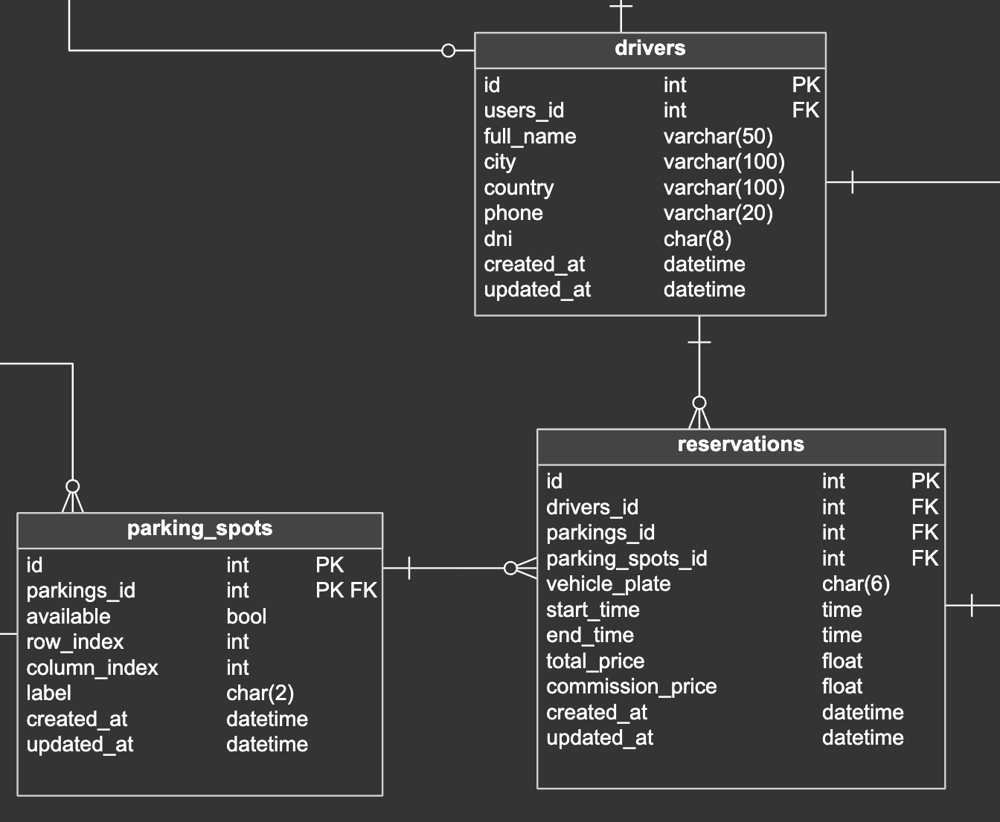

## Capítulo IV: Requirements Specification

### 4.1. Strategic-Level Domain-Driven Design

En esta sección presentamos el proceso y las decisiones estratégicas aplicando Domain-Driven Design (DDD) al proyecto ParkeoYa. El objetivo fue descomponer el dominio en Bounded Contexts bien delimitados, definiendo cómo colaboran entre sí para resolver los casos de negocio más relevantes (búsqueda, reserva, uso del espacio, pago y monitoreo IoT).

El trabajo se estructuró en cuatro actividades principales:

1. EventStorming (Design-Level)
2. Candidate Context Discovery
3. Domain Message Flows Modeling (Domain Storytelling)
4. Bounded Context Canvases (iterativos) 

> **Herramienta utilizada:** Miro (tablero “ParkeoYa – DDD”), con sticky notes naranjas (eventos), azules (comandos), rosas (actores), amarillas (políticas) y moradas (agregados).  
> **Duración total:** 3.5 h (1h45m EventStorming + 1h30m Candidate Context Discovery + 15m Domain Storytelling inicial + 15m cierre).  
> **Participantes:** Todo el equipo (conductores/propietarios representados por el Product Owner) y un facilitador DDD.

---

#### 4.1.1 Design Level EventStorming

##### Propósito y alcance
El objetivo de la sesión de **EventStorming** fue mapear los **eventos de dominio** clave de punta a punta (descubrimiento → reserva → ingreso/salida → pago → liberación → analítica), identificar políticas/decisiones y detectar *pivotal events* que anticipan límites naturales entre contextos.

##### Actividades realizadas
- **Warm-up (10 min):** repaso de ubiquitous language (estacionamiento, reserva, check-in, check-out, tiempo de gracia, tarifa, sensor).  
- **Storming (70 min):** construcción de la línea de tiempo con eventos de negocio; se añadieron comandos, actores y políticas.  
- **Refactor (25 min):** agrupación de eventos por zonas de responsabilidad y detección de dependencias externas (pasarela de pagos, push notifications).  

##### Línea de tiempo (eventos principales)
1. Conductor busca estacionamiento.  
2. Disponibilidad consultada (datos de sensores agregados).  
3. Espacio reservado (bloqueo temporal).  
4. Reserva confirmada (reglas de overbooking y tiempo de gracia).  
5. Conductor llega → Check-in registrado (sensor detecta ocupación).  
6. Uso del espacio contabilizado (cronómetro de tarifa).  
7. Extensión de tiempo solicitada (opcional).  
8. Check-out registrado (libera el espacio).  
9. Pago liquidado (cobro exacto por tiempo).  
10. Reembolso/ajuste aplicado (si aplica).  
11. Ocupación/rotación actualizadas.  
12. Métricas y reportes generados (dashboard propietario).  
13. Alertas operativas (ocupación no autorizada, sensor caído).  

##### Políticas de negocio detectadas

- **Bloqueo de espacio:** al crear reserva se bloquea por *X* minutos hasta el check-in.  
- **Tiempo de gracia:** tolerancia configurable antes de liberar y penalizar.  
- **Cálculo de tarifa:** redondeo mixto (hora + prorrateo minutos).  
- **Compensación por falla:** reembolso automático y crédito si el sensor se equivoca.  
- **SLA de sensores:** batería/conectividad bajo umbral → alerta preventiva.  

##### 4.1.1.1. Candidate Context Discovery

En esta subsección se describen los bounded contexts candidatos, sus límites de responsabilidad, datos propietarios, contratos de interacción (sincronía/asíncronía) y eventos de dominio. La definición se alinea con el EventStorming previo y con las épicas e historias del Cap. III.

Nota de convenciones
- Roles: Conductor, Propietario.
- Estados típicos de Reserva: creada, bloqueada, confirmada, en-uso, extendida, completada, cancelada, expirada, no-show.
- Los eventos de dominio se nombran en pasado y en español: <Hecho>Registrado, <Entidad>Creada, etc.

##### Bounded Context: IAM (Identity & Access Management)

- Descripción
  - Gestiona identidad, autenticación y autorización para todos los usuarios. Emite y valida tokens (JWT) y administra sesiones.
- Responsabilidades
  - Registro y verificación de cuentas; login/logout; recuperación de acceso; emisión/rotación de tokens.
  - Gestión de roles y permisos (conductor, propietario, admin) y revocación de sesiones comprometidas.

—

##### Bounded Context: Profile

- Descripción
  - Mantiene, gestiona y crea perfiles y preferencias de usuarios. Diferencia entre PerfilConductor y PerfilPropietario.
- Responsabilidades
  - CRUD de perfiles, foto y datos de contacto; preferencias de notificaciones.
  - Para propietarios: datos fiscales y preferencias comerciales básicas.

—

##### Bounded Context: Parking Management

- Descripción
  - Administra estacionamientos y espacios, sus atributos, tarifas y horarios; provee consultas de disponibilidad.
- Responsabilidades
  - Alta/edición de estacionamientos (propietario verificado), gestión de espacios y tarifas/horarios.
  - Cálculo de disponibilidad combinando reservas activas y estado IoT.

—

##### Bounded Context: Reservations

- Descripción
  - Encargado de gestionar las reservas de espacios de estacionamiento. Permite crear, consultar y actualizar el estado de una reserva, asociándola a un conductor y un estacionamiento.
- Responsabilidades
  - Generar una nueva reserva.
  - Asociar pagos a reservas.
  - Consultar disponibilidad de espacios.
  - Cambiar el estado de la reserva (creada, pagada, cancelada).

—

##### Bounded Context: Payment

- Descripción
  - Procesa pagos de reservas. Aplica comisión del modelo de negocio.
- Responsabilidades
  - Preautorizar al crear/confirmar.
  - Calcular la comisión fija del 5% por cada pago de reserva y reflejarla en la liquidación neta.

—

##### Bounded Context: Review 

- Descripción
  - Gestiona calificaciones y reseñas sobre los estacionamientos luego de su uso; así mismo expone su reputación agregada por cada uno.
- Responsabilidades
  - Registrar reseñas 1–5 estrellas con categorías; moderación básica; cálculo de promedios. Poder actulizarlo y eliminarlo.

—

##### Bounded Context: IoT Management

- Descripción
  - Gestiona los dispositivos IoT instalados en cada espacio de estacionamiento, permitiendo reportar en tiempo real la disponibilidad de espacios.
- Responsabilidades
  - Registrar y asociar dispositivos IoT a espacios.
  - Establecer estados de ocupación (libre/ocupado).
  - Consultar disponibilidad desde reservas o frontends.
  - Validar funcionamiento y batería del dispositivo.

—

##### Bounded Context: Notification

- Descripción
  - Enviar notificaciones a los usuarios del sistema, relacionadas con el estado de pagos o reservas, u otros eventos clave.
- Responsabilidades
  - Crear notificaciones personalizadas.
  - Asociar mensajes a usuarios específicos.
  - Notificar eventos como éxito/fallo en pago o reserva.
  - Consultar historial de notificaciones por usuario.

—

##### 4.1.1.2. Domain Message Flows Modeling

En esta etapa representamos el intercambio de mensajes entre actores y bounded contexts para entender cómo se coordina el sistema extremo a extremo. A modo ilustrativo:

- Cuando un sensor registra el ingreso de un vehículo, emite el evento: EspacioOcupadoDetectado.
- Si un conductor solicita una reserva desde la app, se ejecuta el comando: CrearReserva/BloquearEspacio y, tras las validaciones, se publica el evento: ReservaConfirmada.
- Al completarse el cobro, se publica el evento: PagoProcesado (o PagoCapturado), que habilita la verificación/actualización del estado de la reserva.
- Cuando el sensor detecta la salida del vehículo, se libera el espacio mediante el evento: EspacioLiberadoDetectado.

Este modelado hace visible qué eventos impactan a cada contexto y cómo se encadenan sus reacciones. Además, ayuda a anticipar zonas de riesgo, como la duplicidad de reservas o fallas de telemetría (sensores inactivos), para diseñar medidas de resiliencia y validaciones cruzadas.

##### 4.1.1.3. Bounded Context Canvases
1. IAM

2. Profile

3. Parking Management

4. Reservation

5. Payment

6. Review

7. Notification

8. IoT Management

#### 4.1.2. Context Mapping

**Descripción de Relaciones**

- *IAM → Profile / Reservations / Notification / Payment*  
  El contexto de Identidad y Acceso permite que el usuario acceda a las funcionalidades del sistema.

- *Profile → Parking / Reservations*  
  El contexto de perfil provee información del usuario (rol, datos personales) que se reutiliza en la gestión de reservas o estacionamientos.

- *Reservations ↔ Parking*  
  Se comunica para consultar disponibilidad y reservar espacios.

- *Reservations ↔ Payment*  
  La reserva requiere validación de pagos.

- *Payment → Notification*  
  Notifica al usuario el resultado de su pago.

- *IoT → Parking*  
  Proporciona la información en tiempo real de los espacios disponibles.

- *Reservations → Review*  
  Los conductores dejan una reseña tras utilizar un espacio reservado.

---

#### 4.1.3. Software Architecture

##### 4.1.3.1. Software Architecture Context Level Diagrams

Se describe el diagrama de contexto del sistema SmartParking, que define los límites del sistema y cómo interactúa con los segmentos objetivo y servicios externos.

##### 4.1.3.2. Software Architecture Container Level Diagrams

Se presenta el diagrama de contenedores del sistema SmartParking, que detalla los principales componentes internos y sus interacciones entre sí y con sistemas externos.

##### 4.1.3.3. Software Architecture Deployment Diagrams

Se presenta el diagrama de despliegue del sistema SmartParking, que ilustra cómo se implementan los contenedores en la infraestructura física y virtual.

### 4.2. Tactical-Level Domain-Driven Design

#### 4.2.1. Bounded Context: Identity and Access Management
El **Bounded Context de IAM (Identity and Access Management)** está diseñado para manejar la autenticación, autorización y gestión de usuarios dentro de la aplicación. Este contexto gestiona tanto el registro como la autenticación de usuarios, así como la asignación y gestión de roles. En esta sección, se definen los componentes claves como las entidades User y Role, los controladores para la interacción con estos recursos y los servicios de aplicación y consulta que gestionan las operaciones relacionadas.

##### 4.2.1.1. Domain Layer

El **Domain Layer** es responsable de representar el núcleo del sistema de gestión de usuarios y roles. Contiene las entidades principales (como User) y su lógica de negocio, con las relaciones que gestionan la interacción con los roles y otras entidades dentro del sistema.

**Aggregate:** User

**Descripción:** Representa el agregado raíz "Usuario", que contiene los datos de la cuenta y su rol. Se mapea a la tabla users en la base de datos.

|**Atributo**|**Descripción**|**Tipo**|
| :- | :- | :- |
|email|Correo electrónico del usuario.|String|
|password|Contraseña del usuario.|String|
|roles|Conjunto de roles asociados al usuario.|Set<Role>|

**Métodos**

|**Método**|**Descripción**|
| :- | :- |
|addRole(Role role)|Añade un rol al usuario.|
|addRoles(List<Role> roles)|Añade un conjunto de roles al usuario.|
|getSerializedRoles()|Devuelve los roles del usuario como una lista de nombres serializados.|

**Entity: Role**

**Descripción:** Representa un rol dentro del sistema, asociado a un value object Roles y utilizado para definir permisos de usuario.

|**Atributo**|**Tipo**|**Descripción**|
| :- | :- | :- |
|id|Long|Identificador único del rol|
|name|Roles|Nombre del rol (value object)|

|**Método**|**Descripción**|
| :- | :- |
|getStringName()|Obtiene el nombre del rol como string|
|getDefaultRole()|Retorna el rol por defecto (ROLE\_ADMIN)|
|toRoleFromName(String name)|Crea un rol a partir de su nombre string|
|validateRoleSet(List<Role> roles)|Valida una lista de roles y asigna un rol por defecto si está vacía|

**Value Objects**

**Roles**

**Descripción:** Enumeración que representa los roles disponibles en el sistema.

|**Valor**|**Descripción**|
| :-: | :-: |
|ROLE_ADMIN|Administrador del sistema|
|ROLE_PARKING\_OWNER|Propietario de estacionamiento|
|ROLE_DRIVER|Conductor|

**Domain Services**

Los Domain Services en el bounded context IAM son interfaces que definen operaciones y reglas de negocio que no pertenecen naturalmente a una única entidad o aggregate, pero que son esenciales para mantener la lógica del dominio. Estas interfaces abstraen comportamientos relacionados con la gestión de usuarios y roles, como la autenticación, el registro, consultas y operaciones de inicialización de datos.

**RoleCommandService**

**Descripción:** Interfaz que define el contrato para los comandos relacionados con la gestión de roles dentro del dominio. Permite establecer las operaciones necesarias para crear o modificar roles sin acoplarse a una implementación específica.

|**Método**|**Descripción**|
| :-: | :-: |
|handle(SeedRolesCommand command)|Maneja la creación inicial de roles en el sistema|

**RoleQueryService**

**Descripción:** Interfaz que define las operaciones de consulta para obtener información sobre los roles registrados en el sistema. Aísla la lógica de consulta respecto de su implementación.

|**Método**|**Descripción**|
| :-: | :-: |
|handle(GetAllRolesQuery query)|Obtiene todos los roles registrados|
|handle(GetRoleByNameQuery query)|Busca un rol por su nombre|

**UserCommandService**

**Descripción:** Interfaz que establece el contrato para los comandos de gestión de usuarios dentro del dominio. Define las operaciones necesarias para registrar usuarios, autenticarlos y realizar cambios relacionados.

|**Método**|**Descripción**|
| :-: | :-: |
|handle(SignInCommand command)|Autentica a un usuario y devuelve su información junto con el token|
|handle(SignUpDriverCommand command)|Registra a un nuevo conductor|
|handle(SignUpParkingOwnerCommand command)|Registra a un nuevo propietario de estacionamiento|

**UserQueryService**

**Descripción:** Interfaz que define las operaciones de consulta relacionadas con los usuarios del sistema. Permite obtener información y verificar la existencia de usuarios de forma desacoplada.

|**Método**|**Descripción**|
| :-: | :-: |
|handle(GetAllUsersQuery query)|Obtiene todos los usuarios registrados|
|handle(GetUserByIdQuery query)|Busca un usuario por su ID|
|handle(GetUserByUsernameQuery query)|Busca un usuario por su nombre de usuario|
|handle(CheckUserByIdQuery query)|Verifica si existe un usuario con un ID específico|

##### 4.2.1.2. Interface Layer

El **Interface Layer** sirve como la capa de comunicación entre el mundo exterior (como los controladores HTTP) y la lógica del dominio. Este nivel contiene los controladores responsables de gestionar las solicitudes de los usuarios, como el inicio de sesión, registro y obtención de información de usuarios.

**Controlador AuthenticationController**

**Descripción**:
El controlador AuthenticationController se encarga de manejar las solicitudes relacionadas con la autenticación de los usuarios. A través de sus métodos, permite realizar el inicio de sesión y registro de usuarios, ya sea conductores o propietarios de estacionamientos.

|**Método**|**Descripción**|**HTTP**|**Respuesta**|
| :- | :- | :- | :- |
|signIn(SignInResource signInResource)|Maneja la solicitud de inicio de sesión.|POST /sign-in|Devuelve el recurso de usuario autenticado.|
|signUpDriver(SignUpDriverResource signUpDriverResource)|Maneja la solicitud de registro para conductores.|POST /sign-up/driver|Devuelve el recurso del usuario creado.|
|signUpParkingOwner(SignUpParkingOwnerResource signUpParkingOwnerResource)|Maneja la solicitud de registro para propietarios de estacionamientos.|POST /sign-up/parking-owner|Devuelve el recurso del usuario creado.|

**Controlador RolesController**

**Descripción**:
El controlador RolesController permite obtener la lista de todos los roles disponibles en el sistema.

|**Método**|**Descripción**|**HTTP**|**Respuesta**|
| :- | :- | :- | :- |
|getAllRoles()|Devuelve todos los roles.|GET /roles|Lista de recursos de roles.|

**Controlador UsersController**

**Descripción**:
El controlador UsersController gestiona las solicitudes para obtener información sobre los usuarios registrados en el sistema.

|**Método**|**Descripción**|**HTTP**|**Respuesta**|
| :- | :- | :- | :- |
|getAllUsers()|Devuelve todos los usuarios.|GET /users|Lista de recursos de usuarios.|
|getUserById(Long userId)|Devuelve un usuario por su ID.|GET /users/{userId}|Recurso de usuario por ID.|

##### 4.2.1.3. Application Layer

El **Application Layer** contiene la lógica necesaria para procesar las operaciones relacionadas con las entidades, como la creación de roles y usuarios, y la gestión de sus acciones. Esta capa maneja la lógica del negocio que no forma parte del dominio central, sino que orquesta las acciones entre diferentes componentes del sistema.

**Clase RoleCommandServiceImpl**

**Descripción**:
La clase RoleCommandServiceImpl se encarga de manejar los comandos relacionados con los roles. Proporciona lógica para crear roles si no existen previamente en el sistema.

|**Método**|**Descripción**|
| :- | :- |
|handle(SeedRolesCommand command)|Maneja el comando para crear roles si no existen.|

**Clase UserCommandServiceImpl**

**Descripción**:
La clase UserCommandServiceImpl maneja los comandos relacionados con las operaciones de los usuarios, como iniciar sesión y registrar nuevos usuarios.

|**Método**|**Descripción**|
| :- | :- |
|handle(SignInCommand command)|Maneja el comando para iniciar sesión de un usuario.|
|handle(SignUpDriverCommand command)|Maneja el comando para registrar un conductor.|
|handle(SignUpParkingOwnerCommand command)|Maneja el comando para registrar un propietario de estacionamiento.|

**Clase RoleQueryServiceImpl**

**Descripción**:
La clase RoleQueryServiceImpl maneja las consultas relacionadas con los roles.

|**Método**|**Descripción**|
| :- | :- |
|handle(GetAllRolesQuery query)|Devuelve todos los roles.|
|handle(GetRoleByNameQuery query)|Devuelve un rol por su nombre.|

**Clase UserQueryServiceImpl**

**Descripción**:
La clase UserQueryServiceImpl maneja las consultas relacionadas con los usuarios.

|**Método**|**Descripción**|
| :- | :- |
|handle(GetAllUsersQuery query)|Devuelve todos los usuarios.|
|handle(GetUserByIdQuery query)|Devuelve un usuario por su ID.|
|handle(GetUserByUsernameQuery query)|Devuelve un usuario por su correo electrónico.|
|handle(CheckUserByIdQuery query)|Verifica si un usuario existe por su ID.|

##### 4.2.1.4. Infrastructure Layer

La capa de infraestructura se encarga de la interacción con fuentes externas de datos, como bases de datos, APIs de terceros, o cualquier recurso que esté fuera del ámbito de la lógica de negocio del sistema. En este caso, los repositorios UserRepository y RoleRepository son responsables de la persistencia de los datos relacionados con los usuarios y roles, proporcionando métodos para validar la existencia de entidades y realizar búsquedas en la base de datos.

**Repositorio: UserRepository**

**Descripción**: Repositorio que maneja las operaciones de persistencia relacionadas con los usuarios en la base de datos.

|**Método**|**Descripción**|
| :- | :- |
|findByEmail(String email)|Busca un usuario en la base de datos utilizando su correo electrónico. Devuelve un Optional<User>.|
|existsByEmail(String email)|Verifica si un usuario con el correo electrónico especificado ya existe. Devuelve un boolean.|
|existsById(Long userId)|Verifica si un usuario con el ID especificado ya existe. Devuelve un boolean.|

**Repositorio: RoleRepository**

**Descripción**: Repositorio encargado de gestionar la persistencia de los roles del sistema.

|**Método**|**Descripción**|
| :- | :- |
|findByName(Roles name)|Busca un rol en la base de datos por su nombre. Devuelve un Optional<Role>.|
|existsByName(Roles name)|Verifica si un rol con el nombre especificado ya existe. Devuelve un boolean.|

##### 4.2.1.5. Bounded Context Software Architecture Component Level Diagrams

-**Backend**

El IAM Bounded Context gestiona la autenticación y autorización de usuarios, estructurado en capas que incluyen lógica de negocio, coordinación de casos de uso, persistencia e interfaces HTTP. La interfaz recibe solicitudes desde las aplicaciones web y móvil, delegándolas a la capa de aplicación, que a su vez interactúa con la lógica de dominio y con la infraestructura para acceder a datos. Además, expone un servicio externo para coordinar acciones relacionadas con perfiles desde otros bounded contexts, asegurando una integración segura y coherente del sistema de identidad.

-**WebApp**

El diagrama de componentes del IAM Bounded Context representa los elementos encargados de gestionar la autenticación y registro de usuarios dentro de la aplicación SmartParking, incluyendo componentes de interfaz como Sign In Component y Sign Up Component, que capturan credenciales y datos de registro, y un AuthService que centraliza la lógica de autenticación comunicándose con la API REST y gestionando la transformación de datos mediante el IAMAssembler, garantizando una separación limpia entre la vista, la lógica y la comunicación con los servicios backend.

-**mobileApp**

El diagrama de componentes del bounded context Profile muestra los componentes encargados de la gestión de perfiles de conductores en la aplicación móvil, incluyendo un widget para la edición de datos de usuario, un servicio de perfil que centraliza la lógica de negocio relacionada y un ensamblador que adapta los datos entre las estructuras de backend y los modelos del frontend. El flujo parte del Driver Card Edit Widget hacia el DriverService, que transforma los datos usando el ProfileAssembler y gestiona las solicitudes a la API RESTful, permitiendo la edición y recuperación de información de perfil de forma eficiente y estructurada.

##### 4.2.1.6. Bounded Context Software Architecture Code Level Diagrams

###### 4.2.1.6.1. Bounded Context Domain Layer Class Diagrams

El diagrama de clases muestra cómo se relacionan las entidades User y Role, así como los objetos de valor asociados a ellas.

###### 4.2.1.6.2. Bounded Context Database Design Diagram

En el diagrama de base, se observa la tabla users y roles, así como la relación entre estas.

#### 4.2.2. Bounded Context: Profile Management

El Bounded Context de **Profile** es responsable de la gestión de perfiles de usuarios que interactúan con el sistema. En particular, maneja los perfiles de **Conductores (Drivers)** y **Propietarios de Estacionamientos (Parking Owners)**. Este contexto permite registrar nuevos perfiles y obtener información de los mismos mediante su userId. Las entidades principales son Driver y ParkingOwner, y su estructura está diseñada para asegurar la unicidad de identificadores clave como DNI, RUC y número de teléfono.

##### 4.2.2.1. Domain Layer

La capa de dominio encapsula las entidades centrales del sistema de perfiles y contiene la lógica de validación de atributos mediante objetos de valor. Las entidades principales son Driver y ParkingOwner, las cuales heredan de un agregado raíz auditable. Se usan objetos de valor como Phone, Dni y Ruc para encapsular lógica específica y validación.

**Aggregate:** Driver

**Descripción:** Representa el perfil de un conductor registrado.

|**Atributo**|**Descripción**|**Tipo**|
| :-: | :-: | :-: |
|fullName|Nombre completo del conductor|String|
|city|Ciudad de residencia|String|
|country|País de residencia|String|
|userId|ID del usuario (referencia a IAM)|Long|
|dni|Documento nacional de identidad|Dni|
|phone|Número de teléfono del usuario|Phone|

**Método**

|**Método**|**Descripción**|
| :-: | :-: |
|Driver(CreateDriverCommand command, Long userId)|Constructor que crea un perfil de conductor.|
|String getDni()|Devuelve el número de DNI del conductor.|
|String getPhone()|Devuelve el número telefónico del conductor.|

**Aggregate**: ParkingOwner

**Descripción:** Representa el perfil de un propietario de estacionamiento.

|**Atributo**|**Descripción**|**Tipo**|
| :-: | :-: | :-: |
|fullName|Nombre completo del propietario|String|
|city|Ciudad de operación|String|
|country|País de operación|String|
|companyName|Nombre de la empresa|String|
|userId|ID del usuario (referencia a IAM)|Long|
|ruc|Registro Único de Contribuyentes (empresa)|Ruc|
|phone|Número de teléfono|Phone|

**Método**

|**Clase**|**Método**|**Descripción**|
| :-: | :-: | :-: |
|ParkingOwner|ParkingOwner(CreateParkingOwnerCommand command, Long userId)|Constructor que crea un perfil de propietario.|
|ParkingOwner|String getPhone()|Devuelve el número telefónico del propietario.|
|ParkingOwner|String getRuc()|Devuelve el RUC de la empresa del propietario.|

**Value Objects**

**Dni**

**Descripción:**
Representa el Documento Nacional de Identidad (DNI) de un usuario. Asegura que el valor sea un número positivo de exactamente 8 dígitos.

**Atributos:**

|**Nombre**|**Tipo**|**Descripción**|
| :- | :- | :- |
|dni|String|Número de DNI con exactamente 8 dígitos|

**Métodos:**

|**Nombre**|**Descripción**|
| :- | :- |
|Dni(String dni)|Constructor que valida que el valor tenga exactamente 8 dígitos.|
|Dni()|Constructor por defecto que asigna "00000000".|

**Phone**

**Descripción:**
Representa un número de teléfono válido, de exactamente 9 dígitos.

**Atributos:**

|**Nombre**|**Tipo**|**Descripción**|
| :- | :- | :- |
|phone|String|Número telefónico con exactamente 9 dígitos|

**Métodos:**

|**Nombre**|**Descripción**|
| :- | :- |
|Phone(String phone)|Constructor que valida que el valor tenga exactamente 9 dígitos.|
|Phone()|Constructor por defecto que asigna "000000000".|

**Ruc**

**Descripción:**
Representa un Registro Único de Contribuyente (RUC), válido con exactamente 11 dígitos.

**Atributos:**

|**Nombre**|**Tipo**|**Descripción**|
| :- | :- | :- |
|ruc|String|Número de RUC con exactamente 11 dígitos|

**Métodos:**

|**Nombre**|**Descripción**|
| :- | :- |
|Ruc(String ruc)|Constructor que valida que el valor tenga exactamente 11 dígitos.|
|Ruc()|Constructor por defecto que asigna "00000000000".|

**Domain Services**

Los Domain Services en este contexto son interfaces que definen operaciones de negocio relacionadas con los aggregates Driver y ParkingOwner. Permiten separar las reglas de negocio que no pertenecen directamente a una entidad o value object.

**DriverCommandService**

**Descripción:**
Interfaz que define operaciones de negocio relacionadas con la creación de un Driver.

**Métodos:**

|**Nombre**|**Descripción**|
| :- | :- |
|Optional<Driver> handle(CreateDriverCommand command, Long userId)|Procesa el comando de creación de un conductor, asociándolo a un User existente mediante su userId.|

**DriverQueryService**

**Descripción:**
Interfaz que permite consultar información relacionada con un Driver.

**Métodos:**

|**Nombre**|**Descripción**|
| :- | :- |
|Optional<Driver> handle(GetDriverByUserIdAsyncQuery query)|Obtiene un Driver asociado a un User mediante su userId.|

**ParkingOwnerCommandService**

**Descripción:**
Interfaz que define operaciones de negocio relacionadas con la creación de un ParkingOwner.

**Métodos:**

|**Nombre**|**Descripción**|
| :- | :- |
|Optional<ParkingOwner> handle(CreateParkingOwnerCommand command, Long userId)|Procesa el comando de creación de un propietario de estacionamiento, asociándolo a un User existente mediante su userId.|

**ParkingOwnerQueryService**

**Descripción:**
Interfaz que permite consultar información relacionada con un ParkingOwner.

**Métodos:**

|**Nombre**|**Descripción**|
| :- | :- |
|Optional<ParkingOwner> handle(GetParkingOwnerByUserIdAsyncQuery query)|Obtiene un ParkingOwner asociado a un User mediante su userId.|

##### 4.2.2.2. Interface Layer

Esta capa actúa como punto de entrada para consultas externas relacionadas con los perfiles. A través de los controladores REST, los clientes pueden consultar el perfil de un conductor o un propietario de estacionamiento por su userId.

**Controlador: ProfilesController**

**Descripción:** Gestiona las consultas de perfiles de usuarios.

|**Método**|**Descripción**|**HTTP**|**Respuesta**|
| :-: | :-: | :-: | :-: |
|getDriverProfile(Long userId)|Devuelve el perfil de un conductor por su userId|GET /profiles/driver/{userId}|Recurso del conductor|
|getParkingOwnerProfile(Long userId)|Devuelve el perfil de un propietario por su userId|GET /profiles/parking-owner/{userId}|Recurso del propietario|

##### 4.2.2.3. Application Layer

Esta capa contiene la lógica de aplicación, incluyendo la validación de unicidad para campos clave y el manejo de comandos y consultas. Coordina la creación y recuperación de perfiles utilizando servicios específicos para cada tipo de usuario.

**Clase: DriverCommandServiceImpl**

**Descripción:** Gestiona los comandos para la creación de conductores.

|**Método**|**Descripción**|
| :-: | :-: |
|handle(CreateDriverCommand)|Crea un nuevo perfil de conductor, validando unicidad de dni, phone y userId.|

**Clase: ParkingOwnerCommandServiceImpl**

**Descripción:** Gestiona los comandos para la creación de propietarios de estacionamiento.

|**Método**|**Descripción**|
| :-: | :-: |
|handle(CreateParkingOwnerCommand)|Crea un nuevo perfil de propietario, validando ruc, phone, userId.|

**Clase: DriverQueryServiceImpl**

**Descripción:** Gestiona consultas sobre conductores.

|**Método**|**Descripción**|
| :-: | :-: |
|handle(GetDriverByUserIdQuery)|Recupera un conductor a partir de su userId.|

**Clase: ParkingOwnerQueryServiceImpl**

**Descripción:** Gestiona consultas sobre propietarios de estacionamiento.

|**Método**|**Descripción**|
| :-: | :-: |
|handle(GetParkingOwnerByUserIdQuery)|Recupera un propietario por su userId.|

##### 4.2.2.4. Infrastructure Layer

La capa de infraestructura proporciona la implementación de persistencia para los perfiles, permitiendo operaciones CRUD y búsquedas específicas. Los repositorios se basan en Spring Data JPA.

**Repositorio: DriverRepository**

**Descripción:** Administra la persistencia de la entidad Driver.

|**Método**|**Descripción**|
| :-: | :-: |
|findDriverByUserId(Long)|Recupera un conductor por su userId.|
|existsByDni_Dni(String)|Verifica si existe un conductor con un DNI dado.|
|existsByPhone_Phone(String)|Verifica si existe un conductor con un teléfono dado.|
|existsByUserId(Long)|Verifica si existe un conductor con un userId dado.|

**Repositorio: ParkingOwnerRepository**

**Descripción:** Administra la persistencia de la entidad ParkingOwner.

|**Método**|**Descripción**|
| :-: | :-: |
|findParkingOwnerByUserId(Long)|Recupera un propietario de estacionamiento por su userId.|
|existsByRuc_Ruc(String)|Verifica si existe un propietario con un RUC dado.|
|existsByPhone_Phone(String)|Verifica si existe un propietario con un teléfono dado.|
|existsByUserId(Long)|Verifica si existe un propietario con un userId dado.|

##### 4.2.2.5. Bounded Context Software Architecture Component Level Diagrams

-**Backend**

El Profile Bounded Context centraliza la gestión de la información de perfil de los usuarios, incluyendo su estructura de dominio, lógica de aplicación, almacenamiento persistente e interfaces expuestas vía HTTP. Su arquitectura facilita tanto el acceso directo desde aplicaciones cliente como la colaboración con otros contextos a través de su fachada de contexto, permitiendo así la reutilización controlada de funciones relacionadas con los perfiles sin romper la encapsulación.

-**WebApp**

El diagrama de componentes del Profile Bounded Context describe la estructura de componentes dedicados a la gestión de perfiles de propietarios de estacionamientos, donde el Owner Car Edit Component permite visualizar y editar información personal, mientras que el OwnerService orquesta las operaciones y coordina con ProfileAssembler para transformar datos entre el frontend y la API RESTful, estableciendo una arquitectura desacoplada que facilita el mantenimiento y la evolución de las funcionalidades de perfil.

-**MobileApp**

El diagrama de componentes del bounded context Profile muestra los componentes encargados de la gestión de perfiles de conductores en la aplicación móvil, incluyendo un widget para la edición de datos de usuario, un servicio de perfil que centraliza la lógica de negocio relacionada y un ensamblador que adapta los datos entre las estructuras de backend y los modelos del frontend. El flujo parte del Driver Card Edit Widget hacia el DriverService, que transforma los datos usando el ProfileAssembler y gestiona las solicitudes a la API RESTful, permitiendo la edición y recuperación de información de perfil de forma eficiente y estructurada.

##### 4.2.2.6. Bounded Context Software Architecture Code Level Diagrams

###### 4.2.2.6.1. Bounded Context Domain Layer Class Diagrams

El diagrama de clases muestra la relación entre las entidades Driver y ParkingOwner, así como los objetos de valor asociados a ellas.

###### 4.2.2.6.2. Bounded Context Database Design Diagram

El diagrama de base muestra las tablas drivers y parking\_owners, así como la relación entre estas.

#### 4.2.3. Bounded Context: Parking Management
El Bounded Context de **Parking Management** es responsable de la gestión de los estacionamientos registrados por los propietarios. Este contexto permite la creación de estacionamientos, el registro de spots (espacios disponibles), y la consulta de los mismos. Las entidades principales son **Parking** y **ParkingSpot**, donde un estacionamiento puede contener múltiples espacios. La lógica de agregación, validación y control de espacios está encapsulada en el agregado raíz Parking.

##### 4.2.3.1. Domain Layer

La capa de dominio encapsula las entidades y lógica central del sistema de gestión de estacionamientos. El agregado raíz es Parking, que contiene información sobre la ubicación, tarifa, imagen, y distribución de los espacios de estacionamiento. La entidad ParkingSpot representa un espacio individual. Se utilizan objetos de valor como SpotManager para encapsular lógica y referencias específicas.

**Aggregate:** Parking

**Descripción:** Representa un estacionamiento gestionado por un propietario.

|**Atributo**|**Descripción**|**Tipo**|
| :-: | :-: | :-: |
|name|Nombre del estacionamiento|String|
|description|Descripción del estacionamiento|String|
|address|Dirección física del estacionamiento|String|
|lat|Latitud de ubicación|Double|
|lng|Longitud de ubicación|Double|
|ratePerHour|Tarifa por hora|Float|
|rating|Calificación promedio|Float|
|totalSpots|Total de espacios de estacionamiento|Integer|
|availableSpots|Espacios actualmente disponibles|Integer|
|totalRows|Número total de filas de espacios|Integer|
|totalColumns|Número total de columnas de espacios|Integer|
|imageUrl|URL de imagen representativa|String|
|ownerId|Identificador del propietario|OwnerId|
|parkingSpotManager|Gestor interno de los espacios|SpotManager|

**Método:**

|**Método**|**Descripción**|
| :-: | :-: |
|Parking(CreateParkingCommand command)|Constructor que crea un estacionamiento a partir de un comando.|
|void addParkingSpot(AddParkingSpotCommand command)|Agrega un nuevo espacio de estacionamiento.|
|List<ParkingSpot> getParkingSpots()|Obtiene todos los espacios de estacionamiento.|
|ParkingSpot getParkingSpot(UUID parkingSpotId)|Devuelve un espacio específico por ID.|
|Long getOwnerId()|Devuelve el ID del propietario del estacionamiento.|

**Entity: ParkingSpot**

**Descripción:** Representa un espacio individual dentro de un estacionamiento.

|**Atributo**|**Descripción**|**Tipo**|
| :-: | :-: | :-: |
|id|Identificador único del espacio|UUID|
|available|Disponibilidad del espacio|Boolean|
|rowIndex|Fila en la matriz del estacionamiento|Integer|
|columnIndex|Columna en la matriz del estacionamiento|Integer|
|label|Etiqueta visible del espacio|String|

**Método**

|**Método**|**Retorno**|**Descripción**|
| :-: | :-: | :-: |
|ParkingSpot()|Constructor protegido|Constructor vacío requerido por JPA.|
|ParkingSpot(Parking parking, Integer row, Integer column, String label)|Constructor|Inicializa un nuevo ParkingSpot con datos de ubicación y disponibilidad.|
|Long getParkingId()|Long|Retorna el ID del estacionamiento asociado.|

**Value Objects**

**OwnerId**

**Descripción:**
Representa el identificador único de un propietario de estacionamiento. Asegura que el valor sea un número positivo.

**Atributos:**

|**Nombre**|**Tipo**|**Descripción**|
| :- | :- | :- |
|ownerId|Long|Identificador único del propietario, debe ser positivo|

**Métodos:**

|**Nombre**|**Descripción**|
| :- | :- |
|OwnerId(Long ownerId)|Constructor que valida que el valor sea un número positivo.|
|OwnerId()|Constructor por defecto que asigna 0L, utilizado para serialización.|

**SpotManager**

**Descripción:**
Representa el componente encargado de administrar la colección de espacios de estacionamiento (ParkingSpot) de un Parking. Permite agregar, eliminar y consultar espacios de estacionamiento.

**Atributos:**

|**Nombre**|**Tipo**|**Descripción**|
| :- | :- | :- |
|parkingSpots|List<ParkingSpot>|Lista de espacios de estacionamiento asociados al Parking|

**Métodos:**

|**Nombre**|**Descripción**|
| :- | :- |
|SpotManager()|Constructor por defecto que inicializa la lista de parkingSpots vacía.|
|addParkingSpot(Parking, Integer, Integer, String)|Agrega un nuevo espacio de estacionamiento a la lista.|
|removeParkingSpot(UUID)|Elimina un espacio de estacionamiento de la lista según su ID.|
|getParkingSpotById(UUID)|Obtiene un espacio de estacionamiento de la lista según su ID. Retorna null si no existe.|

**Domain Services**

**Descripción:**
Los Domain Services en este contexto son **interfaces** que definen operaciones de negocio relacionadas con los aggregates **Parking** y **ParkingSpot**. Permiten separar las reglas de negocio que no pertenecen directamente a una entidad o value object.

**ParkingCommandService**

**Descripción:**
Interfaz que define operaciones de negocio relacionadas con la creación de estacionamientos y la asignación de espacios de estacionamiento.

**Métodos:**

|**Nombre**|**Descripción**|
| :- | :- |
|Optional<Parking> handle(CreateParkingCommand command)|Procesa el comando para crear un nuevo estacionamiento.|
|Optional<ParkingSpot> handle(AddParkingSpotCommand command)|Procesa el comando para agregar un nuevo espacio de estacionamiento a un Parking existente.|

**ParkingQueryService**

**Descripción:**
Interfaz que permite consultar información relacionada con los estacionamientos y sus espacios de estacionamiento.

**Métodos:**

|**Nombre**|**Descripción**|
| :- | :- |
|Optional<Parking> handle(GetParkingByIdQuery query)|Obtiene un estacionamiento por su ID.|
|List<ParkingSpot> handle(GetParkingSpotsByParkingIdQuery query)|Obtiene todos los espacios de estacionamiento asociados a un estacionamiento.|
|Optional<ParkingSpot> handle(GetParkingSpotByIdQuery query)|Obtiene un espacio de estacionamiento específico por su ID.|

##### 4.2.3.2. Interface Layer

Esta capa define los puntos de entrada externos para interactuar con los estacionamientos. A través de controladores REST, se exponen operaciones para registrar estacionamientos y recuperar información.

**Controlador: ParkingController**

**Descripción:** Gestiona las operaciones externas relacionadas con los estacionamientos.

|**Método**|**Descripción**|**HTTP**|**Respuesta**|
| :-: | :-: | :-: | :-: |
|createParking(CreateParkingCommand)|Crea un nuevo estacionamiento|POST /parkings|Recurso del estacionamiento creado|
|getParking(Long parkingId)|Recupera la información de un estacionamiento por su ID|GET /parkings/{parkingId}|Recurso de estacionamiento|
|getAllParkings()|Lista todos los estacionamientos disponibles|GET /parkings|Lista de estacionamientos|
|getParkingSpots(Long parkingId)|Lista los espacios de un estacionamiento específico|GET /parkings/{parkingId}/spots|Lista de espacios|

##### 4.2.3.3. Application Layer

La capa de aplicación contiene la lógica de negocio que orquesta la creación y consulta de estacionamientos y espacios. Coordina comandos y consultas entre la capa de interfaz y la de dominio.

**Clase: ParkingCommandServiceImpl**

**Descripción:** Maneja los comandos de creación de estacionamientos y agregación de espacios.

|**Método**|**Descripción**|
| :-: | :-: |
|handle(CreateParkingCommand)|Crea un nuevo estacionamiento usando los datos del comando|
|handle(AddParkingSpotCommand)|Agrega un nuevo espacio a un estacionamiento existente, validando su matriz|

**Clase: ParkingQueryServiceImpl**

**Descripción:** Maneja las consultas relacionadas con estacionamientos y espacios.

|**Método**|**Descripción**|
| :-: | :-: |
|handle(GetParkingByIdQuery)|Recupera un estacionamiento por su ID|
|handle(GetAllParkingsQuery)|Recupera todos los estacionamientos disponibles|
|handle(GetParkingSpotsQuery)|Recupera los espacios de un estacionamiento dado|

##### 4.2.3.4. Infrastructure Layer

La capa de infraestructura implementa los mecanismos de persistencia para los estacionamientos. Utiliza Spring Data JPA para operaciones CRUD.

**Repositorio: ParkingRepository**

**Descripción:** Administra la persistencia de la entidad Parking.

|**Método**|**Descripción**|
| :-: | :-: |
|findById(Long parkingId)|Recupera un estacionamiento por su ID.|
|findAllByOwnerId(Long ownerId)|Recupera todos los estacionamientos asociados a un propietario.|
|existsByNameAndOwnerId(String, Long)|Verifica si existe un estacionamiento con el mismo nombre para un propietario.|
|existsByAddressAndOwnerId(String, Long)|Verifica si existe un estacionamiento con la misma dirección para un propietario.|

##### 4.2.3.5. Bounded Context Software Architecture Component Level Diagrams

-**Backend**

El Parking Management Bounded Context se encarga de toda la lógica relacionada con la administración de estacionamientos, desde la definición de espacios disponibles hasta la gestión de su estado. Mediante una separación clara por capas, permite recibir solicitudes externas, procesarlas con lógica de aplicación coordinada, aplicar las reglas de dominio y persistir los datos. Ofrece también una fachada que permite a otros bounded contexts consumir funcionalidades específicas del sistema de gestión de parkings de forma segura y acotada.

-**WebApp**

El diagrama de componentes del Parking Management Bounded Context detalla los elementos encargados de administrar los espacios de estacionamiento, incluyendo componentes visuales como Parking Address Picker, Parking Card, Parking List y Parking Spot Viewer, que permiten interactuar con mapas, listas y tarjetas informativas, coordinados por un ParkingService que gestiona la lógica de negocio y delega la transformación de datos a ParkingAssembler, estableciendo un flujo ordenado de interacción entre UI, lógica de negocio y servicios backend.

-**MobileApp**

El diagrama de componentes del bounded context Parking Management detalla los componentes que permiten a los conductores visualizar y consultar información de los estacionamientos disponibles. Incluye widgets como Parking Card, Parking Info, Parking Map y Parking Spot Viewer, que presentan desde vistas resumidas hasta mapas interactivos y disponibilidad de espacios en tiempo real. Todos los widgets consumen lógica del ParkingService, encargado de coordinar operaciones y transformar datos mediante el ParkingAssembler. Este ensamblador adapta los DTOs del backend a modelos de dominio del frontend, con las solicitudes a la API RESTful realizándose a través de HTTPS y JSON.

##### 4.2.3.6. Bounded Context Software Architecture Code Level Diagrams

###### 4.2.3.6.1. Bounded Context Domain Layer Class Diagrams

En el diagrama de clases se observa la relación entre las entidades Parking y ParkingSpot, así como los objetos de valor asociados a ellas.

###### 4.2.3.6.2. Bounded Context Database Design Diagram

El diagrama de base muestra la tabla parkings y parking_spots, así como la relación entre estas.

#### 4.2.4. Bounded Context: Reservation

El Bounded Context de **Reservation** se encarga de gestionar las reservas de espacios de estacionamiento realizadas por los conductores dentro del sistema Smart Parking. Permite crear reservas indicando la duración, placa de vehículo y espacio de estacionamiento, y consultar reservas por estacionamiento, por conductor o por estado. Este contexto interactúa mediante ACL con los contextos de perfiles y gestión de estacionamientos para validar disponibilidad, calcular precios y actualizar el estado de los espacios, notificando además a los propietarios de nuevas reservas.

##### 4.2.4.1. Domain Layer

La capa de dominio encapsula las entidades, objetos de valor y servicios de negocio relacionados con las reservas. Define un aggregate root que contiene los atributos, comportamiento y reglas asociadas a una reserva.

**Aggregates**

**Aggregate: Reservation**

**Descripción:**  
Representa una reserva realizada por un conductor para un espacio de estacionamiento en una fecha y horario específicos.

| **Atributo** | **Descripción** | **Tipo** |
|-------------|----------------|---------|
| `driverId` | Identificador del conductor que realiza la reserva | `DriverId` (Value Object) |
| `driverName` | Nombre completo del conductor | `String` |
| `vehiclePlate` | Placa del vehículo | `String` |
| `parkingId` | Identificador del estacionamiento reservado | `ParkingId` (Value Object) |
| `parkingSpotId` | Identificador del espacio reservado | `ParkingSpotId` (Value Object) |
| `spotLabel` | Etiqueta del espacio reservado | `String` |
| `date` | Fecha de la reserva | `LocalDate` |
| `startTime` | Hora de inicio de la reserva | `LocalTime` |
| `endTime` | Hora de fin de la reserva | `LocalTime` |
| `totalPrice` | Precio total calculado para la reserva | `Float` |
| `status` | Estado de la reserva (PENDING, CONFIRMED...) | `ReservationStatus` (Enum) |

**Métodos:**

| **Método** | **Descripción** |
|-----------|----------------|
| `Reservation(CreateReservationCommand, String, Float, String)` | Constructor que inicializa una reserva con datos del comando y valores externos |
| `Float calculateTotalPrice(Float pricePerHour)` | Calcula el precio total en función de la duración |
| `confirm()` | Cambia el estado de la reserva a CONFIRMED |
| `cancel()` | Cambia el estado de la reserva a CANCELED |
| `complete()` | Cambia el estado de la reserva a COMPLETED |

**Value Objects**

**DriverId**

**Descripción:**  
Representa de forma segura el identificador de un conductor, validando que sea un número positivo.

| **Atributo** | **Descripción** | **Tipo** |
|-------------|----------------|---------|
| `driverId` | Identificador único del conductor | `Long` |

**ParkingId**

**Descripción:**  
Representa de forma segura el identificador de un estacionamiento, validando que sea un número positivo.

| **Atributo** | **Descripción** | **Tipo** |
|-------------|----------------|---------|
| `parkingId` | Identificador único del estacionamiento | `Long` |

**ParkingSpotId**

**Descripción:**  
Representa de forma segura el identificador de un espacio de estacionamiento, garantizando que sea un UUID válido.

| **Atributo** | **Descripción** | **Tipo** |
|-------------|----------------|---------|
| `parkingSpotId` | Identificador único del espacio | `UUID` |

**ReservationStatus**

**Descripción:**  
Enum que define los posibles estados de una reserva.

| **Valor** | **Descripción** |
|----------|----------------|
| `PENDING` | Reserva pendiente por confirmar |
| `CONFIRMED` | Reserva confirmada |
| `CANCELED` | Reserva cancelada |
| `COMPLETED` | Reserva completada |

**Domain Services**

Los Domain Services definen las operaciones de negocio relacionadas con la creación y consulta de reservas.

**ReservationCommandService**

**Descripción:**  
Define operaciones de negocio para crear nuevas reservas.

| **Nombre** | **Descripción** |
|-----------|----------------|
| `Optional<Reservation> handle(CreateReservationCommand command)` | Procesa un comando de creación de reserva, actualiza disponibilidad y notifica al propietario |

**ReservationQueryService**

**Descripción:**  
Define consultas de reservas por estacionamiento, conductor o estado.

| **Nombre** | **Descripción** |
|-----------|----------------|
| `List<Reservation> handle(GetAllReservationsByParkingIdQuery query)` | Obtiene todas las reservas de un estacionamiento |
| `List<Reservation> handle(GetAllReservationsByDriverIdQuery query)` | Obtiene todas las reservas de un conductor |
| `List<Reservation> handle(GetAllReservationsByDriverIdAndStatusQuery query)` | Obtiene reservas de un conductor según estado |

##### 4.2.4.2. Interface Layer

Expone operaciones REST para crear y consultar reservas desde sistemas externos.

**Controlador: ReservationsController**

**Descripción:**  
Gestiona las operaciones externas relacionadas con reservas de espacios en Smart Parking.

| **Método** | **Descripción** | **HTTP** | **Respuesta** |
|-----------|----------------|---------|--------------|
| `createReservation(CreateReservationResource resource)` | Crea una nueva reserva | `POST /api/v1/reservations` | Recurso de reserva creada |
| `getReservationsByParkingId(Long parkingId)` | Obtiene todas las reservas de un estacionamiento | `GET /api/v1/reservations/parking/{parkingId}` | Lista de reservas |
| `getReservationsByDriverIdAndStatus(Long driverId, String status)` | Obtiene reservas de un conductor filtradas por estado | `GET /api/v1/reservations/driver/{driverId}/status/{status}` | Lista de reservas |

##### 4.2.4.3. Application Layer

Orquesta los comandos y consultas de reservas, comunicándose con los servicios de dominio y ACL externos para gestionar disponibilidad y notificaciones.

**Clase: ReservationCommandServiceImpl**

**Descripción:**  
Gestiona la creación de reservas, validando información externa, actualizando disponibilidad y notificando al propietario.

| **Método** | **Descripción** |
|-----------|----------------|
| `handle(CreateReservationCommand command)` | Crea una reserva, actualiza estado del espacio, reduce cupos disponibles y envía notificación |

**Clase: ReservationQueryServiceImpl**

**Descripción:**  
Gestiona consultas de reservas por estacionamiento, conductor o estado.

| **Método** | **Descripción** |
|-----------|----------------|
| `handle(GetAllReservationsByParkingIdQuery query)` | Obtiene reservas de un estacionamiento |
| `handle(GetAllReservationsByDriverIdQuery query)` | Obtiene reservas de un conductor |
| `handle(GetAllReservationsByDriverIdAndStatusQuery query)` | Obtiene reservas de un conductor filtradas por estado |

**ACL: ExternalParkingService**

**Descripción:**  
Permite obtener información y actualizar disponibilidad de espacios desde otro contexto a través de un facade.

| **Método** | **Descripción** |
|-----------|----------------|
| `getParkingRatePerHour(Long parkingId)` | Obtiene tarifa por hora de un estacionamiento |
| `getSpotLabel(UUID parkingSpotId, Long parkingId)` | Obtiene etiqueta de un espacio |
| `updateParkingSpotAvailability(Long parkingId, UUID parkingSpotId, String availability)` | Actualiza disponibilidad de un espacio |
| `updateAvailableSpotsCount(Long parkingId, Integer availableSpots, String operation)` | Modifica el conteo de espacios disponibles |
| `getOwnerUserIdByParkingId(Long parkingId)` | Obtiene el userId del propietario |

**ACL: ExternalProfileService**

**Descripción:**  
Permite obtener el nombre completo de un conductor desde otro contexto mediante un facade.

| **Método** | **Descripción** |
|-----------|----------------|
| `getDriverFullNameByUserId(Long userId)` | Obtiene el nombre completo de un conductor |

##### 4.2.4.4. Infrastructure Layer

Gestiona la persistencia de reservas, usando Spring Data JPA para operaciones CRUD y consultas personalizadas.

**Repositorio: ReservationRepository**

**Descripción:**  
Administra la persistencia de reservas en la base de datos.

| **Método** | **Descripción** |
|-----------|----------------|
| `findReservationsByParkingIdParkingId(Long parkingId)` | Obtiene todas las reservas de un estacionamiento |
| `findReservationsByDriverIdDriverId(Long driverId)` | Obtiene todas las reservas de un conductor |
| `findReservationsByDriverIdDriverIdAndStatus(Long driverId, ReservationStatus status)` | Obtiene reservas de un conductor filtradas por estado |

##### 4.2.4.5. Bounded Context Software Architecture Component Level Diagrams

-**Backend**

El Reservation Bounded Context permite a los conductores realizar, modificar o cancelar reservas de estacionamiento, conectándose a los sistemas de parqueo y perfil mediante servicios externos. Implementa una arquitectura en capas para organizar la lógica de negocio, persistencia y exposición de servicios vía HTTP, lo que permite una orquestación robusta y modular de las funcionalidades de reserva, manteniendo una clara separación de responsabilidades y promoviendo el desacoplamiento.

-**WebApp**

No aplica para este caso

-**MobileApp**

El diagrama de componentes del bounded context Reservation describe los componentes que gestionan las reservas de estacionamiento realizadas por conductores en la aplicación móvil. Incluye widgets para mostrar tarjetas individuales de reserva y listas filtradas de reservas por estado, ambos conectados a un ReservationService que maneja la lógica de negocio para crear, recuperar y administrar reservas. Un ReservationAssembler se encarga de transformar datos entre DTOs y modelos de dominio, facilitando la presentación adecuada en la aplicación. La API RESTful gestiona las operaciones a través de peticiones seguras JSON sobre HTTPS.

##### 4.2.4.6. Bounded Context Software Architecture Code Level Diagrams

###### 4.2.4.6.1. Bounded Context Domain Layer Class Diagrams

El diagrama de clases muestra la relación entre las entidades Reservation y ReservationPayment, así como los objetos de valor asociados a ellas.

###### 4.2.4.6.2. Bounded Context Database Design Diagram

El diagrama de base muestra la tabla reservations y reservation_payments, así como la relación entre estas.

#### 4.2.5. Bounded Context: Review

El Bounded Context de **Review** es responsable de gestionar las reseñas que los conductores realizan sobre los estacionamientos dentro del sistema Smart Parking. Permite crear reseñas con calificación y comentario, asociadas a un conductor y a un estacionamiento, y consultar todas las reseñas por conductor o por estacionamiento. Este contexto integra servicios externos mediante ACL para obtener información de perfiles y estacionamientos, y actualiza la calificación promedio de cada estacionamiento según nuevas reseñas.

##### 4.2.5.1. Domain Layer
La capa de dominio encapsula las entidades y objetos de valor relacionados a reseñas. Define un aggregate root que centraliza los atributos y reglas de una reseña, junto con value objects para garantizar la validez de identificadores.

**Aggregates**

**Aggregate: Review**

**Descripción:**  
Representa una reseña creada por un conductor hacia un estacionamiento, incluyendo calificación, comentario e información contextual.

| **Atributo** | **Descripción** | **Tipo** |
|-------------|----------------|---------|
| `driverId` | Identificador del conductor autor de la reseña | `DriverId` (Value Object) |
| `driverName` | Nombre completo del conductor autor | `String` |
| `parkingId` | Identificador del estacionamiento reseñado | `ParkingId` (Value Object) |
| `parkingName` | Nombre del estacionamiento reseñado | `String` |
| `comment` | Comentario de la reseña | `String` |
| `rating` | Calificación numérica del estacionamiento | `Float` |

**Métodos:**

| **Método** | **Descripción** |
|-----------|----------------|
| `Review(CreateReviewCommand, String, String)` | Constructor que inicializa una reseña con datos del comando y nombres recuperados por ACL. |

**Value Objects**

**DriverId**

**Descripción:**  
Representa de forma segura el identificador de un conductor, validando que sea un número positivo.

| **Atributo** | **Descripción** | **Tipo** |
|-------------|----------------|---------|
| `driverId` | Identificador único del conductor | `Long` |

**ParkingId**

**Descripción:**  
Representa de forma segura el identificador de un estacionamiento, validando que sea un número positivo.

| **Atributo** | **Descripción** | **Tipo** |
|-------------|----------------|---------|
| `parkingId` | Identificador único del estacionamiento | `Long` |

**Domain Services**

Los Domain Services definen operaciones de negocio relacionadas con la creación y consulta de reseñas, delegando la persistencia al repositorio.

**ReviewCommandService**

**Descripción:**  
Define operaciones de negocio para crear nuevas reseñas.

| **Nombre** | **Descripción** |
|-----------|----------------|
| `Optional<Review> handle(CreateReviewCommand command)` | Procesa el comando de creación de una reseña y actualiza el rating del estacionamiento. |

**ReviewQueryService**

**Descripción:**  
Define consultas de reseñas asociadas a un conductor o estacionamiento.

| **Nombre** | **Descripción** |
|-----------|----------------|
| `List<Review> handle(GetReviewsByDriverIdQuery query)` | Obtiene todas las reseñas hechas por un conductor. |
| `List<Review> handle(GetReviewsByParkingIdQuery query)` | Obtiene todas las reseñas de un estacionamiento. |

##### 4.2.5.2. Interface Layer

Esta capa expone operaciones REST para crear y consultar reseñas en el sistema.

**Controlador: ReviewsController**

**Descripción:**  
Gestiona las operaciones externas relacionadas con la gestión de reseñas en Smart Parking.

| **Método** | **Descripción** | **HTTP** | **Respuesta** |
|-----------|----------------|---------|--------------|
| `createReview(CreateReviewResource resource)` | Crea una nueva reseña con calificación y comentario | `POST /api/v1/reviews` | Recurso de reseña creada |
| `getReviewsByParkingId(Long parkingId)` | Obtiene todas las reseñas de un estacionamiento | `GET /api/v1/reviews/parking/{parkingId}` | Lista de reseñas |
| `getReviewsByDriverId(Long driverId)` | Obtiene todas las reseñas hechas por un conductor | `GET /api/v1/reviews/driver/{driverId}` | Lista de reseñas |

##### 4.2.5.3. Application Layer

Contiene la lógica de aplicación que orquesta los comandos y consultas, comunicándose con los servicios de dominio y los ACL externos.

**Clase: ReviewCommandServiceImpl**

**Descripción:**  
Gestiona la creación de reseñas, validando la existencia de conductor y estacionamiento a través de servicios externos, y actualizando el rating promedio del estacionamiento.

| **Método** | **Descripción** |
|-----------|----------------|
| `handle(CreateReviewCommand command)` | Crea una nueva reseña y actualiza el rating del estacionamiento. |

**Clase: ReviewQueryServiceImpl**

**Descripción:**  
Gestiona las consultas de reseñas por conductor o estacionamiento.

| **Método** | **Descripción** |
|-----------|----------------|
| `handle(GetReviewsByDriverIdQuery query)` | Obtiene todas las reseñas hechas por un conductor específico. |
| `handle(GetReviewsByParkingIdQuery query)` | Obtiene todas las reseñas de un estacionamiento específico. |

**ACL: ExternalParkingService**

**Descripción:**  
Permite recuperar el nombre del estacionamiento y actualizar su rating promedio desde otro contexto a través de un facade.

| **Método** | **Descripción** |
|-----------|----------------|
| `getParkingName(Long parkingId)` | Recupera el nombre del estacionamiento. |
| `updateParkingRating(Long parkingId, Float rating)` | Actualiza la calificación promedio del estacionamiento. |

**ACL: ExternalProfileService**

**Descripción:**  
Permite recuperar el nombre completo de un conductor desde otro contexto mediante un facade.

| **Método** | **Descripción** |
|-----------|----------------|
| `getDriverFullNameByUserId(Long userId)` | Obtiene el nombre completo de un conductor por su userId. |

##### 4.2.5.4. Infrastructure Layer

Implementa los mecanismos de persistencia para las reseñas, usando Spring Data JPA para operaciones CRUD y consultas especializadas.

**Repositorio: ReviewRepository**

**Descripción:**  
Administra la persistencia de las reseñas en el sistema.

| **Método** | **Descripción** |
|-----------|----------------|
| `findAllByDriverIdDriverId(Long driverId)` | Obtiene todas las reseñas hechas por un conductor. |
| `findAllByParkingIdParkingId(Long parkingId)` | Obtiene todas las reseñas de un estacionamiento. |

##### 4.2.5.5. Bounded Context Software Architecture Component Level Diagrams

-**Backend**

El Review Bounded Context centraliza la creación, almacenamiento y consulta de reseñas de parkings, integrándose con los bounded contexts de perfil y estacionamiento para enriquecer el contenido y garantizar la autenticidad de las evaluaciones. Gracias a sus capas claramente definidas, puede recibir peticiones HTTP, coordinar la lógica necesaria y persistir los datos, además de interactuar con servicios externos para validar información relacionada con usuarios y parkings.

-**WebApp**

El diagrama de componentes del Review Bounded Context abarca los elementos responsables de la gestión de reseñas de usuarios sobre estacionamientos y reservas, incluyendo el Review Card Component que muestra reseñas individuales y el Review List Component que permite listar, ordenar y filtrar reseñas, todo gestionado por el ReviewService, el cual administra la lógica y las operaciones de reseñas en conjunto con el ReviewAssembler, encargado de transformar los datos entre backend y frontend para una correcta visualización y manipulación.

-**MobileApp**

El diagrama de componentes del bounded context Review presenta los componentes de la aplicación móvil responsables de la gestión de opiniones y calificaciones de los conductores sobre estacionamientos. Contiene widgets para mostrar reseñas individuales y listados ordenables y filtrables, todos gestionados por el ReviewService, que centraliza la lógica de negocio y la comunicación con el backend. El ReviewAssembler convierte los datos entre estructuras de backend y modelos de presentación, garantizando coherencia y formato adecuado en la aplicación. La interacción con la API RESTful se realiza mediante peticiones HTTPS con contenido en JSON.

##### 4.2.5.6. Bounded Context Software Architecture Code Level Diagrams

###### 4.2.5.6.1. Bounded Context Domain Layer Class Diagrams

En el diagrama de clases del contexto Review, el agregado raíz es Review, que se compone de atributos como id (Long), rating (Rating), comment (Comment), createdAt y updatedAt (Date). Proporciona métodos como getRating(), getComment(), updateRating(int) y updateComment(String) para leer y modificar su estado validando invariantes de dominio (por ejemplo, rango de rating y longitud de comentario). El agregado Review está relacionado con las entidades User y Parking, cada una con sus propios campos esenciales (id, email, name, address, etc.) y métodos de acceso (getId(), getEmail(), getName(), getAddress()).

###### 4.2.5.6.2. Bounded Context Database Design Diagram

El diagrama de base de datos del bounded context **Review** muestra tres tablas principales:
- **reviews**: con campos `id` (clave primaria, BIGINT), `user_id` (BIGINT, clave foránea a `users.id`), `parking_id` (BIGINT, clave foránea a `parkings.id`), `rating` (INT), `comment` (VARCHAR(500)), `created_at` y `updated_at` (TIMESTAMP).
- **users**: con campos `id` (clave primaria, BIGINT), `email` (VARCHAR(255)), `created_at` y `updated_at` (TIMESTAMP).
- **parkings**: con campos `id` (clave primaria, BIGINT), `name` (VARCHAR(255)), `address` (VARCHAR(500)), `rate_per_hour` (DECIMAL), `total_spots` (INT).

Las relaciones refuerzan la integridad referencial: cada reseña (`reviews`) apunta a un usuario y a un parking, garantizando que solo puedan existir reseñas para usuarios y parkings válidos.

#### 4.2.6. Bounded Context: Notification

Este bounded context gestiona la administración de tokens de notificación FCM y el envío de mensajes push a dispositivos móviles. Incluye el registro y eliminación de tokens asociados a usuarios, así como la composición y despacho de notificaciones hacia dispositivos específicos mediante un servicio de mensajería.

##### 4.2.6.1. Domain Layer

La capa de dominio encapsula las entidades y objetos de valor relacionados con la gestión de tokens de notificación y los mensajes a enviar.

**Entity: FcmToken**

**Descripción:**  
Representa un token FCM (Firebase Cloud Messaging) vinculado a un usuario, utilizado para enviar notificaciones push.

| **Atributo** | **Descripción** | **Tipo** |
|-------------|----------------|---------|
| `id` | Identificador único del token. | `Long` |
| `userId` | Identificador del usuario propietario del token. | `Long` |
| `token` | Token único de dispositivo para recibir notificaciones. | `String` |

**Enity: NotificationMessage**

**Descripción:**  
Representa el contenido de una notificación que será enviada a través de un servicio de mensajería.

| **Atributo** | **Descripción** | **Tipo** |
|-------------|----------------|---------|
| `title` | Título de la notificación. | `String` |
| `body` | Contenido de la notificación. | `String` |
| `token` | Token de destino (identifica el dispositivo). | `String` |

**Métodos:**

| **Nombre** | **Descripción** |
|-----------|----------------|
| `NotificationMessage(String token, String title, String body)` | Crea un mensaje de notificación con título, cuerpo y token. |
| `getToken()` | Devuelve el token de destino. |
| `getTitle()` | Devuelve el título del mensaje. |
| `getBody()` | Devuelve el cuerpo del mensaje. |

##### 4.2.6.2. Interface Layer

Esta capa expone los endpoints REST para registrar tokens, eliminar tokens y enviar notificaciones.

**Controlador: TokenController**

**Descripción:**  
Gestiona la operación de registro y eliminación de tokens de notificación FCM.

| **Método** | **Descripción** | **HTTP** | **Respuesta** |
|-----------|----------------|---------|--------------|
| `registerToken(Long userId, String token)` | Registra un nuevo token FCM o actualiza el usuario asociado. | `POST /api/v1/notifications/register-token` | `201 Created` |
| `unregisterToken(String token)` | Elimina un token de FCM del sistema. | `DELETE /api/v1/notifications/unregister-token` | `200 OK` |

**Controlador: NotificationController**

**Descripción:**  
Gestiona el envío de notificaciones push a través de tokens FCM.

| **Método** | **Descripción** | **HTTP** | **Respuesta** |
|-----------|----------------|---------|--------------|
| `sendNotification(String token, String title, String body)` | Envía una notificación push a un dispositivo específico. | `POST /api/v1/notifications/send` | `201 Created` |

##### 4.2.6.3. Application Layer

Esta capa contiene la lógica de aplicación para coordinar el envío de notificaciones.

**Clase: NotificationService**

**Descripción:**  
Gestiona el envío de mensajes push a dispositivos a través de un repositorio de mensajería.

| **Método** | **Descripción** |
|-----------|----------------|
| `sendNotification(String token, String title, String body)` | Crea y envía un mensaje de notificación utilizando el repositorio de mensajería. |

##### 4.2.6.4. Infrastructure Layer

La capa de infraestructura proporciona persistencia para los tokens FCM y la integración con servicios externos para el envío de notificaciones.

**Repositorio: FcmTokenRepository**

**Descripción:**  
Administra la persistencia de los tokens de notificación FCM.

| **Método** | **Descripción** |
|-----------|----------------|
| `existsByToken(String token)` | Verifica si existe un token específico. |
| `deleteByToken(String token)` | Elimina un token específico. |
| `findByUserId(Long userId)` | Obtiene un token por usuario. |
| `findAllByUserId(Long userId)` | Obtiene todos los tokens asociados a un usuario. |
| `findByToken(String token)` | Obtiene un token por su valor. |

**Repositorio: NotificationRepository**

**Descripción:**  
Interfaz de mensajería encargada de enviar notificaciones a dispositivos mediante FCM u otro servicio.

| **Método** | **Descripción** |
|-----------|----------------|
| `send(NotificationMessage message)` | Envía una notificación push al dispositivo destino. |

---

##### 4.2.6.5. Bounded Context Software Architecture Component Level Diagrams

**- Backend**

El Notification Bounded Context es el encargado del manejo de notificaciones dentro del sistema, este contexto permite a los usuarios recibir alertas y mensajes relevantes relacionados con reservas, pagos o eventos. Sus componentes están organizados para aceptar solicitudes, procesar lógica de envío y gestionar la persistencia de notificaciones.

**- WebApp**

El diagrama de componentes de la Web Application en el bounded context de Notificaciones representa los elementos que gestionan la visualización y recuperación de notificaciones en el frontend web de SmartParking. Incluye componentes como NotificationComponent (interfaz de usuario), NotificationService (lógica para acceder al backend) y NotificationAssembler (utilitario que transforma los modelos del backend a modelos de vista). 

**- MobileApp**

La arquitectura de la aplicación móvil para el contexto de Notificaciones refleja la estructura en capas del frontend Flutter. Comienza con NotificationScreen, el componente de interfaz que presenta las notificaciones al usuario. Esta pantalla delega el control de estado a NotificationBloc, que gestiona los eventos y estados asociados. A su vez, este interactúa con NotificationApiService, el cual comunica con el backend REST y utiliza NotificationAssembler para adaptar los datos.

##### 4.2.6.6. Bounded Context Software Architecture Code Level Diagrams

###### 4.2.6.6.1. Bounded Context Domain Layer Class Diagrams

En el diagrama de clases del contexto Notifications, el agregado raíz es Notification, con atributos como id (Long), type (NotificationType), message (NotificationMessage) y createdAt (Date). Ofrece métodos como getType(), getMessage() y el constructor que valida la no-nullidad del mensaje y tipo. El agregado Notification se asocia con la entidad User, definida con campos como id, email y timestamps, y métodos getId()/getEmail().

###### 4.2.6.6.2. Bounded Context Database Design Diagram

El diagrama de base de datos del bounded context **Notifications** muestra dos tablas principales:
- **notifications**: con campos `id` (clave primaria, BIGINT), `user_id` (BIGINT, clave foránea a `users.id`), `type` (VARCHAR(50)), `message` (VARCHAR(500)), `created_at` (TIMESTAMP).
- **users**: con campos `id` (clave primaria, BIGINT), `email` (VARCHAR(255)), `created_at` y `updated_at` (TIMESTAMP).

La clave foránea `notifications.user_id` asegura que cada notificación esté asociada a un usuario existente, facilitando el seguimiento y filtrado de notificaciones por destinatario.  

#### 4.2.7. Bounded Context: Device Management

El Bounded Context de **Device Management** es responsable de gestionar los dispositivos y edge servers asociados a los estacionamientos del sistema Smart Parking. Permite la creación, actualización y consulta de dispositivos (sensores y cámaras) así como de edge servers que actúan como gateway de comunicación en el entorno IoT.

##### 4.2.7.1. Domain Layer

La capa de dominio encapsula las entidades principales de gestión de dispositivos y edge servers, junto a sus value objects y servicios de dominio.

**Aggregate:** Device

**Descripción:** Representa un dispositivo físico (sensor o cámara) ubicado en un espacio de estacionamiento.

|**Atributo**|**Descripción**|**Tipo**|
| :-: | :-: | :-: |
|parkingId|Identificador del estacionamiento|ParkingId|
|parkingSpotId|Identificador del espacio de estacionamiento|ParkingSpotId|
|spotStatus|Estado actual del espacio|SpotStatus|
|spotLabel|Etiqueta visible del espacio|String|
|edgeServerId|Identificador del edge server asignado|EdgeServerId|
|macAddress|Dirección MAC del dispositivo|String|
|type|Tipo de dispositivo|DeviceType|
|operationalStatus|Estado operativo del dispositivo|DeviceStatus|
|lastCommunication|Fecha y hora de última comunicación|LocalDateTime|

**Método**

|**Método**|**Descripción**|
| :-: | :-: |
|Device(Long, UUID, String, String)|Constructor que inicializa un dispositivo asignado a un espacio de estacionamiento.|
|void updateMissingFields(UpdateDeviceCommand)|Actualiza campos pendientes en un dispositivo.|

**Aggregate:** EdgeServer

**Descripción:** Representa un servidor perimetral responsable de intermediar la comunicación entre dispositivos y el backend.

|**Atributo**|**Descripción**|**Tipo**|
| :-: | :-: | :-: |
|serverId|Identificador único del edge server|String|
|apiKey|Clave API de autenticación|String|
|name|Nombre del edge server|String|
|ipAddress|Dirección IP|String|
|status|Estado operativo|EdgeServerStatus|
|lastHeartbeat|Última señal de vida recibida|LocalDateTime|
|connectedDevicesCount|Cantidad de dispositivos conectados|Integer|
|parkingId|Identificador del estacionamiento|ParkingId|

**Método**

|**Método**|**Descripción**|
| :-: | :-: |
|EdgeServer(CreateEdgeServerCommand)|Constructor que inicializa un edge server a partir de un comando.|

**Value Objects**

**DeviceStatus**

**Descripción:**  
Enumeración que representa los estados operativos posibles de un dispositivo físico en el sistema.

| **Valor**      | **Descripción** |
|---------------|----------------|
| `ONLINE`      | El dispositivo está activo y comunicándose correctamente. |
| `OFFLINE`     | El dispositivo está inactivo o no disponible. |
| `MAINTENANCE` | El dispositivo se encuentra en mantenimiento preventivo o correctivo. |
| `ERROR`       | El dispositivo ha reportado un estado de error operativo. |

**DeviceType**

**Descripción:**  
Enumeración que define los tipos de dispositivos físicos que pueden integrarse al sistema de monitoreo.

| **Valor**           | **Descripción** |
|--------------------|----------------|
| `OCCUPANCY_SENSOR` | Sensor de ocupación para detectar vehículos en un espacio de estacionamiento. |
| `DISTANCE_SENSOR`  | Sensor de distancia para medir la proximidad de objetos o vehículos. |
| `CAMERA`           | Cámara de videovigilancia para monitoreo visual del estacionamiento. |
| `NONE`             | Tipo no definido o sin asignación. |

**SpotStatus**

**Descripción:**  
Enumeración que representa el estado de ocupación actual de un espacio de estacionamiento.

| **Valor**     | **Descripción** |
|--------------|----------------|
| `AVAILABLE`  | El espacio está libre y disponible. |
| `OCCUPIED`   | El espacio está actualmente ocupado. |
| `RESERVED`   | El espacio está reservado para un vehículo próximo o específico. |

**EdgeServerStatus**

**Descripción:**  
Enumeración que indica el estado operativo actual de un servidor perimetral (edge server).

| **Valor**      | **Descripción** |
|---------------|----------------|
| `ONLINE`      | El edge server está en línea y operativo. |
| `OFFLINE`     | El edge server está fuera de línea o inactivo. |
| `MAINTENANCE` | El edge server está en proceso de mantenimiento. |
| `OVERLOADED`  | El edge server está sobrecargado y podría no atender nuevas conexiones. |

**EdgeServerId**

**Descripción:** Record wrapper de String que encapsula un identificador de edge server.

**Atributos:**

|**Nombre**|**Tipo**|**Descripción**|
| :- | :- | :- |
|edgeServerId|String|Identificador único de edge server|

**Métodos:**

|**Nombre**|**Descripción**|
| :- | :- |
|EdgeServerId()|Constructor que asigna "unassigned" por defecto.|

**ParkingId**

**Descripción:** Record wrapper de Long que encapsula un identificador de estacionamiento.

**Atributos:**

|**Nombre**|**Tipo**|**Descripción**|
| :- | :- | :- |
|parkingId|Long|Identificador del estacionamiento|

**Métodos:**

|**Nombre**|**Descripción**|
| :- | :- |
|ParkingId()|Constructor por defecto que asigna 0.|
|ParkingId(Long)|Valida que el valor no sea nulo.|

**ParkingSpotId**

**Descripción:** Record wrapper de UUID que encapsula un identificador de espacio de estacionamiento.

**Atributos:**

|**Nombre**|**Tipo**|**Descripción**|
| :- | :- | :- |
|spotId|UUID|Identificador de espacio de estacionamiento|

**Métodos:**

|**Nombre**|**Descripción**|
| :- | :- |
|ParkingSpotId(UUID)|Valida que el valor no sea nulo.|

**Domain Services**

**DeviceCommandService**

**Descripción:** Define operaciones de negocio relacionadas con la gestión de dispositivos.

**Métodos:**

|**Nombre**|**Descripción**|
| :- | :- |
|Optional<Device> handle(CreateDeviceCommand)|Crea un dispositivo.|
|Optional<Device> handle(UpdateDeviceCommand)|Actualiza datos de un dispositivo.|
|Optional<Device> handle(UpdateDeviceMacAddressCommand)|Actualiza la MAC de un dispositivo.|

**DeviceQueryService**

**Descripción:** Permite consultar información relacionada con los dispositivos.

**Métodos:**

|**Nombre**|**Descripción**|
| :- | :- |
|List<Device> handle(GetDevicesByParkingIdQuery)|Obtiene dispositivos por estacionamiento.|
|Optional<Device> handle(GetDeviceByParkingSpotIdQuery)|Obtiene dispositivo por espacio.|
|List<Device> handle(GetUnassignedDevicesByParkingIdQuery)|Dispositivos sin asignar por estacionamiento.|
|List<Device> handle(GetDevicesByEdgeServerIdQuery)|Dispositivos asignados a un edge server.|

**EdgeServerCommandService**

**Descripción:** Define operaciones de negocio para la gestión de edge servers.

**Métodos:**

|**Nombre**|**Descripción**|
| :- | :- |
|Optional<EdgeServer> handle(CreateEdgeServerCommand)|Crea un edge server.|

**EdgeServerQueryService**

**Descripción:** Permite consultar información de edge servers.

**Métodos:**

|**Nombre**|**Descripción**|
| :- | :- |
|List<EdgeServer> handle(GetEdgeServerByParkingIdQuery)|Obtiene edge servers por estacionamiento.|

##### 4.2.7.2. Interface Layer

Esta capa actúa como punto de entrada para solicitudes externas relacionadas con dispositivos y edge servers. Expone controladores REST que permiten a los clientes realizar operaciones de consulta y modificación.

**Controlador: DevicesController**

**Descripción:**  
Gestiona las operaciones REST relacionadas con los dispositivos físicos (sensores y cámaras) en los espacios de estacionamiento.

|**Método**|**Descripción**|**HTTP**|**Respuesta**|
| :-: | :-: | :-: | :-: |
|updateDevice(UUID, UpdateDeviceResource)|Actualiza los atributos de un dispositivo existente.|PUT /api/v1/devices/{deviceId}|Dispositivo actualizado|
|updateDeviceMacAddress(Long, String)|Actualiza la dirección MAC de un dispositivo.|PATCH /api/v1/devices/{deviceId}|Dispositivo actualizado|
|getDevicesByEdgeServerId(String)|Obtiene la lista de dispositivos asignados a un edge server.|GET /api/v1/devices/edge-server/{edgeServerId}|Lista de dispositivos|
|getUnassignedDevicesByParkingId(Long)|Obtiene los dispositivos de un estacionamiento que no tienen edge server asignado.|GET /api/v1/devices/unassigned/{parkingId}|Lista de dispositivos|

**Controlador: EdgeServersController**

**Descripción:**  
Gestiona las operaciones REST relacionadas con los edge servers, permitiendo su creación y consulta por estacionamiento.

|**Método**|**Descripción**|**HTTP**|**Respuesta**|
| :-: | :-: | :-: | :-: |
|createEdgeServer(CreateEdgeServerResource)|Crea un nuevo edge server con sus atributos iniciales.|POST /api/v1/edge-servers|Edge server creado|
|getEdgeServersByParkingId(Long)|Obtiene la lista de edge servers asociados a un estacionamiento.|GET /api/v1/edge-servers/parking/{parkingId}|Lista de edge servers|

**ACL: DevicesContextFacade**

**Descripción:**  
Actúa como punto de integración entre contextos para crear dispositivos desde otros bounded contexts. Expone una operación de creación de dispositivo encapsulando la lógica de dominio correspondiente.

|**Método**|**Descripción**|
| :-: | :-: |
|void createDevice(Long, UUID, String, String)|Permite crear un dispositivo desde otro contexto utilizando un facade como intermediario.|

##### 4.2.7.3. Application Layer

Esta capa contiene la lógica de aplicación, coordinando la ejecución de comandos y consultas relacionados con dispositivos y edge servers. Encapsula la orquestación de reglas de negocio usando los servicios de dominio y repositorios de infraestructura.

**Clase: DeviceCommandServiceImpl**

**Descripción:**  
Gestiona los comandos relacionados con dispositivos, incluyendo creación, actualización de datos y modificación de la dirección MAC.

|**Método**|**Descripción**|
| :-: | :-: |
|handle(CreateDeviceCommand)|Crea un nuevo dispositivo físico en un espacio de estacionamiento, asociando su metadata y estado inicial.|
|handle(UpdateDeviceCommand)|Actualiza la información operativa y asociativa de un dispositivo existente.|
|handle(UpdateDeviceMacAddressCommand)|Actualiza la dirección MAC registrada de un dispositivo.|

**Clase: EdgeServerCommandServiceImpl**

**Descripción:**  
Gestiona los comandos relacionados con la creación de edge servers, asegurando la unicidad del serverId y configurando sus atributos iniciales.

|**Método**|**Descripción**|
| :-: | :-: |
|handle(CreateEdgeServerCommand)|Crea un nuevo edge server validando la unicidad de su identificador.|

**Clase: DeviceQueryServiceImpl**

**Descripción:**  
Gestiona las consultas relacionadas con dispositivos en función de criterios como estacionamiento, espacio de parqueo o edge server asignado.

|**Método**|**Descripción**|
| :-: | :-: |
|handle(GetDevicesByParkingIdQuery)|Obtiene la lista de dispositivos físicos asignados a un estacionamiento específico.|
|handle(GetDeviceByParkingSpotIdQuery)|Obtiene un dispositivo por su espacio de estacionamiento (spotId).|
|handle(GetUnassignedDevicesByParkingIdQuery)|Recupera dispositivos de un estacionamiento que no tienen edge server asignado.|
|handle(GetDevicesByEdgeServerIdQuery)|Obtiene todos los dispositivos asignados a un edge server específico.|

**Clase: EdgeServerQueryServiceImpl**

**Descripción:**  
Gestiona las consultas relacionadas con edge servers, particularmente listando los servers asociados a un estacionamiento.

|**Método**|**Descripción**|
| :-: | :-: |
|handle(GetEdgeServerByParkingIdQuery)|Obtiene la lista de edge servers asignados a un estacionamiento específico.|

**ACL: DevicesContextFacadeImpl**

**Descripción:**  
Implementación de un facade de contexto que permite la creación de dispositivos desde otros bounded contexts mediante la invocación de un comando de dominio.

|**Método**|**Descripción**|
| :-: | :-: |
|createDevice(Long, UUID, String, String)|Crea un dispositivo a partir de datos recibidos desde otro contexto, usando un comando de dominio. Lanza una excepción si la creación falla.|

##### 4.2.7.4. Infrastructure Layer

La capa de infraestructura proporciona las implementaciones de persistencia para dispositivos y edge servers. Los repositorios están basados en Spring Data JPA, permitiendo operaciones CRUD y consultas personalizadas.

**Repositorio: DeviceRepository**

**Descripción:**  
Administra la persistencia y recuperación de dispositivos físicos asociados a espacios de estacionamiento.

|**Método**|**Descripción**|
| :-: | :-: |
|findByParkingSpotId_SpotId(UUID)|Obtiene un dispositivo a partir de su espacio de estacionamiento (spotId).|
|findByParkingId_ParkingId(Long)|Recupera la lista de dispositivos asociados a un estacionamiento específico.|
|findByParkingIdParkingIdAndEdgeServerIdEdgeServerId(Long, String)|Obtiene los dispositivos de un estacionamiento que no tienen un edge server asignado.|
|findByEdgeServerIdEdgeServerId(String)|Obtiene la lista de dispositivos conectados a un edge server específico.|

**Repositorio: EdgeServerRepository**

**Descripción:**  
Gestiona la persistencia de edge servers, permitiendo verificar existencia y consultar servidores asociados a un estacionamiento.

|**Método**|**Descripción**|
| :-: | :-: |
|existsByServerId(String)|Verifica si un edge server con un identificador dado ya existe en la base de datos.|
|findByParkingIdParkingId(Long)|Recupera la lista de edge servers asignados a un estacionamiento específico.|

##### 4.2.7.5. Bounded Context Software Architecture Component Level Diagrams

**- Backend**

El diagrama de componentes del Device Management API organiza su lógica en cuatro capas: Domain, Application, Infrastructure e Interfaces, que gestionan las reglas de negocio, casos de uso, persistencia de datos y la exposición de operaciones mediante HTTP. Incluye además un Device Context Facade que permite a otros bounded contexts acceder a funcionalidades específicas. La comunicación con la base de datos se realiza vía JDBC y las aplicaciones cliente interactúan a través de JSON/HTTPS.

**- WebApp**

El diagrama de componentes del Device Management Frontend presenta una interfaz web con el Device Table Component, que muestra y gestiona dispositivos registrados, y el Device Monitoring Component, que supervisa su estado en tiempo real. Ambos se apoyan en los servicios Device Service y Edge Server Service para la lógica de gestión y control, delegando a Device Assembler la transformación de datos entre backend y frontend.

**- Mobile**

No aplica para este caso

##### 4.2.7.6. Bounded Context Software Architecture Code Level Diagrams

###### 4.2.7.6.1. Bounded Context Domain Layer Class Diagrams

 El diagrama muestra las entidades ParkingSpot e IoTDevice con sus atributos y métodos clave, destacando su relación 1:1 dentro del contexto de gestión IoT para monitorear disponibilidad de espacios mediante dispositivos físicos.

###### 4.2.7.6.2. Bounded Context Database Design Diagram

 El esquema de base de datos detalla las tablas parking_spots e iot_devices, sus campos y claves foráneas, reflejando la estructura persistente del dominio para registrar dispositivos asociados a espacios de estacionamiento.

#### 4.2.8. Bounded Context: Payment

El Bounded Context de **Payment** es responsable de gestionar los pagos realizados por los usuarios exclusivamente para reservas de estacionamientos en el sistema Smart Parking. Permite crear pagos con datos de tarjeta para una reserva específica. Este contexto implementa una jerarquía de agregados y una estructura de persistencia unificada.

##### 4.2.8.1. Domain Layer

La capa de dominio encapsula las entidades centrales relacionadas a pagos. Utiliza una jerarquía compuesta por el aggregate ReservationPayment, que hereda de un value object abstracto Payment que centraliza atributos comunes. Define además interfaces de *Domain Services* que contienen la lógica de negocio transaccional.

**Aggregates**

**Aggregate: ReservationPayment**

**Descripción:** Representa un pago realizado por la **reserva de un estacionamiento**.

|**Atributo**|**Descripción**|**Tipo**|
| :-: | :-: | :-: |
|reservationId|Identificador de la reserva asociada|Long|

**Métodos:**

|**Método**|**Descripción**|
| :-: | :-: |
|ReservationPayment(CreatePaymentCommand, Long)|Constructor que inicializa un pago de reserva con los datos de pago y el `reservationId`.|
|boolean isForReservation()|Indica si el pago es para reserva (`true`).|

**Value Objects**

**Payment**

**Descripción:**  
Representa un pago genérico que centraliza los atributos comunes para todos los pagos del sistema. Es una entidad **abstracta**.

**Atributos:**

|**Nombre**|**Tipo**|**Descripción**|
| :- | :- | :- |
|userId|Long|Identificador del usuario que realiza el pago|
|amount|double|Monto del pago|
|paidAt|LocalDateTime|Fecha y hora de pago|
|nameOnCard|String|Nombre del titular de la tarjeta|
|cardNumber|String|Número de la tarjeta de crédito|
|cardExpiryDate|String|Fecha de expiración de la tarjeta|

**Métodos:**

|**Nombre**|**Descripción**|
| :- | :- |
|Payment(CreatePaymentCommand)|Constructor que inicializa los atributos comunes del pago.|
|boolean isForReservation()|Método abstracto para identificar si es pago de reserva.|

**Domain Services**

**Descripción:**  
Los Domain Services en este contexto son **interfaces** que definen operaciones de negocio relacionadas con el aggregate **ReservationPayment**. Permiten separar reglas de negocio que no pertenecen directamente a una entidad o value object.

**PaymentCommandService**

**Descripción:**  
Interfaz que define operaciones de negocio relacionadas con la creación de pagos.

|**Nombre**|**Descripción**|
| :- | :- |
|Optional<ReservationPayment> handleReservationPayment(CreatePaymentCommand command, Long reservationId)|Procesa el comando para crear un nuevo pago de reserva.|

---

##### 4.2.8.2. Interface Layer

Esta capa define los puntos de entrada externos para gestionar los pagos. A través de controladores REST se exponen operaciones para crear pagos de **reservas**.

**Controlador: PaymentsController**

**Descripción:**  
Gestiona las operaciones externas relacionadas con los pagos en Smart Parking.

|**Método**|**Descripción**|**HTTP**|**Respuesta**|
| :-: | :-: | :-: | :-: |
|createReservationPayment(CreatePaymentResource resource, Long reservationId)|Crea un nuevo pago de reserva|POST /api/v1/payments/reservation/{reservationId}|Recurso de pago creado|

---

##### 4.2.8.3. Application Layer

La capa de aplicación contiene la lógica de negocio que orquesta la creación de pagos de reserva. Coordina los comandos entre la capa de interfaz y la de dominio.

**Clase: PaymentCommandServiceImpl**

**Descripción:**  
Gestiona los comandos relacionados con la creación de pagos de reservas.

|**Método**|**Descripción**|
| :-: | :-: |
|handleReservationPayment(CreatePaymentCommand, Long)|Crea un nuevo pago de reserva y lo persiste en la base de datos.|

---

##### 4.2.8.4. Infrastructure Layer

Esta capa proporciona las implementaciones de persistencia para `ReservationPayment`. A través del repositorio `ReservationPaymentRepository`, se gestionan operaciones como guardar nuevos pagos, actualizar estados, buscar por ID o recuperar todos los registros.

**ReservationPaymentRepository**

**Descripción:**  
Repositorio encargado de gestionar las operaciones de persistencia para el aggregate `ReservationPayment`.

|**Método**|**Descripción**|
| :- | :- |
|save(ReservationPayment payment)|Persiste o actualiza un pago de reserva.|
|findById(Long id)|Encuentra un pago de reserva por su ID.|
|findAll()|Devuelve todos los pagos de reserva registrados.|

##### 4.2.8.5. Bounded Context Software Architecture Component Level Diagrams

- **Backend**

Payment Bounded Context es el responsable de gestionar los pagos dentro de SmartParking; este contexto permite realizar transacciones seguras, coordinar la lógica asociada y almacenar los datos financieros necesarios. Las capas de interfaz, aplicación, dominio e infraestructura trabajan juntas para ofrecer un procesamiento confiable.

##### 4.2.8.6. Bounded Context Software Architecture Code Level Diagrams

###### 4.2.8.6.1. Bounded Context Domain Layer Class Diagrams

El diagrama de clases muestra cómo se relacionan las entidades Payment y PaymentMethod, así como los objetos de valor asociados a ellas.

###### 4.2.8.6.2. Bounded Context Database Design Diagram

El diagrama de base muestra la tabla `payments` y `payment_methods`, así como la relación entre estas.

---

