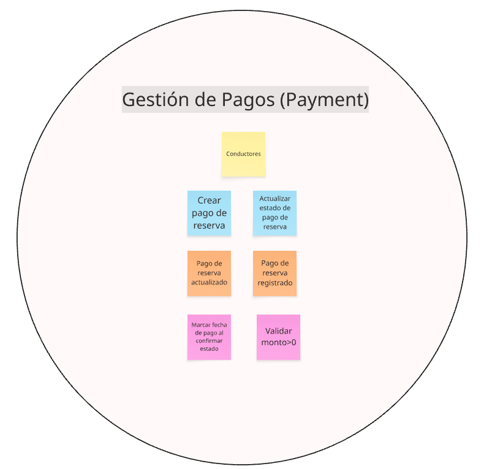

## Capítulo IV: Requirements Specification

### 4.1. Strategic-Level Domain-Driven Design

En esta sección presentamos el proceso y las decisiones estratégicas aplicando Domain-Driven Design (DDD) al proyecto ParkeoYa. El objetivo fue descomponer el dominio en Bounded Contexts bien delimitados, definiendo cómo colaboran entre sí para resolver los casos de negocio más relevantes (búsqueda, reserva, uso del espacio, pago y monitoreo IoT).

El trabajo se estructuró en cuatro actividades principales:

1. EventStorming (Design-Level)
2. Candidate Context Discovery
3. Domain Message Flows Modeling (Domain Storytelling)
4. Bounded Context Canvases (iterativos) 

> **Herramienta utilizada:** Miro (tablero “ParkeoYa – DDD”), con sticky notes naranjas (eventos), azules (comandos), rosas (actores), amarillas (políticas) y moradas (agregados).  
> **Duración total:** 3.5 h (1h45m EventStorming + 1h30m Candidate Context Discovery + 15m Domain Storytelling inicial + 15m cierre).  
> **Participantes:** Todo el equipo (conductores/propietarios representados por el Product Owner) y un facilitador DDD.

---

#### 4.1.1 Design Level EventStorming

##### Propósito y alcance
El objetivo de la sesión de **EventStorming** fue mapear los **eventos de dominio** clave de punta a punta (descubrimiento → reserva → ingreso/salida → pago → liberación → analítica), identificar políticas/decisiones y detectar *pivotal events* que anticipan límites naturales entre contextos.

##### Actividades realizadas
- **Warm-up (10 min):** repaso de ubiquitous language (estacionamiento, reserva, check-in, check-out, tiempo de gracia, tarifa, sensor).  
- **Storming (70 min):** construcción de la línea de tiempo con eventos de negocio; se añadieron comandos, actores y políticas.  
- **Refactor (25 min):** agrupación de eventos por zonas de responsabilidad y detección de dependencias externas (pasarela de pagos, push notifications).  

##### Línea de tiempo (eventos principales)
1. Conductor busca estacionamiento.  
2. Disponibilidad consultada (datos de sensores agregados).  
3. Espacio reservado (bloqueo temporal).  
4. Reserva confirmada (reglas de overbooking y tiempo de gracia).  
5. Conductor llega → Check-in registrado (sensor detecta ocupación).  
6. Uso del espacio contabilizado (cronómetro de tarifa).  
7. Extensión de tiempo solicitada (opcional).  
8. Check-out registrado (libera el espacio).  
9. Pago liquidado (cobro exacto por tiempo).  
10. Reembolso/ajuste aplicado (si aplica).  
11. Ocupación/rotación actualizadas.  
12. Métricas y reportes generados (dashboard propietario).  
13. Alertas operativas (ocupación no autorizada, sensor caído).  

##### Políticas de negocio detectadas

- **Bloqueo de espacio:** al crear reserva se bloquea por *X* minutos hasta el check-in.  
- **Tiempo de gracia:** tolerancia configurable antes de liberar y penalizar.  
- **Cálculo de tarifa:** redondeo mixto (hora + prorrateo minutos).  
- **Compensación por falla:** reembolso automático y crédito si el sensor se equivoca.  
- **SLA de sensores:** batería/conectividad bajo umbral → alerta preventiva.  

##### 4.1.1.1. Candidate Context Discovery

En esta subsección se describen los bounded contexts candidatos, sus límites de responsabilidad, datos propietarios, contratos de interacción (sincronía/asíncronía) y eventos de dominio. La definición se alinea con el EventStorming previo y con las épicas e historias del Cap. III.

Nota de convenciones
- Roles: Conductor, Propietario.
- Estados típicos de Reserva: creada, bloqueada, confirmada, en-uso, extendida, completada, cancelada, expirada, no-show.
- Los eventos de dominio se nombran en pasado y en español: <Hecho>Registrado, <Entidad>Creada, etc.

##### Bounded Context: IAM (Identity & Access Management)

- Descripción
  - Gestiona identidad, autenticación y autorización para todos los usuarios. Emite y valida tokens (JWT) y administra sesiones.
- Responsabilidades
  - Registro y verificación de cuentas; login/logout; recuperación de acceso; emisión/rotación de tokens.
  - Gestión de roles y permisos (conductor, propietario, admin) y revocación de sesiones comprometidas.

—

##### Bounded Context: Profile

- Descripción
  - Mantiene, gestiona y crea perfiles y preferencias de usuarios. Diferencia entre PerfilConductor y PerfilPropietario.
- Responsabilidades
  - CRUD de perfiles, foto y datos de contacto; preferencias de notificaciones.
  - Para propietarios: datos fiscales y preferencias comerciales básicas.

—

##### Bounded Context: Parking Management

- Descripción
  - Administra estacionamientos y espacios, sus atributos, tarifas y horarios; provee consultas de disponibilidad.
- Responsabilidades
  - Alta/edición de estacionamientos (propietario verificado), gestión de espacios y tarifas/horarios.
  - Cálculo de disponibilidad combinando reservas activas y estado IoT.

—

##### Bounded Context: Reservations

- Descripción
  - Encargado de gestionar las reservas de espacios de estacionamiento. Permite crear, consultar y actualizar el estado de una reserva, asociándola a un conductor y un estacionamiento.
- Responsabilidades
  - Generar una nueva reserva.
  - Asociar pagos a reservas.
  - Consultar disponibilidad de espacios.
  - Cambiar el estado de la reserva (creada, pagada, cancelada).

—

##### Bounded Context: Payment

- Descripción
  - Procesa pagos de reservas. Aplica comisión del modelo de negocio.
- Responsabilidades
  - Preautorizar al crear/confirmar.
  - Calcular la comisión fija del 5% por cada pago de reserva y reflejarla en la liquidación neta.

—

##### Bounded Context: Review 

- Descripción
  - Gestiona calificaciones y reseñas sobre los estacionamientos luego de su uso; así mismo expone su reputación agregada por cada uno.
- Responsabilidades
  - Registrar reseñas 1–5 estrellas con categorías; moderación básica; cálculo de promedios. Poder actulizarlo y eliminarlo.

—

##### Bounded Context: IoT Management

- Descripción
  - Gestiona los dispositivos IoT instalados en cada espacio de estacionamiento, permitiendo reportar en tiempo real la disponibilidad de espacios.
- Responsabilidades
  - Registrar y asociar dispositivos IoT a espacios.
  - Establecer estados de ocupación (libre/ocupado).
  - Consultar disponibilidad desde reservas o frontends.
  - Validar funcionamiento y batería del dispositivo.

—

##### Bounded Context: Notification

- Descripción
  - Enviar notificaciones a los usuarios del sistema, relacionadas con el estado de pagos o reservas, u otros eventos clave.
- Responsabilidades
  - Crear notificaciones personalizadas.
  - Asociar mensajes a usuarios específicos.
  - Notificar eventos como éxito/fallo en pago o reserva.
  - Consultar historial de notificaciones por usuario.

—

##### 4.1.1.2. Domain Message Flows Modeling

En esta etapa representamos el intercambio de mensajes entre actores y bounded contexts para entender cómo se coordina el sistema extremo a extremo. A modo ilustrativo:

- Cuando un sensor registra el ingreso de un vehículo, emite el evento: EspacioOcupadoDetectado.
- Si un conductor solicita una reserva desde la app, se ejecuta el comando: CrearReserva/BloquearEspacio y, tras las validaciones, se publica el evento: ReservaConfirmada.
- Al completarse el cobro, se publica el evento: PagoProcesado (o PagoCapturado), que habilita la verificación/actualización del estado de la reserva.
- Cuando el sensor detecta la salida del vehículo, se libera el espacio mediante el evento: EspacioLiberadoDetectado.

Este modelado hace visible qué eventos impactan a cada contexto y cómo se encadenan sus reacciones. Además, ayuda a anticipar zonas de riesgo, como la duplicidad de reservas o fallas de telemetría (sensores inactivos), para diseñar medidas de resiliencia y validaciones cruzadas.

##### 4.1.1.3. Bounded Context Canvases
1. IAM

2. Profile

3. Parking Management

4. Reservation

5. Payment

6. Review

7. Notification

8. IoT Management

#### 4.1.2 Context Mapping

#### 4.1.3. Software Architecture

##### 4.1.3.1. Software Architecture Context Level Diagrams

##### 4.1.3.2. Software Architecture Container Level Diagrams

##### 4.1.3.3. Software Architecture Deployment Diagrams

### 4.2. Tactical-Level Domain-Driven Design

#### 4.2.X. Bounded Context: <Bounded Context Name>

##### 4.2.X.1. Domain Layer

##### 4.2.X.2. Interface Layer

##### 4.2.X.3. Application Layer

##### 4.2.X.4. Infrastructure Layer

##### 4.2.X.5. Bounded Context Software Architecture Component Level Diagrams

##### 4.2.X.6. Bounded Context Software Architecture Code Level Diagrams

###### 4.2.X.6.1. Bounded Context Domain Layer Class Diagrams

###### 4.2.X.6.2. Bounded Context Database Design Diagram
