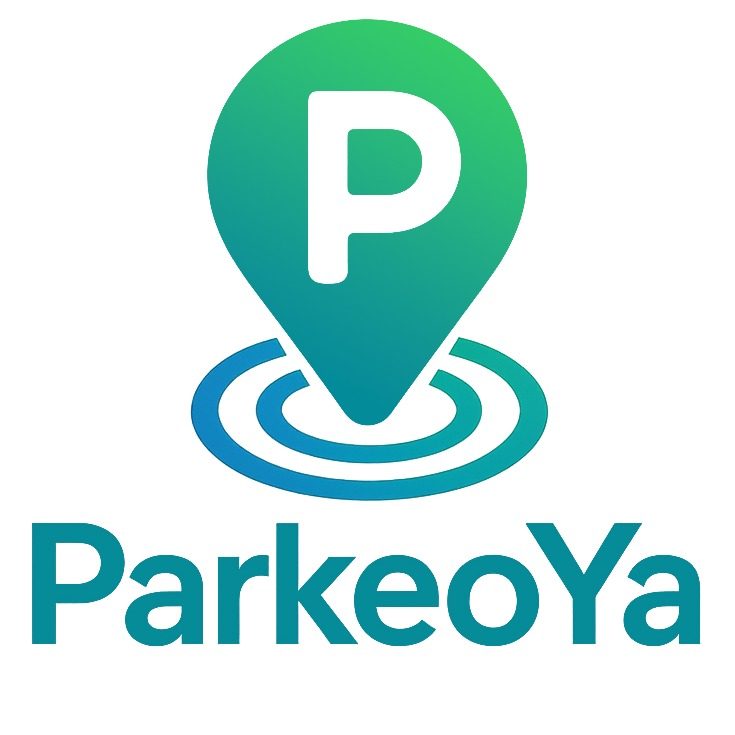

    <strong>Universidad Peruana de Ciencias Aplicadas</strong> 
    </img> 
    <strong>Ingeniería de Software</strong> 
     <strong>Ciclo: 7mo</strong> 
     <strong>1ASI0572 - Desarrollo de Soluciones IOT - 3428</strong> 
     <strong>Docente: Marco Antonio Leon Baca</strong> 
     <strong>"Informe de Trabajo Final"
</strong> 

    <strong>Startup: Lorem-Ipsum-UPC </strong> 
     <strong>Producto: ParkeoYa </strong> 

    <h3 align="center">Team Members:</h3>

    <table align="center">
        <tr>
            <th style="text-align:center;">Código</th>
            <th style="text-align:center;">Apellidos y nombres</th>
        </tr>
        <tr>
            <td style="text-align:center;">U202121935</td>
            <td style="text-align:center;">Calisaya Sánchez, Juan Jesús</td>
        </tr>
        <tr>
            <td style="text-align:center;">U202122232</td>
            <td style="text-align:center;">David Polanco, Alessandro Alonso</td>
        </tr>
        <tr>
            <td style="text-align:center;">U201911727</td>
            <td style="text-align:center;">Espinoza Delgado, Bárbara Antonella</td>
        </tr>
        <tr>
            <td style="text-align:center;">U202214733</td>
            <td style="text-align:center;">Serrano Ircañaupa, Nelson Elias</td>
        </tr>
        <tr>
            <td style="text-align:center;">U202017267</td>
            <td style="text-align:center;">Sotil Vasquez, Tyrone Raí</td>
        </tr>
    </table>
    

</body>

 <strong> Septiempre, 2025</strong>

 

# Registro de Versiones del Informe

| **Versión** | **Fecha** | **Autor** | **Descripción de Modificación** |
|-------------|-----------|-----------|---------------------------------|
| 1.0         | 31/08/2025| Juan Calisaya | Creación del documento de trabajo en formato Markdown. |
| 1.1         | 02/09/2025| Bárbara Espinoza | Realización del Capítulo 1 |
| 1.2         | 03/09/2025| Bárbara Espinoza | Realización del Capítulo 2 |
| 1.3         | 15/09/2025| Juan Calissaya y Alessandro David | Realización del Capítulo 3 |
| 1.4         | 20/09/2025| Alessandro David, Nelson Serrano y Tyrone Sotil | Realización del Capítulo 4 |

# Project Report Collaboration Insights 

Enlace al repositorio del informe en GitHub:
[Repositorio de GitHub](https://github.com/Lorem-Ipsum-UPC/reporte)

---

## TB1

**Descripción de las actividades realizadas:**
- **Espinoza Delgado, Bárbara Antonella**: Colaboré con la realización del capítulo 1 y 2 del informe cumpliendo con el formato en Markdown y estando pendiente de las correcciones y partes faltantes.

- **Calisaya Sánchez, Juan Jesús**: Colaboré con la realización del capítulo 3 del informe , especificamente, la realización de epicas y user stories.
  
- **David Polanco, Alessandro Alonso**: Colaboré con la realización del capítulo 3 y 4 del informe , especificamente, la realización del impact mapping y Strategic-Level Domain-Driven Design.
  
- **Serrano Ircañaupa, Nelson Elias**: Colaboré con la realización del capítulo 4 del informe , especificamente, la realización de Diagramas C4 y Bounded Context Canvas.
  
- **Sotil Vasquez, Tyrone Raí**: Colaboré con la realización del capítulo 4 del informe , especificamente, la realización de Diagramas C4, diagramas de clases y diagramas de base de datos.

Evidencia de colaboración

# Contenido

---

#### Tabla de contenidos 

## Tabla de contenidos
### [Registro de versiones del informe](#registro-de-versiones-del-informe)
### [Project Report Collaboration Insights](#project-report-collaboration-insights)
### [Student Outcome](#student-outcome)
## [Capítulo I: Introducción](#capítulo-i-introducción)
- [1.1. Startup Profile](#11-startup-profile)
    - [1.1.1. Descripción de la Startup](#111-descripción-de-la-startup)
    - [1.1.2. Perfiles de integrantes del equipo](#112-perfiles-de-integrantes-del-equipo)
- [1.2. Solution Profile](#12-solution-profile)
    - [1.2.1 Antecedentes y problemática](#121-antecedentes-y-problemática)
    - [1.2.2 Lean UX Process](#122-lean-ux-process)
        - [1.2.2.1. Lean UX Problem Statements](#1221-lean-ux-problem-statements)
        - [1.2.2.2. Lean UX Assumptions](#1222-lean-ux-assumptions)
        - [1.2.2.3. Lean UX Hypothesis Statements](#1223-lean-ux-hypothesis-statements)
        - [1.2.2.4. Lean UX Canvas](#1224-lean-ux-canvas)
- [1.3. Segmentos objetivo](#13-segmentos-objetivo)

## [Capítulo II: Requirements Elicitation & Analysis](#capítulo-ii-requirements-elicitation--analysis)
- [2.1. Competidores](#21-competidores)
    - [2.1.1. Análisis competitivo](#211-análisis-competitivo)
    - [2.1.2. Estrategias y tácticas frente a competidores](#212-estrategias-y-tácticas-frente-a-competidores)
- [2.2. Entrevistas](#22-entrevistas)
    - [2.2.1. Diseño de entrevistas](#221-diseño-de-entrevistas)
    - [2.2.2. Registro de entrevistas](#222-registro-de-entrevistas)
    - [2.2.3. Análisis de entrevistas](#223-análisis-de-entrevistas)
- [2.3. Needfinding](#23-needfinding)
    - [2.3.1. User Personas](#231-user-personas)
    - [2.3.2. User Task Matrix](#232-user-task-matrix)
    - [2.3.3. User Journey Mapping](#233-user-journey-mapping)
    - [2.3.4. Empathy Mapping](#234-empathy-mapping)
- [2.4. Big Picture Event Storming](#24-big-picture-event-storming)
- [2.5. Ubiquitous Language](#25-ubiquitous-language)

  ## [Capítulo III: Requirements Specification](#capítulo-iii-requirements-specification)
- [3.1. User Stories](#31-user-stories)
- [3.2. Impact Mapping](#32-impact-mapping)
- [3.3. Product Backlog](#33-product-backlog)

## [Capítulo IV: Solution Software Design](#capítulo-iv-solution-software-design)

- [4.1. Strategic-Level Domain-Driven Design](#41-strategic-level-domain-driven-design)
  - [4.1.1. Design Level EventStorming](#411-design-level-eventstorming)
    - [4.1.1.1. Candidate Context Discovery](#4111-candidate-context-discovery)
    - [4.1.1.2. Domain Message Flows Modeling](#4112-domain-message-flows-modeling)
    - [4.1.1.3. Bounded Context Canvases](#4113-bounded-context-canvases)
  - [4.1.2. Context Mapping](#412-context-mapping)
  - [4.1.3. Software Architecture](#413-software-architecture)
    - [4.1.3.1. Software Architecture Context Level Diagrams](#4131-software-architecture-context-level-diagrams)
    - [4.1.3.2. Software Architecture Container Level Diagrams](#4132-software-architecture-container-level-diagrams)
    - [4.1.3.3. Software Architecture Deployment Diagrams](#4133-software-architecture-deployment-diagrams)

- [4.2. Tactical-Level Domain-Driven Design](#42-tactical-level-domain-driven-design)
  - [4.2.X. Bounded Context: &lt;Bounded Context Name&gt;](#42x-bounded-context-bounded-context-name)
    - [4.2.X.1. Domain Layer](#42x1-domain-layer)
    - [4.2.X.2. Interface Layer](#42x2-interface-layer)
    - [4.2.X.3. Application Layer](#42x3-application-layer)
    - [4.2.X.4. Infrastructure Layer](#42x4-infrastructure-layer)
    - [4.2.X.5. Bounded Context Software Architecture Component Level Diagrams](#42x5-bounded-context-software-architecture-component-level-diagrams)
    - [4.2.X.6. Bounded Context Software Architecture Code Level Diagrams](#42x6-bounded-context-software-architecture-code-level-diagrams)
      - [4.2.X.6.1. Bounded Context Domain Layer Class Diagrams](#42x61-bounded-context-domain-layer-class-diagrams)
      - [4.2.X.6.2. Bounded Context Database Design Diagram](#42x62-bounded-context-database-design-diagram)

## [Conclusiones](#conclusiones)
- [Video About the Team](#video-about-the-team)

## [Bibliografía](#bibliografía)
## [Anexos](#anexos)

--- 

# Student Outcome

**ABET – EAC - Student Outcome 5**
Criterio: La capacidad de funcionar efectivamente en un equipo cuyos miembros juntos proporcionan liderazgo, crean un entorno de colaboración e inclusivo, establecen objetivos, planifican tareas y cumplen objetivos.

<table>
  <tr>
    <th>Criterio específico</th>
    <th>Acciones realizadas</th>
    <th>Conclusiones</th>
  </tr>
  <tr>
    <td>Trabaja en equipo para proporcionar liderazgo en forma conjunta</td>
    <td>
      <b>TB1:</b> 
      Calisaya Sánchez Juan Jesús:   
      David Polanco, Alessandro Alonso:   
      Espinoza Delgado, Bárbara Antonella: En grupo logramos organizarnos de forma adecuada para desarrollar el trabajo, distribuyendo responsabilidades entre los integrantes. Se llevaron a cabo reuniones para coordinar las actividades y se utilizó GitHub como herramienta para dar seguimiento al progreso de cada miembro y Discord para realizar las reuniones semanales.   
      Serrano Ircañaupa, Nelson Elias:   
      Sotil Vasquez, Tyrone Raí:   
    </td>
    <td><b>TB1:</b> Conseguimos organizarnos de manera eficiente, asignando las tareas de forma equitativa y empleando herramientas como GitHub para dar un seguimiento claro al progreso. Compartimos ideas, resolvimos dudas de forma colectiva y mantuvimos una comunicación continua a través de reuniones de coordinación. Esta experiencia fortaleció nuestras capacidades de trabajo colaborativo y evidenció el valor de la planificación y la cooperación para cumplir objetivos en común.
</td>
  </tr>
  <tr>
    <td>Crea un entorno colaborativo e inclusivo, establece metas, planifica tareas y cumple objetivos.</td>
    <td>
      <b>TB1:</b> 
      Calisaya Sánchez Juan Jesús:   
      David Polanco, Alessandro Alonso:   
      Espinoza Delgado, Bárbara Antonella: Se coordinó de manera conjunta la repartición de tareas a realizar para esta entrega tomando en cuenta las habilidades de cada integrante, asi como a traves de las reuniones nos hemos ayudado unos a otros a solventar dudas o dar recordatorios sobre los plazos de entrega del trabajo.   
      Serrano Ircañaupa, Nelson Elias:   
      Sotil Vasquez, Tyrone Raí:   
    </td>
    <td><b>TB1:</b> Colaboramos de forma coordinada, repartiendo las tareas de manera justa y definiendo metas semanales en reuniones periódicas. Hicimos uso de GitHub y mantuvimos una comunicación continua para aclarar dudas, realizar ajustes y supervisar los avances de manera conjunta. Promovimos un entorno inclusivo en el que cada integrante aportó sus ideas, alcanzando consensos en las decisiones y garantizando transparencia durante todo el proceso. Gracias a esta organización compartida y al compromiso colectivo, conseguimos finalizar el trabajo dentro del plazo previsto.
</td>
  </tr>
</table>

---

# Capítulo I: Introduccion

## 1.1. Startup Profile
### 1.1.1. Descripción de la Startup

Lorem Ipsum es una startup peruana del sector tecnológico orientada al desarrollo de soluciones inteligentes. Como solución a la ineficiente administración de espacios en zonas urbanas de alto tráfico, donde los conductores suelen perder tiempo valioso buscando disponibilidad de estacionamiento, hemos creado ParkeoYa.

Nuestra propuesta se basa en el uso de tecnologías IoT, geolocalización y sensores inteligentes, que permiten detectar en tiempo real los espacios libres, reservarlos a través de una aplicación y facilitar su pago. Además, la integración de información en tiempo real garantiza una administración eficiente, incrementa la rentabilidad de las playas de estacionamiento y mejora la experiencia de los conductores habituales y esporádicos.

Con esta solución buscamos optimizar el uso de los estacionamientos, mejorar la movilidad urbana y promover prácticas sostenibles, generando beneficios tanto para los usuarios como para los propietarios de los espacios.

**Misión:** Nuestra misión como startup es revolucionar la experiencia de aparcamiento conectando a conductores y administradores mediante una plataforma inteligente que, apoyada en IoT y cámaras de monitoreo, optimice el uso del espacio, reduzca tiempos de búsqueda y proporcione una gestión automatizada y eficiente.

**Visión:** Nuestra visión es consolidarnos como la startup líder en soluciones que involucren la gestión de estacionamientos a nivel nacional, aportando a la movilidad eficiente de las ciudades a través de soluciones tecnológicas innovadoras y sostenibles que favorezcan a los conductores y a los titulares de los estacionamientos.

### 1.1.2. Perfiles de integrantes del equipo

| Perfiles de los Miembros del Equipo | Descripción de los Miembros del Equipo |
|:-------------------|:------:|
|  **Calisaya Sánchez Juan Jesús - u202121935**     | Soy estudiante de Ingeniería de Software. Me considero una persona empática, colaboradora, responsable y con buenas habilidades de comunicación. Además de mis capacidades técnicas, estas cualidades me permitirán contribuir de manera efectiva al desarrollo exitoso del proyecto.	|
| **David Polanco, Alessandro Alonso - u202122232**     | Mi nombre es Alessandro David y tengo 22 años. Yo estoy cursando la carrera de Ingenieria de Software en la UPC y ando en 9no ciclo. Me gusto demasiado mi eleccion referente a la carrera dado que me interesan mucho todos los temas que tenga que ver con la tecnologia y las tendencias de este rubro. Me considero una persona empática, comprometida, y siempre atento a resolver cualquier problema que me concierna. Como integrante del grupo de Desarrollo de Soluciones IoT me comprometo a cooperar con todo lo asignado en el trabajo y apoyar a mis compañeros con cualquier duda que quieran absolver.	|
| **Espinoza Delgado, Bárbara Antonella - u201911727**    | Mi nombre es Bárbara Antonella Espinoza Delgado, soy estudiante de Ingeniería de Software de 8vo ciclo. Tengo experiencia en trabajos en equipo y me considero una persona puntual con la realización y entrega de las tareas pendientes. |
| **Serrano Ircañaupa, Nelson Elias - u202214733**     | Me llamo Nelson Serrano, soy un entusiasta de la tecnología con gran interés en el backend, las redes y la ciberseguridad. Disfruto aprender nuevas herramientas de desarrollo, explorar entornos de seguridad informática y trabajar en proyectos que combinan programación con buenas prácticas de software. Mis principales fortalezas son el desarrollo backend, la gestión de bases de datos y el análisis de vulnerabilidades, lo que me permite aportar valor en proyectos que requieren robustez, organización y seguridad. |
| **Sotil Vasquez, Tyrone Raí - u202017267**     | Me llamo Tyrone Sotil, soy un apasionado tanto de la programación como de la creación de contenido. Mis hobbies incluyen la edición de videos, jugar videojuegos y la programación de páginas web. Mis principales fortalezas son la programación frontend, el diseño de imágenes/videos y los procesos de automatización o conexiones con IA |

## 1.2. Solution Profile
### 1.2.1. Antecedentes y problemática

En las ciudades con alto flujo vehicular, la búsqueda de estacionamientos representa un problema crítico que genera congestión, pérdida de tiempo, contaminación ambiental y estrés en los conductores. La escasez de espacios adecuados y la falta de herramientas tecnológicas que permitan consultar disponibilidad o realizar reservas anticipadas incrementan la frustración y afectan la movilidad urbana. Ante esta situación, surge la necesidad de soluciones innovadoras basadas en tecnologías IoT y sensores inteligentes, que permitan una gestión en tiempo real de los espacios.

**What (¿Qué?)**
Desarrollar una solución tecnológica que optimice la gestión de estacionamientos públicos. Esta debe permitir monitorear en tiempo real la disponibilidad de espacios, reducir el tiempo de búsqueda, evitar la ocupación indebida y facilitar un cobro automatizado mediante aplicaciones y sistemas de monitoreo inteligente.

**When (¿Cuándo?)**
El problema se ha intensificado en la última década debido al crecimiento vehicular. En Lima, por ejemplo, se suman más de 100 000 vehículos al año (AAP, 2023), lo que agudiza el tráfico, especialmente en horas punta (7:00–9:00 a.m. y 5:00–8:00 p.m.). La demanda supera con creces la oferta de espacios y se vuelve aún más crítica en contextos de alta concentración, como eventos masivos o zonas céntricas.

**Where (¿Dónde?)**
La problemática se concentra en ciudades densamente pobladas como Lima, Arequipa y Trujillo, donde estudios como Lima Cómo Vamos (2022) indican que hasta el 60% del tráfico en distritos como Miraflores y San Isidro proviene de conductores buscando estacionamiento. La falta de sistemas automatizados agrava la dificultad de acceder a información precisa y actualizada.

**Who (¿Quiénes?)**
Los principales afectados son los conductores que requieren estacionamientos seguros, accesibles y eficientes, así como los propietarios de playas de estacionamiento, que buscan maximizar la ocupación de sus espacios.

**Why (¿Por qué?)**
La raíz del problema está en la ausencia de sistemas modernos de gestión. La falta de comunicación en tiempo real entre oferta y demanda de espacios genera pérdidas económicas, mayor contaminación, incremento de infracciones y reducción de la calidad de vida urbana.

**How (¿Cómo?)**
La solución propuesta integra sensores IoT para detectar ocupación en tiempo real, una plataforma centralizada para procesar datos y pagos digitales, y una app móvil que guíe a los conductores hacia espacios disponibles. Además, el sistema permite reservas anticipadas y cobro automatizado.

**How Much (¿Cuánto?)**
Se estima un impacto significativo: reducción del 30% en el tiempo de búsqueda de estacionamientos, disminución del 15% en emisiones de CO₂, y un aumento en los ingresos de municipalidades y operadores gracias a tarifas dinámicas, control de evasiones y mayor rotación de espacios. Asimismo, se espera una reducción de incidentes asociados al estacionamiento informal o indebido, elevando la seguridad vial y urbana.

En síntesis, nuestra propuesta se posiciona como una alternativa integral e innovadora para enfrentar los desafíos de movilidad urbana, promoviendo eficiencia, sostenibilidad y una mejor experiencia tanto para conductores como para administradores.

### 1.2.2. Lean UX Process

En esta sección se aplica la metodología Lean UX, cuyo alcance incluye la conceptualización del modelo de negocio que sustentará el desarrollo del producto digital propuesto. Este enfoque ágil permite centrar los esfuerzos del equipo en el diseño de una solución enfocada en el usuario, alineada con las problemáticas detectadas mediante técnicas de Design Thinking y validación temprana.

#### 1.2.2.1. Lean UX Problem Statements

**Domain**  
El dominio de este proyecto es la gestión inteligente de estacionamientos urbanos, facilitando la búsqueda, reserva y administración de espacios de parqueo mediante una aplicación móvil y web. La plataforma conecta a conductores con espacios disponibles en tiempo real, utilizando tecnologías IoT, sensores y geolocalización para optimizar la movilidad y mejorar la experiencia de los usuarios.

**Customer Segments**
- Conductores: Personas que necesitan encontrar estacionamiento de forma rápida, segura y sin complicaciones, especialmente en zonas urbanas congestionadas.

- Propietarios de estacionamientos: Dueños de espacios interesados en rentabilizar su espacio, gestionando reservas, horarios y tarifas desde un panel digital.

**Initial Segment**
- Conductores urbanos jóvenes y adultos (18–50 años), usuarios frecuentes de smartphones que buscan optimizar su tiempo y tener experiencias de movilidad seguras y eficientes.

- Propietarios de estacionamientos en zonas de alta demanda (comerciales y residenciales), interesados en monetizar su espacio de forma sencilla.

**Pain Points**
- Pérdida de tiempo: Los conductores invierten minutos valiosos buscando estacionamiento, sobre todo en horas pico.

- Falta de visibilidad en tiempo real: Muchos estacionamientos carecen de sistemas digitales que informen sobre disponibilidad actualizada.

- Inseguridad: Los usuarios suelen estacionar en lugares no confiables al no contar con información precisa.

- Gestión ineficiente para propietarios: Los dueños no tienen herramientas para controlar ocupación, tarifas o reservas.

- Congestión vehicular y contaminación: La búsqueda de espacios aumenta el tráfico y las emisiones de CO₂.

**Gap**
Actualmente, las soluciones disponibles son convencionales y poco integradas:

- No permiten reservas anticipadas de espacios.

- No muestran datos confiables en tiempo real sobre la ocupación.

- No ofrecen herramientas tecnológicas avanzadas con sensores IoT y apps móviles que automaticen la gestión.

Esto genera congestión, frustración y una experiencia deficiente para usuarios y propietarios.

**Visión / Estrategia**  
La visión es revolucionar la gestión de estacionamientos urbanos mediante una solución digital avanzada que:

- Permita a los conductores encontrar, reservar y pagar estacionamientos en segundos.

- Ofrezca información confiable en tiempo real sobre disponibilidad, ubicación y seguridad.

- Genere ingresos pasivos para propietarios, mejorando la administración de sus espacios.

- Contribuya a una movilidad urbana más eficiente y sostenible, reduciendo la congestión y las emisiones contaminantes.

La estrategia se centra en el uso de sensores IoT, integración con aplicaciones móviles y plataformas web, conectadas a un backend en la nube.

#### 1.2.2.2. Lean UX Assumptions

**Business Assumptions**
- La solución IoT mejorará la eficiencia de los estacionamientos: Se asume que al integrar sensores IoT para detectar disponibilidad y habilitar reservas automáticas, los tiempos de búsqueda se reducirán significativamente.

- El mercado está dispuesto a adoptar nuevas tecnologías: Se asume que conductores y propietarios verán valor en usar soluciones IoT para mejorar la experiencia de estacionamiento.

- El costo de implementación será recuperable rápidamente: Se asume que los gastos iniciales en infraestructura IoT y app se compensarán con las comisiones cobradas con cada reserva pagada.

- La solución aumentará la satisfacción del usuario: Se asume que un estacionamiento más rápido, seguro y predecible generará lealtad y mayor retención de clientes.

- El proyecto es escalable: Se asume que puede implementarse tanto en pequeños estacionamientos como en empresas que cuenten con múltiples playas de estacionamientos.

**Business Outcome Assumptions**
- Incremento en las reservas de estacionamiento gracias a la disponibilidad y reservas en tiempo real.

- Reducción de costos operativos para propietarios mediante la automatización de la gestión.

- Mejora de la satisfacción del cliente, generando mayor recurrencia en el uso de la aplicación.

**User Assumptions**
- Los conductores preferirán un sistema automatizado, confiando en la tecnología IoT para encontrar y reservar espacios de manera rápida.

- Los propietarios de estacionamientos adoptarán el sistema, al percibir beneficios en ingresos previos a la llegada de los vehículos y un mejor control de espacios.

- La aplicación será intuitiva, de modo que tanto conductores como propietarios podrán usarla sin complicaciones ni tendrán que recurrir a un periodo largo de aprendizaje.

**User Outcome Assumptions**
- Conductores más satisfechos, al contar con reservas anticipadas, información en tiempo real y menos tiempo perdido en búsquedas.

- Propietarios con mejor gestión de espacios, logrando mayor ocupación y rentabilidad a través de la plataforma digital.

**Feature Assumptions**
- Detección de disponibilidad mediante IoT: Sensores en cada espacio informan si está ocupado o libre en tiempo real.

- Sistema de reservas automáticas: Conductores pueden reservar un espacio anticipadamente o en el momento.

- Monitoreo en tiempo real: Los propietarios reciben datos actualizados para ajustar la gestión de su estacionamiento.

- Interfaz de administración centralizada: Panel digital para que propietarios gestionen tarifas, horarios y disponibilidad.

- Integración con pagos digitales: Cobro directo desde la app para agilizar la experiencia y reducir evasión.

**Users**
- Conductores urbanos que necesitan soluciones rápidas en zonas congestionadas.

- Propietarios de playas de estacionamientos, interesados en maximizar ingresos y mejorar la experiencia del cliente.

**User Outcomes**

Segmento Conductores:
- Acceder a una aplicación que muestre espacios en tiempo real.

- Reservar y pagar con antelación o en el momento.

- Reducir tiempos de búsqueda y planificar mejor los trayectos.

Segmento Propietarios de playas de estacionamiento:
- Incrementar la ocupación de los espacios.

- Administrar reservas y tarifas en un solo sistema.

- Tomar decisiones informadas con datos en tiempo real.

#### 1.2.2.3. Lean UX Hypothesis Statements

**Hipótesis 1**
Creemos que los conductores estarán motivados a usar ParkeoYa si les ofrecemos una aplicación sencilla e intuitiva que, mediante sensores IoT, muestre en tiempo real los espacios disponibles y permita hacer reservas rápidas.
Esto permitirá que los usuarios reduzcan el tiempo perdido buscando estacionamiento y adopten la plataforma como parte de su rutina diaria.
Lo validaremos cuando al menos el 70% de los conductores activos realicen una reserva semanal durante los primeros tres meses.

**Hipótesis 2**
Creemos que los propietarios de estacionamientos encontrarán valor en ParkeoYa si la plataforma les ayuda a gestionar de manera automatizada la disponibilidad de espacios, reduciendo tiempos vacíos y aumentando sus ingresos.
Esto permitirá mejorar la ocupación de los estacionamientos y optimizar la rentabilidad de cada espacio.
Lo validaremos cuando al menos el 60% de los propietarios de playas de estacionamiento aumenten la tasa de ocupación en un 20% dentro de los primeros tres meses.

**Hipótesis 3**
Creemos que las actualizaciones en tiempo real sobre la disponibilidad de estacionamientos reducirá el tiempo que los conductores dedican a encontrar estacionamiento en zonas de alta demanda.
Esto permitirá disminuir la congestión vehicular y mejorar la movilidad urbana.
Lo validaremos cuando los registros del sistema muestren una reducción del 20% en los tiempos de búsqueda.

**Hipótesis 4**
Creemos que los propietarios de estacionamientos aceptarán un modelo de negocio basado en una comisión sobre cada reserva gestionada a través de la aplicación si perciben que incrementa su ocupación e ingresos totales.
Esto permitirá asegurar la sostenibilidad económica de la plataforma y al mismo tiempo garantizar valor para los propietarios.
Lo validaremos cuando al menos el 50% de los propietarios activos mantengan la aceptación del modelo de comisión en los primeros seis meses de operación.

**Hipótesis 5**
Creemos que ofrecer soporte técnico accesible y materiales de capacitación simples ayudará a que conductores y propietarios adopten la plataforma más rápidamente.
Esto permitirá reducir las barreras iniciales de uso y minimizar la tasa de abandono.
Lo validaremos cuando la tasa de adopción inicial llegue al 90% y la tasa de abandono se mantenga por debajo del 15% en los primeros tres meses.

#### 1.2.2.4. Lean UX Canvas

  <table width="100%" border="1" cellpadding="10" cellspacing="0">
    <tr>
      <td width="33%" valign="top">
        <h4>Business Problem</h4>
        

          En las ciudades con alta congestión vehicular, los conductores enfrentan grandes dificultades para encontrar estacionamiento, lo que genera pérdida de tiempo, contaminación ambiental, incremento del tráfico y estrés. Paralelamente, los propietarios de estacionamientos urbanos no cuentan con herramientas digitales eficientes para maximizar la ocupación de sus espacios, lo que provoca pérdidas de ingresos y procesos operativos manuales poco efectivos. La falta de sistemas en tiempo real y reservas anticipadas profundiza esta problemática.
        

      </td>
      <td rowspan="2" width="33%" valign="top">
        <h4>Solutions</h4>
        <ul>
          <li>Aplicación móvil para conductores que permita búsqueda, reserva y pago digital en tiempo real.</li>
          <li>Plataforma web para propietarios con monitoreo de ocupación, reportes y control de tarifas</li>
          <li>Integración de dispositivos IoT para monitoreo en tiempo real de espacios disponibles.</li>
          <li>Implementación de un sistema de reservas anticipadas en tiempo real.</li>
          <li>Cobro automatizado y seguro a través de la app.</li>
        </ul>
      </td>
      <td width="33%" valign="top">
        <h4>Business Outcomes</h4>
        <ul>
          <li>Incremento en la ocupación de estacionamientos al optimizar el uso de los espacios disponibles.</li>
          <li>Reducción del tiempo de búsqueda de estacionamiento para conductores.</li>
          <li>Mayor eficiencia en la gestión para propietarios mediante herramientas digitales e IoT. </li>
          <li>Monetización sostenible a través de comisiones por reserva, suscripciones premium y venta de dispositivos IoT.</li>
          <li>Disminución de la congestión vehicular y de las emisiones de CO₂ gracias a la reducción de tiempo de búsqueda.</li>
        </ul>
      </td>
    </tr>
    <tr>
      <td valign="top">
        <h4>Users</h4>
        <ul>
          <li><b>Conductores:</b> Personas entre 18 y 50 años que necesitan soluciones rápidas y confiables para encontrar estacionamiento en zonas congestionadas. Valoran la conveniencia, el ahorro de tiempo y la facilidad de uso de aplicaciones móviles.</li>
          <li>
<b>Propietarios de Estacionamientos:</b> Dueños de playas de estacionamientos en áreas urbanas de alta demanda. Buscan aumentar la rentabilidad mediante la automatización de procesos, la digitalización de cobros y el acceso a datos en tiempo real para optimizar la gestión.</li>
        </ul>
      </td>  
      <td valign="top">
        <h4>User Outcomes & Benefits</h4>
        <b>Conductores:</b>
        <ul>
          <li>Reducen el tiempo de búsqueda de estacionamiento, disminuyendo estrés y mejorando la planificación.</li>
          <li>Pueden reservar y pagar en tiempo real desde la app, con mayor seguridad y conveniencia.</li>
          <li>Acceden a información confiable sobre disponibilidad y precios en un solo lugar.</li>
        </ul>
        <b>Propietarios de Estacionamientos:</b>
        <ul>
          <li>Incrementan la ocupación de sus espacios y rentabilidad gracias a reservas anticipadas y tarifas dinámicas.</li>
          <li>Mejoran la eficiencia operativa al automatizar cobros, reservas y monitoreo en tiempo real.</li>
          <li>Obtienen ingresos recurrentes y seguros a través de la plataforma.</li>
        </ul>
      </td>
    </tr>
    <tr>
      <td valign="top">
        <h4>Hypotheses</h4>
        <ul>
          <li>Creemos que los conductores estarán motivados a usar ParkeoYa si les ofrecemos una aplicación sencilla e intuitiva que, mediante sensores IoT, muestre en tiempo real los espacios disponibles y permita hacer reservas rápidas. Esto permitirá que los usuarios reduzcan el tiempo perdido buscando estacionamiento y adopten la plataforma como parte de su rutina diaria. Lo validaremos cuando al menos el 70% de los conductores activos realicen una reserva semanal durante los primeros tres meses.</li>
          <li>Creemos que los propietarios de estacionamientos encontrarán valor en ParkeoYa si la plataforma les ayuda a gestionar de manera automatizada la disponibilidad de espacios, reduciendo tiempos vacíos y aumentando sus ingresos. Esto permitirá mejorar la ocupación de los estacionamientos y optimizar la rentabilidad de cada espacio. Lo validaremos cuando al menos el 60% de los propietarios de playas de estacionamiento aumenten la tasa de ocupación en un 20% dentro de los primeros tres meses.</li>
          <li>Creemos que las actualizaciones en tiempo real sobre la disponibilidad de estacionamientos reducirá el tiempo que los conductores dedican a encontrar estacionamiento en zonas de alta demanda. Esto permitirá disminuir la congestión vehicular y mejorar la movilidad urbana. Lo validaremos cuando los registros del sistema muestren una reducción del 20% en los tiempos de búsqueda.</li>
          <li>Creemos que los propietarios de estacionamientos aceptarán un modelo de negocio basado en una comisión sobre cada reserva gestionada a través de la aplicación si perciben que incrementa su ocupación e ingresos totales. Esto permitirá asegurar la sostenibilidad económica de la plataforma y al mismo tiempo garantizar valor para los propietarios. Lo validaremos cuando al menos el 50% de los propietarios activos mantengan la aceptación del modelo de comisión en los primeros seis meses de operación.</li>
          <li>Creemos que ofrecer soporte técnico accesible y materiales de capacitación simples ayudará a que conductores y propietarios adopten la plataforma más rápidamente. Esto permitirá reducir las barreras iniciales de uso y minimizar la tasa de abandono. Lo validaremos cuando la tasa de adopción inicial llegue al 90% y la tasa de abandono se mantenga por debajo del 15% en los primeros tres meses.</li>
        </ul>
      </td>
      <td valign="top">
        <h4>What's the most important thing we need to learn first?</h4>
        <ul>
          <li>Validar si la provisión de datos en tiempo real sobre la disponibilidad de estacionamientos reduce el tiempo de búsqueda de espacios habitual de los conductores.</li>
          <li>Determinar si la reserva anticipada de estacionamientos aumenta la satifacción del usuario.</li>
          <li>Conocer el comportamiento de los usuarios respecto al uso de aplicaciones similares en el mercado.</li>
          <li>Validar el interés de los propietarios en adoptar tecnología IoT para el monitoreo de espacios.</li>
          <li>Validar el interés real de los propietarios en digitalizar la gestión y aceptar un modelo de negocio basado en comisiones por cada reserva, comprobando si perciben beneficios en ingresos y ocupación.</li>
        </ul>
      </td>
      <td valign="top">
        <h4>What's the least amount of work we need to do to learn the next most important thing?</h4>
        <ul>
          <li>Realizar encuestas rápidas a conductores en zonas de alta demanda para conocer sus hábitos, frustraciones y disposición a usar una app de reservas.</li>
          <li>Entrevistar a propietarios de playas de estacionamiento para validar su interés en digitalizar procesos, su disposición a pagar comisiones y su expectativa de retorno de inversión.</li>
          <li>Implementar un prototipo funcional mínimo (MVP) que permita búsqueda de espacios disponibles, reservas básicas y un flujo de pago digital, para evaluar la usabilidad inicial.</li>
          <li>Medir indicadores clave: Tiempo promedio de búsqueda, ocupación promedio de estacionamientos, tasa de adopción, recurrencia de uso y aceptación del modelo de comisiones.</li>
        </ul>
      </td>
    </tr>
  </table>

## 1.3. Segmentos objetivo

La plataforma se orienta a dos públicos principales:

- Propietarios de playas estacionamientos urbanos, interesados en optimizar la ocupación de sus espacios y automatizar la gestión de cobros.

- Conductores urbanos, que enfrentan la alta congestión de la ciudad y valoran la rapidez y conveniencia de reservar y pagar estacionamientos desde una aplicación digital.

Esta caracterización guía la propuesta de valor, así como las decisiones de diseño, marketing y desarrollo del producto.

**Propietarios de Playas de Estacionamiento**
- Geográfico: Dueños de playas estacionamientos en zonas urbanas de alta demanda, tanto públicos como privados, especialmente en áreas comerciales y residenciales con gran flujo vehicular.

- Psicográfico: Buscan optimizar la rentabilidad de sus espacios mediante automatización de procesos, reducción de la carga operativa y acceso a datos que les permitan tomar decisiones estratégicas. Valoran soluciones digitales que les den mayor control y formalización en su gestión.

- Demográfico:
  - Edad: 25 – 55 años
  - Género: Masculino y femenino
  - Educación: Profesionales con formación en administración, ingeniería industrial o gestión de instalaciones.
  - Nivel socioeconómico: Clases B y C (media-alta y media).

- Beneficios clave:
  - Incremento en la rentabilidad gracias a la mayor ocupación de espacios.
  - Automatización de reservas y cobros digitales, reduciendo costos operativos.
  - Digitalización de la gestión, contribuyendo a la formalización del negocio.

**Conductores Urbanos**
- Geográfico: Personas que conducen en zonas de alta densidad vehicular, donde la oferta de estacionamientos es limitada (centros urbanos, áreas comerciales y residenciales).

- Psicográfico: Priorizan soluciones que les ahorren tiempo, reduzcan la frustración de buscar estacionamiento y ofrezcan conveniencia. Valoran aplicaciones fáciles de usar que les permitan reservar y pagar en segundos.

- Demográfico:
  - Edad: 18 – 50 años
  - Género: Masculino y femenino
  - Educación: Varía desde estudiantes universitarios hasta profesionales con formación técnica o superior.
  - Nivel socioeconómico: Clases B, C y D (media-alta, media y media-baja).

- Beneficios clave:
  - Reducción del tiempo de búsqueda y menor nivel de estrés.
  - Posibilidad de reservar estacionamiento en tiempo real, evitando incertidumbre.
  - Acceso a información centralizada sobre precios, disponibilidad y ubicación.

---

# Capítulo II: Requirements Elicitation & Analysis

## 2.1. Competidores

**Parkimeter**

Parkimeter es una solución digital enfocada en la gestión y reserva de espacios de estacionamiento. Su plataforma facilita a los usuarios la búsqueda, comparación y reserva de plazas en distintas ubicaciones. También ofrece funcionalidades como visualización de tarifas, disponibilidad en tiempo real y otros servicios útiles que simplifican el proceso de estacionamiento para los conductores.

**ElParking**

ElParking brinda a los usuarios la posibilidad de localizar, reservar y pagar por estacionamientos desde una misma plataforma. Su sistema incorpora datos actualizados sobre espacios disponibles, además de permitir el pago de parquímetros, seguimiento de sanciones de tránsito y otros servicios complementarios que optimizan la experiencia del conductor.

**Aparcados**

Aparcados es una aplicación enfocada en simplificar la búsqueda de estacionamientos urbanos según las necesidades del usuario. Aunque cuenta con versión web, su versión móvil es la más utilizada debido a su interfaz amigable y diseño visual atractivo, lo que la convierte en una herramienta práctica para conductores en movimiento.

### 2.1.1. Análisis competitivo

## Competitive Analysis Landscape

**¿Por qué llevar a cabo este análisis?**  
Para identificar cómo **ParkeoYa** se posiciona frente a sus competidores en términos de servicios, ventajas competitivas y estrategias de mercado. Este análisis permitirá detectar oportunidades, diferenciar la propuesta de valor y tomar decisiones estratégicas de producto, marketing y crecimiento.  

## Competidores  

| Competidor   | Imágen | Descripción  | Enlace   |
|--------------|--------|--------------|----------|
| **ParkeoYa** |  | Plataforma digital que conecta conductores con estacionamientos urbanos en tiempo real. Permite reservar, pagar y administrar espacios desde una app móvil y un portal web. Está orientada a reducir tiempos de búsqueda y mejorar la rentabilidad de los propietarios mediante IoT y automatización. | N/A |
| **Parkimeter** |  | App web y móvil con presencia internacional. Ofrece reserva de plazas de aparcamiento en diversas ciudades de Europa y Latinoamérica, destacando por sus descuentos y promociones. | [Parkimeter](https://parkimeter.com) |
| **ElParking** |  | Aplicación española que permite no solo reservar estacionamientos, sino también pagar multas, parquímetros y otros servicios urbanos, ampliando su ecosistema de movilidad. | [ElParking](https://elparking.com) |
| **Aparcados** |  | App enfocada en la reserva de estacionamientos en España con expansión hacia Europa y Latinoamérica. Ofrece geolocalización y notificaciones en tiempo real. | [Aparcados](https://aparcados.com) |

## Perfil – Overview

| Empresa      | Overview |
|--------------|----------|
| **ParkeoYa** | Plataforma que integra sensores IoT, app móvil y portal web para reservar y pagar estacionamientos en tiempo real, reduciendo tiempos de búsqueda y aumentando la rentabilidad de propietarios. |
| **Parkimeter**   | Aplicación internacional para reserva de estacionamientos con descuentos en múltiples ciudades de Europa y América Latina. |
| **ElParking**    | Plataforma española que amplía su servicio más allá del estacionamiento, incluyendo pago de parquímetros y gestión de multas. |
| **Aparcados**    | App española en expansión que ofrece reservas con geolocalización y notificaciones en tiempo real. |

## Perfil de Marketing

**Ventaja competitiva**

| Empresa      | Ventaja competitiva |
|--------------|----------------------|
| **ParkeoYa** | Acceso en tiempo real a disponibilidad, tarifas dinámicas, reservas digitales y panel analítico para propietarios. |
| **Parkimeter**   | Atractivos descuentos (hasta 70%) y sin gastos de gestión. |
| **ElParking**    | Ecosistema completo que incluye multas, parquímetros y estacionamientos. |
| **Aparcados**    | Geolocalización avanzada y notificaciones instantáneas. |

**Mercado objetivo**    

| Empresa      | Mercado objetivo |
|--------------|------------------|
| **ParkeoYa** | Conductores urbanos en ciudades congestionadas y propietarios de estacionamientos que buscan digitalizar y rentabilizar su gestión. |
| **Parkimeter**   | Conductores internacionales que buscan estacionar en ciudades turísticas y urbanas. |
| **ElParking**    | Conductores urbanos en España que buscan una solución integral de movilidad. |
| **Aparcados**    | Conductores en España y América Latina que requieren reservas en tiempo real. |

**Estrategias de marketing**  

| Empresa      | Estrategias de marketing |
|--------------|---------------------------|
| **ParkeoYa** | Campañas digitales segmentadas, alianzas con negocios e integración con apps de movilidad. |
| **Parkimeter**   | Publicidad en línea y alianzas en destinos turísticos. |
| **ElParking**    | Marketing digital apoyado por influencers y campañas urbanas. |
| **Aparcados**    | Publicidad digital y campañas en redes sociales. |

## Perfil de Producto  

**Productos & Servicio**   

| Empresa      | Productos & Servicios |
|--------------|------------------------|
| **ParkeoYa** | App móvil, panel web, sensores IoT, reservas digitales y pagos integrados. |
| **Parkimeter**   | Reserva de estacionamientos en ciudades internacionales, con sistema de descuentos. |
| **ElParking**    | Reservas, pago de parquímetros, gestión de multas y estacionamientos. |
| **Aparcados**    | Reservas urbanas con geolocalización y notificaciones en tiempo real. |

**Precios & Costos**  

| Empresa      | Precios & Costos |
|--------------|------------------|
| **ParkeoYa** | Cobro de comisión por cada pago de reserva; plan gratuito para conductores. |
| **Parkimeter**   | Uso gratuito de la app, pago de tarifas y suscripciones VIP. |
| **ElParking**    | Uso gratuito, pago de estacionamientos, multas y servicios adicionales. |
| **Aparcados**    | Uso gratuito de la app, pago de estacionamientos en destino. |

**Canales de distribución**  

| Empresa      | Canales de distribución |
|--------------|--------------------------|
| **ParkeoYa** | App móvil, portal web, redes sociales y soporte digital. |
| **Parkimeter**   | Web y app móvil. |
| **ElParking**    | Web y app móvil. |
| **Aparcados**    | Web y app móvil. |

## Análisis SWOT  

**Fortalezas**  

| Empresa      | Fortalezas |
|--------------|------------|
| **ParkeoYa** | Solución integral con doble enfoque (usuario + propietario), escalable y con IoT en tiempo real. |
| **Parkimeter**   | Presencia internacional y atractivos descuentos. |
| **ElParking**    | Servicios de movilidad más allá del estacionamiento. |
| **Aparcados**    | Notificaciones y reservas en tiempo real. |

**Debilidades**  

| Empresa      | Debilidades |
|--------------|-------------|
| **ParkeoYa** | Requiere adopción tecnológica de propietarios y hardware inicial. |
| **Parkimeter**   | Alta competencia internacional. |
| **ElParking**    | Mercado inicial limitado a España. |
| **Aparcados**    | Competencia creciente en apps similares. |

**Oportunidades**  

| Empresa      | Oportunidades |
|--------------|---------------|
| **ParkeoYa**     | Creciente demanda de soluciones urbanas sostenibles y movilidad inteligente. |
| **Parkimeter**   | Creciente congestión en ciudades globales. |
| **ElParking**    | Ampliar su ecosistema en otros países. |
| **Aparcados**    | Expansión en América Latina. |

**Amenazas**

| Empresa        | Amenazas |
|----------------|----------|
| **ParkeoYa**   | Resistencia al cambio en operadores tradicionales y competidores ya posicionados. |
| **Parkimeter** | Aparición de nuevas startups internacionales. |
| **ElParking**  | Regulaciones de movilidad urbana en España. |
| **Aparcados**  | Nuevas apps emergentes en Europa y LATAM. |

### 2.1.2. Estrategias y tácticas frente a competidores

A continuación, se presenta la **Matriz FODA y C.A.M.E**, que nos permitirá definir estrategias claras para fortalecer nuestra propuesta y posicionarnos de manera competitiva frente a los competidores ya establecidos en el mercado. Este análisis busca transformar debilidades en oportunidades, potenciar fortalezas, y anticiparnos a posibles amenazas mediante acciones estratégicas.  

| **MATRIZ FODA y C.A.M.E** | **Oportunidades: Crecimiento sostenido de la demanda de soluciones de estacionamiento inteligente debido al incremento vehicular anual** | **Amenazas: Posibles cambios en las políticas de movilidad urbana y la aparición de nuevas regulaciones en transporte y estacionamiento** |
|----------------------------|-----------------------------------------------------------------------------------------------------------------------------------|----------------------------------------------------------------------------------------------------------------------------|
| **Fortalezas: Innovación tecnológica, acceso en tiempo real, propuesta integral para conductores y propietarios, y soporte continuo a usuarios** | Aprovechar el interés creciente del mercado para posicionarnos como la opción más confiable, destacando nuestras ventajas tecnológicas como la integración IoT y los pagos automatizados.| Anticipar escenarios regulatorios con un equipo de monitoreo legal y técnico, ajustando funcionalidades de la plataforma a la normativa vigente y ofreciendo reportes a los propietarios para asegurar cumplimiento regulatorio. |
| **Debilidades: Mercado competitivo, necesidad de inversión inicial y baja visibilidad de marca frente a competidores consolidados** | Impulsar campañas segmentadas en redes sociales y colaboraciones con empresas privadas para generar confianza. | Diseñar mensajes que posicionen la plataforma como un aliado estratégico de la gestión urbana, resaltando que la solución contribuye a reducir la congestión vehicular, en lugar de representar un obstáculo para las políticas públicas. |

## 2.2. Entrevistas
Esta sección se centra en la recopilación de información mediante entrevistas a representantes de los segmentos objetivo, con el fin de entender sus necesidades y expectativas en relación al servicio.

### 2.2.1. Diseño de entrevistas
Incluye la elaboración de preguntas principales y complementarias dirigidas a cada segmento, considerando aspectos demográficos, características de personalidad y preferencias tecnológicas para construir perfiles precisos de los usuarios.

**Segmento objetivo 1: Conductores Urbanos Frecuentes**

**Preguntas demográficas:**

- ¿Cuál es tu nombre?  
- ¿Cuál es tu edad?  
- ¿Dónde vives?  
- ¿A qué te dedicas?  
- ¿Cuáles consideras que son tus principales habilidades?  

**Preguntas principales:**

- ¿Con qué frecuencia necesitas estacionamiento en la ciudad?  
- ¿Cuánto tiempo dedicas normalmente a buscar estacionamiento?  
- ¿Utilizas actualmente alguna aplicación o servicio para encontrar estacionamiento?  
- ¿Qué tan importante es para ti conocer la disponibilidad de estacionamiento en tiempo real?    
- ¿Qué consideras más importante al elegir un estacionamiento: costo, proximidad, o seguridad?
- ¿Qué tan útil le sería que los estacionamientos tuvieran luces que le indique si están libres u ocupados desde lejos?
- ¿Te gustaría recibir recomendaciones de rutas hacia el estacionamiento más cercano basado en el tráfico en tiempo real?  

**Preguntas complementarias:**

- ¿Has tenido experiencias frustrantes buscando estacionamiento en la ciudad?  
- ¿Qué mejoras te gustaría ver en los servicios de estacionamiento que utilizas actualmente?  

**Segmento objetivo 2: Dueños de estacionamientos**

**Preguntas demográficas:**

- ¿Cuál es tu nombre?  
- ¿Cuál es tu edad?  
- ¿Dónde vives?  
- ¿A qué te dedicas?  
- ¿Cuáles consideras que son tus principales habilidades?  

**Preguntas principales:**

- ¿Consideras sencillo el proceso de gestionamiento de espacios en tu estacionamiento?  
- ¿Qué tan importante es para ti contar con información en tiempo real sobre los espacios disponibles?  
- ¿Utilizas algún sistema digital para administrar los pagos y reservas de los espacios de estacionamiento?  
- ¿Qué beneficios ves en la posibilidad de automatizar el proceso de reserva y pago de los espacios de estacionamiento?  
- ¿Qué tan relevante es para ti ofrecer opciones de pago seguras y rápidas a tus clientes?  
- ¿De qué manera crees que la integración de una solucion que gestione datos y pagos y la inclusión de sensores inteligentes podría mejorar la eficiencia de tu negocio?  

**Preguntas complementarias:**

- ¿Cuáles son los principales desafíos que enfrentas al administrar tu estacionamiento?  
- ¿Qué funcionalidades adicionales te gustaría que una app ofreciera para facilitar la gestión de tu negocio?  
- ¿Te gustaría recibir reportes o análisis sobre la ocupación y rotación de vehículos en tu estacionamiento?
- ¿Qué tan innovador ve la propuesta de incluir sensores y luces para detectar disponibilidad y ocupación en los estacionamientos?
  
### 2.2.2. Registro de entrevistas

Link de entrevistas: [Link de Entrevistas](https://upcedupe-my.sharepoint.com/:v:/g/personal/u201911727_upc_edu_pe/EYQhtWUIDpVJmC_4vrNvyeEBVwPe0lza4GruF-bIEb73Ww?e=OLnD12 )

**Segmento objetivo 1: Conductores Urbanos Frecuentes**

| Entrevista | 1 |
|--------------|---------------------------|
| Nombres y Apellidos | Joan Talizo Balbin |
| Edad | 23 años |
| Lugar de residencia | Surco |
| Enlace del video | [Entrevista Joan](https://www.youtube.com/watch?v=8MtQq3fYY3s) |
| Duración | 6 minutos y 6 segundos |
| Imagen |   |
| Resumen de la entrevista | Balbín utiliza su auto todos los días para ir a la universidad y a su trabajo como desarrollador web en una ONG. Esto lo obliga a buscar estacionamiento constantemente, lo cual puede tomarle entre 10 a 20 minutos, dependiendo del tráfico y la zona. Actualmente no usa ninguna aplicación para encontrar estacionamiento, pero considera que una app con información en tiempo real sería muy útil, ya que le ahorraría tiempo y evitaría dar vueltas innecesarias. También le gustaría que la app recomiende rutas según el tráfico, lo cual considera clave para optimizar sus desplazamientos. Está dispuesto a pagar una tarifa adicional por reservar un espacio, siempre que esto le garantice seguridad y cercanía. Aunque valora la seguridad, prioriza el costo y la proximidad al momento de elegir un estacionamiento. Ha vivido situaciones frustrantes, como perder tiempo en el tráfico, no encontrar espacios libres o que otro conductor le gane el lugar. Por ello, valora la posibilidad de saber en tiempo real si hay espacios disponibles e incluso recibir alertas si ocurre algo sospechoso con su vehículo. |

| Entrevista | 2 |
|--------------|---------------------------|
| Nombres y Apellidos | Leandro Medina |
| Edad | 22 años |
| Lugar de residencia | Villa Maria |
| Enlace del video | [Entrevista Leandro](https://www.youtube.com/watch?v=_RbKISOL-Qo) |
| Duración | 4 minutos y 58 segundos |
| Imagen |   |
| Resumen de la entrevista | Leandro compartió su experiencia como conductor frecuente en la ciudad y respondió a varias de las preguntas que le planteamos. Mencionó que necesita estacionar casi todos los días, tanto por razones laborales como personales, y que suele dedicar entre 15 y 20 minutos en promedio para encontrar un espacio disponible. Actualmente no utiliza ninguna aplicación específica para buscar estacionamiento, aunque considera que una herramienta que muestre la disponibilidad en tiempo real sería muy útil, ya que le permitiría ahorrar tiempo y reducir el estrés diario. Al momento de elegir dónde estacionar, Leandro prioriza la proximidad a su destino, aunque también toma en cuenta el costo y, en menor medida, la seguridad. Comentó que le parecería muy práctico que los estacionamientos contaran con luces indicadoras que señalen desde lejos si hay espacios disponibles, y valoró la posibilidad de recibir rutas recomendadas en función del tráfico para llegar más rápido a un lugar libre. |

| Entrevista | 3 |
|--------------|---------------------------|
| Nombres y Apellidos | Maria Gracia Rojas |
| Edad | 20 años |
| Lugar de residencia | Surco |
| Enlace del video | [Entrevista Maria](https://drive.google.com/file/d/1-lvSQDIcGbk-fEERg-kFN4gXO0x1Y2Th/view?usp=sharing) |
| Duración | 3 minutos y 19 segundos |
| Imagen |   |
| Resumen de la entrevista | Maria Gracia es una estudiante de 20 años que vive en el distrito de Surco y estudia derecho corporativo en la universidad. Comentó que usualmente le es fácil encontrar estacionamiento dado que en su universidad hay espacios libros la mayoria de los dias; sin embargo, cuando se encuentra en centros comerciales, como el Jockey Plaza o Mall del Sur, se le ahce difícil encontrar sitios para estacionar dado que hay un gran flujo de usuarios dentro del centro comercial por lo que los estacionamientos son escasos y muy dificiles de encontrar; tanto asi, que a veces le toma hasta 15 minutos encontrar un espacio para estacionarse. Ella no utilizo algun sistema que le simplifique la tarea de encontrar estacionamiento y piensa que los sensores de estacionamientos son de mucha ayuda, pero a veces son engañosos, dado que a veces hay estacionamientos libres que aparcen con luz rojo como si estuvieran ocupados, y viceversa. Ella cree que seria una buena opcion que exista una app que te ayude a encontrar estacionamientos al lugar donde te estes dirigiendo, ya sea centro comercial o alrededores, y que te facilite la tarea de brindarte apoyo al momento de encontrar un espacio donde estacionarte para optimizar el tiempo haciendo actividades de mayor provecho. |

**Segmento objetivo 2: Dueños de estacionamientos**

| Entrevista | 1 |
|--------------|---------------------------|
| Nombres y Apellidos | Rafael Soto |
| Edad | 26 años |
| Lugar de residencia | La Victoria |
| Enlace del video | [Entrevista Rafael](https://upcedupe-my.sharepoint.com/:v:/g/personal/u202017267_upc_edu_pe/EaAVNhk_5lRBjzmuxUTDyNYBiuZnwvw1xfj9TqTjifT7mw?nav=eyJyZWZlcnJhbEluZm8iOnsicmVmZXJyYWxBcHAiOiJPbmVEcml2ZUZvckJ1c2luZXNzIiwicmVmZXJyYWxBcHBQbGF0Zm9ybSI6IldlYiIsInJlZmVycmFsTW9kZSI6InZpZXciLCJyZWZlcnJhbFZpZXciOiJNeUZpbGVzTGlua0NvcHkifX0&e=E78kAV) |
| Duración | 9 minutos y 19 segundos |
| Imagen |  |
| Resumen de la entrevista | Se entrevistó a Rafael Soto, estudiante de 26 años que vive en el distrito de La Victoria y colabora en el negocio familiar de estacionamientos. Señaló que sus principales habilidades están relacionadas con los números, ya que tiene facilidad para realizar operaciones rápidas y manejar cálculos. Comentó que la gestión de los espacios resulta sencilla en días de baja afluencia, pero en jornadas con mucho movimiento se dificulta controlar las horas de entrada y salida, lo que a veces genera pérdidas. Actualmente el registro se hace de forma manual con tickets y luego se pasa a Excel. Considera muy importante contar con información en tiempo real sobre los espacios disponibles, ya que ayudaría a evitar confusiones y mejorar la atención a los clientes. También ve beneficios en la automatización de reservas y pagos, así como en diversificar los medios de pago más allá del efectivo y Yape. Sobre la integración de sensores inteligentes, destacó que sería útil para identificar espacios vacíos sin necesidad de recorrer el local, optimizando el tiempo y reduciendo errores. Entre los principales desafíos mencionó la pérdida de tickets y los errores al calcular las horas de permanencia. Finalmente, señaló que le gustaría que una aplicación ofreciera reportes sobre ocupación, rotación y horarios de mayor demanda, además de incluir indicadores visuales como luces para señalar espacios libres, similar a lo que se ve en centros comerciales. Considera que estas innovaciones mejorarían la eficiencia y competitividad de su negocio. |

| Entrevista | 2 |
|--------------|---------------------------|
| Nombres y Apellidos | Carlos Ponce |
| Edad | 21 años |
| Lugar de residencia | La Molina |
| Enlace del video | [Entrevista Carlos](https://www.youtube.com/watch?v=pI_iSFNsPYE) |
| Duración | 4 minutos y 37 segundos |
| Imagen |  |
| Resumen de la entrevista | Carlos tiene 20 años y vive en La Molina, donde administra un estacionamiento. Se considera una persona organizada, resolutiva y orientada a mantener el orden, aunque reconoce que durante momentos de alta afluencia la gestión puede volverse complicada. Respecto al control de los espacios, menciona que usualmente es sencillo, pero se dificulta cuando hay gran movimiento o los conductores no respetan los espacios asignados. Por esta razón, valora la posibilidad de contar con información en tiempo real sobre la disponibilidad, lo cual evitaría revisiones físicas continuas y mejoraría la eficiencia operativa. Actualmente no utiliza sistemas digitales de reservas, pero acepta pagos mediante Yape y Plin, métodos que considera ágiles y populares entre sus clientes. Carlos considera que la automatización de reservas y pagos sería altamente beneficiosa, ya que permitiría organizar mejor los tiempos de permanencia, agilizar los ingresos y salidas, y llevar un control más preciso de los cobros. Resalta la importancia de ofrecer métodos de pago seguros y rápidos para mejorar la experiencia del cliente. Además, está convencido de que una aplicación que integre la gestión de espacios, reservas y pagos facilitaría el control detallado de la ocupación, ingresos diarios y aumentaría la transparencia en su administración. Entre los principales desafíos que enfrenta señala la organización en horarios de alta demanda y el seguimiento manual de los pagos. Finalmente, le gustaría que una app permita a los clientes registrar su tiempo de permanencia, calcule automáticamente el costo, notifique la disponibilidad en tiempo real y genere reportes de ocupación y rotación para tomar decisiones más estratégicas. |

| Entrevista | 3 |
|--------------|---------------------------|
| Nombres y Apellidos | Alexandra Teves |
| Edad | 21 años |
| Lugar de residencia | Breña |
| Enlace del video | [Entrevista Alexandra](https://youtu.be/z5NyHt4swxQ) |
| Duración | 3 minutos y 13 segundos |
| Imagen |  |
| Resumen de la entrevista | Alexandra, de 21 años, ha asumido la gestión del estacionamiento que anteriormente administraba su madre. Si bien no posee experiencia formal en administración, ha demostrado buenas capacidades organizativas y mantiene una actitud receptiva hacia la incorporación de herramientas tecnológicas. Percibe que la gestión manual resulta complicada, en especial durante las horas de mayor demanda. Por ello, le interesa disponer de información en tiempo real y automatizar tareas como reservas y cobros, lo que simplificaría su labor y optimizaría la experiencia de los clientes. Actualmente no emplea un sistema digital, pero está dispuesta a implementar uno que permita aceptar pagos electrónicos y generar reportes sobre ocupación y rotación. Asimismo, valora la importancia de contar con métodos de pago seguros y funciones que fortalezcan el control y la eficiencia de su negocio. |

### 2.2.3. Análisis de entrevistas

En el segmento 1, los conductores suelen buscar estacionamiento varias veces a la semana, demoran más de 10 minutos o inclusive media hora en buscar donde estacionar su vehículo cuando van a algún lugar y han tenido experiencias frustrantes al encontrar donde estacionarse, sin embargo, ninguno usa alguna aplicación para encontrar estacionamiento más fácil.

Consideran muy importante conocer la disponibilidad de estacionamiento en tiempo real para asi no perder tiempo en verificar si la playa de estacionamiento cuenta con un espacio libre.

Algunos consideran que la proximidad y la seguridad del estacionamiento al lugar al que se dirigen es lo mas importante, pero todos coinciden que tanto costo, proximidad y seguridad son aspectos importantes a tener en cuenta al elegir una playa de estacionamiento.

En cuanto a utilidad de sensores y luces que indiquen disponibilidad de un espacio, todos consideran que es un aspecto útil que deberian tener las playas de estacionamiento.

A cerca de recibir recomendaciones de playas de estacionamiento mas cercanas a donde se dirigen, a todos les gustaria tener esa opción.

Finalmente, algunas de las mejoras que quisieran en las playas de estacionamiento son el ver la disponibilidad en tiempo real, saber si el aforo está copado y que se hagan notar para que sea más fácil para los conductores saber que ahi pueden dejar su vehículo y que tengan una aplicación que le indique donde hay estacionamientos libres o cercanos.

Link del Forms: [Link_Forms](https://forms.gle/4iHuvEREBSzFWc9y6)

En el segmento 2, los dueños de playas de estacionamiento, consideran que cuando no hay muchos clientes, gestionar su playas es sencillo, pero cuando hay muchos clientes, la gestión es tediosa, dificil y agotadora, por lo que consideran importante contar con información en tiempo real. Entre los principales desafíos que enfrentan son el registro de placas, ingresos, salidas, organización en horarios de alta demanda y seguimiento de pagos sin embargo, ninguno usa algún sistema para administrar pagos y reservas.

Entre los beneficios que ven en la automatización de pagos y reservas consideran que esto simplificaría su labor, mejoraría la experiencia de los clientes, daría una mejor organizacion de los tiempos de permanencia y un mejor control de cobros e ingresos.

Todos consideran que ofrecer opciones de pago seguras y rápidas a los clientes es muy relevante

En cuanto a la mejora de la eficiencia al usar un sistema que gestione datos y pagos, los entrevistados consideran que ayudaria con la gestión general, evitaria atender a muchos clientes formados en una cola, facilitaría los calculo, y en cuanto a la inclusión de sensores y luces que indiquen disponibilidad de un espacios, creen que les ahorraría el tener que hacer rondas y ayudaria a avisar a los autos cuando hay o no hay espacio disponible.

A cerca de recibir reportes o análisis sobre la ocupación y rotacion de los vehículos estacionados, a todos les gustaria tener esa opción.

Finalmente, algunas de las funcionalidades que quisieran en una aplicación de gestión son el dar reportes de ingresos, permitir a los clientes registrar el tiempo de permanencia previo a su llegada, calcule automaticamente los costos y tarifas y que hayan indicadores visuales para señalar la disponibilidad como en los centros comerciales.

Link del Forms: [Link_Forms](https://forms.gle/TszFqNakzyBn1D6o7)

## 2.3. Needfinding

En esta sección se presentarán los artefactos generados a partir del proceso de recopilación llevado a cabo en los segmentos objetivos. Este proceso culmina con la creación de los User Personas, la User Task Matrix, los User Journey Maps, el Empathy Mapping y el As-Is Scenario Mapping. Los hallazgos obtenidos a través de entrevistas permiten construir representaciones precisas de los usuarios reales, facilitando un enfoque centrado en el usuario para el desarrollo de nuestras aplicaciones.

### 2.3.1. User Personas

En esta sección del documento, se presentan perfiles ficticios que representan a los grupos de interés identificados y que fueron objeto de entrevistas. La información proporcionada incluye datos demográficos, rasgos de personalidad, motivaciones, preferencias, metas, desafíos y comportamientos típicos. Estos detalles están basados en las entrevistas realizadas previamente. Se han utilizado herramientas de UXPressia para facilitar la elaboración de estos perfiles y asegurar una visualización estructurada y coherente con el enfoque UX del proyecto.

**User Persona para Conductores Urbanos**  
La "User Persona" de Sofía Torres representa a los conductores urbanos que requieren soluciones rápidas, eficientes y seguras para estacionar cerca de sus destinos. Sofía es una organizadora de eventos de 25 años, cuya rutina diaria implica múltiples desplazamientos por la ciudad. Está motivada por la comodidad y la optimización del tiempo, pero suele frustrarse por la falta de espacios disponibles y la pérdida de tiempo al buscar estacionamiento. Busca una solución móvil práctica, con información en tiempo real, reserva anticipada y funciones que mejoren su experiencia general al conducir en zonas urbanas.

<em>User Persona: Conductores</em>

**User Persona para Dueños de Playas de Estacionamiento**  
La "User Persona" de Miguel Castro representa a propietarios de estacionamientos interesados en mejorar la gestión y aumentar ingresos. Miguel, de 40 años y dueño de una playa de estacionamiento, tiene experiencia en el rubro y quiere implementar tecnología para optimizar la ocupación y reducir tiempos de espera. Sus objetivos incluyen la fidelización de clientes y la expansión del negocio, pero enfrenta frustraciones con problemas tecnológicos y altos costos operativos.

<em>User Persona: Dueño de Estacionamiento</em>

### 2.3.2. User Task Matrix

En el User Task Matrix hemos identificado las actividades que realizan nuestros dos segmentos y hemos evaluado la importancia de cada una de estas tareas para cada segmento.

### Indicadores de Importancia:

- ALTA
- MEDIA
- BAJA

### Indicadores de Frecuencia:

- ALTA
- MEDIA
- BAJA

A través del User Task Matrix, podemos identificar las frecuencias e importancias entre los diferentes segmentos que presentamos y usar esta información como guía.

#### Usuarios:
Para los usuarios, las tareas que presentan mayor frecuencia son:

| **Segmento Objetivo**            | **Tarea**                                                                       | **Frecuencia** | **Importancia**  |
|----------------------------------|---------------------------------------------------------------------------------|----------------|------------------|
| Conductores Urbanos Frecuentes   | Buscar estacionamientos disponibles                                             | Alta          | Alta             |
| Conductores Urbanos Frecuentes   | Comparar precios de estacionamientos                                            | Alta           | Media            |
| Conductores Urbanos Frecuentes   | Reservar estacionamientos con anticipación                                      | Media          | Alta             |
| Conductores Urbanos Frecuentes   | Pagar por estacionamiento a través de la aplicación                             | Alta           | Alta             |
| Conductores Urbanos Frecuentes   | Recibir direcciones al estacionamiento reservado                                | Alta           | Alta             |
| Conductores Urbanos Frecuentes   | Filtrar estacionamientos por criterios (precio, seguridad, etc.)                | Alta           | Alta             |
| Conductores Urbanos Frecuentes   | Recibir notificaciones sobre descuentos y ofertas                               | Media          | Baja             |
| Conductores Urbanos Frecuentes   | Verificar disponibilidad de estacionamiento en tiempo real                      | Alta           | Alta             |
| Conductores Urbanos Frecuentes   | Consultar historial de estacionamientos utilizados                              | Media          | Baja             |
| Dueños de Estacionamientos       | Administrar y actualizar la disponibilidad de espacios                          | Alta           | Alta             |
| Dueños de Estacionamientos       | Ajustar precios de los espacios de estacionamiento                              | Media          | Alta             |
| Dueños de Estacionamientos       | Gestionar reservas de estacionamientos                                          | Alta           | Alta             |
| Dueños de Estacionamientos       | Procesar pagos de estacionamiento a través de la aplicación                     | Alta           | Media            |
| Dueños de Estacionamientos       | Revisar y ajustar las características del estacionamiento                       | Media          | Alta             |
| Dueños de Estacionamientos       | Revisar reportes de uso y disponibilidad                                        | Media          | Media            |
| Dueños de Estacionamientos       | Recibir y gestionar comentarios y valoraciones de los usuarios                  | Baja           | Media            |
| Dueños de Estacionamientos       | Promocionar descuentos y ofertas especiales                                     | Media          | Media            |
| Dueños de Estacionamientos       | Consultar el historial de transacciones y reservas                              | Baja           | Media            |

A través del User Task Matrix, podemos identificar las frecuencias e importancias entre los diferentes segmentos que presentamos y usar esta información como guía.

**Explicación**

Al analizar las tareas de los segmentos de dueños de playas de estacionamiento y conductores, se observan diferencias claras en los objetivos y responsabilidades, así como algunas coincidencias importantes.

**Tareas con Mayor Frecuencia e Importancia (Conductores)**
- **Buscar estacionamientos disponibles** y **Verificar disponibilidad en tiempo real:** Estas tareas son el núcleo de la experiencia del conductor, siendo realizadas de manera constante para resolver su necesidad inmediata.
- **Pagar por estacionamiento a través de la aplicación:** Los pagos a través de una aplicación optimizan tiempo y evitan colas y pérdida de tiempo.

**Tareas con Mayor Frecuencia e Importancia (Dueños de Playas de Estacionamiento)**
- **Administrar y actualizar la disponibilidad de espacios:** Es esencial para gestionar correctamente su espacio y maximizar ingresos. Tiene alta frecuencia, especialmente si los precios varían según el día o la demanda.
- **Gestionar reservas de estacionamientos:** Es una tarea clave que impacta directamente en la operación eficiente del estacionamiento.

**Principales Diferencias**

- Los propietarios están enfocados en la gestión operativa y financiera del estacionamiento (tarifas, disponibilidad, pagos).
- Los conductores están enfocados en localizar, evaluar y asegurar su experiencia al aparcar.

**Coincidencias**

Ambos perfiles realizan la tarea de coordinar con clientes (por ejemplo, para resolver inconvenientes o dar indicaciones), lo cual resalta una necesidad compartida de trazabilidad y buena comunicación.

Estas diferencias y coincidencias subrayan la necesidad de una solución que contemple tanto la eficiencia operativa para los propietarios como la conveniencia y seguridad para los conductores.

### 2.3.3. User Journey Mapping

En esta sección, hemos creado los mapas de recorrido del usuario para cada tipo de usuario (cliente y propietario de estacionamiento). Para el cliente, el proceso comienza con la búsqueda de un espacio de estacionamiento, continúa con la selección y reserva del espacio, el pago a través de la aplicación y la obtención de direcciones hacia el lugar reservado. Finalmente, el cliente llega al espacio y lo utiliza. Este recorrido permite identificar metas, desafíos, oportunidades y pasos clave dentro de su experiencia de uso, lo cual es fundamental para optimizar la funcionalidad de la aplicación y la satisfacción del usuario.

Desde la perspectiva del propietario de estacionamiento, el recorrido implica gestionar la disponibilidad de espacios, ajustar precios de manera estratégica, procesar reservas en tiempo real y asegurar que el proceso de pago y uso se realice de forma eficiente. El propósito es brindar una experiencia fluida y confiable que motive a los clientes a recomendar el servicio y considerar al propietario como una opción constante para futuros estacionamientos.

**User Journey Mapping para Conductores**

Este User Journey Mapping describe las etapas que un conductor urbano atraviesa al utilizar una aplicación de estacionamiento. El recorrido inicia con el descubrimiento de la app, ya sea por recomendaciones, búsqueda directa o publicidad. Luego, el usuario explora las opciones disponibles y aplica filtros según criterios como precio, ubicación y seguridad. Una vez identificado el espacio adecuado, realiza la reserva a través de la app y efectúa el pago mediante medios digitales. Finalmente, decide cuando dejar de utilizar la aplicación.

Durante todo el recorrido, se identifican puntos de contacto clave como la interfaz de usuario, el sistema de navegación y el soporte integrado. También se reconocen problemas comunes como una navegación poco intuitiva, confirmaciones confusas o lentitud en la carga de información. Como oportunidades de mejora se proponen: simplificar la experiencia de reserva y disponibilidad en tiempo real. Estos aspectos son fundamentales para reforzar la usabilidad, confianza y fidelidad del usuario hacia la aplicación.

<em>User Journey: Conductor</em>

**User Journey Mapping para Dueños de Playas de Estacionamientos**

Este "User Journey Mapping" para dueños de estacionamientos describe las etapas de uso de una app de gestión, desde encontrar la herramienta adecuada y configurarla, hasta su instalación y seguimiento para optimización. Destaca desafíos en la selección de la app y la comprensión de sus funciones, con oportunidades para mejorar la personalización, la facilidad de uso y el soporte técnico.

<em>User Journey Mapping: Dueños de Playas de Estacionamientos</em>

### 2.3.4. Empathy Mapping

A continuación se pueden apreciar los Empathy Mapping de los segmentos objetivos.

**Segmento objetivo: Conductores**

Este "Empathy Map" representa a conductores urbanos frecuentes que enfrentan problemas para encontrar estacionamiento. Expresa sus frustraciones por la falta de opciones disponibles y su deseo de contar con herramientas que les brinden información en tiempo real sobre espacios seguros y accesibles.

<em>Empathy Map: Conductor</em>

**Segmento objetivo: Dueños de estacionamientos**

El mapa de empatía para **Dueños de Estacionamientos** identifica sus necesidades y preocupaciones al gestionar espacios de estacionamiento, destacando oportunidades para optimizar operaciones y mejorar la experiencia del cliente con **ParkeoYa**.

<em>Empathy Map: Dueños de Estacionamientos</em>

## 2.4. Big Picture Event Storming

El Big Picture Event Storming es una técnica colaborativa que permitió al equipo comprender el dominio del negocio de manera visual y participativa. Esta metodología se utilizó como una primera aproximación para mapear los procesos clave, identificar eventos de negocio significativos, analizar la interacción entre conductores, propietarios de estacionamientos y sistemas tecnológicos y descubrir oportunidades de mejora que guiarán el diseño de la solución. A través de la representación en una línea de tiempo de los eventos, se generó un lenguaje compartido entre todos los participantes, reduciendo ambigüedades y facilitando la alineación estratégica para las siguientes fases del desarrollo.

Link Big Picture Event Storming: [Big Picture Event Storming](https://miro.com/welcomeonboard/bkluNG00NUlCbnR4TUFOb2dsSzdkSXgvcStOWmplZEtBVUp6TlNpTmNuRnlWT2doVFJJbk0yTjdOdStRWU9EcUFQbVhwdWFEWGhBblhFWnBIemlmY05OMnV3Tm5iYXVzQ25DbUFKWG1CNjlqS09ZaXNNTURYNlVnNWcvZUdZNElzVXVvMm53MW9OWFg5bkJoVXZxdFhRPT0hdjE=?share_link_id=755378133416)

**1. Preparing the Room**  
El equipo configuró el entorno de trabajo colaborativo. Se creó un Miro colaborativo para capturar los eventos en tiempo real y se definió el objetivo de la sesión: comprender el dominio de gestión inteligente de estacionamientos mediante IoT y trazar la línea de tiempo completa de eventos.

**2. Energizing the audience**  
Se realizaron dinámicas iniciales para que todos los participantes entendieran la importancia del proceso. Se presentaron ejemplos simples de “eventos de negocio” siguiendo la guia de "Step by Step Guide to run your Big Picture Event Storming" y cómo estos sirven como insumo para comprender el sistema.

**3. Briefing and Presenting the Agenda**  
Se explicó el alcance de la sesión:

- Analizar cómo interactúan los conductores y los propietarios de estacionamientos.

- Identificar los eventos clave desde que un conductor busca un estacionamiento hasta el pago y salida.

- Identificar a los actores y servicios externos.

**4. Generating Domain Events**  
Los participantes propusieron todos los eventos posibles sin orden específico, anotándolos en tarjetas (físicas o virtuales).

**5. Sorting Domain Events**  
Se organizó la secuencia de eventos siguiendo una línea de tiempo lógica desde el inicio (creación de cuenta) hasta el final (visualización de reportes). Esto permitió visualizar de forma clara el flujo completo y detectar posibles cuellos de botella o redundancias.

**6. Adding Actors and External Systems**  
Se identificaron los actores clave que participan en los eventos:

- Conductor (usuario de la app).
- Dueño del estacionamiento (gestiona disponibilidad y tarifas).
- Sistema IoT (sensores para disponibilidad).

Además, se incluyeron sistemas como las aplicaciones y servicios de pagos.

**7. Storytelling**  
El equipo narró la experiencia desde la perspectiva del conductor:
Un conductor se registra, ingresa a la aplicación, busca una playa de estacionamiento, consulta disponibilidad de espacios, realiza una reserva y al llegar hace check-in automáticamente gracias al sensor IoT. El sistema contabiliza el tiempo y, al finalizar, determina si hay penalidades. Los datos generados son reportados al dueño de la playa de estacionamiento, quien recibe métricas claras para la gestión.

Y desde la perspectiva del dueño:
Un dueño se registra, ingresa a la aplicación, registra su playa de estacionamiento, registra los espacios, establece tarifas, instala los dispositivos IoT, recibe reservas y reportes de ingresos.

**8. Reverse Storytelling**  
Se utilizó la técnica de narración inversa para verificar la consistencia del flujo: Comenzando desde el cierre de sesión y el reporte final del dueño y retrocediendo paso a paso hasta el evento inicial de creación de cuenta. Esto ayudó a confirmar que no faltaba ningún evento crítico y que las políticas de negocio estaban correctamente representadas.

**9. Closing**  
Se recopilaron los principales aprendizajes de la sesión:

- El sistema debe manejar eventos críticos en tiempo real (check-in, check-out, disponibilidad).

- La automatización mediante IoT es la clave diferenciadora frente a soluciones convencionales.

- Es importante documentar políticas de negocio claras para evitar conflictos (tiempo de gracia, tarifas, reembolsos).

## 2.5. Ubiquitous Language

Se presenta una lista que contiene los términos del dominio del negocio y su definición.

- **Estacionamiento:** Área asignada dentro de un estacionamiento destinada a que un vehículo pueda aparcarse.

- **Reserva:** Acción de apartar un espacio específico por un tiempo definido, asegurando que esté disponible para el usuario.

- **Disponibilidad en Tiempo Real:** Información instantánea sobre qué espacios están libres u ocupados en un estacionamiento.

- **Geolocalización:** Uso de tecnologías de ubicación para identificar la posición del usuario y mostrarle opciones cercanas de estacionamiento.

- **Mapa Interactivo:** Representación digital dentro de la aplicación que muestra en tiempo real los estacionamientos disponibles.

- **Tarifas por Hora:** Costo del uso de un espacio calculado según el tiempo de permanencia.

- **Pago en Línea:** Proceso de cancelar una reserva mediante medios digitales como tarjetas o billeteras electrónicas.

- **Historial de Reservas:** Registro de las reservas pasadas con detalles como fecha, hora, lugar y costo.

- **Usuario:** Persona que utiliza la aplicación para localizar, reservar y pagar estacionamientos.

- **Propietario de Estacionamiento:** Individuo o empresa que administra los espacios y los pone a disposición en la plataforma.

- **Administrador del Sistema:** Responsable del mantenimiento de la aplicación, la gestión de usuarios y el control de la disponibilidad de espacios.

- **Check-in:** Confirmación de la llegada del usuario al espacio reservado, iniciando el conteo del tiempo de uso.

- **Check-out:** Registro de la salida del vehículo, que finaliza el tiempo de uso y libera el espacio.

- **Zona de Estacionamiento:** Sector geográfico que agrupa varios espacios de parqueo gestionados en la aplicación.

- **Tiempo de Gracia:** Periodo breve permitido antes o después de la reserva en el que no se generan cobros extra.

- **Multa por Exceso de Tiempo:** Cargo adicional aplicado cuando se excede el tiempo reservado.

- **Sistema de Validación:** Proceso que confirma que un vehículo cuenta con una reserva activa para un espacio determinado.

- **Interfaz de Usuario (UI):** Parte visual e interactiva de la aplicación donde los usuarios gestionan reservas, pagos y notificaciones.

- **Backend:** Infraestructura que procesa y administra los datos de la app, incluyendo disponibilidad de espacios y perfiles de usuarios.
  
- **Sensor:** Dispositivo que detecta un estímulo o cambio en su entorno.

